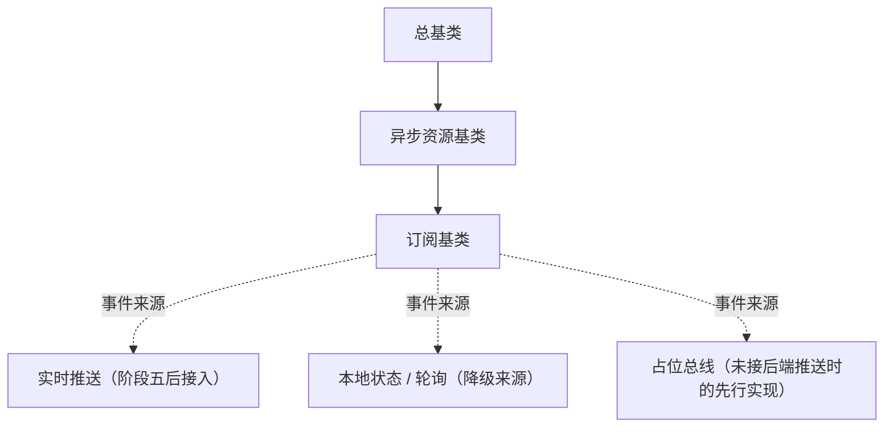

# 组件设计 · 订阅基类

> 事件订阅统一语义：注册 / 取消 / 占位实现；来源解耦，句柄随异步资源释放（对齐后端事件域与实时推送消费侧）
> 实现侧命名与落点见《[前端基类清单](../../../../../前端基类清单.md)》（§2.1 全量基类登记表；继承链全系统唯一一份），实现契约细节见项目详细设计。

[文档首页](../../../../../文档首页.md) › [项目规划说明](../../../../../规划/项目规划说明.md) › [组件设计](../../../01_组件设计_总览.md) › 订阅基类　|　[← 错误基类](../07_组件设计_错误基类/07_组件设计_错误基类.md)　[交互能力 →](../../02_能力类/01_组件设计_交互能力/01_组件设计_交互能力.md)

> 可交互原型：[08_原型设计_订阅基类.html](08_原型设计_订阅基类.html)（演示订阅 / 取消 / 占位实现、事件触发与卸载自动取消）

## 1. 目的与适用范围 

定义 BMS 前端**订阅基类**的组件设计：为**实时通知、审批待办、会话失效等事件消费**提供统一订阅语义——注册、取消、占位实现。它是继承链上的**订阅基类**（父基类链：总基类 → 异步资源基类 → 订阅基类），对齐后端事件发布（事件类型）与实时推送（发布 / 加入 / 离开；事件名登记）的**消费侧**；订阅句柄的释放复用异步资源机制（父子关系见《[前端基类清单](../../../../../前端基类清单.md)》§2.1 / §4）。

### 1.1 定位与继承链位置 

| 职责 | 归属 |
| --- | --- |
| 订阅注册 / 取消、事件名约定、占位实现、来源解耦 | **本节点（订阅基类）** |
| 句柄释放（卸载自动取消） | 父基类 [异步资源基类](../05_组件设计_异步资源基类/05_组件设计_异步资源基类.md)（异步资源基类） |
| 事件发布侧（服务端推送、事件总线） | 后端（[《后端基类清单》](../../../../../后端基类清单.md)「实时推送 / 事件发布」节） |
| 订阅后的业务响应（刷新列表、提示消息） | 具体组件 / 页面（如展示类「通知与消息」） |

上游依据：[《前端开发规范》](../../../../../规范/前端开发规范.md)（§3 前端基类体系与 §3.4 双轨）、[《后端基类清单》](../../../../../后端基类清单.md)「实时推送」「事件发布」（事件名与语义对齐）、[《命名规范》](../../../../../规范/命名规范.md)（事件名点分小写：领域.动作）。

> 本篇为 **基础组件类 · 公共基类「订阅基类」**。**范围边界**：连接管理（实时通道实例、断线重连）归阶段五实时接入；业务响应归具体组件；本节点只做"订阅语义与来源解耦"，保证占位先行。

## 2. 职责与组成 

| 组成部分 | 职责 |
| --- | --- |
| 订阅基类核心 | 订阅源适配、事件名解析（点分小写校验）、占位实现 |
| 订阅总线契约与占位总线 | 真实总线由宿主 / 渲染插件注入；占位总线不发请求、无副作用 |

- **与后端对齐**：后端事件名为点分小写（`approval.todo` / `notification.new` / `session.revoked`，见《命名规范》「基础设施命名」节）；前端订阅事件名与后端同源登记，不另起命名。

## 3. 交互与契约语义 

| 语义项 | 说明 |
| --- | --- |
| 订阅总线 | 构造注入；缺省占位总线不发请求、无副作用 |
| 事件处理 | 处理函数接收载荷与事件名（载荷为后端推送数据，回传事件名便于复用句柄） |
| 订阅 | 订阅事件（事件名点分小写校验）并返回取消函数；取消函数自动登记异步资源（卸载即取消） |
| 释放 | 取消全部订阅（逆序 + 幂等由异步资源基类保证） |

## 4. 行为与约定 

| 项 | 设计 |
| --- | --- |
| 来源解耦 | 调用方只认事件名 + 处理函数；来源（实时 / 本地 / 占位）由基类按接入阶段选择，**替换来源不改调用方** |
| 占位实现 | 后端推送未接入时绑占位总线：订阅正常注册（不报错、不连实时通道）；真实推送接入后替换总线实现 |
| 卸载取消 | 订阅返回的取消函数登记到[异步资源基类](../05_组件设计_异步资源基类/05_组件设计_异步资源基类.md)，组件卸载（宿主 / 渲染插件在卸载钩子触发）自动取消（不重复取消、幂等） |
| 事件名 | 统一取自后端事件表（点分小写）；禁止自创前端事件名或驼峰命名 |
| 触发时机 | 处理器内避免重 IO 与长任务（事件风暴）；批量刷新与去抖由业务侧处理，基类不做隐式节流 |
| 依赖方向 | 只依赖组件根 + 异步资源基类；不直接依赖实时通道客户端实现 |

## 5. 场景集成 

| 场景 | 说明 |
| --- | --- |
| 实时通知 | `notification.new` → 消息铃铛（展示类「通知与消息」）增量提示 |
| 审批待办 | `approval.todo` → 待办数刷新、工作台卡片更新 |
| 会话失效 | `session.revoked` → 提示并跳登录（与错误基类 2xxxx 段位协作） |
| 数据变更广播 | 业务事件（如 `pur.order.created`）驱动列表局部刷新 |

## 6. 依赖接口与上游变更 

### 6.1 上游接口与口径 

| 项 | 说明 | 目标文档 |
| --- | --- | --- |
| 继承链权威 | 订阅基类的父基类链与落点 | 《[前端基类清单](../../../../../前端基类清单.md)》§2.1 / §6.1（登记项①，唯一权威） |
| 事件名与语义 | 后端事件表（点分小写） | [《后端基类清单》](../../../../../后端基类清单.md)「实时推送 / 事件发布」节 + [《命名规范》](../../../../../规范/命名规范.md)「基础设施命名」节（登记项②） |
| 句柄释放 | 卸载自动取消 | [异步资源基类](../05_组件设计_异步资源基类/05_组件设计_异步资源基类.md)（登记项③） |
| 新增依赖 | **无** | — |

### 6.2 需登记的上游变更 

| 变更点 | 目标文档 | 内容 |
| --- | --- | --- |
| ① 订阅基类契约 | [《前端开发规范》](../../../../../规范/前端开发规范.md) 第 3 节 | 明确订阅基类：订阅（点分小写校验）/ 释放（取消全部）+ 占位总线 + 来源解耦 + 卸载自动取消 |
| ② 事件名同源 | [《后端基类清单》](../../../../../后端基类清单.md) + [《命名规范》](../../../../../规范/命名规范.md) | 前端订阅事件名取后端事件表（点分小写），前端不新造事件名 |
| ③ 句柄释放 | [异步资源基类](../05_组件设计_异步资源基类/05_组件设计_异步资源基类.md) | 订阅取消函数经异步资源基类登记，卸载自动取消（幂等） |

> 按[《文档生成规范》](../../../../../规范/文档生成规范.md)「引用与追溯」节，上述变更需用户确认后由上游文档同步。

## 7. 权限 / i18n / 移动端 

- **权限**：不做权限判定；推送数据按后端已过滤范围消费，越权数据不入前端（前端不二次过滤）。
- **i18n**：事件载荷文案由后端下发（含 locale）；前端不翻译推送内容。
- **移动端**：PC 与移动端按同一契约多实现（订阅语义一致；切后台断连策略除外）。

## 8. 性能与边界 

| 场景 | 设计 |
| --- | --- |
| 开销 | 订阅注册为轻量集合操作；分发为同步回调（业务侧自行去抖 / 批量） |
| 边界 | 重复订阅（同事件名多处理函数，合法）、取消后仍收到回调（迟到事件）、事件风暴、占位切真实时漏订阅（重放需后端支持）、内存泄漏（未登记句柄） |
| 不支持 | 连接管理与重连（后续）、业务响应（具体组件）、后端事件发布（后端基座） |

## 9. 检查清单 

- □ 契约语义：订阅（点分小写校验 + 取消函数登记）/ 释放；订阅总线注入（占位总线先行）
- □ 行为：来源解耦、占位实现（不连实时通道、正常注册）、卸载自动取消（登记异步资源）、幂等
- □ 禁止自创前端事件名；依赖方向单向（组件根 + 异步资源基类）
- □ 权限/i18n/移动端符合第 7 节；性能边界符合第 8 节
- □ 三项上游登记已确认

> 组件设计节点（订阅基类）· 与[《前端开发规范》](../../../../../规范/前端开发规范.md)[《后端基类清单》](../../../../../后端基类清单.md)[《命名规范》](../../../../../规范/命名规范.md)[组件根基类](../../01_机制基类/02_组件设计_组件根基类/02_组件设计_组件根基类.md)[异步资源基类](../05_组件设计_异步资源基类/05_组件设计_异步资源基类.md)[错误基类](../07_组件设计_错误基类/07_组件设计_错误基类.md)《命名规范》配套
