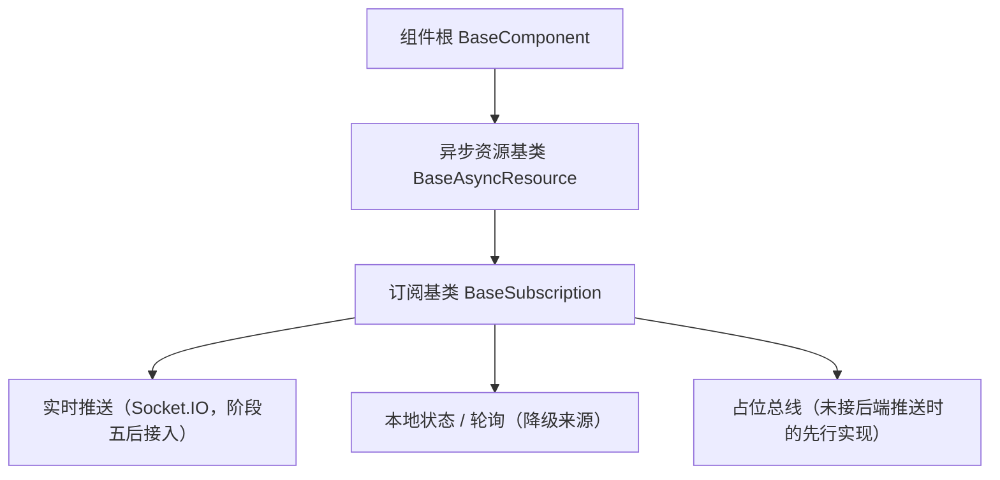

# 组件设计 · 订阅基类

> BaseSubscription（事件订阅：注册 / 取消 / 占位实现，解耦具体来源，对齐后端事件域与实时推送；核心 `frontend/packages/core/src/mechanisms/subscription.ts`，继承 `BaseAsyncResource`）

[文档首页](../../../../../文档首页.md) › [项目规划说明](../../../../../规划/项目规划说明.md) › [组件设计](../../../01_组件设计_总览.md) › 订阅基类　|　[← 错误基类](../07_组件设计_错误基类/07_组件设计_错误基类.md)　[交互能力 →](../../02_能力片段/01_组件设计_交互片段/01_组件设计_交互片段.md)

> 可交互原型：[08_原型设计_订阅基类.html](08_原型设计_订阅基类.html)（演示订阅 / 取消 / 占位实现、事件触发与卸载自动取消）

## 1. 目的与适用范围 

定义 BMS 前端（核心 `frontend/packages/core` 纯 TS；渲染插件与宿主按同一契约装配）**订阅基类**的组件设计：核心类 `BaseSubscription`，为**实时通知、审批待办、会话失效等事件消费**提供统一订阅语义——注册、取消、占位实现。它是组件设计体系 **机制基类「订阅基类」**，对齐后端 `BaseEventWorker`（`event_type`）与实时推送 `BaseRealtimePublisher`（`emit` / `join` / `leave`；事件名 `REALTIME_EVENTS`）的**消费侧**，继承 [异步资源基类](../05_组件设计_异步资源基类/05_组件设计_异步资源基类.md)（`BaseSubscription → BaseAsyncResource`，上接 [组件根基类](../../01_机制基类/02_组件设计_组件根基类/02_组件设计_组件根基类.md)）；订阅句柄的释放同步复用异步资源机制。

### 1.1 定位与分层 

| 职责 | 归属 |
| --- | --- |
| 订阅注册 / 取消、事件名约定、占位实现、来源解耦 | **本节点（订阅基类）** |
| 句柄释放（卸载自动取消） | [异步资源基类](../05_组件设计_异步资源基类/05_组件设计_异步资源基类.md) |
| 事件发布侧（服务端推送、事件总线） | 后端（[《后端基类清单》](../../../../../后端基类清单.md)「实时推送 / 事件发布」节） |
| 订阅后的业务响应（刷新列表、提示消息） | 具体组件 / 页面（如展示类「通知与消息」） |

上游依据：[《前端开发规范》](../../../../../规范/前端开发规范.md)（§3 机制基类）、[《后端基类清单》](../../../../../后端基类清单.md)「实时推送」「事件发布」（事件名与语义对齐）、[《命名规范》](../../../../../规范/命名规范.md)（事件名点分小写：领域.动作）。

> 本篇为 **基础组件类 · 机制基类「订阅基类」**。**范围边界**：连接管理（Socket.IO 实例、断线重连）归阶段五实时接入；业务响应归具体组件；本节点只做"订阅语义与来源解耦"，保证占位先行。

## 2. 组件清单与职责 

| 组件 / 工具 | 位置 | 职责 |
| --- | --- | --- |
| `BaseSubscription` | `frontend/packages/core/src/mechanisms/subscription.ts` | 核心类（继承 `BaseAsyncResource`）：订阅源适配、事件名解析（`topic` 点分小写校验）、占位实现 |
| `SubscriptionBus` / `nullSubscriptionBus` | `frontend/packages/core/src/mechanisms/subscription.ts` | 订阅总线契约与占位总线（真实总线由宿主 / 渲染插件注入；占位总线不发请求、无副作用） |

- 命名与落点遵循[《命名规范》](../../../../../规范/命名规范.md)与[《前端开发规范》](../../../../../规范/前端开发规范.md)：核心类 `BaseSubscription`；核心落点 `frontend/packages/core/src/mechanisms/`；投影只落 `frontend/packages/vue/src/bindings/`（本机制无投影）。
- 旧组合式入口（占位 / 异步资源 / 注册表 / 订阅）已随旧层删除（历史经 git 追溯）；如需组合式入口，按「核心类 + `@bms/vue` 投影」口径按需补（当前投影仅根系 / 组件根 / 值 / 字段 / 容器 / 页签 / 偏好 / 权限 / 动态路由 / 可视区）。
- **与后端对齐**：后端事件名为点分小写（`approval.todo` / `notification.new` / `session.revoked`，见《命名规范》「基础设施命名」节 Socket.IO 事件）；前端订阅 `topic` 与后端同源登记，不另起命名。

## 3. 契约（方法与事件） 

| 成员 | 类型 | 说明 |
| --- | --- | --- |
| `bus` | `SubscriptionBus` | 订阅总线（构造注入；缺省占位总线 `nullSubscriptionBus` 不发请求、无副作用） |
| `handler` | (payload, topic) => void | 事件处理（payload 为后端推送数据，回传 topic 便于复用句柄） |

| 方法 | 说明 |
| --- | --- |
| `subscribe(topic, handler)` | 订阅（`topic` 点分小写校验）并返回取消函数；取消函数自动登记异步资源（卸载即取消） |
| `dispose()` | 释放（取消全部订阅；逆序 + 幂等由异步资源基类保证） |

> 原设计面（未落码）：`unsubscribe(topic?)` / `once()` / `publish()` / `has()` / `source` 来源枚举与 `subscription:*` 事件——按域需要再补；来源差异收敛在 `SubscriptionBus` 注入实现（占位 / 本地 / 实时）。

## 4. 行为与实现约定 

| 项 | 设计 |
| --- | --- |
| 来源解耦 | 调用方只认 `topic` + `handler`；来源（Socket.IO / 本地 / 占位）由基类按接入阶段选择，**替换来源不改调用方** |
| 占位实现 | 后端推送未接入时绑占位总线：`subscribe` 正常注册（不报错、不连 socket；`publish` 本地发布为原设计面）；真实推送接入后替换总线实现 |
| 卸载取消 | `subscribe` 返回的取消函数登记到[异步资源基类](../05_组件设计_异步资源基类/05_组件设计_异步资源基类.md)，组件卸载（宿主 / 渲染插件在卸载钩子触发）自动取消（不重复取消、幂等） |
| 事件名 | 统一取自后端事件表（点分小写）；禁止自创前端事件名或驼峰命名 |
| 触发时机 | 处理器内避免重 IO 与长任务（事件风暴）；批量刷新与去抖由业务侧处理，基类不做隐式节流 |
| 依赖方向 | 只依赖组件根 + 异步资源基类；不直接依赖 socket 客户端实现 |

## 5. 场景集成 

| 场景 | 说明 |
| --- | --- |
| 实时通知 | `notification.new` → 消息铃铛（展示类「通知与消息」）增量提示 |
| 审批待办 | `approval.todo` → 待办数刷新、工作台卡片更新 |
| 会话失效 | `session.revoked` → 提示并跳登录（与错误基类 2xxxx 段位协作） |
| 数据变更广播 | 业务事件（如 `purchase.order.created`）驱动列表局部刷新 |

## 6. 依赖接口与上游变更 

### 6.1 上游接口与口径 

| 项 | 说明 | 目标文档 |
| --- | --- | --- |
| 分层权威 | 订阅基类职责与占位口径 | [《前端开发规范》](../../../../../规范/前端开发规范.md) 第 3 节（登记项①） |
| 事件名与语义 | 后端事件表（点分小写） | [《后端基类清单》](../../../../../后端基类清单.md)「实时推送 / 事件发布」节 + [《命名规范》](../../../../../规范/命名规范.md)「基础设施命名」节（登记项②） |
| 句柄释放 | 卸载自动取消 | [异步资源基类](../05_组件设计_异步资源基类/05_组件设计_异步资源基类.md)（登记项③） |
| 新增依赖 | **无** | — |

### 6.2 需登记的上游变更 

| 变更点 | 目标文档 | 内容 |
| --- | --- | --- |
| ① 订阅基类契约 | [《前端开发规范》](../../../../../规范/前端开发规范.md) 第 3 节 | 明确订阅基类：`subscribe`（点分小写校验）/ `dispose`（取消全部）+ 占位总线 + 来源解耦 + 卸载自动取消 |
| ② 事件名同源 | [《后端基类清单》](../../../../../后端基类清单.md) + [《命名规范》](../../../../../规范/命名规范.md) | 前端 `topic` 取后端事件表（点分小写），前端不新造事件名 |
| ③ 句柄释放 | [异步资源基类](../05_组件设计_异步资源基类/05_组件设计_异步资源基类.md) | 订阅取消函数经异步资源基类登记（`registerResource`），卸载自动取消（幂等） |

> 按[《文档生成规范》](../../../../../规范/文档生成规范.md)「引用与追溯」节，上述变更需用户确认后由上游文档同步。

## 7. 权限 / i18n / 移动端 

- **权限**：不做权限判定；推送数据按后端已过滤范围消费，越权数据不入前端（前端不二次过滤）。
- **i18n**：事件载荷文案由后端下发（含 locale）；前端不翻译推送内容。
- **移动端**：渲染插件 `frontend/packages/ui-vant` 与 `ui-ep` 按同一契约多实现（订阅语义一致；切后台断连策略除外）。

## 8. 性能与边界 

| 场景 | 设计 |
| --- | --- |
| 开销 | 订阅注册为轻量 Map 操作；分发为同步回调（业务侧自行去抖 / 批量） |
| 边界 | 重复订阅（同 topic 多 handler，合法）、取消后仍收到回调（迟到事件）、事件风暴、占位切真实时漏订阅（重放需后端支持）、内存泄漏（未登记句柄） |
| 不支持 | 连接管理与重连（阶段五）、业务响应（具体组件）、后端事件发布（后端基座） |

## 9. 检查清单 

- □ 契约：`subscribe`（点分小写校验 + 取消函数登记）/ `dispose`；`SubscriptionBus` 注入（占位总线先行）；原设计面（`unsubscribe` / `once` / `publish` / `has`）按需补
- □ 行为：来源解耦、占位实现（不连 socket、正常注册）、卸载自动取消（登记异步资源）、幂等
- □ 禁止自创前端事件名；依赖方向单向（组件根 + 异步资源基类）
- □ 权限/i18n/移动端符合第 7 节；性能边界符合第 8 节
- □ 三项上游登记已确认

> 组件设计节点（订阅基类）· 与[《前端开发规范》](../../../../../规范/前端开发规范.md)[《后端基类清单》](../../../../../后端基类清单.md)[《命名规范》](../../../../../规范/命名规范.md)[组件根基类](../../01_机制基类/02_组件设计_组件根基类/02_组件设计_组件根基类.md)[异步资源基类](../05_组件设计_异步资源基类/05_组件设计_异步资源基类.md)[错误基类](../07_组件设计_错误基类/07_组件设计_错误基类.md)《命名规范》配套
