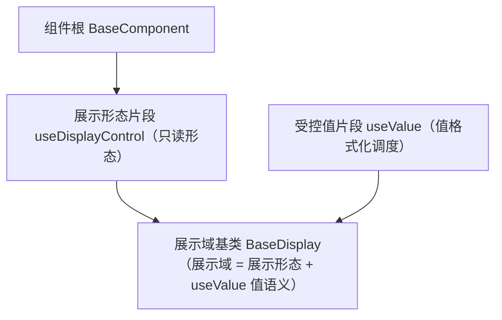

# 组件设计 · 展示形态片段

> useDisplayControl（能力片段，对外契约）· BaseDisplayControl.vue（可选组件包装，只读展示组件通用形态）

[文档首页](../../../../../文档首页.md) › [项目规划说明](../../../../../规划/项目规划说明.md) › [组件设计](../../../01_组件设计_总览.md) › 展示形态片段　|　[← 输入形态片段](../02_组件设计_输入形态片段/02_组件设计_输入形态片段.md)　[容器片段 →](../04_组件设计_容器片段/04_组件设计_容器片段.md)

> 可交互原型：[03_原型设计_展示形态片段.html](03_原型设计_展示形态片段.html)（演示只读形态、密度/令牌、空值占位、超长省略与 tooltip；与 能力片段 值格式化、域基类 展示域的区别）

## 1. 目的与适用范围 

定义 BMS 前端 `apps/desktop/`（`frontend-mobile/` 同款）**展示形态片段**的组件设计：`useDisplayControl`（能力片段，对外契约）与 `BaseDisplayControl.vue`（可选组件包装），为**所有只读展示组件**（标签、描述项、头像、指标卡、表格单元格、图表卡等）提供**通用只读形态**——密度、主题令牌、空值占位、超长省略与 tooltip。它是组件设计体系 **能力片段「展示形态片段」**，继承 [组件根基类](../../01_机制基类/02_组件设计_组件根基类/02_组件设计_组件根基类.md)。

### 1.1 定位（与 能力片段 值、域基类 展示域的区别） 

- **展示形态片段 只管"只读展示长什么样"**：密度、令牌、空值占位、省略/tooltip；**不含**值格式化编排（金额/日期/枚举文本等）。
- **值格式化**由 [受控值片段](../../02_能力片段/08_组件设计_受控值片段/08_组件设计_受控值片段.md) 与 [基础类「格式化工具」](../../../09_基础类/03_组件设计_格式化工具/03_组件设计_格式化工具.md) 提供；**展示域细化**归 [展示域基类](../../03_域基类/02_组件设计_展示域基类/02_组件设计_展示域基类.md)（组合展示形态 + 值语义）。

上游依据：[《前端开发规范》](../../../../../规范/前端开发规范.md)（§3 分层）、[《布局设计 · 设计令牌》](../../../../布局设计/02_布局设计_设计令牌.html)（展示令牌/密度）、[《布局设计 · 表格明细》](../../../../布局设计/09_布局设计_表格明细.html)（只读渲染）。

> 本篇为 **基础组件类 · 能力片段「展示形态片段」**。**范围边界**：通用能力归 组件根；值语义归 受控值片段；展示域细化归 展示域基类；空状态（整块无数据）归 [展示类「异常与空状态」](../../../07_展示类/05_组件设计_异常与空状态/05_组件设计_异常与空状态.md)。

## 2. 组件清单与职责 

| 组件 / 工具 | 位置 | 职责 |
| --- | --- | --- |
| `useDisplayControl.ts`（能力片段，对外契约） | `src/components/base/<能力域>/` | 只读能力片段：密度、令牌、空值占位、省略/tooltip |
| `BaseDisplayControl.vue`（可选组件包装） | `src/components/base/<能力域>/` | 以组件形态包装 `useDisplayControl` 片段，供模板中直接使用；行为契约同片段 |

## 3. 契约（Props 与事件） 

| 属性 | 类型 | 默认 | 说明 |
| --- | --- | --- | --- |
| `density` | 'compact' \| 'default' \| 'loose' | 继承 | 密度（令牌） |
| `emptyText` | string | `'—'` | 空值占位 |
| `ellipsis` | boolean \| number | false | 超长省略 |
| `tooltip` | boolean \| 'overflow' | 'overflow' | 省略时悬浮完整值 |
| `clickable` | boolean | false | 是否可点击（点击归 交互片段） |

| 事件 | 载荷 | 说明 |
| --- | --- | --- |
| `click-value` | event | 可点击时（组合 交互片段） |

- 作用域插槽：`default`、`empty`（自定义空值）。

## 4. 行为与实现约定 

| 项 | 设计 |
| --- | --- |
| 只读 | 不接收 `modelValue`、不参与校验；需要交互时组合 交互片段 |
| 空值 | `null`/`undefined`/`''`/`[]`/`{}` 显示 `emptyText`；**`0`/`false` 不为空** |
| 密度 | 由 `density` 或上下文（表格/表单/用户偏好）决定，映射设计令牌 |
| 令牌 | 颜色/字号/间距只消费令牌，随主题与品牌自动适配 |
| 省略/tooltip | 超长省略 + 悬浮完整值；表格默认 `tooltip='overflow'` |
| 空值 vs 空状态 | 单元格/字段空值用占位；整块无数据用空状态组件 |

## 5. 场景集成 

| 场景 | 说明 |
| --- | --- |
| 展示类 | 标签/描述项/头像/指标卡经 展示域基类 继承 |
| 表格单元格 | 只读列渲染 |
| 字段只读回显 | 与值语义组合（展示域基类） |

## 6. 依赖接口与上游变更 

### 6.1 上游接口与口径 

| 项 | 说明 | 目标文档 |
| --- | --- | --- |
| 分层权威 | 能力片段（展示形态片段）职责 | [《前端开发规范》](../../../../../规范/前端开发规范.md) 第 3 节（登记项①） |
| 只读渲染 | 单元格/描述展示口径 | [《布局设计 · 表格明细》](../../../../布局设计/09_布局设计_表格明细.html)（登记项②） |
| 展示令牌与密度 | 密度/字号/色令牌 | [《布局设计 · 设计令牌》](../../../../布局设计/02_布局设计_设计令牌.html)（登记项③） |
| 新增依赖 | **无** | — |

### 6.2 需登记的上游变更 

| 变更点 | 目标文档 | 内容 |
| --- | --- | --- |
| ① 展示形态片段契约 | [《前端开发规范》](../../../../../规范/前端开发规范.md) 第 3 节 | 明确 展示形态片段只负责只读形态（密度/令牌/空值/省略），值格式化归 能力片段、域细化归 域基类 |
| ② 只读展示口径 | [《布局设计 · 表格明细》](../../../../布局设计/09_布局设计_表格明细.html)「只读渲染」节 | 明确单元格空值占位 `—`、省略与 tooltip、密度 |
| ③ 展示令牌与密度 | [《布局设计 · 设计令牌》](../../../../布局设计/02_布局设计_设计令牌.html)「展示令牌」节 | 明确展示组件密度（compact/default/loose）与令牌映射 |

> 按[《文档生成规范》](../../../../../规范/文档生成规范.md)「引用与追溯」节，上述变更需用户确认后由上游文档同步。

## 7. 权限 / i18n / 移动端 

- **权限**：展示值可见性由字段权限/数据范围决定（[字段权限片段](../../02_能力片段/11_组件设计_字段权限片段/11_组件设计_字段权限片段.md)），本基类不判权限；脱敏由 `v-plain`/`maskValue`。
- **i18n**：占位文案经 根系 `t`。
- **移动端**：展示语义同款，密度适配触屏。

## 8. 性能与边界 

| 场景 | 设计 |
| --- | --- |
| 渲染 | 纯文本轻量；tooltip 按需挂载 |
| 大表格 | 单元格渲染可缓存，避免重组件 |
| 边界 | 空值判定差异、省略与 tooltip 冲突、密度上下文缺失、令牌缺失回退、脱敏不可复制明文 |
| 不支持 | 通用能力（组件根）、值格式化（受控值片段）、展示域细化（展示域基类）、空状态、权限 |

## 9. 检查清单 

- □ 契约：`density`/`emptyText`/`ellipsis`/`tooltip`/`clickable`
- □ 空值统一占位且 `0`/`false` 不为空；省略/tooltip；令牌消费
- □ 只读不校验；需要交互时组合 交互片段；空值 vs 空状态分工清晰
- □ 与 能力片段 值语义、域基类 展示域边界清晰
- □ 权限/i18n/移动端符合第 7 节；性能边界符合第 8 节
- □ 三项上游登记已确认

> 组件设计节点（展示形态片段）· 与[《前端开发规范》](../../../../../规范/前端开发规范.md)[《布局设计 · 设计令牌》](../../../../布局设计/02_布局设计_设计令牌.html)[《布局设计 · 表格明细》](../../../../布局设计/09_布局设计_表格明细.html)[组件根基类](../../01_机制基类/02_组件设计_组件根基类/02_组件设计_组件根基类.md)[输入形态片段](../02_组件设计_输入形态片段/02_组件设计_输入形态片段.md)[容器片段](../04_组件设计_容器片段/04_组件设计_容器片段.md)[受控值片段](../../02_能力片段/08_组件设计_受控值片段/08_组件设计_受控值片段.md)[展示域基类](../../03_域基类/02_组件设计_展示域基类/02_组件设计_展示域基类.md)[展示类「异常与空状态」](../../../07_展示类/05_组件设计_异常与空状态/05_组件设计_异常与空状态.md)《命名规范》配套
