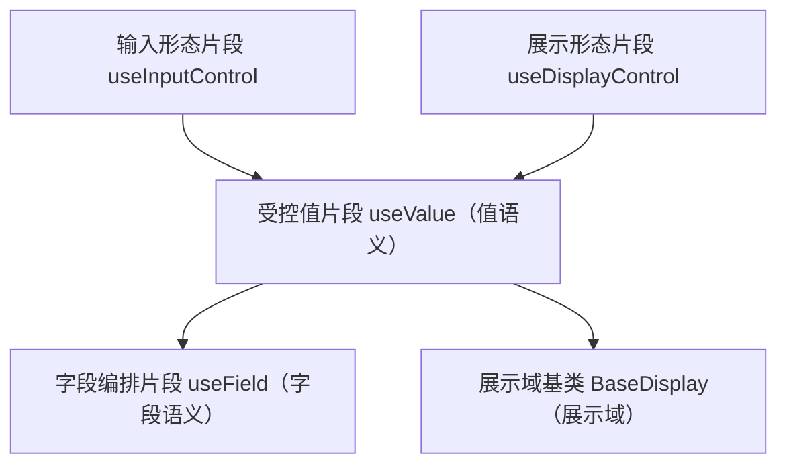

# 组件设计 · 受控值片段

> useValue（能力片段，对外契约）· BaseValue.vue（可选组件包装，输入/展示共用的值语义，承前启后）

[文档首页](../../../../../文档首页.md) › [项目规划说明](../../../../../规划/项目规划说明.md) › [组件设计](../../../01_组件设计_总览.md) › 受控值片段　|　[← 布局片段](../../02_能力片段/07_组件设计_布局片段/07_组件设计_布局片段.md)　[字段编排片段 →](../09_组件设计_字段编排片段/09_组件设计_字段编排片段.md)

> 可交互原型：[08_原型设计_受控值片段.html](08_原型设计_受控值片段.html)（演示值归一、三态（未设置/空/已填）、格式化调度与 `change` 上报；输入与展示共用）

## 1. 目的与适用范围 

定义 BMS 前端 `apps/desktop/`（`frontend-mobile/` 同款）**受控值片段**的组件设计：`useValue`（能力片段，对外契约）与 `BaseValue.vue`（可选组件包装），为**输入与展示共用**提供**值语义**——值归一、格式化调度、三态（未设置/空/已填）、`change` 上报。它是组件设计体系**能力片段（值 / 字段链）首枚**：组合 [输入形态片段](../../02_能力片段/02_组件设计_输入形态片段/02_组件设计_输入形态片段.md) 与 [展示形态片段](../../02_能力片段/03_组件设计_展示形态片段/03_组件设计_展示形态片段.md)，上接 [字段编排片段](../09_组件设计_字段编排片段/09_组件设计_字段编排片段.md) 与 [展示域基类](../../03_域基类/02_组件设计_展示域基类/02_组件设计_展示域基类.md)。

### 1.1 定位（为什么需要这一层） 

原本 能力片段与 域基类在"输入/展示"上职责打架（"长什么样"与"值/字段语义"被混为一层）；按[《前端开发规范》](../../../../../规范/前端开发规范.md) §3.9「冲突时插入中间层」，把**值语义**独立为 能力片段 一层承前启后：

| 职责 | 归属 |
| --- | --- |
| 值归一、格式化调度、三态、`change` | **本节点（受控值片段）** |
| 输入/展示形态 | 输入形态片段 / 展示形态片段 |
| 字段语义（上下文/权限/校验） | [字段编排片段](../09_组件设计_字段编排片段/09_组件设计_字段编排片段.md) |
| 格式化规则本体 | [基础类「格式化工具」](../../../09_基础类/03_组件设计_格式化工具/03_组件设计_格式化工具.md) |

上游依据：[《前端开发规范》](../../../../../规范/前端开发规范.md)（§3.5 能力片段、§3.9 演进示例）、[《架构设计 · 数据架构》](../../../../架构设计/07_架构设计_数据架构.md)（空值/精度口径）。

> 本篇为「受控值片段」节点。**范围边界**：形态归 能力片段；字段语义归 字段编排片段；格式化规则归 基础类「格式化工具」；域细化归 域基类。

## 2. 组件清单与职责 

| 组件 / 工具 | 位置 | 职责 |
| --- | --- | --- |
| `useValue.ts`（能力片段，对外契约） | `src/components/base/<能力域>/` | 值语义片段：归一、格式化调度、三态、`change`；输入与展示均适用；`normalize`/`format`/`isUnset` |
| `BaseValue.vue`（可选组件包装） | `src/components/base/<能力域>/` | 以组件形态包装 `useValue` 片段，供模板中直接使用；行为契约同片段 |

## 3. 契约（Props 与方法） 

| 属性 | 类型 | 默认 | 说明 |
| --- | --- | --- | --- |
| `modelValue` | any | `undefined` | 受控值 |
| `emptyValue` | any | `null` | 空值归一目标 |
| `formatter` | string 或 function | '' | 格式化器名（调度基础类「格式化工具」）或函数 |
| `threeState` | boolean | false | 是否区分"未设置/空/已填" |

| 方法 / 事件 | 说明 |
| --- | --- |
| `normalize(value)` | 值归一（空串/undefined → `emptyValue`；多值空数组归一） |
| `format(value)` | 格式化调度（金额/日期/枚举/布尔…），缺失回退原值 |
| `isUnset(value)` | 三态判定（未设置） |
| `update:modelValue` / `change` | 受控更新与业务上报（归一后值） |

## 4. 行为与实现约定 

| 项 | 设计 |
| --- | --- |
| 归一 | 空串/`undefined` → `emptyValue`（默认 `null`）；多值空 → `[]`；子类可覆盖（如金额保留精度） |
| 三态 | `unset`（未设置）／`empty`（显式空）／`value`（已填）；`threeState=false` 时 `unset` 与 `empty` 合并 |
| 格式化 | 展示侧经 `format` 调度基础类「格式化工具」；输入侧一般不用格式化（或输入掩码） |
| `change` | 归一后上报；去抖由具体控件决定 |
| 组合 | 输入链 `useValue` 组合 `useInputControl`；展示链 `useValue` 组合 `useDisplayControl`（展示域基类） |
| 依赖方向 | 只依赖 能力片段（值 / 字段链）与 基础类「格式化工具」；不依赖 字段编排片段/域基类 |

## 5. 场景集成 

| 场景 | 说明 |
| --- | --- |
| 输入控件 | 具体输入控件经 输入域基类 → 字段编排片段 → 受控值片段 获得归一/三态 |
| 展示域 | `BaseDisplay`（展示域基类）组合本层做格式化展示 |
| 字段只读回显 | 值归一 + 格式化 |

## 6. 依赖接口与上游变更 

### 6.1 上游接口与口径 

| 项 | 说明 | 目标文档 |
| --- | --- | --- |
| 分层权威 | 能力片段 受控值片段职责与冲突插层 | [《前端开发规范》](../../../../../规范/前端开发规范.md) 第 3 节（登记项①） |
| 空值/精度 | 空值归一与数值精度口径 | [《架构设计 · 数据架构》](../../../../架构设计/07_架构设计_数据架构.md)（登记项②） |
| 格式化 | 格式化调度口径 | [基础类「格式化工具」](../../../09_基础类/03_组件设计_格式化工具/03_组件设计_格式化工具.md)（登记项③） |
| 新增依赖 | **无** | — |

### 6.2 需登记的上游变更 

| 变更点 | 目标文档 | 内容 |
| --- | --- | --- |
| ① 受控值片段契约 | [《前端开发规范》](../../../../../规范/前端开发规范.md) 第 3 节 | 明确 能力片段 `useValue`：归一、格式化调度、三态（未设置/空/已填）、`change`；承前启后（能力片段 形态 → 能力片段 值 → 能力片段 字段/域基类 域） |
| ② 空值与精度 | [《架构设计 · 数据架构》](../../../../架构设计/07_架构设计_数据架构.md)「空值与精度」节 | 明确各类型空值归一（`null`/`[]`/`''`）与数值/金额精度，供前端归一与后端一致 |
| ③ 格式化调度 | [基础类「格式化工具」](../../../09_基础类/03_组件设计_格式化工具/03_组件设计_格式化工具.md) | 明确 `format` 调度接口（格式化器名/函数）与缺失回退 |

> 按[《文档生成规范》](../../../../../规范/文档生成规范.md)「引用与追溯」节，上述变更需用户确认后由上游文档同步。

## 7. 权限 / i18n / 移动端 

- **权限**：不做权限判定（字段权限见 [字段权限片段](../../02_能力片段/11_组件设计_字段权限片段/11_组件设计_字段权限片段.md)）。
- **i18n**：布尔/枚举文本由格式化工具按 locale。
- **移动端**：值语义同款。

## 8. 性能与边界 

| 场景 | 设计 |
| --- | --- |
| 归一 | 轻量纯函数；避免每次渲染重复归一（可缓存） |
| 边界 | 空值语义差异（`''`/`null`/`[]`）、三态与必填、格式化器缺失回退、输入侧误用格式化、精度丢失 |
| 不支持 | 形态（能力片段）、字段语义（字段编排片段）、格式化规则本体（容器组件类「懒加载容器」）、域细化（域基类） |

## 9. 检查清单 

- □ 契约：`modelValue`/`emptyValue`/`formatter`/`threeState` + `normalize`/`format`/`isUnset`/`change`
- □ 归一与三态口径清晰；格式化调度基础类「格式化工具」；缺失回退
- □ 输入链与展示链组合方式明确；依赖方向单向
- □ 权限/i18n/移动端符合第 7 节；性能边界符合第 8 节
- □ 三项上游登记已确认

> 组件设计节点（受控值片段）· 与[《前端开发规范》](../../../../../规范/前端开发规范.md)[《架构设计 · 数据架构》](../../../../架构设计/07_架构设计_数据架构.md)[基础类「格式化工具」](../../../09_基础类/03_组件设计_格式化工具/03_组件设计_格式化工具.md)[输入形态片段](../../02_能力片段/02_组件设计_输入形态片段/02_组件设计_输入形态片段.md)[展示形态片段](../../02_能力片段/03_组件设计_展示形态片段/03_组件设计_展示形态片段.md)[字段编排片段](../09_组件设计_字段编排片段/09_组件设计_字段编排片段.md)[展示域基类](../../03_域基类/02_组件设计_展示域基类/02_组件设计_展示域基类.md)《命名规范》配套
