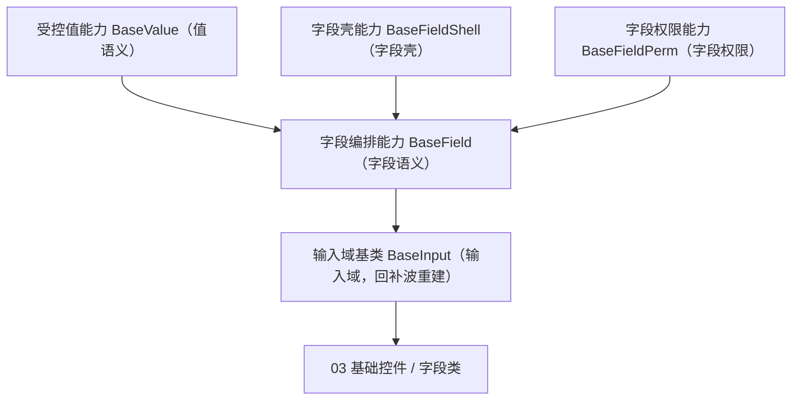

# 组件设计 · 字段编排片段

> `BaseField`（核心能力类，key `field`，`depends: value / field-shell / field-perm`；`frontend/packages/core/src/capabilities/field.ts`，登记 `capabilities/manifest.ts`）+ 投影 `useField`（`frontend/packages/vue/src/bindings/useField.ts`）· `BaseField.vue` 组件包装为按需形态（历史未落码）（历史经 git 追溯）

[文档首页](../../../../../文档首页.md) › [项目规划说明](../../../../../规划/项目规划说明.md) › [组件设计](../../../01_组件设计_总览.md) › 字段编排片段　|　[← 受控值片段](../08_组件设计_受控值片段/08_组件设计_受控值片段.md)　[字段壳片段 →](../10_组件设计_字段壳片段/10_组件设计_字段壳片段.md)

> 可交互原型：[09_原型设计_字段编排片段.html](09_原型设计_字段编排片段.html)（演示字段语义：字段上下文（label/必填/错误）、字段权限（visible/editable）、三态与校验触发、`fieldKey` 注册）

## 1. 目的与适用范围 

定义 BMS 前端 `frontend/packages/*`（核心 `frontend/packages/core` + Vue 投影 `frontend/packages/vue`；渲染插件 `ui-ep` / `ui-vant` 按需）**字段编排能力（原「字段编排片段」）**的组件设计：核心能力类 `BaseField`（`frontend/packages/core/src/capabilities/field.ts`，登记 `capabilities/manifest.ts`；`depends: value / field-shell / field-perm`）+ 投影 `useField`，在 [受控值能力](../08_组件设计_受控值片段/08_组件设计_受控值片段.md) 的**值语义**之上提供**表单字段语义**——字段上下文（label/必填/错误，来自 [字段壳能力](../10_组件设计_字段壳片段/10_组件设计_字段壳片段.md)）、字段权限（`visible`/`editable`，来自 [字段权限能力](../11_组件设计_字段权限片段/11_组件设计_字段权限片段.md)）、校验触发、`fieldKey`。它是组件设计体系**能力（值 / 字段链）**，**组合** `BaseFieldShell` + `BaseFieldPerm`（`depends` 单向登记）。

### 1.1 定位 

| 职责 | 归属 |
| --- | --- |
| 字段上下文（label/必填/错误/栅格）、字段权限、校验触发、`fieldKey` | **本节点（字段编排能力，组合 字段壳能力/字段权限能力）** |
| 值语义（归一/三态/格式化） | [受控值能力](../08_组件设计_受控值片段/08_组件设计_受控值片段.md) |
| 字段壳细节（label/必填/错误位） | [字段壳能力](../10_组件设计_字段壳片段/10_组件设计_字段壳片段.md) |
| 字段权限细节（visible/editable/required/脱敏） | [字段权限能力](../11_组件设计_字段权限片段/11_组件设计_字段权限片段.md) |
| 元数据取数与控件分发 | [交互类「表单渲染器」](../../../08_交互类/12_组件设计_表单渲染器/12_组件设计_表单渲染器.md) |

上游依据：[《前端开发规范》](../../../../../规范/前端开发规范.md)（§3.4 继承与组合分工）、[《概要设计 · 菜单管理》](../../../../概要设计/07_概要设计_菜单管理.md)（`sys_field`/`sys_role_field` 字段元数据）、[《概要设计 · 表单定制》](../../../../概要设计/36_概要设计_表单定制.md)（字段属性）。

> 本篇为「字段编排能力」节点。**范围边界**：值语义归 受控值能力；壳/权限细节归 字段壳能力/字段权限能力；输入域细化归 [输入域基类](../../03_域基类/01_组件设计_输入域基类/01_组件设计_输入域基类.md)。

## 2. 组件清单与职责 

| 组件 / 工具 | 位置 | 职责 |
| --- | --- | --- |
| `BaseField`（核心能力类，key `field`，`depends: value / field-shell / field-perm`） | `frontend/packages/core/src/capabilities/field.ts`（登记 `capabilities/manifest.ts`） | 字段编排能力：组合字段壳与字段权限，提供字段上下文、校验触发与 `fieldKey` |
| `useField`（Vue 投影） | `frontend/packages/vue/src/bindings/useField.ts` | 核心 `BaseField` ↔ Vue 响应式：投影 `value` / `error` / `effectiveDisabled` / `effectiveRequired` 与 `setValue` / `validate`；不重复实现能力逻辑 |
| `BaseField.vue`（可选组件包装） | 按需形态（历史未落码） | 按需随回补波按「核心类 + 投影（+ 插件包装）」重建 |

> **实现口径（2026-09-17，新体系）**：原「字段编排片段」（旧 `useField` 组合式）已类化为核心能力类 `BaseField`（`frontend/packages/core/src/capabilities/field.ts`，继承 `BaseCapability`，登记 `capabilities/manifest.ts`；依赖 `value` / `field-shell` / `field-perm` 单向下沉）+ Vue 投影 `useField`（`frontend/packages/vue/src/bindings/useField.ts`，`useXxx` 只存在于此）；`BaseField.vue` 组件包装为按需形态（历史未落码）；旧片段实现（原 `useXxx` 组合式）已随旧层删除（历史经 git 追溯）。`depends` 由能力机制开发态校验（单向、无循环）；契约语义（Props / 事件 / 方法 / 行为规则）保持不变。

## 3. 契约（Props 与方法） 

| 属性 | 类型 | 默认 | 说明 |
| --- | --- | --- | --- |
| `fieldKey` | string | '' | 字段标识（上下文注册、错误定位、元数据读取） |
| `label` | string | '' | 字段标签（经字段壳；也可由元数据下发） |
| `required` | boolean \| 'auto' | 'auto' | 必填（`'auto'` 由字段属性/规则推导） |
| `help` | string | '' | 帮助说明 |
| `span` | number | 1 | 栅格跨度 |
| `modelValue` | any | `undefined` | 值（继承 受控值能力 归一/三态） |

| 事件 / 方法 | 说明 |
| --- | --- |
| `change` | 值变化（继承 受控值能力） |
| `validate` | 触发/转发校验结果 |
| `fieldContext` | 暴露给控件（provide/inject）：`readonly`/`disabled`/`required`/`error` |

## 4. 行为与实现约定 

| 项 | 设计 |
| --- | --- |
| 字段上下文 | 由 字段壳能力 字段壳 `provide`，本层注入并转发给控件（label/占位/必填/错误）；provide/inject 通道随旧层删除（历史经 git 追溯），归域 05+ 回补波按新体系重建 |
| 字段权限 | 由 字段权限能力 `BaseFieldPerm` 判定：`permVisible=false` 整壳不渲染；`editable=false` 合并 `disabled`；`required`/脱敏按元数据 |
| 校验触发 | 值变化触发字段校验并回传上下文；提交时由表单容器 `validate` 汇总 |
| `fieldKey` | 挂载注册、卸载注销；未提供时降级为匿名字段 |
| 依赖方向 | `depends` 组合 受控值能力/字段壳能力/字段权限能力（单向登记、开发态校验）；被 输入域基类 组合消费；不依赖具体控件 |

## 5. 场景集成 

| 场景 | 说明 |
| --- | --- |
| 表单字段 | 03 基础控件与 字段类经 输入域基类 组合本能力 |
| 列表行内编辑 | 明细区字段 |
| 只读回显 | 字段权限 + 值格式化 |

## 6. 依赖接口与上游变更 

### 6.1 上游接口与口径 

| 项 | 说明 | 目标文档 |
| --- | --- | --- |
| 分层权威 | 能力 字段编排能力职责 | [《前端开发规范》](../../../../../规范/前端开发规范.md) 第 3 节（登记项①） |
| 字段元数据 | `sys_field`/`sys_role_field`、`GET /menus/my` | [《概要设计 · 菜单管理》](../../../../概要设计/07_概要设计_菜单管理.md)（登记项②） |
| 字段属性 | `label/required/help/span` 等下发 | [《概要设计 · 表单定制》](../../../../概要设计/36_概要设计_表单定制.md)（登记项③） |
| 新增依赖 | **无** | — |

### 6.2 需登记的上游变更 

| 变更点 | 目标文档 | 内容 |
| --- | --- | --- |
| ① 字段编排能力契约 | [《前端开发规范》](../../../../../规范/前端开发规范.md) 第 3 节 | 明确 能力 `field`（`BaseField`）：在值语义上加字段上下文/字段权限/校验触发/`fieldKey`，组合 `BaseFieldShell` + `BaseFieldPerm`（`depends` 登记） |
| ② 字段元数据 | [《概要设计 · 菜单管理》](../../../../概要设计/07_概要设计_菜单管理.md)「字段元数据」节 | 明确字段 `label/required/help/span/visible/editable/脱敏` 随 `GET /menus/my` 下发 |
| ③ 字段属性 | [《概要设计 · 表单定制》](../../../../概要设计/36_概要设计_表单定制.md)「字段属性」节 | 明确字段属性默认值与前端消费口径 |

> 按[《文档生成规范》](../../../../../规范/文档生成规范.md)「引用与追溯」节，上述变更需用户确认后由上游文档同步。

## 7. 权限 / i18n / 移动端 

- **权限**：字段权限由 [字段权限能力](../11_组件设计_字段权限片段/11_组件设计_字段权限片段.md) 判定；本能力只负责应用（不渲染/传 disabled）。
- **i18n**：label/help 由元数据按 locale 下发。
- **移动端**：字段语义一致（`ui-vant` 为同一契约的另一实现）；单列渲染。

## 8. 性能与边界 

| 场景 | 设计 |
| --- | --- |
| 上下文 | 注册/注销 O(1)；避免逐字段重复读元数据 |
| 边界 | `fieldKey` 缺失/重复、`visible` 与栅格收缩、`editable` 被绕过（后端拒绝）、必填与三态、脱敏与复制 |
| 不支持 | 值语义（受控值能力）、壳/权限细节（字段壳能力/字段权限能力）、域细化（域基类）、元数据取数（13） |

## 9. 检查清单 

- □ 契约：`fieldKey`/`label`/`required`/`help`/`span` + `change`/`validate`/`fieldContext`
- □ 组合字段壳（字段壳能力）与字段权限（字段权限能力）；值语义继承 受控值能力
- □ 校验触发与上下文注册；依赖方向单向（`depends` 登记校验）
- □ 权限/i18n/移动端符合第 7 节；性能边界符合第 8 节
- □ 三项上游登记已确认

> 组件设计节点（字段编排片段）· 与[《前端开发规范》](../../../../../规范/前端开发规范.md)[《概要设计 · 菜单管理》](../../../../概要设计/07_概要设计_菜单管理.md)[《概要设计 · 表单定制》](../../../../概要设计/36_概要设计_表单定制.md)[受控值片段](../08_组件设计_受控值片段/08_组件设计_受控值片段.md)[字段壳片段](../10_组件设计_字段壳片段/10_组件设计_字段壳片段.md)[字段权限片段](../11_组件设计_字段权限片段/11_组件设计_字段权限片段.md)[输入域基类](../../03_域基类/01_组件设计_输入域基类/01_组件设计_输入域基类.md)[交互类「表单渲染器」](../../../08_交互类/12_组件设计_表单渲染器/12_组件设计_表单渲染器.md)《命名规范》配套
