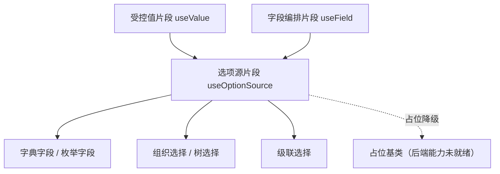

# 组件设计 · 选项源片段

> useOptionSource（能力片段，对外契约）· BaseOptionSource.vue（可选组件包装，远程选项源：加载 / 缓存与版本比对 / 搜索 / 回显；字典、组织、枚举、树、级联共用）

[文档首页](../../../../../文档首页.md) › [项目规划说明](../../../../../规划/项目规划说明.md) › [组件设计](../../../01_组件设计_总览.md) › 选项源片段　|　[← 字段权限片段](../11_组件设计_字段权限片段/11_组件设计_字段权限片段.md)　[上传引擎片段 →](../13_组件设计_上传引擎片段/13_组件设计_上传引擎片段.md)

> 可交互原型：[12_原型设计_选项源片段.html](12_原型设计_选项源片段.html)（演示远程加载与缓存命中、关键字搜索、批量回显与占位降级）

## 1. 目的与适用范围 

定义 BMS 前端 `frontend/`（`frontend-mobile/` 同款）**选项源片段**的组件设计：`useOptionSource`（能力片段，对外契约）与 `BaseOptionSource.vue`（可选组件包装），为**依赖远程选项的字段**（[字典字段](../../../06_字段类/01_组件设计_字典字段/01_组件设计_字典字段.md)、[组织选择字段](../../../06_字段类/05_组件设计_组织选择字段/05_组件设计_组织选择字段.md)、[开关与枚举字段](../../../06_字段类/08_组件设计_开关与枚举字段/08_组件设计_开关与枚举字段.md)、[树选择字段](../../../06_字段类/04_组件设计_树选择字段/04_组件设计_树选择字段.md)、[级联选择](../../../06_字段类/12_组件设计_级联选择/12_组件设计_级联选择.md)）提供统一的**选项加载、缓存与版本比对、搜索、回显**能力。它是组件设计体系**能力片段「选项源片段」**，组合 [受控值片段](../08_组件设计_受控值片段/08_组件设计_受控值片段.md) 与 [字段编排片段](../09_组件设计_字段编排片段/09_组件设计_字段编排片段.md) 工作，继承 [组件根基类](../../01_机制基类/02_组件设计_组件根基类/02_组件设计_组件根基类.md)。

### 1.1 定位 

| 职责 | 归属 |
| --- | --- |
| 选项加载、缓存与版本比对、搜索、批量回显、占位降级 | **本节点（选项源片段）** |
| 字段语义（label / 必填 / 校验 / 权限） | [字段编排片段](../09_组件设计_字段编排片段/09_组件设计_字段编排片段.md) 与[字段壳片段](../10_组件设计_字段壳片段/10_组件设计_字段壳片段.md) |
| 树形选项的展开 / 勾选 / 懒加载 | [树数据片段](../18_组件设计_树数据片段/18_组件设计_树数据片段.md)（树选择 / 组织树复用） |
| 字典数据的后端接口与版本号 | 后端字典管理（阶段八回补；当前占位降级） |

上游依据：[《前端开发规范》](../../../../../规范/前端开发规范.md)（§3 能力片段）、[《概要设计 · 系统参数 / 字典》](../../../../概要设计/10_概要设计_系统参数.md)、[《架构设计 · 数据架构》](../../../../架构设计/07_架构设计_数据架构.md)（缓存三防与版本比对）。

> 本篇为 **基础组件类 · 能力片段「选项源片段」**。**范围边界**：字段外观归字段壳；树语义归树数据片段；本片段只管"选项从哪来、怎么缓存、怎么回显"。

## 2. 组件清单与职责 

| 组件 / 工具 | 位置 | 职责 |
| --- | --- | --- |
| `useOptionSource.ts`（能力片段，对外契约） | `src/components/base/<能力域>/` | 选项源：`load` / `search` / `resolveLabel` / `invalidate`；缓存与版本比对；占位降级 |
| `BaseOptionSource.vue`（可选组件包装） | `src/components/base/<能力域>/` | 以组件形态包装片段（下拉 / 级联 / 树选择共享的内层）：加载态、空态、搜索框 |

- 命名遵循[《命名规范》](../../../../../规范/命名规范.md)：片段 `useXxx`、组件包装 `BaseXxx.vue`；目录遵循[《前端开发规范》](../../../../../规范/前端开发规范.md)（归 `src/components/base/<能力域>/`）。

## 3. 契约（Props 与方法） 

| 属性 | 类型 | 默认 | 说明 |
| --- | --- | --- | --- |
| `source` | string | 必填 | 数据源标识（字典类型编码 / 接口别名 / 枚举名） |
| `mode` | 'remote' \| 'static' | 'remote' | 远程 / 静态（静态由调用方传 `options`） |
| `searchable` | boolean | false | 是否支持关键字搜索（远程搜索 / 本地过滤） |
| `valueKey` | string | 'value' | 选项值字段 |
| `labelKey` | string | 'label' | 选项文本字段 |
| `cascade` | boolean | false | 级联（父子联动加载；不用于树，树见树数据片段） |
| `cache` | boolean | true | 是否缓存（按 `source` + 版本号） |
| `placeholder` | string | '' | 占位文案（i18n） |

| 方法 / 事件 | 说明 |
| --- | --- |
| `load(params?)` | 加载选项（含缓存命中判断与版本比对） |
| `search(keyword)` | 关键字搜索（远程或本地过滤） |
| `resolveLabel(value)` | 单值回显（列表 / 只读场景） |
| `resolveLabels(values)` | 批量回显（列表批量场景，优先批量接口） |
| `invalidate()` | 使缓存失效（字典更新 / 版本号变化） |
| `options` | 当前选项（响应式） |
| `error` | 加载失败信息（降级展示） |

## 4. 行为与实现约定 

| 项 | 设计 |
| --- | --- |
| 缓存与版本比对 | 按 `source` 缓存选项 + 版本号；请求带版本号，**未变化命中缓存**（防重复、防击穿，复用数据架构三防口径） |
| 批量回显 | 列表场景优先批量接口（一次取多值 label），避免 N+1；`resolveLabels` 为统一入口 |
| 搜索 | `searchable` 时远程搜索（防抖 + 竞态取消，取消登记[异步资源基类](../../01_机制基类/05_组件设计_异步资源基类/05_组件设计_异步资源基类.md)）；小数据量本地过滤 |
| 占位降级 | 后端字典 / 组织接口未就绪时按**占位语义**：不请求（或返回空结果）、下拉禁用或空态提示；接入后无需改调用方（对齐[占位基类](../../01_机制基类/04_组件设计_占位基类/04_组件设计_占位基类.md)） |
| 级联 | `cascade` 按父值加载子级（省市区 / 分类）；懒加载与缓存按父值分键 |
| 释放 | 在途请求经异步资源登记，卸载 / 切换自动取消（防竞态写入） |
| 依赖方向 | 只依赖 组件根 / 受控值片段 / 机制基类；不依赖具体字段组件；字段组件组合本片段 |

## 5. 场景集成 

| 场景 | 说明 |
| --- | --- |
| 字典字段 | `source=字典类型`：下拉选项、只读回显（label） |
| 组织选择字段 | `source=组织接口`：下拉 / 树（树数据片段提供树语义） |
| 开关与枚举字段 | `source=枚举名`：静态或远程枚举映射 |
| 级联选择 | `cascade=true`：省市区 / 分类多级联动 |
| 列表批量回显 | 表格列显示字典 label：`resolveLabels` 批量接口 |

## 6. 依赖接口与上游变更 

### 6.1 上游接口与口径 

| 项 | 说明 | 目标文档 |
| --- | --- | --- |
| 分层权威 | 选项源片段职责与缓存口径 | [《前端开发规范》](../../../../../规范/前端开发规范.md) 第 3 节（登记项①） |
| 字典 / 组织接口 | 字典、组织、枚举的接口与版本号 | [《概要设计 · 系统参数》](../../../../概要设计/10_概要设计_系统参数.md)、[《概要设计 · 组织管理》](../../../../概要设计/01_概要设计_总览.md)（登记项②） |
| 缓存三防 | 缓存 key / 版本比对 / 防击穿 | [《架构设计 · 数据架构》](../../../../架构设计/07_架构设计_数据架构.md)（登记项③） |
| 新增依赖 | **无** | — |

### 6.2 需登记的上游变更 

| 变更点 | 目标文档 | 内容 |
| --- | --- | --- |
| ① 选项源片段契约 | [《前端开发规范》](../../../../../规范/前端开发规范.md) 第 3 节 | 明确 `useOptionSource`：加载 / 缓存与版本比对 / 搜索 / 回显 / 占位降级；批量回显优先批量接口 |
| ② 选项接口与版本 | [《概要设计》](../../../../概要设计/01_概要设计_总览.md) 对应节点 | 字典 / 组织 / 枚举接口含版本号或更新时间，供缓存比对；批量回显接口 |
| ③ 缓存防击穿 | [《架构设计 · 数据架构》](../../../../架构设计/07_架构设计_数据架构.md) | 选项缓存 key 与版本比对口径（同屏去重 / 防击穿） |

> 按[《文档生成规范》](../../../../../规范/文档生成规范.md)「引用与追溯」节，上述变更需用户确认后由上游文档同步。

## 7. 权限 / i18n / 移动端 

- **权限**：选项范围由后端按权限 / 数据范围过滤；前端不二次过滤（敏感选项不下发）。
- **i18n**：选项 label 由接口按 locale 下发；空态 / 加载文案走 vue-i18n。
- **移动端**：独立工程，选项源语义同款（触控选择器）。

## 8. 性能与边界 

| 场景 | 设计 |
| --- | --- |
| 缓存 | 同屏同 `source` 只请求一次；版本未变化命中缓存；列表用批量回显 |
| 搜索 | 远程搜索防抖 + 竞态取消；避免每键入一字符一次请求 |
| 边界 | 缓存与字典更新不同步（版本号兜底）、回显缺失值（显示原 code / 占位）、级联父值变化未清子值、占位与真实切换 |
| 不支持 | 树语义（树数据片段）、字段外观（字段壳）、权限判定 |

## 9. 检查清单 

- □ 契约：`source`/`mode`/`searchable`/`valueKey`/`labelKey`/`cascade`/`cache` + `load`/`search`/`resolveLabel`/`resolveLabels`/`invalidate`
- □ 行为：缓存与版本比对、批量回显优先、搜索防抖与竞态取消、占位降级不请求、释放走异步资源
- □ 依赖方向单向（不依赖具体字段组件）；字段组件组合本片段
- □ 权限/i18n/移动端符合第 7 节；性能边界符合第 8 节
- □ 三项上游登记已确认

> 组件设计节点（选项源片段）· 与[《前端开发规范》](../../../../../规范/前端开发规范.md)[《架构设计 · 数据架构》](../../../../架构设计/07_架构设计_数据架构.md)[受控值片段](../08_组件设计_受控值片段/08_组件设计_受控值片段.md)[字段编排片段](../09_组件设计_字段编排片段/09_组件设计_字段编排片段.md)[树数据片段](../18_组件设计_树数据片段/18_组件设计_树数据片段.md)[占位基类](../../01_机制基类/04_组件设计_占位基类/04_组件设计_占位基类.md)《命名规范》配套
