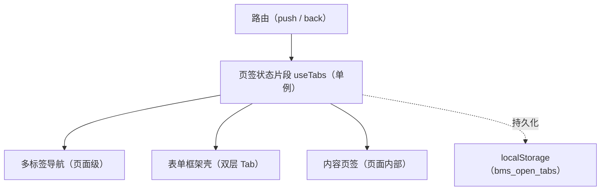

# 组件设计 · 页签状态片段

> useTabs（能力片段，模块级单例组合式；页签状态：打开 / 关闭 / 固定 / 缓存键 / keep-alive 清单；多标签导航、表单框架双层 Tab、内容页签共用）

[文档首页](../../../../../文档首页.md) › [项目规划说明](../../../../../规划/项目规划说明.md) › [组件设计](../../../01_组件设计_总览.md) › 页签状态片段　|　[← 异步任务片段](../14_组件设计_异步任务片段/14_组件设计_异步任务片段.md)　[偏好持久化片段 →](../16_组件设计_偏好持久化片段/16_组件设计_偏好持久化片段.md)

> 可交互原型：[15_原型设计_页签状态片段.html](15_原型设计_页签状态片段.html)（演示打开 / 关闭 / 固定、激活相邻、去重激活与 keep-alive 缓存清单）

## 1. 目的与适用范围 

定义 BMS 前端 `apps/desktop/`（`frontend-mobile/` 同款）**页签状态片段**的组件设计：`useTabs`（能力片段，**模块级单例组合式**，非 store）。它是组件设计体系**能力片段「页签状态片段」**，统一管理页签的**打开、关闭、固定、缓存键与 keep-alive 清单**，供 [布局组件类「多标签导航」](../../../03_布局组件类/04_组件设计_多标签导航/04_组件设计_多标签导航.md)、[布局组件类「表单框架壳」FormFrame](../../../03_布局组件类/02_组件设计_表单框架壳/02_组件设计_表单框架壳.md)（双层 Tab）与[布局组件类「内容页签」](../../../03_布局组件类/09_组件设计_内容页签/09_组件设计_内容页签.md) 共用；沿用阶段一既有实现（核心），本节点补契约、缓存键与持久化口径。

### 1.1 定位 

| 职责 | 归属 |
| --- | --- |
| 页签列表与激活、打开 / 关闭 / 固定、缓存键、keep-alive 清单、持久化 | **本节点（页签状态片段）** |
| 标签栏渲染与交互（右键菜单等） | [多标签导航](../../../03_布局组件类/04_组件设计_多标签导航/04_组件设计_多标签导航.md) |
| 表单页内部 Tab | [表单框架壳](../../../03_布局组件类/02_组件设计_表单框架壳/02_组件设计_表单框架壳.md)（不参与顶层页签与持久化） |
| 脏数据拦截 | [容器组件类「弹窗抽屉表单」](../../../04_容器组件类/01_组件设计_弹窗抽屉表单/01_组件设计_弹窗抽屉表单.md) 与表单页 `dirty` |

上游依据：[《前端开发规范》](../../../../../规范/前端开发规范.md)（§6 store 约定：`useTabs` 为模块级单例组合式；§8.1 Tab 与路由）、[《布局设计 · 主框架》](../../../../布局设计/01_布局设计_总览.html)（多标签行为）。

> 本篇为 **基础组件类 · 能力片段「页签状态片段」**。**范围边界**：标签栏 UI 归多标签导航；表单内部 Tab 归表单框架壳；本片段只管页签状态与缓存清单。

## 2. 组件清单与职责 

| 组件 / 工具 | 位置 | 职责 |
| --- | --- | --- |
| `useTabs.ts`（能力片段，单例） | `src/components/base/<能力域>/` 或 `src/utils/`（阶段一既有，按目录口径归位） | 页签状态机：打开 / 关闭 / 固定 / 激活 / 缓存键 / keep-alive 清单 / 持久化 |
| `BaseTabsNav.vue`（可选组件包装） | `src/components/base/<能力域>/` | 标签栏基础壳（标签渲染、关闭按钮、右键菜单入口）；由多标签导航复用 |

- 命名遵循[《命名规范》](../../../../../规范/命名规范.md)：片段 `useXxx`（不带 `Base` 后缀）；目录遵循[《前端开发规范》](../../../../../规范/前端开发规范.md)。
- **单例口径**：`useTabs` 为模块级单例组合式（非 Pinia store）；多标签导航、表单框架、内容页签读取同一实例状态。

## 3. 契约（状态与方法） 

| 状态 | 类型 | 说明 |
| --- | --- | --- |
| `tabs` | TabItem[] | 已打开页签（`{ key, title, path, closable, fixed, component }`） |
| `activeKey` | string | 当前激活页签键（缺省为路由 path / name） |
| `cachedNames` | string[] | keep-alive 缓存组件名清单（固定 + 非固定按策略） |

| 方法 / 事件 | 说明 |
| --- | --- |
| `open(tab)` | 打开（同 `key` 已存在则激活，不重复打开） |
| `close(key)` | 关闭并激活相邻页签（优先右侧 → 左侧 → 首页） |
| `closeOthers(key)` / `closeAll()` | 关闭其他 / 全部（固定页签保留） |
| `pin(key)` / `unpin(key)` | 固定 / 取消固定（固定页签不可关、常驻缓存） |
| `activate(key)` | 激活（同步路由 push；由路由守卫或标签点击触发） |
| `find(key)` / `has(key)` | 查询（供路由白名单与拦截判定） |

## 4. 行为与实现约定 

| 项 | 设计 |
| --- | --- |
| 打开去重 | 同 `key`（路由 path / name + 参数策略）只保留一个页签；重复打开转为激活 |
| 路由驱动 | 前进 / 后退同步激活（`watch route` → `activate`）；直接访问先建后激活；白名单 `ALLOWED_PATHS` 过滤（登录、404 等不建签） |
| 关闭顺序 | 关闭激活页签 → 激活右侧相邻，无则左侧，最后首页；固定页签不参与关闭 |
| 缓存键 | `cachedNames` 由固定页签 + 表单框架双层的缓存策略合成（表单页缓存由 FormFrame 管理） |
| 持久化 | 页签列表与激活项同步 `localStorage`（key `bms_open_tabs`）；刷新后恢复；**表单内部 Tab 不持久化** |
| 标题 | 取自菜单名（locale 翻译）/ `meta.title`，不直接用路由 name |
| 脏数据 | 关闭前由页面 `dirty` 状态触发确认（经弹窗抽屉表单的确认能力），确认后关闭 |
| 依赖方向 | 只依赖 组件根 / 路由；被布局类消费，不被具体页面直接改状态 |

## 5. 场景集成 

| 场景 | 说明 |
| --- | --- |
| 多标签导航 | 页面级页签：打开菜单 → 建签激活；关闭 / 固定 / 右键菜单 |
| 表单框架 FormFrame | 列表固定签 + 详情多开签（第二层 Tab 由 FormFrame 消费 `open` / `close`） |
| 内容页签 | 页面内部页签：不参与顶层页签与持久化，仅复用交互模式 |
| 路由守卫 | 无权限路由不建签（与动态路由 / 权限上下文协作） |

## 6. 依赖接口与上游变更 

### 6.1 上游接口与口径 

| 项 | 说明 | 目标文档 |
| --- | --- | --- |
| 分层权威 | 页签状态片段职责与单例口径 | [《前端开发规范》](../../../../../规范/前端开发规范.md) §6 / §8.1（登记项①） |
| 页签行为 | 打开 / 关闭 / 固定 / 缓存与持久化 | [《布局设计 · 主框架》](../../../../布局设计/01_布局设计_总览.html)（登记项②） |
| 缓存清单 | keep-alive 缓存与表单框架双层 Tab | [表单框架壳](../../../03_布局组件类/02_组件设计_表单框架壳/02_组件设计_表单框架壳.md)（登记项③） |
| 新增依赖 | **无**（沿用阶段一核心实现） | — |

### 6.2 需登记的上游变更 

| 变更点 | 目标文档 | 内容 |
| --- | --- | --- |
| ① 页签状态片段契约 | [《前端开发规范》](../../../../../规范/前端开发规范.md) | 明确 `useTabs` 单例口径：打开 / 关闭 / 固定 / 缓存键 / 持久化（`bms_open_tabs`）/ 脏数据拦截；表单内部 Tab 不参与 |
| ② 页签行为口径 | [《布局设计 · 主框架》](../../../../布局设计/01_布局设计_总览.html) | 关闭激活顺序、固定页签、前进后退同步、白名单过滤 |
| ③ 缓存清单协作 | [表单框架壳](../../../03_布局组件类/02_组件设计_表单框架壳/02_组件设计_表单框架壳.md) | `cachedNames` 与 FormFrame 双层 Tab 缓存策略合成口径 |

> 按[《文档生成规范》](../../../../../规范/文档生成规范.md)「引用与追溯」节，上述变更需用户确认后由上游文档同步。

## 7. 权限 / i18n / 移动端 

- **权限**：无权限路由不建签（权限上下文 `useAccess` 过滤 + 路由守卫），本片段不判权。
- **i18n**：页签标题取菜单名（locale 翻译）或 `meta.title`。
- **移动端**：独立工程，页签状态简化为栈式导航（能力同源、交互不同）。

## 8. 性能与边界 

| 场景 | 设计 |
| --- | --- |
| 缓存 | `cachedNames` 精确输出，避免全量缓存（内存） |
| 持久化 | 只存必要字段（key / title / path / fixed）；频繁写 localStorage 防抖 |
| 边界 | 页签数量无上限（可配上限与提示）、参数不同同页签策略、关闭激活竞态、刷新恢复后路由不一致、固定签被误关 |
| 不支持 | 标签栏 UI（多标签导航）、表单内部 Tab（表单框架壳）、权限判定 |

## 9. 检查清单 

- □ 契约：`tabs`/`activeKey`/`cachedNames` + `open`/`close`/`closeOthers`/`closeAll`/`pin`/`unpin`/`activate`
- □ 行为：打开去重、路由同步、关闭激活顺序、固定不可关、白名单过滤、持久化（`bms_open_tabs`）、脏数据确认
- □ 单例口径（非 store）；被布局类消费，依赖方向单向
- □ 权限/i18n/移动端符合第 7 节；性能边界符合第 8 节
- □ 三项上游登记已确认

> 组件设计节点（页签状态片段）· 与[《前端开发规范》](../../../../../规范/前端开发规范.md)[《布局设计 · 主框架》](../../../../布局设计/01_布局设计_总览.html)[多标签导航](../../../03_布局组件类/04_组件设计_多标签导航/04_组件设计_多标签导航.md)[表单框架壳](../../../03_布局组件类/02_组件设计_表单框架壳/02_组件设计_表单框架壳.md)[内容页签](../../../03_布局组件类/09_组件设计_内容页签/09_组件设计_内容页签.md)《命名规范》配套
