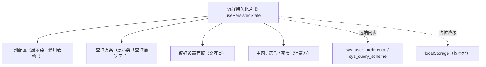

# 组件设计 · 偏好持久化片段

> usePersistedState（能力片段，对外契约）· 偏好持久化：本地即时 + 远端同步（sys_user_preference / sys_query_scheme；列配置、查询方案、偏好面板、主题语言共用）

[文档首页](../../../../../文档首页.md) › [项目规划说明](../../../../../规划/项目规划说明.md) › [组件设计](../../../01_组件设计_总览.md) › 偏好持久化片段　|　[← 页签状态片段](../15_组件设计_页签状态片段/15_组件设计_页签状态片段.md)　[编辑器内核片段 →](../17_组件设计_编辑器内核片段/17_组件设计_编辑器内核片段.md)

> 可交互原型：[16_原型设计_偏好持久化片段.html](16_原型设计_偏好持久化片段.html)（演示本地即时生效、远端同步、重置默认与占位降级）

## 1. 目的与适用范围 

定义 BMS 前端 `frontend/`（`frontend-mobile/` 同款）**偏好持久化片段**的组件设计：`usePersistedState`（能力片段，对外契约）。它是组件设计体系**能力片段「偏好持久化片段」**，为**表格列配置、查询方案、偏好设置面板、主题与语言**等提供统一的「本地即时 + 远端同步」偏好存取；后端对应 `sys_user_preference` / `sys_query_scheme`（跨设备同步，未就绪时**占位降级为仅本地**）。

### 1.1 定位 

| 职责 | 归属 |
| --- | --- |
| 本地即时存取、远端同步、合并冲突策略、重置默认、占位降级 | **本节点（偏好持久化片段）** |
| 偏好内容的结构与默认值 | 各消费方（列配置、查询方案、主题等） |
| 偏好表与接口 | 后端（阶段八回补） |
| 语言 / 时区上下文 | [语言上下文片段](../26_组件设计_语言上下文片段/26_组件设计_语言上下文片段.md)（消费者） |

上游依据：[《前端开发规范》](../../../../../规范/前端开发规范.md)（§3 能力片段、§6 store 约定）、[《概要设计 · 系统参数》](../../../../概要设计/10_概要设计_系统参数.md)（用户偏好 / 查询方案表）。

> 本篇为 **基础组件类 · 能力片段「偏好持久化片段」**。**范围边界**：偏好内容定义归消费方；远端表结构归后端；本片段只管"偏好怎么存、怎么同步、怎么合并"。

## 2. 组件清单与职责 

| 组件 / 工具 | 位置 | 职责 |
| --- | --- | --- |
| `usePersistedState.ts`（能力片段，对外契约） | `src/components/base/<能力域>/` | 偏好：`get` / `set` / `reset` / `syncFromRemote` / `flush`；本地即时 + 远端防抖同步；占位降级 |
| `BasePreferencePanel.vue`（可选组件包装） | `src/components/base/<能力域>/` | 偏好面板容器（分组 / 重置按钮 / 同步状态提示）；供偏好设置面板复用 |

- 命名遵循[《命名规范》](../../../../../规范/命名规范.md)：片段 `useXxx`、组件包装 `BaseXxx.vue`；目录遵循[《前端开发规范》](../../../../../规范/前端开发规范.md)。

## 3. 契约（Props 与方法） 

| 属性 | 类型 | 默认 | 说明 |
| --- | --- | --- | --- |
| `key` | string | 必填 | 偏好键（如 `table:user:columns` / `query:user` / `ui:theme`） |
| `scope` | 'local' \| 'remote' \| 'both' | 'both' | 存储范围（local＝localStorage；remote＝偏好表；both＝本地即时 + 远端同步） |
| `defaultValue` | any | — | 默认值（重置与首次使用） |
| `syncDebounce` | number | 800 | 远端同步防抖（ms） |
| `merge` | 'remote-wins' \| 'local-wins' \| 'deep' | 'deep' | 冲突合并策略（登录拉取远端时） |

| 方法 / 事件 | 说明 |
| --- | --- |
| `get()` / `set(value)` | 读写（本地即时生效；`set` 触发远端防抖同步） |
| `reset()` | 重置为 `defaultValue`（本地 + 远端） |
| `syncFromRemote()` | 登录 / 切换租户后拉取远端并合并 |
| `flush()` | 立即推送未同步变更（离开页面 / 提交前） |
| `state` / `syncing` / `synced` | 状态与同步指示（响应式） |

## 4. 行为与实现约定 

| 项 | 设计 |
| --- | --- |
| 本地优先 | 读写先走 localStorage（即时生效、离线可用）；远端作为跨设备同步层 |
| 远端同步 | `set` 防抖推送（合并连续变更）；登录 / 切租户 / 刷新后拉取远端与本地合并（`merge` 策略，默认深合并） |
| 冲突 | 默认深合并（远端新值覆盖叶子）；`local-wins` 用于本地操作为主的偏好（列宽拖拽）；冲突不可自动判定时以远端为准并提示 |
| 重置 | 恢复默认值并同步清除远端 |
| 占位降级 | 偏好表 / 查询方案接口未就绪时按占位语义：仅本地存储（`scope` 自动降级），同步状态提示"仅本地"；接入后无改调用方 |
| 与页签协作 | 页签持久化（`bms_open_tabs`）由页签状态片段自管，不走本片段（保持单一职责） |
| 释放 | 同步请求登记[异步资源基类](../../01_机制基类/05_组件设计_异步资源基类/05_组件设计_异步资源基类.md)（卸载 flush 并取消在途） |
| 依赖方向 | 只依赖 组件根 / 机制基类；不依赖具体组件；消费方组合本片段 |

## 5. 场景集成 

| 场景 | 说明 |
| --- | --- |
| 列配置 | 表格列显隐 / 顺序 / 宽度（`table:模块:columns`），跨设备同步 |
| 查询方案 | 保存 / 应用查询条件方案（`sys_query_scheme`，与查询方案片段协作） |
| 偏好设置面板 | 主题 / 密度 / 语言等用户偏好统一存取 |
| 语言与主题 | 语言上下文与主题品牌化读取 / 写入偏好（各自片段消费） |

## 6. 依赖接口与上游变更 

### 6.1 上游接口与口径 

| 项 | 说明 | 目标文档 |
| --- | --- | --- |
| 分层权威 | 偏好片段职责与本地/远端口径 | [《前端开发规范》](../../../../../规范/前端开发规范.md) 第 3 节（登记项①） |
| 偏好表与接口 | `sys_user_preference` / `sys_query_scheme` | [《概要设计 · 系统参数》](../../../../概要设计/10_概要设计_系统参数.md)（登记项②） |
| 多租户隔离 | 偏好的租户隔离与切换 | [《概要设计》](../../../../概要设计/01_概要设计_总览.md)（登记项③） |
| 新增依赖 | **无** | — |

### 6.2 需登记的上游变更 

| 变更点 | 目标文档 | 内容 |
| --- | --- | --- |
| ① 偏好持久化契约 | [《前端开发规范》](../../../../../规范/前端开发规范.md) 第 3 节 | 明确 `usePersistedState`：本地即时 + 远端防抖同步 + 合并策略 + 重置 + 占位降级（仅本地） |
| ② 偏好接口 | [《概要设计》](../../../../概要设计/01_概要设计_总览.md) 对应节点 | 偏好读写（批量 get / set）与查询方案接口；跨设备同步语义 |
| ③ 租户切换 | [《概要设计》](../../../../概要设计/01_概要设计_总览.md) 对应节点 | 切换租户后偏好重新拉取与隔离口径 |

> 按[《文档生成规范》](../../../../../规范/文档生成规范.md)「引用与追溯」节，上述变更需用户确认后由上游文档同步。

## 7. 权限 / i18n / 移动端 

- **权限**：偏好存取按用户隔离（后端鉴权）；前端不判权。
- **i18n**：偏好内容不涉及文案（值本身）；面板文案走 vue-i18n。
- **移动端**：独立工程，能力同款；移动端偏好键按端区分（避免相互覆盖）。

## 8. 性能与边界 

| 场景 | 设计 |
| --- | --- |
| 写入 | 本地写即时；远端防抖合并（避免每次拖拽全量推送） |
| 读取 | 同步读本地（首屏不等待远端）；远端异步合并后响应式刷新 |
| 边界 | 本地与远端冲突、localStorage 容量（大对象裁剪）、隐私模式禁用 localStorage（降级内存）、跨租户污染、未登录时远端跳过 |
| 不支持 | 偏好内容定义（消费方）、偏好表结构（后端）、页签持久化（页签状态片段） |

## 9. 检查清单 

- □ 契约：`key`/`scope`/`defaultValue`/`syncDebounce`/`merge` + `get`/`set`/`reset`/`syncFromRemote`/`flush`
- □ 行为：本地即时 + 远端防抖、合并策略、重置双清、占位降级仅本地、释放登记异步资源
- □ 消费方（列配置 / 查询方案 / 偏好面板 / 语言主题）组合本片段；依赖方向单向
- □ 权限/i18n/移动端符合第 7 节；性能边界符合第 8 节
- □ 三项上游登记已确认

> 组件设计节点（偏好持久化片段）· 与[《前端开发规范》](../../../../../规范/前端开发规范.md)[《概要设计 · 系统参数》](../../../../概要设计/10_概要设计_系统参数.md)[列配置片段](../28_组件设计_列配置片段/28_组件设计_列配置片段.md)[查询方案片段](../29_组件设计_查询方案片段/29_组件设计_查询方案片段.md)[偏好设置面板](../../../08_交互类/15_组件设计_偏好设置面板/15_组件设计_偏好设置面板.md)《命名规范》配套
