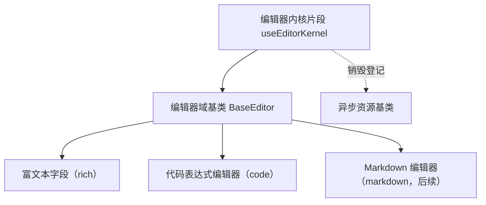

# 组件设计 · 编辑器内核片段

> useEditorKernel（能力片段，对外契约）· 编辑器内核：懒加载 / 销毁 / 内容协议（CodeMirror 与富文本 / Markdown 共用）

[文档首页](../../../../../文档首页.md) › [项目规划说明](../../../../../规划/项目规划说明.md) › [组件设计](../../../01_组件设计_总览.md) › 编辑器内核片段　|　[← 偏好持久化片段](../16_组件设计_偏好持久化片段/16_组件设计_偏好持久化片段.md)　[树数据片段 →](../18_组件设计_树数据片段/18_组件设计_树数据片段.md)

> 可交互原型：[17_原型设计_编辑器内核片段.html](17_原型设计_编辑器内核片段.html)（演示内核懒加载、内容协议读写、实例销毁与同屏多实例共享）

## 1. 目的与适用范围 

定义 BMS 前端 `apps/desktop/`（`frontend-mobile/` 同款）**编辑器内核片段**的组件设计：`useEditorKernel`（能力片段，对外契约）。它是组件设计体系**能力片段「编辑器内核片段」**，为 [编辑器域基类](../../03_域基类/05_组件设计_编辑器域基类/05_组件设计_编辑器域基类.md) 提供底层能力——**内核懒加载（独立分包）、实例创建与销毁、内容协议读写**；CodeMirror（代码）与富文本 / Markdown 编辑器**共用同一片段**，差异由 `kind` 决定。

### 1.1 定位 

| 职责 | 归属 |
| --- | --- |
| 内核懒加载（分包）、实例创建 / 销毁、内容协议读写、多实例共享 | **本节点（编辑器内核片段）** |
| 域契约（只读 / 高度 / 工具栏插槽 / 上传配置） | [编辑器域基类](../../03_域基类/05_组件设计_编辑器域基类/05_组件设计_编辑器域基类.md) |
| 富文本图片上传 | [上传引擎片段](../13_组件设计_上传引擎片段/13_组件设计_上传引擎片段.md) |
| 具体编辑器产品（版本 / 插件） | 实现层（本片段定义加载与协议契约） |

上游依据：[《前端开发规范》](../../../../../规范/前端开发规范.md)（§3 能力片段）、[《架构设计 · 前端组件体系》](../../../../架构设计/05_架构设计_前端组件体系.md)（重组件异步加载与分包策略）。

> 本篇为 **基础组件类 · 能力片段「编辑器内核片段」**。**范围边界**：域契约归编辑器域基类；上传归上传引擎；本片段只管"内核怎么加载、实例怎么管、内容怎么读写"。

## 2. 组件清单与职责 

| 组件 / 工具 | 位置 | 职责 |
| --- | --- | --- |
| `useEditorKernel.ts`（能力片段，对外契约） | `src/components/base/<能力域>/` | 内核：`loadKernel` / `create` / `destroy` / `getContent` / `setContent` / `onChange`；分包加载与多实例共享 |
| `kernelRegistry.ts`（片段内部机制） | 同上 | 内核模块缓存（同屏多编辑器共享已加载模块，避免重复 import） |

- 命名遵循[《命名规范》](../../../../../规范/命名规范.md)：片段 `useXxx`；目录遵循[《前端开发规范》](../../../../../规范/前端开发规范.md)（归 `src/components/base/<能力域>/`）。

## 3. 契约（参数与方法） 

| 属性 | 类型 | 默认 | 说明 |
| --- | --- | --- | --- |
| `kind` | 'rich' \| 'markdown' \| 'code' | 'rich' | 内核类型（决定加载的模块与内容协议） |
| `language` | string | '' | `code` 模式语言包（如 sql / json，语言包同样懒加载） |
| `readonly` | boolean | false | 只读（禁编辑） |
| `placeholder` | string | '' | 占位（由内核支持时透传） |

| 方法 / 事件 | 说明 |
| --- | --- |
| `loadKernel()` | 懒加载内核模块（返回 Promise；模块级缓存，重复调用不重复加载） |
| `create(el, opts)` | 创建实例（内核就绪后）；返回实例句柄 |
| `destroy()` | 销毁实例（登记异步资源，卸载自动调用） |
| `getContent()` / `setContent(v)` | 内容读写（按 `kind` 协议归一：HTML / Markdown / 纯文本） |
| `onChange(cb)` | 内容变更回调（由域基类去抖后对外 emit） |

## 4. 行为与实现约定 

| 项 | 设计 |
| --- | --- |
| 懒加载 | `loadKernel()` 内动态 `import()`（独立分包）；模块级缓存（`kernelRegistry`），**同屏多实例共享已加载模块**；加载失败重试一次并提示 |
| 加载时机 | 由域基类决定（首次进入视口 / 聚焦 / 编辑态）；本片段只提供加载能力 |
| 实例协议 | `create` 返回统一句柄（`{ getContent, setContent, focus, destroy }`），屏蔽不同内核 API 差异 |
| 销毁 | `destroy()` 幂等；登记[异步资源基类](../../01_机制基类/05_组件设计_异步资源基类/05_组件设计_异步资源基类.md)，卸载自动销毁（防 DOM / 定时器泄漏） |
| 内容协议 | `rich`＝HTML（提交前 / 渲染时白名单净化 + 服务端二次）；`markdown`＝Markdown 文本；`code`＝纯文本 + 语言标记；协议只在片段内归一，对外一致 |
| 只读 | `readonly` 透传内核（禁编辑、保复制滚动）；切换只读不重建实例 |
| 依赖方向 | 只依赖 组件根 / 机制基类；被编辑器域基类组合；不依赖具体字段组件 |

## 5. 场景集成 

| 场景 | 说明 |
| --- | --- |
| 富文本字段 | `kind=rich`：公告 / 说明 / 审批意见（叠加输入域基类与字段壳） |
| 代码表达式编辑器 | `kind=code` + `language`：表单公式 / 报表表达式 / 规则脚本 |
| 同屏多编辑器 | 表单多项富文本 / 代码项：共享内核模块，各自独立实例 |
| 内容渲染 | 展示侧按内容协议渲染（净化后），与编辑协议一致 |

## 6. 依赖接口与上游变更 

### 6.1 上游接口与口径 

| 项 | 说明 | 目标文档 |
| --- | --- | --- |
| 分层权威 | 编辑器内核片段职责与协议口径 | [《前端开发规范》](../../../../../规范/前端开发规范.md) 第 3 节（登记项①） |
| 分包加载 | 内核模块独立分包（首屏不含） | [《架构设计 · 前端组件体系》](../../../../架构设计/05_架构设计_前端组件体系.md)「分包与加载策略」节（登记项②） |
| 内容安全 | 富文本净化责任边界（前端白名单 + 服务端二次） | [编辑器域基类](../../03_域基类/05_组件设计_编辑器域基类/05_组件设计_编辑器域基类.md) + [《架构设计 · 安全》](../../../../架构设计/01_架构设计_总览.md)（登记项③） |
| 新增依赖 | 编辑器内核（CodeMirror / 富文本，随实现锁定版本） | — |

### 6.2 需登记的上游变更 

| 变更点 | 目标文档 | 内容 |
| --- | --- | --- |
| ① 编辑器内核契约 | [《前端开发规范》](../../../../../规范/前端开发规范.md) 第 3 节 | 明确 `useEditorKernel`：内核懒加载（分包 / 模块缓存）/ 实例协议 / 销毁 / 内容协议（rich / markdown / code） |
| ② 分包策略 | [《架构设计 · 前端组件体系》](../../../../架构设计/05_架构设计_前端组件体系.md) | 编辑器内核与语言包异步加载、独立分包，同屏多实例共享 |
| ③ 内容净化 | [《架构设计》](../../../../架构设计/01_架构设计_总览.md) 安全节点 + [编辑器域基类](../../03_域基类/05_组件设计_编辑器域基类/05_组件设计_编辑器域基类.md) | 前端白名单净化 + 服务端二次净化的责任边界 |

> 按[《文档生成规范》](../../../../../规范/文档生成规范.md)「引用与追溯」节，上述变更需用户确认后由上游文档同步。

## 7. 权限 / i18n / 移动端 

- **权限**：不做权限判定（编辑器只读由域基类 / 字段权限决定）。
- **i18n**：内核语言包按 locale 懒加载；工具栏文案由域基类处理。
- **移动端**：独立工程，内核可不同（内容协议同源，数据兼容）。

## 8. 性能与边界 

| 场景 | 设计 |
| --- | --- |
| 分包 | 内核 / 语言包异步加载，独立分包；模块缓存防重复 import |
| 多实例 | 每实例独立 DOM 与状态；销毁彻底（事件 / 定时器 / observers） |
| 边界 | 加载失败（重试 + 降级纯文本）、实例未销毁泄漏、协议不一致（历史数据）、只读切换重建、语言包缺失 |
| 不支持 | 域契约（编辑器域基类）、上传（上传引擎片段）、具体编辑器产品配置（使用方） |

## 9. 检查清单 

- □ 契约：`kind`/`language`/`readonly`/`placeholder` + `loadKernel`/`create`/`destroy`/`getContent`/`setContent`/`onChange`
- □ 行为：懒加载与模块缓存、统一实例协议、幂等销毁（登记异步资源）、内容协议归一、加载失败重试
- □ 被编辑器域基类组合；依赖方向单向（不依赖具体字段组件）
- □ 权限/i18n/移动端符合第 7 节；性能边界符合第 8 节
- □ 三项上游登记已确认

> 组件设计节点（编辑器内核片段）· 与[《前端开发规范》](../../../../../规范/前端开发规范.md)[《架构设计 · 前端组件体系》](../../../../架构设计/05_架构设计_前端组件体系.md)[编辑器域基类](../../03_域基类/05_组件设计_编辑器域基类/05_组件设计_编辑器域基类.md)[上传引擎片段](../13_组件设计_上传引擎片段/13_组件设计_上传引擎片段.md)[异步资源基类](../../01_机制基类/05_组件设计_异步资源基类/05_组件设计_异步资源基类.md)《命名规范》配套
