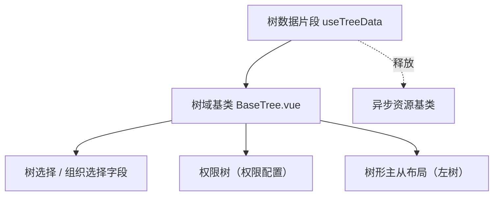

# 组件设计 · 树数据片段

> useTreeData（能力片段，对外契约）· 树数据：加载 / 懒加载 / 选中 / 过滤（树选择、组织树、权限树、树形主从共用；归树域基类）

[文档首页](../../../../../文档首页.md) › [项目规划说明](../../../../../规划/项目规划说明.md) › [组件设计](../../../01_组件设计_总览.md) › 树数据片段　|　[← 编辑器内核片段](../17_组件设计_编辑器内核片段/17_组件设计_编辑器内核片段.md)　[用户展示片段 →](../19_组件设计_用户展示片段/19_组件设计_用户展示片段.md)

> 可交互原型：[18_原型设计_树数据片段.html](18_原型设计_树数据片段.html)（演示加载 / 懒加载缓存、选中与勾选模型、关键字过滤与请求释放）

## 1. 目的与适用范围 

定义 BMS 前端 `frontend/`（`frontend-mobile/` 同款）**树数据片段**的组件设计：`useTreeData`（能力片段，对外契约）。它是组件设计体系**能力片段「树数据片段」**，承载树形态的**数据与选择模型**——加载 / 懒加载、数据归一、选中 / 勾选、关键字过滤；由 [树域基类](../../03_域基类/03_组件设计_树域基类/03_组件设计_树域基类.md)（`BaseTree.vue`）组合，供**树选择字段、组织树、权限树、树形主从布局**共用。

### 1.1 定位 

| 职责 | 归属 |
| --- | --- |
| 数据加载 / 懒加载、归一、选中 / 勾选模型、过滤、缓存 | **本节点（树数据片段）** |
| 域契约与组件包装（Props / 插槽 / 事件） | [树域基类](../../03_域基类/03_组件设计_树域基类/03_组件设计_树域基类.md) |
| 字段语义（label / 必填 / 校验） | [字段编排片段](../09_组件设计_字段编排片段/09_组件设计_字段编排片段.md) 与字段壳 |
| 树数据的后端接口 | 组织 / 权限 / 字典树接口（模块接口） |

上游依据：[《前端开发规范》](../../../../../规范/前端开发规范.md)（§3 能力片段）、[《前端基类清单》](../../../../../前端基类清单.md)「能力片段」节、[《概要设计》](../../../../概要设计/01_概要设计_总览.md)（组织 / 权限树结构）。

> 本篇为 **基础组件类 · 能力片段「树数据片段」**。**范围边界**：组件包装与插槽归树域基类；字段外观归输入域基类与字段壳；本片段只管"树数据与选择状态"。

## 2. 组件清单与职责 

| 组件 / 工具 | 位置 | 职责 |
| --- | --- | --- |
| `useTreeData.ts`（能力片段，对外契约） | `src/components/base/tree/` | 树数据：`loadRoot` / `loadChildren` / `normalize` / `select` / `check` / `filter` / `getChecked`；懒加载缓存与释放 |

- 命名遵循[《命名规范》](../../../../../规范/命名规范.md)：片段 `useXxx`；目录遵循[《前端开发规范》](../../../../../规范/前端开发规范.md)（与树域基类同域目录 `src/components/base/tree/`）。

## 3. 契约（参数与方法） 

| 属性 | 类型 | 默认 | 说明 |
| --- | --- | --- | --- |
| `nodeKey` | string | 'id' | 节点键字段（归一映射） |
| `labelKey` | string | 'label' | 节点文本字段 |
| `childrenKey` | string | 'children' | 子节点字段（懒加载判定） |
| `checkable` | boolean | false | 勾选模型（含半选） |
| `checkStrictly` | boolean | false | 勾选父子独立 |
| `lazy` | boolean | false | 懒加载模式（按需拉子级） |

| 状态 / 方法 | 说明 |
| --- | --- |
| `treeData` / `loading` | 数据与加载态（响应式） |
| `selectedKeys` / `checkedKeys` / `expandedKeys` | 选择状态集合 |
| `loadRoot(params?)` | 加载根节点（远程模式） |
| `loadChildren(node)` | 懒加载子级（缓存 `loaded` 标记，重复展开不重复请求） |
| `normalize(raw)` | 后端树 → 前端节点（键 / 文本 / 子级映射） |
| `select(node)` / `selectKeys(keys)` | 单选模型（受控） |
| `check(nodes)` / `getChecked(withHalf?)` | 勾选模型（级联 / 独立；返回含半选） |
| `filter(keyword)` | 过滤（保留命中节点及祖先路径） |

## 4. 行为与实现约定 

| 项 | 设计 |
| --- | --- |
| 归一 | `normalize` 按 `nodeKey` / `labelKey` / `childrenKey` 映射；空 `children` 与 `leaf` 标记决定是否可懒加载 |
| 懒加载缓存 | 每节点记录 `loaded`；重复展开命中缓存；父级刷新时清理子级缓存 |
| 选择模型 | 单选 `selectedKeys` 与勾选 `checkedKeys` 独立；勾选级联由本片段计算（或交给 `el-tree`，二者口径统一）；半选集合可查询 |
| 过滤 | 本地过滤保留命中节点及祖先；远程过滤由 `loadRoot` 带参（由使用方选） |
| 释放 | 在途请求登记[异步资源基类](../../01_机制基类/05_组件设计_异步资源基类/05_组件设计_异步资源基类.md)（卸载 / 参数变化自动取消，防竞态） |
| 受控与视图 | 数据与选择状态在本片段维护（受控输入输出）；视图渲染归树域基类 |
| 依赖方向 | 只依赖 组件根 / 机制基类；被树域基类组合；不依赖字段组件 |

## 5. 场景集成 

| 场景 | 说明 |
| --- | --- |
| 树选择 / 组织选择字段 | 单选模型 + 回显（配合选项源片段做组织数据源） |
| 权限树 | 勾选模型（含半选）回传（权限配置） |
| 树形主从布局 | 单选节点驱动右侧列表 / 详情 |
| 字典树 / 分类树 | 懒加载大数据量树 |

## 6. 依赖接口与上游变更 

### 6.1 上游接口与口径 

| 项 | 说明 | 目标文档 |
| --- | --- | --- |
| 分层权威 | 树数据片段职责与选择模型口径 | [《前端开发规范》](../../../../../规范/前端开发规范.md) 第 3 节（登记项①） |
| 树数据结构 | 组织 / 权限 / 分类树字段与懒加载接口 | [《概要设计》](../../../../概要设计/01_概要设计_总览.md) 对应节点（登记项②） |
| 组件分层 | `src/components/base/tree/` 与组合关系 | [《架构设计 · 前端架构》](../../../../架构设计/08_架构设计_前端架构.md)（登记项③） |
| 新增依赖 | **无** | — |

### 6.2 需登记的上游变更 

| 变更点 | 目标文档 | 内容 |
| --- | --- | --- |
| ① 树数据片段契约 | [《前端开发规范》](../../../../../规范/前端开发规范.md) 第 3 节 | 明确 `useTreeData`：加载 / 懒加载缓存 / 归一 / 选中·勾选模型 / 过滤 / 释放 |
| ② 树接口结构 | [《概要设计》](../../../../概要设计/01_概要设计_总览.md) 对应节点 | 组织 / 权限 / 分类树的节点字段与懒加载接口（含叶标记） |
| ③ 域组合关系 | [《架构设计 · 前端架构》](../../../../架构设计/08_架构设计_前端架构.md) | 登记「片段（树数据）→ 域基类（树域）→ 字段 / 布局组件」组合链 |

> 按[《文档生成规范》](../../../../../规范/文档生成规范.md)「引用与追溯」节，上述变更需用户确认后由上游文档同步。

## 7. 权限 / i18n / 移动端 

- **权限**：树数据范围由后端过滤；前端可叠加节点禁用态；本片段不判权。
- **i18n**：节点 label 由接口下发（含 locale）；无需前端翻译。
- **移动端**：独立工程，数据与选择模型同款。

## 8. 性能与边界 

| 场景 | 设计 |
| --- | --- |
| 大数据量 | 懒加载优先；一次性加载设节点上限保护；展开态按需维护 |
| 更新 | 节点级更新（刷新某一子树）不整树重建；避免深监听全树 |
| 边界 | 键重复、懒加载失败重试、过滤后展开态恢复、勾选半选计算、受控与视图不一致、请求竞态 |
| 不支持 | 组件包装与插槽（树域基类）、字段外观（字段壳）、权限判定 |

## 9. 检查清单 

- □ 契约：`nodeKey`/`labelKey`/`childrenKey`/`checkable`/`checkStrictly`/`lazy` + `loadRoot`/`loadChildren`/`normalize`/`select`/`check`/`filter`
- □ 行为：懒加载缓存、选择模型（含半选）、过滤保留祖先、请求释放（登记异步资源）、受控一致
- □ 被树域基类组合；依赖方向单向
- □ 权限/i18n/移动端符合第 7 节；性能边界符合第 8 节
- □ 三项上游登记已确认

> 组件设计节点（树数据片段）· 与[《前端开发规范》](../../../../../规范/前端开发规范.md)[《前端基类清单》](../../../../../前端基类清单.md)[树域基类](../../03_域基类/03_组件设计_树域基类/03_组件设计_树域基类.md)[选项源片段](../12_组件设计_选项源片段/12_组件设计_选项源片段.md)[异步资源基类](../../01_机制基类/05_组件设计_异步资源基类/05_组件设计_异步资源基类.md)《命名规范》配套
