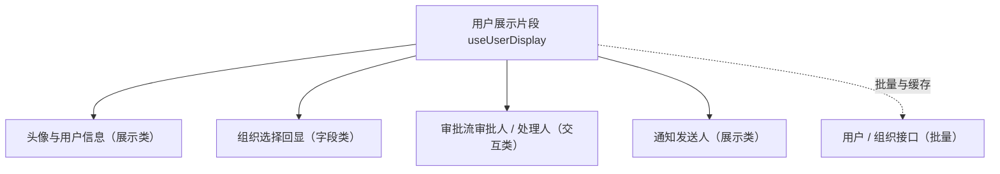

# 组件设计 · 用户展示片段

> useUserDisplay（能力片段，对外契约）· 用户 / 组织展示：姓名 / 头像 / 状态 / 部门路径（头像组件、组织选择回显、审批流、通知共用）

[文档首页](../../../../../文档首页.md) › [项目规划说明](../../../../../规划/项目规划说明.md) › [组件设计](../../../01_组件设计_总览.md) › 用户展示片段　|　[← 树数据片段](../18_组件设计_树数据片段/18_组件设计_树数据片段.md)　[动态路由片段 →](../20_组件设计_动态路由片段/20_组件设计_动态路由片段.md)

> 可交互原型：[19_原型设计_用户展示片段.html](19_原型设计_用户展示片段.html)（演示批量加载与缓存、头像 / 姓名 / 部门路径 / 状态组合展示、离职与空值降级）

## 1. 目的与适用范围 

定义 BMS 前端 `apps/desktop/`（`frontend-mobile/` 同款）**用户展示片段**的组件设计：`useUserDisplay`（能力片段，对外契约）。它是组件设计体系**能力片段「用户展示片段」**，统一**用户 / 组织信息的批量加载与展示**——姓名、头像、状态（在职/离职）、部门路径；供 [展示类「头像与用户信息」](../../../07_展示类/12_组件设计_头像与用户信息/12_组件设计_头像与用户信息.md)、[组织选择字段](../../../06_字段类/05_组件设计_组织选择字段/05_组件设计_组织选择字段.md) 回显、[交互类「审批流展示」](../../../08_交互类/02_组件设计_审批流展示/02_组件设计_审批流展示.md) 与通知组件共用。

### 1.1 定位 

| 职责 | 归属 |
| --- | --- |
| 用户 / 组织信息批量加载、缓存、展示字段组装（姓名 / 头像 / 状态 / 部门路径） | **本节点（用户展示片段）** |
| 头像 / 用户信息组件外观 | [展示类「头像与用户信息」](../../../07_展示类/12_组件设计_头像与用户信息/12_组件设计_头像与用户信息.md) |
| 用户 / 组织的选择取值 | [选项源片段](../12_组件设计_选项源片段/12_组件设计_选项源片段.md) 与[树数据片段](../18_组件设计_树数据片段/18_组件设计_树数据片段.md) |
| 用户 / 组织接口 | 后端用户与组织模块（阶段七 RBAC） |

上游依据：[《前端开发规范》](../../../../../规范/前端开发规范.md)（§3 能力片段）、[《概要设计 · 用户 / 组织管理》](../../../../概要设计/01_概要设计_总览.md)（用户与组织数据）。

> 本篇为 **基础组件类 · 能力片段「用户展示片段」**。**范围边界**：选择取值归选项源 / 树数据；头像视觉归展示类；本片段只管"用户信息怎么取、怎么缓存、怎么组合展示"。

## 2. 组件清单与职责 

| 组件 / 工具 | 位置 | 职责 |
| --- | --- | --- |
| `useUserDisplay.ts`（能力片段，对外契约） | `src/components/base/<能力域>/` | 用户 / 组织展示：`loadUsers` / `loadDepts` / `display` / `avatar` / `deptPath` / `status`；批量与缓存 |
| `BaseUserInfo.vue`（可选组件包装） | `src/components/base/<能力域>/` | 用户信息展示壳（头像 + 姓名 + 部门 / 状态的可配置组合；插槽扩展） |

- 命名遵循[《命名规范》](../../../../../规范/命名规范.md)：片段 `useXxx`、组件包装 `BaseXxx.vue`；目录遵循[《前端开发规范》](../../../../../规范/前端开发规范.md)。

## 3. 契约（参数与方法） 

| 属性 | 类型 | 默认 | 说明 |
| --- | --- | --- | --- |
| `fields` | string[] | `['name', 'avatar', 'dept']` | 展示字段组合（name / avatar / dept / status / title） |
| `deptPathSep` | string | ' / ' | 部门路径分隔符 |
| `cache` | boolean | true | 是否缓存（按用户 id） |
| `fallback` | 'id' \| 'placeholder' \| 'hidden' | 'id' | 缺失降级：显示原 id / 占位符 / 隐藏 |

| 方法 / 事件 | 说明 |
| --- | --- |
| `loadUsers(ids)` | 批量加载用户（一次取多 id，避免 N+1） |
| `loadDepts(ids)` | 批量加载组织（部门路径组装） |
| `display(id)` | 组装展示信息（姓名 / 头像 / 状态；含降级） |
| `deptPath(deptId)` | 部门路径（祖先链拼接，缓存） |
| `status(id)` | 状态（在职 / 离职 / 停用；离职样式与提示） |
| `invalidate(id?)` | 缓存失效（用户信息变更后刷新） |

## 4. 行为与实现约定 

| 项 | 设计 |
| --- | --- |
| 批量优先 | 列表场景 `loadUsers(ids)` 一次批量取；同页同 id 只请求一次（缓存） |
| 展示组装 | `display()` 返回 `{ name, avatar, deptPath, status }`；组件按需渲染；头像为空时回退姓名首字 / 默认图 |
| 离职 / 停用 | 状态字段参与样式（灰显）与提示（tooltip"已离职"）；审批流历史节点仍显示（不隐藏历史） |
| 降级 | 用户不存在 / 已删除：按 `fallback` 显示原 id 或占位，不整块报错 |
| 缓存 | 按用户 / 组织 id 缓存；`invalidate` 供变更后刷新（组织调整 / 用户改名） |
| 释放 | 在途请求登记[异步资源基类](../../01_机制基类/05_组件设计_异步资源基类/05_组件设计_异步资源基类.md) |
| 依赖方向 | 只依赖 组件根 / 机制基类；被展示类 / 字段类 / 交互类消费；不依赖具体组件 |

## 5. 场景集成 

| 场景 | 说明 |
| --- | --- |
| 头像与用户信息 | 表格、详情、评论区的用户展示（头像 + 姓名 + 部门） |
| 组织选择回显 | 选中的组织节点回显（部门路径 + 状态） |
| 审批流 | 审批人 / 处理人展示（历史节点含离职人员） |
| 通知与消息 | 发送人展示（含头像） |

## 6. 依赖接口与上游变更 

### 6.1 上游接口与口径 

| 项 | 说明 | 目标文档 |
| --- | --- | --- |
| 分层权威 | 用户展示片段职责与批量口径 | [《前端开发规范》](../../../../../规范/前端开发规范.md) 第 3 节（登记项①） |
| 用户 / 组织接口 | 批量用户查询、组织路径 | [《概要设计 · 用户 / 组织管理》](../../../../概要设计/01_概要设计_总览.md)（登记项②） |
| 缓存口径 | 用户信息缓存与失效 | [《架构设计 · 数据架构》](../../../../架构设计/07_架构设计_数据架构.md)（登记项③） |
| 新增依赖 | **无** | — |

### 6.2 需登记的上游变更 

| 变更点 | 目标文档 | 内容 |
| --- | --- | --- |
| ① 用户展示片段契约 | [《前端开发规范》](../../../../../规范/前端开发规范.md) 第 3 节 | 明确 `useUserDisplay`：批量加载 / 缓存 / 展示组装（姓名 / 头像 / 部门路径 / 状态）/ 降级 |
| ② 批量接口 | [《概要设计》](../../../../概要设计/01_概要设计_总览.md) 对应节点 | 用户批量查询接口（id 列表）、组织路径字段（或祖先链）；离职状态语义 |
| ③ 缓存与失效 | [《架构设计 · 数据架构》](../../../../架构设计/07_架构设计_数据架构.md) | 用户 / 组织信息缓存与变更失效口径 |

> 按[《文档生成规范》](../../../../../规范/文档生成规范.md)「引用与追溯」节，上述变更需用户确认后由上游文档同步。

## 7. 权限 / i18n / 移动端 

- **权限**：可见范围由后端过滤（用户 / 组织可见性）；前端不二次过滤。
- **i18n**：姓名 / 部门名称由数据下发；状态文案走 vue-i18n。
- **移动端**：独立工程，能力同款（头像尺寸与展示密度差异）。

## 8. 性能与边界 

| 场景 | 设计 |
| --- | --- |
| 批量 | 列表 100 行一次批量请求；缓存命中不再请求 |
| 边界 | 用户已删除（降级显示）、同名用户（以 id 区分）、头像 404（回退）、部门路径缓存过期、离职与停用语义 |
| 不支持 | 选择取值（选项源 / 树数据）、头像视觉（展示类「头像与用户信息」）、权限判定 |

## 9. 检查清单 

- □ 契约：`fields`/`deptPathSep`/`cache`/`fallback` + `loadUsers`/`loadDepts`/`display`/`deptPath`/`status`/`invalidate`
- □ 行为：批量优先、缓存与失效、展示组装、离职样式、降级不报错、请求释放
- □ 被展示 / 字段 / 交互类消费；依赖方向单向
- □ 权限/i18n/移动端符合第 7 节；性能边界符合第 8 节
- □ 三项上游登记已确认

> 组件设计节点（用户展示片段）· 与[《前端开发规范》](../../../../../规范/前端开发规范.md)[《概要设计 · 用户 / 组织管理》](../../../../概要设计/01_概要设计_总览.md)[选项源片段](../12_组件设计_选项源片段/12_组件设计_选项源片段.md)[树数据片段](../18_组件设计_树数据片段/18_组件设计_树数据片段.md)[头像与用户信息](../../../07_展示类/12_组件设计_头像与用户信息/12_组件设计_头像与用户信息.md)《命名规范》配套
