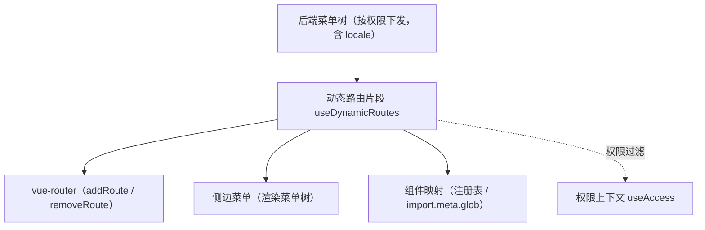

# 组件设计 · 动态路由片段

> useDynamicRoutes（能力片段，对外契约）· 动态路由注册：菜单树 → 路由 → 注册 / 卸载（前端不硬编码路由表；配合宿主薄壳与注册表基座）

[文档首页](../../../../../文档首页.md) › [项目规划说明](../../../../../规划/项目规划说明.md) › [组件设计](../../../01_组件设计_总览.md) › 动态路由片段　|　[← 用户展示片段](../19_组件设计_用户展示片段/19_组件设计_用户展示片段.md)　[表单元数据片段 →](../21_组件设计_表单元数据片段/21_组件设计_表单元数据片段.md)

> 可交互原型：[20_原型设计_动态路由片段.html](20_原型设计_动态路由片段.html)（演示菜单树 → 路由构建、注册 / 卸载、白名单与未注册拦截）

## 1. 目的与适用范围 

定义 BMS 前端 `apps/desktop/`（`frontend-mobile/` 同款）**动态路由片段**的组件设计：`useDynamicRoutes`（能力片段，对外契约）。它是组件设计体系**能力片段「动态路由片段」**，承载**菜单树 → 路由的构建、注册与卸载**——[《前端开发规范》](../../../../../规范/前端开发规范.md) §7 强制"菜单树由后端按权限动态下发，前端动态注册路由，**禁止硬编码路由表**"；配合宿主薄壳、[侧边菜单](../../../08_交互类/13_组件设计_侧边菜单/13_组件设计_侧边菜单.md) 与[注册表基类](../../01_机制基类/06_组件设计_注册表基类/06_组件设计_注册表基类.md)。

### 1.1 定位 

| 职责 | 归属 |
| --- | --- |
| 菜单树 → 路由构建、注册 / 卸载、组件映射、白名单与拦截 | **本节点（动态路由片段）** |
| 菜单树渲染 | [侧边菜单](../../../08_交互类/13_组件设计_侧边菜单/13_组件设计_侧边菜单.md) |
| 组件注册表 | [注册表基类](../../01_机制基类/06_组件设计_注册表基类/06_组件设计_注册表基类.md)（组件名 → 组件映射） |
| 权限码校验与过滤 | [权限上下文片段](../27_组件设计_权限上下文片段/27_组件设计_权限上下文片段.md) 与路由守卫 |
| 运行时片段加载（微前端） | 阶段五宿主外壳与片段加载器（本片段提供注册接口） |

上游依据：[《前端开发规范》](../../../../../规范/前端开发规范.md)（§7 动态菜单与权限）、[《架构设计 · 前端架构》](../../../../架构设计/08_架构设计_前端架构.md)（动态路由与插件化）、[《概要设计 · 菜单管理》](../../../../概要设计/01_概要设计_总览.md)（菜单树下发）。

> 本篇为 **基础组件类 · 能力片段「动态路由片段」**。**范围边界**：菜单树渲染归侧边菜单；组件映射归注册表；权限判定归权限上下文与守卫；本片段只管"路由怎么注册与卸载"。

## 2. 组件清单与职责 

| 组件 / 工具 | 位置 | 职责 |
| --- | --- | --- |
| `useDynamicRoutes.ts`（能力片段，对外契约） | `src/components/base/<能力域>/` | 路由：`buildRoutes` / `register` / `unregister` / `hasRoute` / `reset`；菜单树转换与组件映射 |
| `routeGuards.ts`（片段内部机制） | 同上 | 注册 / 卸载的守卫协作（白名单、404、未注册拦截） |

- 命名遵循[《命名规范》](../../../../../规范/命名规范.md)：片段 `useXxx`；目录遵循[《前端开发规范》](../../../../../规范/前端开发规范.md)。

## 3. 契约（参数与方法） 

| 属性 | 类型 | 默认 | 说明 |
| --- | --- | --- | --- |
| `mode` | 'menu' \| 'fragment' | 'menu' | 来源：后端菜单树 / 运行时片段（阶段五） |
| `allowedPaths` | string[] | `[]` | 白名单（不参与动态注册，如登录 / 404 / 首页） |
| `fallback404` | boolean | true | 未注册路由兜底到 404（防菜单配置错误白屏） |

| 方法 / 事件 | 说明 |
| --- | --- |
| `buildRoutes(menuTree)` | 菜单树 → 路由记录（path / name / meta.title / component 映射） |
| `register(routes)` | 注册到 router（`addRoute`）；返回已注册清单 |
| `unregister(names?)` | 卸载（`removeRoute`；退出登录 / 切换租户 / 片段卸载） |
| `hasRoute(name)` | 判定是否已注册 |
| `reset()` | 全量重置（重新拉取菜单前清空） |
| `routes` / `registered` | 已注册路由与清单（响应式，供菜单渲染） |

## 4. 行为与实现约定 

| 项 | 设计 |
| --- | --- |
| 组件映射 | `component` 名 → 组件：经[注册表基类](../../01_机制基类/06_组件设计_注册表基类/06_组件设计_注册表基类.md)（`import.meta.glob` 批量注册）；**未注册组件名拦截并提示**（防白屏） |
| 权限过滤 | 菜单树已按权限下发（后端）；前端注册时再经[权限上下文片段](../27_组件设计_权限上下文片段/27_组件设计_权限上下文片段.md)过滤（双保险）；无权限路由直达仍被守卫拦截 |
| 注册时机 | 登录成功 / 刷新恢复后拉取菜单 → `buildRoutes` → `register`；注册完成前不渲染菜单（避免闪烁） |
| 卸载 | 退出登录 / 切换租户：`unregister` 清空动态路由（防越权访问）；片段卸载同口径 |
| 白名单与 404 | `allowedPaths` 不参与动态注册；未注册路径按 `fallback404` 兜底（含菜单配置错误的提示） |
| 片段模式 | 阶段五运行时片段以同一套契约注册（`mode='fragment'`），宿主注入上下文 |
| 释放 | 菜单拉取请求登记[异步资源基类](../../01_机制基类/05_组件设计_异步资源基类/05_组件设计_异步资源基类.md) |
| 依赖方向 | 只依赖 组件根 / 注册表基座 / 权限上下文 / 机制基类；供布局壳与宿主消费 |

## 5. 场景集成 

| 场景 | 说明 |
| --- | --- |
| 登录后初始化 | 拉取菜单树 → 注册路由 → 渲染侧边菜单与页签 |
| 刷新恢复 | 重新拉取菜单并注册（幂等，已注册跳过） |
| 退出 / 切租户 | 卸载全部动态路由 + 清缓存 |
| 微前端片段 | 宿主外壳按片段清单加载并以 `fragment` 模式注册路由 |

## 6. 依赖接口与上游变更 

### 6.1 上游接口与口径 

| 项 | 说明 | 目标文档 |
| --- | --- | --- |
| 分层权威 | 动态路由片段职责与禁硬编码口径 | [《前端开发规范》](../../../../../规范/前端开发规范.md) §7（登记项①） |
| 菜单树下发 | 菜单树结构与权限过滤 | [《概要设计 · 菜单管理》](../../../../概要设计/01_概要设计_总览.md)（登记项②） |
| 前端架构 | 动态路由与运行时片段 | [《架构设计 · 前端架构》](../../../../架构设计/08_架构设计_前端架构.md)「前端插件化与运行时组合」节（登记项③） |
| 新增依赖 | **无** | — |

### 6.2 需登记的上游变更 

| 变更点 | 目标文档 | 内容 |
| --- | --- | --- |
| ① 动态路由片段契约 | [《前端开发规范》](../../../../../规范/前端开发规范.md) §7 | 明确 `useDynamicRoutes`：菜单树 → 路由构建 / 注册 / 卸载；组件映射经注册表；未注册拦截；白名单与 404 |
| ② 菜单树下发 | [《概要设计》](../../../../概要设计/01_概要设计_总览.md) 对应节点 | 菜单树字段（path / name / component / meta.title / 权限）与刷新恢复语义 |
| ③ 片段注册模式 | [《架构设计 · 前端架构》](../../../../架构设计/08_架构设计_前端架构.md) | 运行时片段以 `mode='fragment'` 注册路由（阶段五宿主外壳对接） |

> 按[《文档生成规范》](../../../../../规范/文档生成规范.md)「引用与追溯」节，上述变更需用户确认后由上游文档同步。

## 7. 权限 / i18n / 移动端 

- **权限**：菜单树按权限下发 + 注册时二次过滤 + 守卫拦截；**前端不硬编码路由表**。
- **i18n**：菜单标题由后端按 locale 下发；`meta.title` 存已翻译标题。
- **移动端**：独立工程，机制同款（菜单/路由注册方式相同，交互不同）。

## 8. 性能与边界 

| 场景 | 设计 |
| --- | --- |
| 注册 | 批量注册（一次 `addRoute` 多条）；组件懒加载（路由级分包） |
| 边界 | 组件名未注册（拦截提示）、菜单配置错误（404 兜底）、重复注册（幂等跳过）、切换租户残留（卸载清空）、刷新竞态 |
| 不支持 | 菜单渲染（侧边菜单）、组件映射存储（注册表基座）、权限判定（权限上下文 / 守卫） |

## 9. 检查清单 

- □ 契约：`mode`/`allowedPaths`/`fallback404` + `buildRoutes`/`register`/`unregister`/`hasRoute`/`reset`
- □ 行为：组件映射经注册表、未注册拦截、权限双保险、登录 / 刷新注册、退出 / 切租户卸载、白名单与 404
- □ 禁止硬编码路由表；供布局壳与宿主消费，依赖方向单向
- □ 权限/i18n/移动端符合第 7 节；性能边界符合第 8 节
- □ 三项上游登记已确认

> 组件设计节点（动态路由片段）· 与[《前端开发规范》](../../../../../规范/前端开发规范.md)[《架构设计 · 前端架构》](../../../../架构设计/08_架构设计_前端架构.md)[注册表基类](../../01_机制基类/06_组件设计_注册表基类/06_组件设计_注册表基类.md)[权限上下文片段](../27_组件设计_权限上下文片段/27_组件设计_权限上下文片段.md)[侧边菜单](../../../08_交互类/13_组件设计_侧边菜单/13_组件设计_侧边菜单.md)《命名规范》配套
