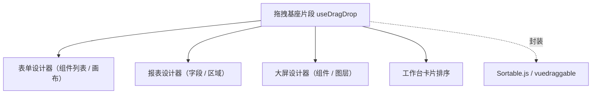

# 组件设计 · 拖拽基座片段

> useDragDrop（能力片段，对外契约）· 拖拽基座：拖拽 / 排序 / 跨区（表单设计器、报表与大屏设计器、工作台卡片共用）

[文档首页](../../../../../文档首页.md) › [项目规划说明](../../../../../规划/项目规划说明.md) › [组件设计](../../../01_组件设计_总览.md) › 拖拽基座片段　|　[← 预签名片段](../22_组件设计_预签名片段/22_组件设计_预签名片段.md)　[设计令牌片段 →](../24_组件设计_设计令牌片段/24_组件设计_设计令牌片段.md)

> 可交互原型：[23_原型设计_拖拽基座片段.html](23_原型设计_拖拽基座片段.html)（演示同区排序、跨区移动、拖拽把手与顺序变更上报）

## 1. 目的与适用范围 

定义 BMS 前端 `frontend/`（`frontend-mobile/` 同款）**拖拽基座片段**的组件设计：`useDragDrop`（能力片段，对外契约）。它是组件设计体系**能力片段「拖拽基座片段」**，统一**拖拽、排序、跨区移动**能力——供 [交互类「表单设计器」](../../../08_交互类/05_组件设计_表单设计器/05_组件设计_表单设计器.md)、[交互类「报表设计器」](../../../08_交互类/08_组件设计_报表设计器/08_组件设计_报表设计器.md)、[交互类「大屏设计器与播放」](../../../08_交互类/09_组件设计_大屏设计器与播放/09_组件设计_大屏设计器与播放.md) 与工作台卡片排序共用；底层封装拖拽库（Sortable.js / vuedraggable），对上层暴露统一契约。

### 1.1 定位 

| 职责 | 归属 |
| --- | --- |
| 拖拽 / 排序 / 跨区、把手、触控、顺序与移动事件 | **本节点（拖拽基座片段）** |
| 拖拽后的业务语义（新增组件 / 字段映射 / 布局计算） | 各设计器（消费方） |
| 拖拽视觉与占位提示 | 各设计器（本片段提供钩子与状态） |
| 拖拽库 | 实现层（统一封装，避免各设计器自接拖拽库） |

上游依据：[《前端开发规范》](../../../../../规范/前端开发规范.md)（§3 能力片段）、[《架构设计 · 前端组件体系》](../../../../架构设计/05_架构设计_前端组件体系.md)（设计器重组件异步加载）。

> 本篇为 **基础组件类 · 能力片段「拖拽基座片段」**。**范围边界**：拖拽后业务语义归设计器；本片段只管"怎么拖、拖到哪、顺序变化"。

## 2. 组件清单与职责 

| 组件 / 工具 | 位置 | 职责 |
| --- | --- | --- |
| `useDragDrop.ts`（能力片段，对外契约） | `src/components/base/<能力域>/` | 拖拽：`create` / `destroy` / `move` / `onChange`；同区排序与跨区移动、把手与触控 |
| `BaseDragList.vue`（可选组件包装） | `src/components/base/<能力域>/` | 可拖拽列表壳（列表 / 网格两种形态；插槽渲染项） |

- 命名遵循[《命名规范》](../../../../../规范/命名规范.md)：片段 `useXxx`、组件包装 `BaseXxx.vue`；目录遵循[《前端开发规范》](../../../../../规范/前端开发规范.md)。
- 底层拖拽库（Sortable.js / vuedraggable）随实现锁定版本；**各设计器不得另接拖拽库**。

## 3. 契约（参数与方法） 

| 属性 | 类型 | 默认 | 说明 |
| --- | --- | --- | --- |
| `group` | string | 必填 | 拖拽组名（同组可跨区移动；不同组隔离） |
| `mode` | 'list' \| 'grid' | 'list' | 列表 / 网格（大屏画布） |
| `handle` | string | '' | 拖拽把手选择器（不给则整项可拖） |
| `disabled` | boolean | false | 禁用拖拽（只读 / 预览态） |
| `animation` | number | 150 | 动画时长（ms） |

| 方法 / 事件 | 说明 |
| --- | --- |
| `create(el, options)` | 初始化拖拽（返回句柄；`destroy` 幂等） |
| `destroy()` | 销毁实例（登记异步资源，卸载自动调用） |
| `move(from, to, item)` | 程序化移动（撤销 / 快捷键支持） |
| `change` | 顺序 / 跨区变化事件（含 `{ from, to, item, oldIndex, newIndex }`） |
| `dragging` | 拖拽状态（响应式；供占位提示与禁用交互） |

## 4. 行为与实现约定 

| 项 | 设计 |
| --- | --- |
| 同区排序 | 列表 / 网格内排序；`change` 上报新顺序（消费方更新模型） |
| 跨区移动 | 同 `group` 的区域间移动（左侧组件列表 → 画布；字段区 → 行区） |
| 把手 | 设计器场景用 `handle`（避免与输入 / 点击冲突）；列表排序可整项拖 |
| 触控 | 移动端触控拖拽（长按触发，与滚动区分） |
| 禁用 | `disabled` 时禁用拖拽但保留渲染（预览 / 只读设计态） |
| 销毁 | `destroy()` 幂等；登记[异步资源基类](../../01_机制基类/05_组件设计_异步资源基类/05_组件设计_异步资源基类.md)（卸载自动清理事件监听） |
| 与撤销栈协作 | 移动后由设计器把操作压入撤销栈；本片段不维护撤销 |
| 依赖方向 | 只依赖 组件根 / 机制基类；被设计器类消费；不依赖具体设计器 |

## 5. 场景集成 

| 场景 | 说明 |
| --- | --- |
| 表单设计器 | 左侧组件列表拖入画布；画布内排序；跨区（分区 / 栅格） |
| 报表设计器 | 字段拖入行 / 列 / 指标区 |
| 大屏设计器 | 组件拖入画布、图层排序（网格模式） |
| 工作台卡片 | 卡片排序（用户偏好持久化协作） |

## 6. 依赖接口与上游变更 

### 6.1 上游接口与口径 

| 项 | 说明 | 目标文档 |
| --- | --- | --- |
| 分层权威 | 拖拽基座片段职责与库封装口径 | [《前端开发规范》](../../../../../规范/前端开发规范.md) 第 3 节（登记项①） |
| 设计器协作 | 拖拽语义与撤销栈 | [表单设计器](../../../08_交互类/05_组件设计_表单设计器/05_组件设计_表单设计器.md)、[大屏设计器](../../../08_交互类/09_组件设计_大屏设计器与播放/09_组件设计_大屏设计器与播放.md)（登记项②） |
| 分包 | 拖拽库异步加载 | [《架构设计 · 前端组件体系》](../../../../架构设计/05_架构设计_前端组件体系.md)（登记项③） |
| 新增依赖 | 拖拽库（Sortable.js / vuedraggable，随实现锁定） | — |

### 6.2 需登记的上游变更 

| 变更点 | 目标文档 | 内容 |
| --- | --- | --- |
| ① 拖拽基座契约 | [《前端开发规范》](../../../../../规范/前端开发规范.md) 第 3 节 | 明确 `useDragDrop`：同区排序 / 跨区移动 / 把手 / 触控 / 销毁；设计器不得另接拖拽库 |
| ② 设计器协作 | [表单设计器](../../../08_交互类/05_组件设计_表单设计器/05_组件设计_表单设计器.md) 等 | `change` 载荷与撤销栈 / 模型更新口径 |
| ③ 分包与选型 | [《架构设计 · 前端组件体系》](../../../../架构设计/05_架构设计_前端组件体系.md) | 拖拽库版本与异步加载（设计器分包内） |

> 按[《文档生成规范》](../../../../../规范/文档生成规范.md)「引用与追溯」节，上述变更需用户确认后由上游文档同步。

## 7. 权限 / i18n / 移动端 

- **权限**：设计态编辑权限由页面控制（无编辑权限时 `disabled`）；本片段不判权。
- **i18n**：无文案（拖拽提示由消费方）。
- **移动端**：独立工程，触控拖拽语义同款（长按触发）。

## 8. 性能与边界 

| 场景 | 设计 |
| --- | --- |
| 大列表 | 虚拟化 + 拖拽结合时注意测量；拖拽中避免全量重渲染 |
| 边界 | 拖拽与点击冲突（把手）、跨区限制（group）、拖拽中数据变更、销毁后残留监听、触控与滚动冲突 |
| 不支持 | 撤销栈（设计器）、拖拽视觉（消费方）、业务语义（消费方） |

## 9. 检查清单 

- □ 契约：`group`/`mode`/`handle`/`disabled`/`animation` + `create`/`destroy`/`move`/`change`/`dragging`
- □ 行为：同区排序、跨区受限、把手、触控、幂等销毁（登记异步资源）、库统一封装
- □ 被设计器类消费；依赖方向单向
- □ 权限/i18n/移动端符合第 7 节；性能边界符合第 8 节
- □ 三项上游登记已确认

> 组件设计节点（拖拽基座片段）· 与[《前端开发规范》](../../../../../规范/前端开发规范.md)[《架构设计 · 前端组件体系》](../../../../架构设计/05_架构设计_前端组件体系.md)[表单设计器](../../../08_交互类/05_组件设计_表单设计器/05_组件设计_表单设计器.md)[大屏设计器与播放](../../../08_交互类/09_组件设计_大屏设计器与播放/09_组件设计_大屏设计器与播放.md)[异步资源基类](../../01_机制基类/05_组件设计_异步资源基类/05_组件设计_异步资源基类.md)《命名规范》配套
