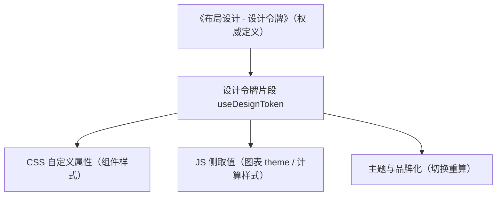

# 组件设计 · 设计令牌片段

> useDesignToken（能力片段，对外契约）· 设计令牌消费：间距 / 色板 / 密度 / 断点（组件根令牌统一入口）

[文档首页](../../../../../文档首页.md) › [项目规划说明](../../../../../规划/项目规划说明.md) › [组件设计](../../../01_组件设计_总览.md) › 设计令牌片段　|　[← 拖拽基座片段](../23_组件设计_拖拽基座片段/23_组件设计_拖拽基座片段.md)　[表单页组合片段 →](../25_组件设计_表单页组合片段/25_组件设计_表单页组合片段.md)

> 可交互原型：[24_原型设计_设计令牌片段.html](24_原型设计_设计令牌片段.html)（演示亮暗切换下的令牌取值（间距 / 色板 / 密度 / 断点）与 JS 侧消费）

## 1. 目的与适用范围 

定义 BMS 前端 `frontend/`（`frontend-mobile/` 同款）**设计令牌片段**的组件设计：`useDesignToken`（能力片段，对外契约）。它是组件设计体系**能力片段「设计令牌片段」**，作为**令牌统一入口**——间距、色板、密度、断点在 CSS（自定义属性）与 JS（需要计算值的场景）两侧的一致消费；由 [组件根基类](../../01_机制基类/02_组件设计_组件根基类/02_组件设计_组件根基类.md) 统一挂接，供 [图表域基类](../../03_域基类/04_组件设计_图表域基类/04_组件设计_图表域基类.md)、主题品牌化与动态样式消费。

### 1.1 定位 

| 职责 | 归属 |
| --- | --- |
| 令牌读取（CSS 变量 / JS 值）、别名解析、缺省回退、主题变化通知 | **本节点（设计令牌片段）** |
| 令牌定义与层级（色板 / 间距 / 密度 / 断点） | [《布局设计 · 设计令牌》](../../../../布局设计/02_布局设计_设计令牌.html)（不重复定义） |
| 主题切换机制（亮暗 / 品牌） | [交互类「主题与品牌化」](../../../08_交互类/17_组件设计_主题与品牌化/17_组件设计_主题与品牌化.md) |
| 组件样式中的令牌消费 | 各组件（CSS 变量直接引用） |

上游依据：[《前端开发规范》](../../../../../规范/前端开发规范.md)（§3 能力片段；样式只消费令牌、不硬编码）、[《布局设计 · 设计令牌》](../../../../布局设计/02_布局设计_设计令牌.html)（令牌权威定义）。

> 本篇为 **基础组件类 · 能力片段「设计令牌片段」**。**范围边界**：令牌定义归布局设计；主题切换归主题品牌化；本片段只管"令牌怎么读、缺省怎么办、变化怎么感知"。

## 2. 组件清单与职责 

| 组件 / 工具 | 位置 | 职责 |
| --- | --- | --- |
| `useDesignToken.ts`（能力片段，对外契约） | `src/components/base/<能力域>/` | 令牌：`token(name, fallback?)` / `spacing(n)` / `color(name)` / `density` / `breakpoints` / `onThemeChange(cb)` |
| `tokens.css`（令牌映射） | `src/components/base/<能力域>/` 或 `src/styles/` | 令牌名 → CSS 自定义属性映射（由布局设计令牌落地） |

- 命名遵循[《命名规范》](../../../../../规范/命名规范.md)：片段 `useXxx`；目录遵循[《前端开发规范》](../../../../../规范/前端开发规范.md)。
- **令牌不重复定义**：令牌值（色板 / 间距 / 断点）以《布局设计 · 设计令牌》为准；本片段只提供读取与通知。

## 3. 契约（参数与方法） 

| 属性 | 类型 | 默认 | 说明 |
| --- | --- | --- | --- |
| `fallback` | string | '' | 缺省回退值（令牌缺失时使用） |
| `unit` | 'px' \| 'rem' | 'px' | 数值令牌单位（间距 / 尺寸） |

| 方法 / 事件 | 说明 |
| --- | --- |
| `token(name, fallback?)` | 读取令牌（CSS 变量优先；缺失回退） |
| `spacing(n)` | 间距令牌（层级 `--bms-space-{n}`，n 取令牌阶梯） |
| `color(name)` | 色板令牌（`--bms-color-{name}`；亮暗 / 品牌自动适配） |
| `density` | 当前密度（compact / default / loose，响应式） |
| `breakpoints` | 断点定义（栅格 / 大屏使用） |
| `onThemeChange(cb)` | 主题 / 品牌变化回调（图表等需重算的消费方）；返回取消函数 |

## 4. 行为与实现约定 

| 项 | 设计 |
| --- | --- |
| CSS 优先 | 组件样式直接引用 CSS 变量（无需 JS）；JS 侧（图表、canvas、动态计算）经本片段读取 |
| 读取缓存 | JS 读取值缓存（`getComputedStyle` 开销高）；主题变化时失效 |
| 主题变化 | 监听主题 / 品牌切换（根节点 `data-theme` 变化），触发 `onThemeChange` 回调（图表重建 option 等） |
| 缺省回退 | 令牌缺失回退 `fallback`（开发态告警"未定义令牌"），不静默使用硬编码值 |
| 不硬编码 | 禁止组件内写死色值 / 尺寸（与[《前端开发规范》](../../../../../规范/前端开发规范.md)一致）；本片段不提供"逃逸口" |
| 释放 | 主题监听注销返回取消函数；组合式卸载自动清理（登记[异步资源基类](../../01_机制基类/05_组件设计_异步资源基类/05_组件设计_异步资源基类.md)） |
| 依赖方向 | 只依赖 组件根；被组件 / 图表 / 大屏消费；不依赖具体组件 |

## 5. 场景集成 

| 场景 | 说明 |
| --- | --- |
| 组件样式 | CSS 变量消费间距 / 色板 / 圆角（无需 JS） |
| 图表主题 | [图表域基类](../../03_域基类/04_组件设计_图表域基类/04_组件设计_图表域基类.md) 经本片段取令牌色重建 ECharts option |
| 主题与品牌化 | 切换亮暗 / 品牌后重算依赖令牌的动态值 |
| 大屏 / 栅格 | 断点与密度取值（响应式计算） |

## 6. 依赖接口与上游变更 

### 6.1 上游接口与口径 

| 项 | 说明 | 目标文档 |
| --- | --- | --- |
| 分层权威 | 设计令牌片段职责与不硬编码口径 | [《前端开发规范》](../../../../../规范/前端开发规范.md) 第 3 节（登记项①） |
| 令牌定义 | 色板 / 间距 / 密度 / 断点权威定义 | [《布局设计 · 设计令牌》](../../../../布局设计/02_布局设计_设计令牌.html)（登记项②） |
| 主题切换 | 亮暗 / 品牌切换机制 | [主题与品牌化](../../../08_交互类/17_组件设计_主题与品牌化/17_组件设计_主题与品牌化.md)（登记项③） |
| 新增依赖 | **无** | — |

### 6.2 需登记的上游变更 

| 变更点 | 目标文档 | 内容 |
| --- | --- | --- |
| ① 设计令牌片段契约 | [《前端开发规范》](../../../../../规范/前端开发规范.md) 第 3 节 | 明确 `useDesignToken`：CSS 优先 / JS 读取缓存 / 主题变化通知 / 缺省回退告警 / 不硬编码 |
| ② 令牌命名 | [《布局设计 · 设计令牌》](../../../../布局设计/02_布局设计_设计令牌.html) | 令牌名与 CSS 变量命名映射（`--bms-space-*` / `--bms-color-*`） |
| ③ 主题切换协作 | [主题与品牌化](../../../08_交互类/17_组件设计_主题与品牌化/17_组件设计_主题与品牌化.md) | `data-theme` 切换与 `onThemeChange` 通知时序 |

> 按[《文档生成规范》](../../../../../规范/文档生成规范.md)「引用与追溯」节，上述变更需用户确认后由上游文档同步。

## 7. 权限 / i18n / 移动端 

- **权限**：无关。
- **i18n**：无关（令牌为视觉值）。
- **移动端**：独立工程，令牌集按端定义（断点与密度可不同），消费方式同款。

## 8. 性能与边界 

| 场景 | 设计 |
| --- | --- |
| 读取 | CSS 变量不产生 JS 开销；JS 读取带缓存（主题变化失效） |
| 边界 | 令牌缺失（回退 + 告警）、主题切换瞬间读到旧值（等切换完成再通知）、SSR 无 `getComputedStyle`（构建期占位）、深色模式媒体查询与显式主题冲突 |
| 不支持 | 令牌定义（布局设计）、主题切换机制（主题品牌化）、组件样式（各组件） |

## 9. 检查清单 

- □ 契约：`fallback`/`unit` + `token`/`spacing`/`color`/`density`/`breakpoints`/`onThemeChange`
- □ 行为：CSS 优先、JS 读取缓存、主题变化通知、缺省回退告警、禁硬编码
- □ 令牌定义不重复（权威在布局设计）；被组件 / 图表 / 大屏消费
- □ 权限/i18n/移动端符合第 7 节；性能边界符合第 8 节
- □ 三项上游登记已确认

> 组件设计节点（设计令牌片段）· 与[《前端开发规范》](../../../../../规范/前端开发规范.md)[《布局设计 · 设计令牌》](../../../../布局设计/02_布局设计_设计令牌.html)[组件根基类](../../01_机制基类/02_组件设计_组件根基类/02_组件设计_组件根基类.md)[图表域基类](../../03_域基类/04_组件设计_图表域基类/04_组件设计_图表域基类.md)[主题与品牌化](../../../08_交互类/17_组件设计_主题与品牌化/17_组件设计_主题与品牌化.md)《命名规范》配套
