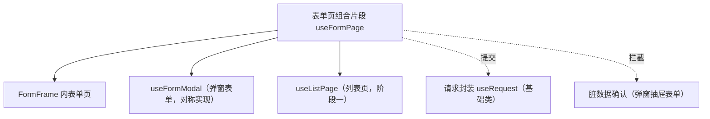

# 组件设计 · 表单页组合片段

> useFormPage（能力片段，对外契约）· 表单页组合：三态（新增 / 编辑 / 详情）/ 提交 / 脏数据 / 返回（与 useListPage / useFormModal 对称）

[文档首页](../../../../../文档首页.md) › [项目规划说明](../../../../../规划/项目规划说明.md) › [组件设计](../../../01_组件设计_总览.md) › 表单页组合片段　|　[← 设计令牌片段](../24_组件设计_设计令牌片段/24_组件设计_设计令牌片段.md)　[语言上下文片段 →](../26_组件设计_语言上下文片段/26_组件设计_语言上下文片段.md)

> 可交互原型：[25_原型设计_表单页组合片段.html](25_原型设计_表单页组合片段.html)（演示三态切换、详情加载、脏数据跟踪、提交与离开确认）

## 1. 目的与适用范围 

定义 BMS 前端 `frontend/`（`frontend-mobile/` 同款）**表单页组合片段**的组件设计：`useFormPage`（能力片段，对外契约）。它是组件设计体系**能力片段「表单页组合片段」**，组合表单页的**三态（新增 / 编辑 / 详情）、详情加载、提交、脏数据跟踪与离开拦截**；与 `useListPage`（阶段一已落地，列表页）与 `useFormModal`（[弹窗抽屉表单](../../../04_容器组件类/01_组件设计_弹窗抽屉表单/01_组件设计_弹窗抽屉表单.md)）对称，供 [布局组件类「表单框架壳」FormFrame](../../../03_布局组件类/02_组件设计_表单框架壳/02_组件设计_表单框架壳.md) 内的表单页复用。

### 1.1 定位 

| 职责 | 归属 |
| --- | --- |
| 三态、详情加载、提交、脏数据跟踪、离开拦截、保存后回退 | **本节点（表单页组合片段）** |
| 表单渲染与字段 | 各表单页（字段组件 + 表单容器片段） |
| 请求提交 / 重试 | [基础类「请求封装」](../../../09_基础类/01_组件设计_请求封装/01_组件设计_请求封装.md)（`useRequest`） |
| 离开确认对话框 | [容器组件类「弹窗抽屉表单」](../../../04_容器组件类/01_组件设计_弹窗抽屉表单/01_组件设计_弹窗抽屉表单.md) 的确认能力 |
| 列表页组合 | 阶段一 `useListPage`（不在本节点） |

上游依据：[《前端开发规范》](../../../../../规范/前端开发规范.md)（§8.3 列表页 / 表单页约定）、[《布局设计 · 表单页》](../../../../布局设计/08_布局设计_表单页.html)（三态、只读 / 编辑分态）、[《架构设计 · 前端架构》](../../../../架构设计/08_架构设计_前端架构.md)（FormFrame 约定）。

> 本篇为 **基础组件类 · 能力片段「表单页组合片段」**。**范围边界**：弹窗表单用 `useFormModal`（对称）；列表页用 `useListPage`；本片段只管"表单页三态与提交流程"。

## 2. 组件清单与职责 

| 组件 / 工具 | 位置 | 职责 |
| --- | --- | --- |
| `useFormPage.ts`（能力片段，对外契约） | `src/components/base/<能力域>/` | 表单页：`loadDetail` / `submit` / `reset` / `isDirty` / `leave` / 三态判定 |
| `BaseFormPage.vue`（可选组件包装） | `src/components/base/<能力域>/` | 表单页壳（信息栏 / 主表 + 明细插槽 / 底部操作栏）；供 FormFrame 表单页复用 |

- 命名遵循[《命名规范》](../../../../../规范/命名规范.md)：片段 `useXxx`、组件包装 `BaseXxx.vue`；目录遵循[《前端开发规范》](../../../../../规范/前端开发规范.md)。

## 3. 契约（参数与方法） 

| 属性 | 类型 | 默认 | 说明 |
| --- | --- | --- | --- |
| `mode` | 'create' \| 'edit' \| 'detail' | 必填 | 三态（由路由 / 调用方决定） |
| `id` | string \| number | — | 编辑 / 详情的主键（`create` 为空） |
| `api` | object | 必填 | 接口集合（`detail` / `create` / `update`；经请求封装） |
| `dirtyCheck` | boolean | true | 是否跟踪脏数据（与初始快照 diff） |
| `leaveConfirm` | boolean | true | 离开拦截（返回 / 关闭页签 / 路由切换） |

| 方法 / 事件 | 说明 |
| --- | --- |
| `loadDetail()` | 加载详情（`edit` / `detail` 态；含版本 / 乐观锁字段） |
| `submit(payload)` | 提交（校验 → 请求 → 成功提示 → `saved` → 回退 / 刷新列表） |
| `reset()` | 重置为初始快照（脏数据清零） |
| `isDirty` | 脏数据状态（响应式；供 FormFrame 与页签关闭拦截） |
| `leave(to?)` | 离开（脏数据时确认；确认后放行） |
| `saved` / `dirty-change` | 保存成功 / 脏数据变化事件 |

## 4. 行为与实现约定 

| 项 | 设计 |
| --- | --- |
| 三态 | `create`：空表单 + 默认值；`edit`：加载详情 + 可编辑；`detail`：加载详情 + 只读（复用编辑组件，`disabled` 或纯文本回显） |
| 脏数据 | 提交前初始快照 vs 当前值深比较（仅跟踪表单字段）；`isDirty` 同步给 FormFrame / 页签关闭拦截 |
| 离开拦截 | 脏数据时 `leave` 弹确认（放弃修改 / 继续编辑）；页签关闭、路由切换、`beforeunload` 三处统一 |
| 提交 | 表单校验通过 → 请求封装（`useRequest`）提交；**整体提交主表 + 明细（单事务）**；携带 `version` 乐观锁 |
| 成功处理 | 提示成功 → 触发 `saved`（FormFrame 刷新列表 / 关闭详情页签）→ 回退到列表或保持编辑态（按页面配置） |
| 并发 | 提交中按钮 loading 防重复提交（经请求封装 / 交互片段） |
| 释放 | 详情 / 提交请求登记[异步资源基类](../../01_机制基类/05_组件设计_异步资源基类/05_组件设计_异步资源基类.md) |
| 依赖方向 | 只依赖 组件根 / 请求封装 / 机制基类；被表单页消费；不依赖具体字段组件 |

## 5. 场景集成 

| 场景 | 说明 |
| --- | --- |
| FormFrame 表单页 | 列表固定 + 详情多开：详情页签内为 `edit` / `detail` 态表单页 |
| 新增 / 编辑表单 | 三态切换由路由参数决定；保存后回列表 |
| 审批 / 只读详情 | `detail` 态：只读回显 + 审批轨迹（与审批流组件协作） |
| 移动端表单 | 同契约、不同布局（弹层 / 页内跳转） |

## 6. 依赖接口与上游变更 

### 6.1 上游接口与口径 

| 项 | 说明 | 目标文档 |
| --- | --- | --- |
| 分层权威 | 表单页组合片段职责与三态口径 | [《前端开发规范》](../../../../../规范/前端开发规范.md) §8.3（登记项①） |
| 页面形态 | 三态 / 只读 / 信息栏 | [《布局设计 · 表单页》](../../../../布局设计/08_布局设计_表单页.html)（登记项②） |
| 框架协作 | FormFrame 事件约定（open-detail / saved / dirty） | [表单框架壳](../../../03_布局组件类/02_组件设计_表单框架壳/02_组件设计_表单框架壳.md)（登记项③） |
| 新增依赖 | **无**（复用阶段一 `useRequest`） | — |

### 6.2 需登记的上游变更 

| 变更点 | 目标文档 | 内容 |
| --- | --- | --- |
| ① 表单页组合契约 | [《前端开发规范》](../../../../../规范/前端开发规范.md) §8.3 | 明确 `useFormPage`：三态 / 详情加载 / 脏数据 / 离开拦截 / 提交与成功处理；与 `useFormModal` / `useListPage` 对称 |
| ② 页面形态 | [《布局设计 · 表单页》](../../../../布局设计/08_布局设计_表单页.html) | 三态与只读分态的交互口径（页内动作区 / 页签拦截） |
| ③ 框架事件 | [表单框架壳](../../../03_布局组件类/02_组件设计_表单框架壳/02_组件设计_表单框架壳.md) | `saved` / `dirty` 事件与列表刷新、页签关闭拦截的时序 |

> 按[《文档生成规范》](../../../../../规范/文档生成规范.md)「引用与追溯」节，上述变更需用户确认后由上游文档同步。

## 7. 权限 / i18n / 移动端 

- **权限**：按钮级动作权限用 `v-perm`；字段权限由[字段权限片段](../11_组件设计_字段权限片段/11_组件设计_字段权限片段.md)处理；本片段不判权。
- **i18n**：提示文案走 vue-i18n；字段 label 由元数据 / 表单定义提供。
- **移动端**：独立工程，三态与脏数据语义同款。

## 8. 性能与边界 

| 场景 | 设计 |
| --- | --- |
| 脏数据比较 | 仅比较表单字段（避免大对象深比较）；快照在详情加载后建立 |
| 大表单 | 明细行变更局部跟踪；避免每次按键全量 diff |
| 边界 | 详情加载失败（空表单 + 提示）、乐观锁冲突（提示刷新）、提交重复、离开确认竞态、saved 后列表刷新时序 |
| 不支持 | 弹窗表单（`useFormModal`）、列表页（`useListPage`）、字段权限判定 |

## 9. 检查清单 

- □ 契约：`mode`/`id`/`api`/`dirtyCheck`/`leaveConfirm` + `loadDetail`/`submit`/`reset`/`isDirty`/`leave` + `saved`/`dirty-change`
- □ 行为：三态、快照脏数据、三处离开拦截、整体提交 + 乐观锁、成功回退 / 刷新、防重复提交
- □ 与 `useFormModal` / `useListPage` 对称；请求经请求封装；依赖方向单向
- □ 权限/i18n/移动端符合第 7 节；性能边界符合第 8 节
- □ 三项上游登记已确认

> 组件设计节点（表单页组合片段）· 与[《前端开发规范》](../../../../../规范/前端开发规范.md)[《布局设计 · 表单页》](../../../../布局设计/08_布局设计_表单页.html)[表单框架壳](../../../03_布局组件类/02_组件设计_表单框架壳/02_组件设计_表单框架壳.md)[基础类「请求封装」](../../../09_基础类/01_组件设计_请求封装/01_组件设计_请求封装.md)[弹窗抽屉表单](../../../04_容器组件类/01_组件设计_弹窗抽屉表单/01_组件设计_弹窗抽屉表单.md)《命名规范》配套
