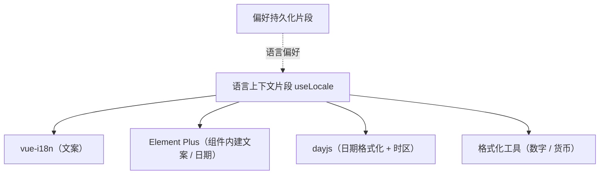

# 组件设计 · 语言上下文片段

> useLocale（能力片段，对外契约）· 语言上下文：locale / 时区 / 格式上下文（切换与缓存；收敛时区格式化）

[文档首页](../../../../../文档首页.md) › [项目规划说明](../../../../../规划/项目规划说明.md) › [组件设计](../../../01_组件设计_总览.md) › 语言上下文片段　|　[← 表单页组合片段](../25_组件设计_表单页组合片段/25_组件设计_表单页组合片段.md)　[权限上下文片段 →](../27_组件设计_权限上下文片段/27_组件设计_权限上下文片段.md)

> 可交互原型：[26_原型设计_语言上下文片段.html](26_原型设计_语言上下文片段.html)（演示 locale 切换（i18n / Element Plus / dayjs 联动）、时区格式化与格式缓存）

## 1. 目的与适用范围 

定义 BMS 前端 `frontend/`（`frontend-mobile/` 同款）**语言上下文片段**的组件设计：`useLocale`（能力片段，对外契约）。它是组件设计体系**能力片段「语言上下文片段」**，承载**locale、时区与格式上下文**——语言切换（vue-i18n + Element Plus + dayjs 联动）、时区格式化（后端 UTC → 用户时区）、数字 / 货币格式上下文；供 [交互类「国际化文案编辑器」](../../../08_交互类/11_组件设计_国际化文案编辑器/11_组件设计_国际化文案编辑器.md)、日期时间字段与全部展示组件共用。

### 1.1 定位 

| 职责 | 归属 |
| --- | --- |
| locale / 时区上下文、切换联动、格式缓存、UTC ↔ 本地转换 | **本节点（语言上下文片段）** |
| 文案资源（语言包） | vue-i18n 语言包 + 后端下发业务文案 |
| 偏好持久化 | [偏好持久化片段](../16_组件设计_偏好持久化片段/16_组件设计_偏好持久化片段.md)（语言 / 时区偏好） |
| 业务数据翻译 | 后端（菜单 / 字典 / 元数据按 locale 下发） |

上游依据：[《前端开发规范》](../../../../../规范/前端开发规范.md)（§3 能力片段）、[《命名规范》](../../../../../规范/命名规范.md)（i18n key 命名）、[《架构设计 · 子系统 · 国际化》](../../../../架构设计/24_架构设计_子系统_国际化.md)（locales / 时区口径）。

> 本篇为 **基础组件类 · 能力片段「语言上下文片段」**。**范围边界**：文案资源归语言包 / 后端；偏好存储归偏好持久化；本片段只管"当前语言 / 时区是什么、怎么格式化"。

## 2. 组件清单与职责 

| 组件 / 工具 | 位置 | 职责 |
| --- | --- | --- |
| `useLocale.ts`（能力片段，对外契约） | `src/components/base/<能力域>/` | 上下文：`locale` / `timezone` / `setLocale` / `setTimezone` / `formatDate` / `formatNumber`；切换联动与缓存 |

- 命名遵循[《命名规范》](../../../../../规范/命名规范.md)：片段 `useXxx`；目录遵循[《前端开发规范》](../../../../../规范/前端开发规范.md)。
- **时区收敛**：日期时间的"UTC 存储 → 本地展示"统一经本片段，禁止各组件各自 `new Date().toLocaleString()` 造成口径发散。

## 3. 契约（参数与方法） 

| 属性 | 类型 | 默认 | 说明 |
| --- | --- | --- | --- |
| `locale` | string | `zh-CN` | 当前语言（zh-CN / en-US；与后端 `SUPPORTED_LOCALES` 一致） |
| `timezone` | string | 浏览器时区 | 用户时区（IANA，如 `Asia/Shanghai`；偏好可覆盖） |
| `formats` | Record\<string, string\> | 内置 | 格式上下文（日期 / 日期时间 / 时间 / 数字 / 货币） |

| 方法 / 事件 | 说明 |
| --- | --- |
| `setLocale(locale)` | 切换语言（联动 vue-i18n / Element Plus / dayjs；写入偏好；刷新远端文案缓存） |
| `setTimezone(tz)` | 切换时区（偏好持久化） |
| `t(key, params?)` | 文案取词（委托 vue-i18n；根部 `t` 的上下文入口） |
| `formatDate(value, kind?)` | 日期时间格式化（后端 UTC / ISO → 用户时区；kind 取 `formats`） |
| `formatNumber(value, kind?)` | 数字 / 货币格式化（Intl / 格式化工具协作） |
| `locale-change` | 语言切换事件（刷新业务缓存：菜单 / 字典 / 元数据） |

## 4. 行为与实现约定 

| 项 | 设计 |
| --- | --- |
| 切换联动 | `setLocale` 同步：i18n 语言包、Element Plus locale、dayjs locale、`<html lang>`；再触发 `locale-change` 让业务缓存（菜单 / 元数据）重新拉取 |
| 时区 | 后端时间统一 UTC / ISO 存储；展示经 `formatDate` 转用户时区；日期输入（日期时间字段）反向转换由字段负责，经本片段工具 |
| 格式缓存 | Intl / dayjs 实例按 locale + 时区缓存（避免重复构造） |
| 持久化 | 语言 / 时区偏好经[偏好持久化片段](../16_组件设计_偏好持久化片段/16_组件设计_偏好持久化片段.md)存储（跨设备同步） |
| 语言包 | 语言包按需加载（懒加载 locale chunk）；缺失 key 回退默认语言并开发态告警 |
| 释放 | 监听注销 / 语言包加载请求登记[异步资源基类](../../01_机制基类/05_组件设计_异步资源基类/05_组件设计_异步资源基类.md) |
| 依赖方向 | 只依赖 组件根 / 偏好持久化；被全部组件消费（经根系 `t` 与格式化工具） |

## 5. 场景集成 

| 场景 | 说明 |
| --- | --- |
| 语言切换 | 偏好面板 / 顶部切换：`setLocale` → 全站文案刷新 |
| 日期时间字段 | 展示与输入按用户时区；与[日期时间字段](../../../06_字段类/02_组件设计_日期时间字段/02_组件设计_日期时间字段.md)协作 |
| 国际化文案编辑器 | 编辑语言包（读取当前 locale 与 key 结构） |
| 通知 / 导出 | 文案与日期格式按用户偏好呈现 |

## 6. 依赖接口与上游变更 

### 6.1 上游接口与口径 

| 项 | 说明 | 目标文档 |
| --- | --- | --- |
| 分层权威 | 语言上下文片段职责与时区口径 | [《前端开发规范》](../../../../../规范/前端开发规范.md) 第 3 节（登记项①） |
| 国际化机制 | locales / 语言包 / 后端翻译 | [《架构设计 · 子系统 · 国际化》](../../../../架构设计/24_架构设计_子系统_国际化.md)（登记项②） |
| i18n key | key 命名与错误码文案映射 | [《命名规范》](../../../../../规范/命名规范.md)「国际化命名」节（登记项③） |
| 新增依赖 | **无**（vue-i18n / dayjs 已定案） | — |

### 6.2 需登记的上游变更 

| 变更点 | 目标文档 | 内容 |
| --- | --- | --- |
| ① 语言上下文契约 | [《前端开发规范》](../../../../../规范/前端开发规范.md) 第 3 节 | 明确 `useLocale`：切换联动（i18n / Element Plus / dayjs）/ 时区格式化 / 格式缓存 / 语言包懒加载 |
| ② 时区口径 | [《架构设计 · 子系统 · 国际化》](../../../../架构设计/24_架构设计_子系统_国际化.md) | 后端 UTC 存储、前端按用户时区展示；日期输入反向转换口径 |
| ③ 语言偏好 | [《概要设计》](../../../../概要设计/01_概要设计_总览.md) 对应节点 | 语言 / 时区偏好存储与跨设备同步（`sys_user_preference`） |

> 按[《文档生成规范》](../../../../../规范/文档生成规范.md)「引用与追溯」节，上述变更需用户确认后由上游文档同步。

## 7. 权限 / i18n / 移动端 

- **权限**：无关。
- **i18n**：本片段即语言上下文本身（`t` 委托 vue-i18n）。
- **移动端**：独立工程，locale / 时区语义同款。

## 8. 性能与边界 

| 场景 | 设计 |
| --- | --- |
| 语言包 | 按需加载 locale chunk；切换时避免整页白屏（先换 UI 文案、业务数据异步刷新） |
| 格式化 | Intl / dayjs 实例缓存；列表格式化避免逐行构造 |
| 边界 | 语言包缺失 key（回退 + 告警）、时区与浏览器不一致、切换时业务缓存未刷新（事件缺漏）、Intl 环境差异 |
| 不支持 | 文案资源本体（语言包 / 后端）、偏好存储（偏好持久化）、字段输入 UI（日期字段） |

## 9. 检查清单 

- □ 契约：`locale`/`timezone`/`formats` + `setLocale`/`setTimezone`/`t`/`formatDate`/`formatNumber`
- □ 行为：切换联动（i18n / Element Plus / dayjs / html lang）、`locale-change` 刷新业务缓存、时区收敛、格式缓存、语言包懒加载
- □ 日期 / 数字格式统一经本片段（禁止各组件自拼）；被全组件消费
- □ 权限/i18n/移动端符合第 7 节；性能边界符合第 8 节
- □ 三项上游登记已确认

> 组件设计节点（语言上下文片段）· 与[《前端开发规范》](../../../../../规范/前端开发规范.md)[《架构设计 · 子系统 · 国际化》](../../../../架构设计/24_架构设计_子系统_国际化.md)[《命名规范》](../../../../../规范/命名规范.md)[偏好持久化片段](../16_组件设计_偏好持久化片段/16_组件设计_偏好持久化片段.md)[日期时间字段](../../../06_字段类/02_组件设计_日期时间字段/02_组件设计_日期时间字段.md)《命名规范》配套
