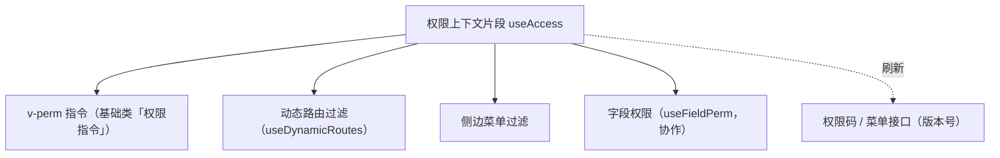

# 组件设计 · 权限上下文片段

> useAccess（能力片段，对外契约）· 权限上下文：权限码集合 / 路由·菜单过滤 / 按钮显隐（动作权限与动态菜单共用）

[文档首页](../../../../../文档首页.md) › [项目规划说明](../../../../../规划/项目规划说明.md) › [组件设计](../../../01_组件设计_总览.md) › 权限上下文片段　|　[← 语言上下文片段](../26_组件设计_语言上下文片段/26_组件设计_语言上下文片段.md)　[列配置片段 →](../28_组件设计_列配置片段/28_组件设计_列配置片段.md)

> 可交互原型：[27_原型设计_权限上下文片段.html](27_原型设计_权限上下文片段.html)（演示权限码集合、按钮显隐、路由 / 菜单过滤与权限变更刷新）

## 1. 目的与适用范围 

定义 BMS 前端 `frontend/`（`frontend-mobile/` 同款）**权限上下文片段**的组件设计：`useAccess`（能力片段，对外契约）。它是组件设计体系**能力片段「权限上下文片段」**，承载**权限码集合与过滤**——按钮显隐（`v-perm` 指令消费）、动态路由 / 菜单过滤（[动态路由片段](../20_组件设计_动态路由片段/20_组件设计_动态路由片段.md) 消费）、权限变更刷新；与[字段权限片段](../11_组件设计_字段权限片段/11_组件设计_字段权限片段.md)（字段级）分工：本片段管**动作 / 路由级**，字段级归字段权限。

### 1.1 定位 

| 职责 | 归属 |
| --- | --- |
| 权限码集合、`has` 判定、路由 / 菜单过滤、变更刷新 | **本节点（权限上下文片段）** |
| 按钮显隐指令 | [基础类「权限指令」](../../../09_基础类/02_组件设计_权限指令/02_组件设计_权限指令.md)（消费本片段） |
| 字段级权限（visible / editable / required） | [字段权限片段](../11_组件设计_字段权限片段/11_组件设计_字段权限片段.md)（元数据驱动） |
| 权限数据与版本号 | 后端 RBAC（阶段七） |

上游依据：[《前端开发规范》](../../../../../规范/前端开发规范.md)（§7 动态菜单与权限）、[《概要设计 · RBAC》](../../../../概要设计/01_概要设计_总览.md)（权限码）、[《架构设计 · 前端架构》](../../../../架构设计/08_架构设计_前端架构.md)（权限渲染）。

> 本篇为 **基础组件类 · 能力片段「权限上下文片段」**。**范围边界**：后端为准（前端只是消费与显隐，不构成安全边界）；字段级权限归字段权限片段；本片段只管"动作 / 路由权限上下文"。

## 2. 组件清单与职责 

| 组件 / 工具 | 位置 | 职责 |
| --- | --- | --- |
| `useAccess.ts`（能力片段，对外契约） | `src/components/base/<能力域>/` | 权限上下文：`codes` / `has` / `hasAny` / `hasAll` / `filterRoutes` / `refresh`；版本号刷新 |

- 命名遵循[《命名规范》](../../../../../规范/命名规范.md)：片段 `useXxx`；目录遵循[《前端开发规范》](../../../../../规范/前端开发规范.md)。

## 3. 契约（参数与方法） 

| 属性 | 类型 | 默认 | 说明 |
| --- | --- | --- | --- |
| `codes` | Set\<string\> | 空 | 当前用户权限码集合（`业务:动作`；登录后拉取） |
| `version` | string | '' | 权限版本号（角色 / 授权变更后比对刷新） |

| 方法 / 事件 | 说明 |
| --- | --- |
| `has(code)` | 单权限判定（`v-perm` 指令调用） |
| `hasAny(codes)` / `hasAll(codes)` | 任一 / 全部判定（批量场景） |
| `filterRoutes(menuTree)` | 按权限码过滤菜单树 / 路由（注册前双保险） |
| `refresh()` | 拉取权限码（登录 / 权限变更 / 版本号变化后） |
| `access-change` | 权限变化事件（触发路由重建 / 菜单刷新） |

## 4. 行为与实现约定 

| 项 | 设计 |
| --- | --- |
| 数据来源 | 登录成功后与菜单一起拉取权限码集合（一次请求）；刷新页面重新拉取 |
| 默认拒绝 | **无权限默认隐藏**（`v-perm` 无权限不渲染）；白名单页面（首页 / 个人中心）不受限 |
| 判定 | `has` 为纯内存判定（Set 查询）；批量渲染（表格行操作列）避免重复判定开销 |
| 过滤 | 菜单树 / 路由注册前过滤（与后端下发双保险）；无权限直达由路由守卫拦截（403） |
| 变更刷新 | 角色 / 授权变更后：后端版本号变化 → `refresh` → 重建动态路由 + 刷新菜单（无需刷新页面，可选） |
| 安全边界 | **前端判定仅为体验**（显隐），真正校验在后端接口（前端不构成安全边界） |
| 释放 | 权限拉取请求登记[异步资源基类](../../01_机制基类/05_组件设计_异步资源基类/05_组件设计_异步资源基类.md) |
| 依赖方向 | 只依赖 组件根 / 机制基类；被权限指令 / 动态路由 / 菜单消费 |

## 5. 场景集成 

| 场景 | 说明 |
| --- | --- |
| 按钮显隐 | `v-perm="'user:create'"`：新建按钮（无权限不渲染） |
| 动态路由 / 菜单 | 注册前过滤菜单树（与后端下发一致） |
| 操作列渲染 | 表格行操作按权限组装（批量判定） |
| 权限变更 | 管理员调整角色后，用户端刷新（版本号驱动） |

## 6. 依赖接口与上游变更 

### 6.1 上游接口与口径 

| 项 | 说明 | 目标文档 |
| --- | --- | --- |
| 分层权威 | 权限上下文片段职责与默认拒绝口径 | [《前端开发规范》](../../../../../规范/前端开发规范.md) §7（登记项①） |
| 权限码 | 权限码命名（`业务:动作`）与集合接口 | [《概要设计 · RBAC》](../../../../概要设计/01_概要设计_总览.md)、[《命名规范》](../../../../../规范/命名规范.md)（登记项②） |
| 权限刷新 | 版本号与刷新时机 | [《架构设计 · 前端架构》](../../../../架构设计/08_架构设计_前端架构.md)（登记项③） |
| 新增依赖 | **无** | — |

### 6.2 需登记的上游变更 

| 变更点 | 目标文档 | 内容 |
| --- | --- | --- |
| ① 权限上下文契约 | [《前端开发规范》](../../../../../规范/前端开发规范.md) §7 | 明确 `useAccess`：权限码集合 / 默认拒绝 / 菜单路由过滤 / 版本号刷新；前端只做体验（后端为准） |
| ② 权限码接口 | [《概要设计》](../../../../概要设计/01_概要设计_总览.md) 对应节点 | 权限码集合接口（含版本号）与菜单接口的返回结构 |
| ③ 变更刷新 | [《架构设计 · 前端架构》](../../../../架构设计/08_架构设计_前端架构.md) | 权限变更后 `access-change` → 重建路由 / 菜单的时序 |

> 按[《文档生成规范》](../../../../../规范/文档生成规范.md)「引用与追溯」节，上述变更需用户确认后由上游文档同步。

## 7. 权限 / i18n / 移动端 

- **权限**：本片段即权限上下文（动作 / 路由级）；字段级归字段权限片段；安全边界在后端。
- **i18n**：无关（权限码为标识符）。
- **移动端**：独立工程，权限上下文语义同款。

## 8. 性能与边界 

| 场景 | 设计 |
| --- | --- |
| 判定 | Set 查询 O(1)；列表批量渲染可先算一次布尔数组 |
| 边界 | 权限码大小写 / 拼写错误（开发态校验）、权限变更未刷新、菜单与权限码不一致（后端为准）、白名单遗漏、权限缓存过期 |
| 不支持 | 字段级权限（字段权限片段）、后端校验（RBAC）、按钮指令实现（权限指令） |

## 9. 检查清单 

- □ 契约：`codes`/`version` + `has`/`hasAny`/`hasAll`/`filterRoutes`/`refresh` + `access-change`
- □ 行为：登录拉取、默认拒绝、白名单、菜单路由过滤双保险、版本号刷新、纯内存判定
- □ 前端仅为体验（后端为准）；被权限指令 / 动态路由消费；依赖方向单向
- □ 权限/i18n/移动端符合第 7 节；性能边界符合第 8 节
- □ 三项上游登记已确认

> 组件设计节点（权限上下文片段）· 与[《前端开发规范》](../../../../../规范/前端开发规范.md)[《概要设计 · RBAC》](../../../../概要设计/01_概要设计_总览.md)[基础类「权限指令」](../../../09_基础类/02_组件设计_权限指令/02_组件设计_权限指令.md)[动态路由片段](../20_组件设计_动态路由片段/20_组件设计_动态路由片段.md)[字段权限片段](../11_组件设计_字段权限片段/11_组件设计_字段权限片段.md)《命名规范》配套
