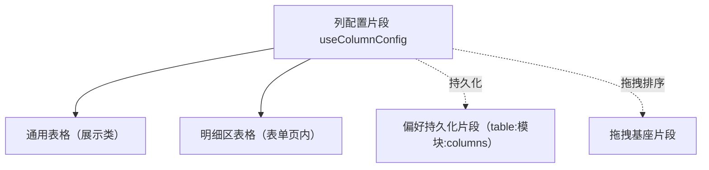

# 组件设计 · 列配置片段

> useColumnConfig（能力片段，对外契约）· 列配置：显隐 / 顺序 / 宽度 / 持久化（通用表格与明细区共用）

[文档首页](../../../../../文档首页.md) › [项目规划说明](../../../../../规划/项目规划说明.md) › [组件设计](../../../01_组件设计_总览.md) › 列配置片段　|　[← 权限上下文片段](../27_组件设计_权限上下文片段/27_组件设计_权限上下文片段.md)　[查询方案片段 →](../29_组件设计_查询方案片段/29_组件设计_查询方案片段.md)

> 可交互原型：[28_原型设计_列配置片段.html](28_原型设计_列配置片段.html)（演示列显隐、拖拽排序、宽度调整、重置与持久化）

## 1. 目的与适用范围 

定义 BMS 前端 `apps/desktop/`（`frontend-mobile/` 同款）**列配置片段**的组件设计：`useColumnConfig`（能力片段，对外契约）。它是组件设计体系**能力片段「列配置片段」**，统一表格**列的显隐、顺序、宽度与持久化**——供 [展示类「通用表格」](../../../07_展示类/01_组件设计_通用表格/01_组件设计_通用表格.md) 与明细区表格共用；持久化经[偏好持久化片段](../16_组件设计_偏好持久化片段/16_组件设计_偏好持久化片段.md)（`table:模块:columns`）。

### 1.1 定位 

| 职责 | 归属 |
| --- | --- |
| 列显隐、顺序、宽度、重置、冻结列、列配置导出 | **本节点（列配置片段）** |
| 表格渲染与数据 | [通用表格](../../../07_展示类/01_组件设计_通用表格/01_组件设计_通用表格.md) |
| 持久化存储 | [偏好持久化片段](../16_组件设计_偏好持久化片段/16_组件设计_偏好持久化片段.md) |
| 拖拽排序交互 | [拖拽基座片段](../23_组件设计_拖拽基座片段/23_组件设计_拖拽基座片段.md) |

上游依据：[《前端开发规范》](../../../../../规范/前端开发规范.md)（§3 能力片段）、[《布局设计 · 列表页》](../../../../布局设计/01_布局设计_总览.html)（表格列行为）。

> 本篇为 **基础组件类 · 能力片段「列配置片段」**。**范围边界**：表格渲染归通用表格；存储归偏好持久化；本片段只管"列的定义与用户偏好"。

## 2. 组件清单与职责 

| 组件 / 工具 | 位置 | 职责 |
| --- | --- | --- |
| `useColumnConfig.ts`（能力片段，对外契约） | `src/components/base/<能力域>/` | 列配置：`visibleColumns` / `toggle` / `move` / `setWidth` / `reset` / `freeze`；与持久化协作 |

- 命名遵循[《命名规范》](../../../../../规范/命名规范.md)：片段 `useXxx`；目录遵循[《前端开发规范》](../../../../../规范/前端开发规范.md)。

## 3. 契约（参数与方法） 

| 属性 | 类型 | 默认 | 说明 |
| --- | --- | --- | --- |
| `columns` | ColumnDef[] | 必填 | 列定义（`key` / `title` / `width` / `fixed` / `defaultHidden`） |
| `storageKey` | string | `table:{模块}:columns` | 持久化键（经偏好持久化片段） |
| `minWidth` / `maxWidth` | number | — | 拖拽宽度边界 |

| 状态 / 方法 | 说明 |
| --- | --- |
| `visibleColumns` | 当前可见列（顺序即渲染顺序；响应式） |
| `toggle(key)` | 显隐切换（至少保留一列） |
| `move(from, to)` | 顺序调整（列设置面板 / 表头拖拽） |
| `setWidth(key, width)` | 宽度调整（表头拖拽；双击自适应） |
| `freeze(key, 'left' \| 'right' \| false)` | 冻结列切换 |
| `reset()` | 重置为默认配置（列定义 `defaultHidden` 生效） |
| `save()` / `restore()` | 手动保存 / 恢复（持久化片段自动同步，手动入口供设置面板） |

## 4. 行为与实现约定 

| 项 | 设计 |
| --- | --- |
| 列定义 | 列定义来自页面（`ColumnDef`）；本片段只维护"用户配置层"（显隐 / 顺序 / 宽度 / 冻结） |
| 显隐 | 默认列 + `defaultHidden`；用户切换即时生效；至少保留一列（防止空白表） |
| 顺序 | 列设置面板或表头拖拽调整（拖拽经拖拽基座片段）；顺序即 `visibleColumns` 数组序 |
| 宽度 | 表头拖拽调整；双击列边界自适应内容；设 `minWidth` / `maxWidth` 边界 |
| 冻结 | 左侧 / 右侧冻结（操作列默认右冻结）；与固定列数限制协调 |
| 持久化 | 变更防抖后经偏好持久化片段保存（key `table:模块:columns`）；跨设备同步；`reset` 同步清远端 |
| 明细表 | 明细区表格独立 `storageKey`（如 `table:order:detail:columns`） |
| 依赖方向 | 只依赖 组件根 / 偏好持久化 / 拖拽基座；被表格消费；不依赖具体页面 |

## 5. 场景集成 

| 场景 | 说明 |
| --- | --- |
| 通用表格 | 列设置面板（显隐 / 顺序）、表头拖宽、冻结列 |
| 明细区表格 | 主表表单内的明细列配置（独立 key） |
| 导出协作 | 导出列范围取当前 `visibleColumns`（与导入导出组件协作） |
| 查询方案 | 列配置与查询方案同属用户偏好（各自 key） |

## 6. 依赖接口与上游变更 

### 6.1 上游接口与口径 

| 项 | 说明 | 目标文档 |
| --- | --- | --- |
| 分层权威 | 列配置片段职责与持久化口径 | [《前端开发规范》](../../../../../规范/前端开发规范.md) 第 3 节（登记项①） |
| 列行为 | 列显隐 / 拖宽 / 冻结的交互口径 | [《布局设计 · 列表页》](../../../../布局设计/01_布局设计_总览.html)（登记项②） |
| 持久化 | 列配置存储键与同步 | [偏好持久化片段](../16_组件设计_偏好持久化片段/16_组件设计_偏好持久化片段.md)（登记项③） |
| 新增依赖 | **无** | — |

### 6.2 需登记的上游变更 

| 变更点 | 目标文档 | 内容 |
| --- | --- | --- |
| ① 列配置片段契约 | [《前端开发规范》](../../../../../规范/前端开发规范.md) 第 3 节 | 明确 `useColumnConfig`：显隐 / 顺序 / 宽度 / 冻结 / 重置；用户配置层与列定义分离 |
| ② 列交互口径 | [《布局设计 · 列表页》](../../../../布局设计/01_布局设计_总览.html) | 列设置面板入口、拖宽 / 双击自适应、冻结规则 |
| ③ 存储键 | [偏好持久化片段](../16_组件设计_偏好持久化片段/16_组件设计_偏好持久化片段.md) | `table:{模块}:columns` 键规则与跨设备同步 |

> 按[《文档生成规范》](../../../../../规范/文档生成规范.md)「引用与追溯」节，上述变更需用户确认后由上游文档同步。

## 7. 权限 / i18n / 移动端 

- **权限**：列是否可见可叠加权限（无权限列不纳入 `columns`，由页面组装）；本片段不判权。
- **i18n**：列标题由列定义（i18n key 或后端下发）提供。
- **移动端**：独立工程，移动端不提供列配置（窄屏精简列）。

## 8. 性能与边界 

| 场景 | 设计 |
| --- | --- |
| 拖宽 | 拖拽过程只更新预览宽度，松手后一次性写模型（避免高频重排） |
| 持久化 | 变更防抖保存；恢复时与列定义合并（新增列自动追加） |
| 边界 | 列 key 变更（旧配置不匹配，按 key 合并兜底）、全隐（禁止）、宽度越界、冻结冲突、跨设备格式升级 |
| 不支持 | 表格渲染（通用表格）、存储实现（偏好持久化）、拖拽库（拖拽基座） |

## 9. 检查清单 

- □ 契约：`columns`/`storageKey`/`minWidth`/`maxWidth` + `visibleColumns`/`toggle`/`move`/`setWidth`/`freeze`/`reset`
- □ 行为：用户配置层、至少保留一列、顺序即渲染序、拖宽边界、冻结规则、防抖持久化
- □ 被表格消费；持久化经偏好片段、拖拽经拖拽基座；依赖方向单向
- □ 权限/i18n/移动端符合第 7 节；性能边界符合第 8 节
- □ 三项上游登记已确认

> 组件设计节点（列配置片段）· 与[《前端开发规范》](../../../../../规范/前端开发规范.md)[《布局设计 · 列表页》](../../../../布局设计/01_布局设计_总览.html)[通用表格](../../../07_展示类/01_组件设计_通用表格/01_组件设计_通用表格.md)[偏好持久化片段](../16_组件设计_偏好持久化片段/16_组件设计_偏好持久化片段.md)[拖拽基座片段](../23_组件设计_拖拽基座片段/23_组件设计_拖拽基座片段.md)《命名规范》配套
