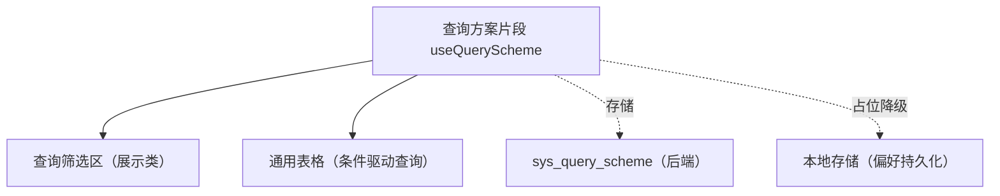

# 组件设计 · 查询方案片段

> useQueryScheme（能力片段，对外契约）· 查询方案：条件模型 / 方案保存·应用（sys_query_scheme；查询筛选区）

[文档首页](../../../../../文档首页.md) › [项目规划说明](../../../../../规划/项目规划说明.md) › [组件设计](../../../01_组件设计_总览.md) › 查询方案片段　|　[← 列配置片段](../28_组件设计_列配置片段/28_组件设计_列配置片段.md)　[水印片段 →](../30_组件设计_水印片段/30_组件设计_水印片段.md)

> 可交互原型：[29_原型设计_查询方案片段.html](29_原型设计_查询方案片段.html)（演示条件模型、方案另存 / 应用 / 删除与默认方案）

## 1. 目的与适用范围 

定义 BMS 前端 `frontend/`（`frontend-mobile/` 同款）**查询方案片段**的组件设计：`useQueryScheme`（能力片段，对外契约）。它是组件设计体系**能力片段「查询方案片段」**，统一**查询条件模型与方案（保存 / 应用 / 默认）**——供 [展示类「查询筛选区」](../../../07_展示类/02_组件设计_查询筛选区/02_组件设计_查询筛选区.md) 与 [展示类「通用表格」](../../../07_展示类/01_组件设计_通用表格/01_组件设计_通用表格.md) 协作；方案存储在后端 `sys_query_scheme`（未就绪时占位降级为本地）。

### 1.1 定位 

| 职责 | 归属 |
| --- | --- |
| 条件模型（字段 + 运算符 + 值）、方案保存 / 应用 / 删除 / 默认 | **本节点（查询方案片段）** |
| 条件输入 UI | [查询筛选区](../../../07_展示类/02_组件设计_查询筛选区/02_组件设计_查询筛选区.md) |
| 条件 → 查询参数 | 通用表格 / 列表页（消费方） |
| 方案存储 | 后端 `sys_query_scheme`（未就绪时本地） |

上游依据：[《前端开发规范》](../../../../../规范/前端开发规范.md)（§3 能力片段）、[《概要设计 · 查询方案》](../../../../概要设计/01_概要设计_总览.md)（`sys_query_scheme` 表）、[《布局设计 · 列表页》](../../../../布局设计/01_布局设计_总览.html)（筛选区形态）。

> 本篇为 **基础组件类 · 能力片段「查询方案片段」**。**范围边界**：条件输入 UI 归查询筛选区；查询执行归表格 / 列表页；本片段只管"条件模型与方案管理"。

## 2. 组件清单与职责 

| 组件 / 工具 | 位置 | 职责 |
| --- | --- | --- |
| `useQueryScheme.ts`（能力片段，对外契约） | `src/components/base/<能力域>/` | 条件模型：`conditions` / `saveAs` / `apply` / `remove` / `setDefault` / `clear`；方案列表与默认方案 |

- 命名遵循[《命名规范》](../../../../../规范/命名规范.md)：片段 `useXxx`；目录遵循[《前端开发规范》](../../../../../规范/前端开发规范.md)。

## 3. 契约（参数与方法） 

| 属性 | 类型 | 默认 | 说明 |
| --- | --- | --- | --- |
| `moduleKey` | string | 必填 | 模块标识（方案归属，如 `user`） |
| `fields` | FieldDef[] | 必填 | 可查询字段定义（key / label / type / operators） |
| `defaultScheme` | string | '' | 默认方案名（进入页面自动应用） |

| 状态 / 方法 | 说明 |
| --- | --- |
| `conditions` | 条件模型（`{ field, operator, value }[]`；响应式） |
| `schemes` | 方案列表（我的方案 + 共享方案，按权限） |
| `saveAs(name)` | 另存方案（当前条件模型）；重名覆盖确认 |
| `apply(schemeId)` | 应用方案（回填条件 → 触发查询） |
| `remove(schemeId)` | 删除方案（仅本人可删；共享方案按权限） |
| `setDefault(schemeId)` | 设默认（进入页面自动应用） |
| `clear()` | 清空条件（恢复空模型） |
| `toParams()` | 条件模型 → 查询参数（供列表页请求） |

## 4. 行为与实现约定 

| 项 | 设计 |
| --- | --- |
| 条件模型 | `{ field, operator, value }` 与后端查询契约同源（操作符对齐后端数据范围操作符集：eq / in / like / gt / between…） |
| 方案保存 | 保存当前条件模型 + 名称；同一模块多方案；`sys_query_scheme` 存储（未就绪时经偏好持久化存本地，占位降级） |
| 应用 | 回填筛选区条件 → `toParams()` → 列表首屏查询（重置分页到第 1 页） |
| 默认方案 | 用户可设默认；进入页面自动应用（可配置开关） |
| 权限 | 方案归属用户；共享方案（可选）按后端权限控制；本片段不判权 |
| 释放 | 方案拉取 / 保存请求登记[异步资源基类](../../01_机制基类/05_组件设计_异步资源基类/05_组件设计_异步资源基类.md) |
| 依赖方向 | 只依赖 组件根 / 偏好持久化 / 机制基类；被筛选区 / 表格消费 |

## 5. 场景集成 

| 场景 | 说明 |
| --- | --- |
| 查询筛选区 | 条件输入 + 方案下拉（保存 / 应用 / 删除 / 设默认） |
| 通用表格 | 应用方案 → 触发查询 → 渲染结果 |
| 常用筛选 | "待我审批"“本月新增”等常用条件存为方案一键应用 |
| 移动端 | 简化方案入口（保留应用，弱化保存） |

## 6. 依赖接口与上游变更 

### 6.1 上游接口与口径 

| 项 | 说明 | 目标文档 |
| --- | --- | --- |
| 分层权威 | 查询方案片段职责与条件模型口径 | [《前端开发规范》](../../../../../规范/前端开发规范.md) 第 3 节（登记项①） |
| 方案表与接口 | `sys_query_scheme` 与方案接口 | [《概要设计 · 查询方案》](../../../../概要设计/01_概要设计_总览.md)（登记项②） |
| 操作符集 | 条件操作符与后端查询一致 | [《后端基类清单》](../../../../../后端基类清单.md)「数据范围」节（登记项③） |
| 新增依赖 | **无** | — |

### 6.2 需登记的上游变更 

| 变更点 | 目标文档 | 内容 |
| --- | --- | --- |
| ① 查询方案片段契约 | [《前端开发规范》](../../../../../规范/前端开发规范.md) 第 3 节 | 明确 `useQueryScheme`：条件模型 / 保存·应用·删除·默认 / `toParams`；未就绪降级本地 |
| ② 方案接口 | [《概要设计》](../../../../概要设计/01_概要设计_总览.md) 对应节点 | 方案 CRUD 接口、归属与共享权限；默认方案字段 |
| ③ 操作符对齐 | [《后端基类清单》](../../../../../后端基类清单.md) | 条件操作符集（eq / ne / in / like / gt / gte / lt / lte / between / is_null / is_not_null）与后端数据范围一致 |

> 按[《文档生成规范》](../../../../../规范/文档生成规范.md)「引用与追溯」节，上述变更需用户确认后由上游文档同步。

## 7. 权限 / i18n / 移动端 

- **权限**：方案归属与共享由后端控制；本片段不判权。
- **i18n**：字段 label 由字段定义（元数据 / 接口）提供；方案名由用户输入。
- **移动端**：独立工程，条件模型同款（UI 简化）。

## 8. 性能与边界 

| 场景 | 设计 |
| --- | --- |
| 应用 | 应用方案只触发一次查询（回填不逐个触发） |
| 边界 | 字段已下线（旧方案含失效字段：忽略并提示）、操作符不匹配类型、重名方案、默认方案被删、方案跨端格式升级 |
| 不支持 | 条件输入 UI（查询筛选区）、查询执行（表格 / 列表页）、存储实现（后端 / 偏好片段） |

## 9. 检查清单 

- □ 契约：`moduleKey`/`fields`/`defaultScheme` + `conditions`/`schemes`/`saveAs`/`apply`/`remove`/`setDefault`/`toParams`
- □ 行为：条件模型与后端操作符同源、应用只触发一次查询、默认方案、重名确认、失效字段兜底、占位降级本地
- □ 被筛选区 / 表格消费；依赖方向单向
- □ 权限/i18n/移动端符合第 7 节；性能边界符合第 8 节
- □ 三项上游登记已确认

> 组件设计节点（查询方案片段）· 与[《前端开发规范》](../../../../../规范/前端开发规范.md)[《概要设计 · 查询方案》](../../../../概要设计/01_概要设计_总览.md)[查询筛选区](../../../07_展示类/02_组件设计_查询筛选区/02_组件设计_查询筛选区.md)[通用表格](../../../07_展示类/01_组件设计_通用表格/01_组件设计_通用表格.md)[偏好持久化片段](../16_组件设计_偏好持久化片段/16_组件设计_偏好持久化片段.md)《命名规范》配套
