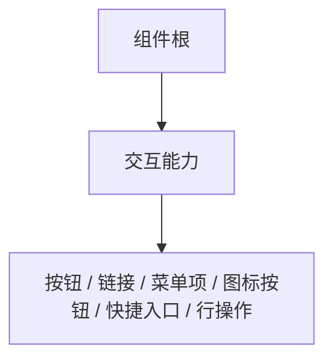

# 组件设计 · 交互能力

> 可交互语义能力：可点击语义 / 加载与禁用 / 焦点与键盘 / 点击防抖 / 危险操作二次确认 / 点击埋点
> 实现侧命名与落点见《[前端基类清单](../../../../../前端基类清单.md)》（「能力」节），实现契约细节见项目详细设计。

[文档首页](../../../../../文档首页.md) › [项目规划说明](../../../../../规划/项目规划说明.md) › [组件设计](../../../01_组件设计_总览.md) › 交互能力　|　[← 组件根基类](../../01_机制基类/02_组件设计_组件根基类/02_组件设计_组件根基类.md)　[输入形态能力 →](../02_组件设计_输入形态能力/02_组件设计_输入形态能力.md)

> 可交互原型：[01_原型设计_交互能力.html](01_原型设计_交互能力.html)（演示可点击语义、加载/禁用、焦点与键盘（Enter/Space）、点击防抖、危险操作二次确认与点击埋点）

## 1. 目的与适用范围 

定义 BMS 前端**交互能力**的组件设计：为**所有可点击/可操作组件**（按钮、链接、菜单项、图标按钮、快捷入口、行操作等）提供公共交互语义——可点击语义、加载/禁用、焦点与键盘、点击防抖、危险操作二次确认、点击埋点。它是组件设计体系**能力（继承链上的一层）**，继承[组件根基类](../../01_机制基类/02_组件设计_组件根基类/02_组件设计_组件根基类.md)，是[《前端开发规范》](../../../../../规范/前端开发规范.md)「前端基类体系」节的组件侧落地。

### 1.1 定位 

| 职责 | 归属 |
| --- | --- |
| 可点击语义、加载/禁用、焦点与键盘、点击防抖、危险确认钩子、点击埋点 | **本节点（交互能力）** |
| 透传/尺寸/密度/主题/i18n/可访问性基础 | [组件根](../../01_机制基类/02_组件设计_组件根基类/02_组件设计_组件根基类.md) |
| 输入形态（值绑定/前后缀/清空） | [输入形态能力](../02_组件设计_输入形态能力/02_组件设计_输入形态能力.md) |
| 权限（按钮显隐/禁用） | [基础类「权限指令」](../../../09_基础类/02_组件设计_权限指令/02_组件设计_权限指令.md) |

上游依据：[《前端开发规范》](../../../../../规范/前端开发规范.md)（「前端基类体系」节、组件契约与组合分工）、[《布局设计 · 设计令牌》](../../../../布局设计/02_布局设计_设计令牌.html)（交互态令牌 hover/active/focus/disabled）。

> 本篇为 **基础组件类 · 能力「交互能力」**。**范围边界**：通用能力归 根系/组件根；输入形态归 输入形态能力；权限判定不在本能力（由动作权限指令与字段权限处理）。

## 2. 职责与组成 

| 组成部分 | 职责 |
| --- | --- |
| 交互能力核心 | 可交互语义与触发判定：点击/键盘触发、加载/禁用、焦点环、防抖、危险确认、埋点 |
| 组件包装（按需） | 可聚焦根元素与加载/禁用态的渲染形态，按需提供 |
| 能力内聚件（按需） | 危险确认提示、点击与曝光埋点等交互内聚件（按需） |

- **继承方式**：能力是**继承链上的一层**（组件根之上、域基类与具体组件之下）；上层经继承取得能力语义，不在链外自由挂接（口径见[《前端开发规范》](../../../../../规范/前端开发规范.md)「架构铁律」与「前端基类体系」节）。

## 3. 交互与契约语义 

| 语义项 | 说明 |
| --- | --- |
| 可点击语义 | 由禁用/加载/防抖/确认共同决定触发与否 |
| 加载与禁用 | 加载态防重复提交并显示加载；禁用态不可点击、不可聚焦 |
| 危险确认 | 危险操作确认文案（设置则点击前二次确认）；确认时机可选（先确认后回调 / 点击后确认） |
| 可访问角色 | 默认按钮角色，可按语义调整 |
| 键盘语义 | Enter/Space 等同点击触发 |
| 焦点语义 | 焦点环用交互态令牌，仅键盘聚焦可见 |
| 内容插槽 | 默认内容与自定义加载态 |

## 4. 行为语义 

| 项 | 设计 |
| --- | --- |
| 点击 | 加载/禁用时不触发；有效点击按防抖去重；危险确认生效则先确认 |
| 键盘 | Enter/Space 触发点击语义；禁用时从 Tab 序列移除 |
| 焦点 | 焦点环用交互态令牌；仅键盘聚焦可见 |
| 加载 | 显示加载态且防重复提交（提交类组件默认） |
| 埋点 | 统一曝光/点击埋点钩子（可关） |
| 组合 | 可同时组合 输入形态能力（如可点击标签输入），无冲突 |

## 5. 场景集成 

| 场景 | 说明 |
| --- | --- |
| 按钮/图标按钮 | 主操作、行操作 |
| 菜单项/快捷入口 | 导航类点击 |
| 危险操作 | 删除/停用等二次确认 |

## 6. 依赖接口与上游变更 

### 6.1 上游接口与口径 

| 项 | 说明 | 目标文档 |
| --- | --- | --- |
| 分层权威 | 能力（交互能力）职责 | [《前端开发规范》](../../../../../规范/前端开发规范.md)「前端基类体系」节（登记项①） |
| 交互态令牌 | hover/active/focus/disabled 令牌 | [《布局设计 · 设计令牌》](../../../../布局设计/02_布局设计_设计令牌.html)（登记项②） |
| 组件分层 | 核心能力 / 投影 / 渲染插件落点与继承链 | [《架构设计 · 前端架构》](../../../../架构设计/08_架构设计_前端架构.md)（登记项③） |
| 新增依赖 | **无** | — |

### 6.2 需登记的上游变更 

| 变更点 | 目标文档 | 内容 |
| --- | --- | --- |
| ① 交互能力契约 | [《前端开发规范》](../../../../../规范/前端开发规范.md)「前端基类体系」节 | 明确交互能力契约：可点击语义、加载/禁用、键盘（Enter/Space）、防抖、危险确认钩子、点击埋点 |
| ② 交互态令牌 | [《布局设计 · 设计令牌》](../../../../布局设计/02_布局设计_设计令牌.html)「交互态令牌」节 | 明确 hover/active/focus-visible/disabled 令牌与焦点环规范，组件只消费令牌 |
| ③ 组件分层与目录 | [《架构设计 · 前端架构》](../../../../架构设计/08_架构设计_前端架构.md)「组件分层」节 | 登记核心能力 / 投影 / 渲染插件 / 宿主分层与 根系→组件根→能力→域基类 继承链（能力即继承链上的一层） |

> 按[《文档生成规范》](../../../../../规范/文档生成规范.md)「引用与追溯」节，上述变更需用户确认后由上游文档同步；本节点只定义交互能力语义与契约。

## 7. 权限 / i18n / 移动端 

- **权限**：按钮显隐/禁用由[基础类「权限指令」](../../../09_基础类/02_组件设计_权限指令/02_组件设计_权限指令.md)判定，本能力不判权限。
- **i18n**：确认/加载文案经全局语言能力取词，不内嵌文案。
- **移动端**：PC 与移动端为同一契约的多实现（同一套契约断言保障）；交互语义一致（触控无悬浮态）。

## 8. 性能与边界 

| 场景 | 设计 |
| --- | --- |
| 渲染 | 薄能力层；无额外包裹元素 |
| 防抖 | 提交类默认防抖 + 加载态双保险 |
| 边界 | 双击/连点、禁用态仍可聚焦、危险确认取消、埋点重复、键盘与鼠标并存 |
| 不支持 | 通用能力（组件根）、输入形态（输入形态能力）、权限判定、具体按钮样式 |

## 9. 检查清单 

- □ 契约语义：可点击语义/加载/禁用/防抖/危险确认/确认时机/可访问角色
- □ 行为：点击语义、键盘 Enter/Space、焦点环（仅键盘可见）、加载防重复、埋点
- □ 与组件根为继承链上下层关系；依赖方向单向（依赖经登记表显式声明）
- □ 权限/i18n/移动端符合第 7 节；性能边界符合第 8 节
- □ 三项上游登记已确认

> 组件设计节点（交互能力）· 与[《前端开发规范》](../../../../../规范/前端开发规范.md)[《布局设计 · 设计令牌》](../../../../布局设计/02_布局设计_设计令牌.html)[《架构设计 · 前端架构》](../../../../架构设计/08_架构设计_前端架构.md)[组件根基类](../../01_机制基类/02_组件设计_组件根基类/02_组件设计_组件根基类.md)[输入形态能力](../02_组件设计_输入形态能力/02_组件设计_输入形态能力.md)[基础类「权限指令」](../../../09_基础类/02_组件设计_权限指令/02_组件设计_权限指令.md)《命名规范》配套
