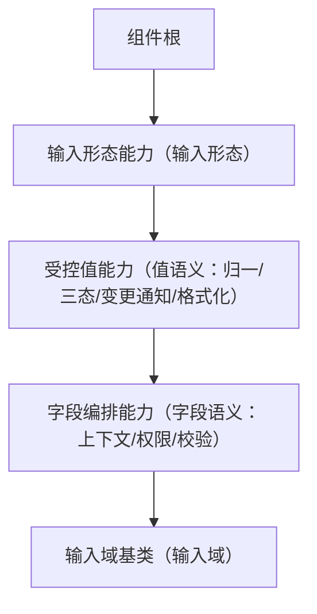

# 组件设计 · 输入形态能力

> 输入形态语义能力：受控值绑定 / 前后缀与前置后置插槽 / 清空 / 只读 / 输入法组合事件 / 聚焦与失焦
> 实现侧命名与落点见《[前端基类清单](../../../../../前端基类清单.md)》（「能力」节），实现契约细节见项目详细设计。

[文档首页](../../../../../文档首页.md) › [项目规划说明](../../../../../规划/项目规划说明.md) › [组件设计](../../../01_组件设计_总览.md) › 输入形态能力　|　[← 交互能力](../01_组件设计_交互能力/01_组件设计_交互能力.md)　[展示形态能力 →](../03_组件设计_展示形态能力/03_组件设计_展示形态能力.md)

> 可交互原型：[02_原型设计_输入形态能力.html](02_原型设计_输入形态能力.html)（演示值绑定、前后缀/前置后置插槽、清空、只读、输入法组合事件与聚焦/失焦；并与受控值/字段编排的字段语义区分）

## 1. 目的与适用范围 

定义 BMS 前端**输入形态能力**的组件设计：为**所有输入型组件**（文本框、文本域、密码、数字、下拉、日期等）提供**通用输入形态**——值绑定、插槽（前缀/后缀/前置/后置）、清空、只读、输入法组合事件。它是组件设计体系**能力（继承链上的一层）**，继承[组件根基类](../../01_机制基类/02_组件设计_组件根基类/02_组件设计_组件根基类.md)。

### 1.1 定位（与字段语义的区别） 

- **输入形态能力 只管"输入长什么样、怎么输入"**：受控绑定、插槽、清空、只读、输入法组合事件；**不含**三态、校验触发、字段上下文、字段权限。
- **字段语义**由 受控值能力 与 字段编排能力 提供；基础控件类与字段类的继承链为：具体控件 → 输入域基类（域层）→ 字段编排能力 → 受控值能力 → 输入形态能力 → 组件根 → 根系。**能力即继承链上的层**：公共字段与方法只在链上对应层维护，不在链外自由挂接；层间依赖在登记表显式声明、方向单向（口径见[《前端开发规范》](../../../../../规范/前端开发规范.md)「架构铁律」与「前端基类体系」节）。

上游依据：[《前端开发规范》](../../../../../规范/前端开发规范.md)（「前端基类体系」节、组件契约）、[《布局设计 · 表单页》](../../../../布局设计/08_布局设计_表单页.html)（输入控件通用形态、只读/编辑分态）、[《概要设计 · 表单定制》](../../../../概要设计/36_概要设计_表单定制.md)（基础控件类型）。

> 本篇为 **基础组件类 · 能力「输入形态能力」**。**范围边界**：通用能力归 根系/组件根；值/字段语义归 受控值能力 / 字段编排能力；输入域细化归 [输入域基类](../../03_域基类/01_组件设计_输入域基类/01_组件设计_输入域基类.md)。

## 2. 职责与组成 

| 组成部分 | 职责 |
| --- | --- |
| 输入形态能力核心 | 输入形态语义：受控绑定、插槽、清空、只读、输入法组合事件、聚焦/失焦 |
| 组件包装（按需） | 输入形态渲染：单根元素、前后缀/前置后置插槽与清空，按需提供 |
| 能力内聚件（按需） | 清空按钮与输入法组合处理等内聚件（按需） |

- **继承方式**：能力是**继承链上的一层**（组件根之上、域基类与具体组件之下）；上层经继承取得能力语义，不在链外自由挂接（口径见[《前端开发规范》](../../../../../规范/前端开发规范.md)「架构铁律」与「前端基类体系」节）。

## 3. 交互与契约语义 

| 语义项 | 说明 |
| --- | --- |
| 受控值绑定 | 同一时刻只认外部受控值，输入即对外通知受控更新 |
| 占位与只读 | 占位提示（i18n）；只读可聚焦不可改 |
| 可清空 | 一键清空；清空后值由受控值语义归一到统一空值（本层置空） |
| 插槽 | 前缀、后缀、前置、后置；单根元素与未声明属性透传（继承组件根） |
| 事件语义 | 受控更新、值提交（输入法组合结束后）、聚焦/失焦、清空 |
| 自动聚焦 | 可配置进入即聚焦 |

## 4. 行为语义 

| 项 | 设计 |
| --- | --- |
| 受控 | 只认受控值，输入即通知受控更新 |
| 输入法组合 | 组合期间不抛提交，组合结束后提交（中文输入不误触发） |
| 清空 | 可清空且非只读/禁用时显示；清空后值由受控值语义归一（本层置空） |
| 只读 | 只读可聚焦可复制；禁用继承组件根 |
| 插槽 | 前后缀/前置后置插槽，供业务图标与单位；建议单一用途 |
| 组合 | 可组合 交互能力（如可点击输入框）；不引入字段语义 |

## 5. 场景集成 

| 场景 | 说明 |
| --- | --- |
| 基础控件类 | 文本框/文本域/密码/数字/下拉经继承链取得输入形态语义 |
| 字段类 | 字典/日期等输入型字段 |
| 查询筛选区 | 查询条件输入控件 |

## 6. 依赖接口与上游变更 

### 6.1 上游接口与口径 

| 项 | 说明 | 目标文档 |
| --- | --- | --- |
| 分层权威 | 能力（输入形态能力）职责 | [《前端开发规范》](../../../../../规范/前端开发规范.md)「前端基类体系」节（登记项①） |
| 输入通用形态 | 只读/编辑分态、插槽、清空 | [《布局设计 · 表单页》](../../../../布局设计/08_布局设计_表单页.html)（登记项②） |
| 基础控件类型 | 基础输入类型注册 | [《概要设计 · 表单定制》](../../../../概要设计/36_概要设计_表单定制.md)（登记项③） |
| 新增依赖 | **无** | — |

### 6.2 需登记的上游变更 

| 变更点 | 目标文档 | 内容 |
| --- | --- | --- |
| ① 输入形态能力契约 | [《前端开发规范》](../../../../../规范/前端开发规范.md)「前端基类体系」节 | 明确输入形态能力只负责输入形态（受控/插槽/清空/只读/输入法组合），不含字段语义（三态/校验/权限） |
| ② 输入控件通用形态 | [《布局设计 · 表单页》](../../../../布局设计/08_布局设计_表单页.html)「输入控件」节 | 明确前后缀插槽、清空、只读可聚焦等通用形态 |
| ③ 基础控件类型注册 | [《概要设计 · 表单定制》](../../../../概要设计/36_概要设计_表单定制.md)「组件类型与自建字段边界」节 | 明确基础输入类型由基础控件类提供、经 输入形态能力→受控值/字段编排能力→输入域基类 的继承链取得契约，映射表指向基础控件类 |

> 按[《文档生成规范》](../../../../../规范/文档生成规范.md)「引用与追溯」节，上述变更需用户确认后由上游文档同步；本节点只定义输入形态能力语义与契约。

## 7. 权限 / i18n / 移动端 

- **权限**：不做权限判定（字段权限见 [字段权限能力](../../02_能力类/11_组件设计_字段权限能力/11_组件设计_字段权限能力.md)）。
- **i18n**：占位/文案经全局语言能力取词，不内嵌文案。
- **移动端**：触屏输入、数字键盘类型由移动端实现按同一契约细化（PC 与移动端同一契约多实现）。

## 8. 性能与边界 

| 场景 | 设计 |
| --- | --- |
| 渲染 | 单根、薄能力层 |
| 输入 | 受控更新；值提交与输入法组合分离；可选去抖（由具体控件决定） |
| 边界 | 组合输入中断、清空与只读冲突、插槽冲突、受控值未更新回显、空值语义（由受控值语义归一） |
| 不支持 | 通用能力（组件根）、值/字段语义（受控值能力/字段编排能力）、域细化（输入域基类）、权限 |

## 9. 检查清单 

- □ 契约语义：受控值/占位/只读/可清空/自动聚焦；聚焦与清空事件
- □ 插槽：前缀/后缀/前置/后置；单根 + 属性透传
- □ 输入法组合事件分离；值提交时机正确；只读可聚焦可复制
- □ 与 受控值能力/字段编排能力 字段语义边界清晰（本层不含三态/校验/权限）
- □ 权限/i18n/移动端符合第 7 节；性能边界符合第 8 节
- □ 三项上游登记已确认

> 组件设计节点（输入形态能力）· 与[《前端开发规范》](../../../../../规范/前端开发规范.md)[《布局设计 · 表单页》](../../../../布局设计/08_布局设计_表单页.html)[《概要设计 · 表单定制》](../../../../概要设计/36_概要设计_表单定制.md)[组件根基类](../../01_机制基类/02_组件设计_组件根基类/02_组件设计_组件根基类.md)[交互能力](../01_组件设计_交互能力/01_组件设计_交互能力.md)[展示形态能力](../03_组件设计_展示形态能力/03_组件设计_展示形态能力.md)[输入域基类](../../03_域基类/01_组件设计_输入域基类/01_组件设计_输入域基类.md)《命名规范》配套
