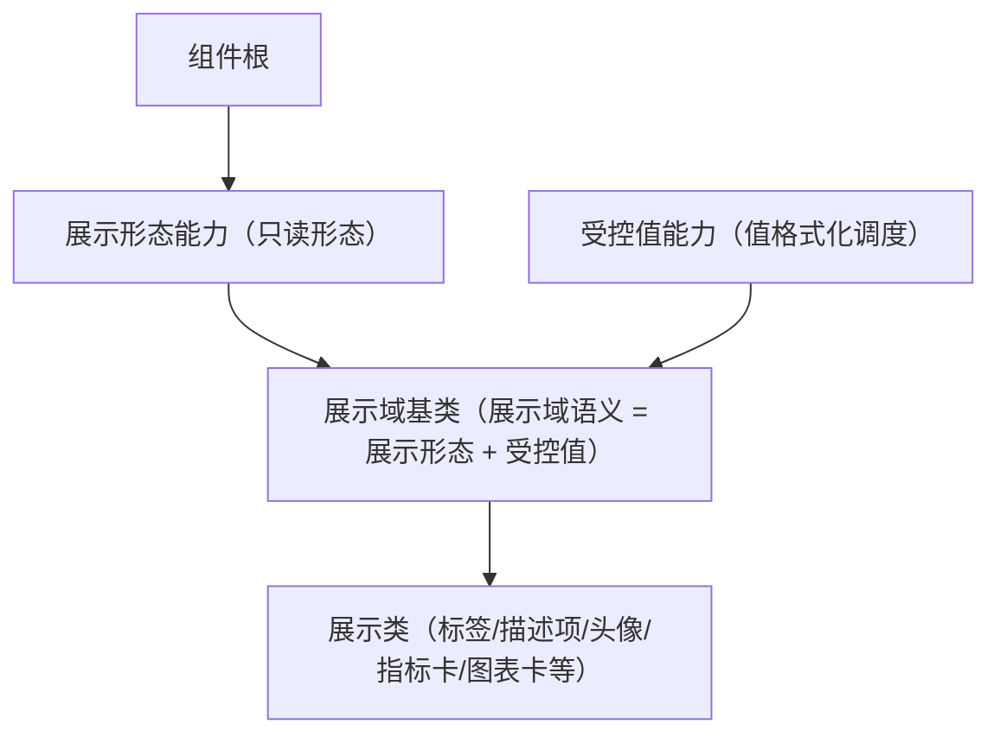

# 组件设计 · 展示形态能力

> 只读展示形态语义能力：密度与令牌 / 空值占位 / 超长省略与悬浮提示 / 只读不校验，可组合交互
> 实现侧命名与落点见《[前端基类清单](../../../../../前端基类清单.md)》（§2.1 全量基类登记表；继承链全系统唯一一份），实现契约细节见项目详细设计。

[文档首页](../../../../../文档首页.md) › [项目规划说明](../../../../../规划/项目规划说明.md) › [组件设计](../../../01_组件设计_总览.md) › 展示形态能力　|　[← 输入形态能力](../02_组件设计_输入形态能力/02_组件设计_输入形态能力.md)　[容器能力 →](../04_组件设计_容器能力/04_组件设计_容器能力.md)

> 可交互原型：[03_原型设计_展示形态能力.html](03_原型设计_展示形态能力.html)（演示只读形态、密度/令牌、空值占位、超长省略与悬浮提示；与受控值能力的值格式化、展示域基类的区别）

## 1. 目的与适用范围 

定义 BMS 前端**展示形态能力**的组件设计：为**所有只读展示组件**（标签、描述项、头像、指标卡、表格单元格、图表卡等）提供**通用只读形态**——密度、主题令牌、空值占位、超长省略与悬浮提示。它是继承链上的能力域基类 **`BaseDisplay`**（父基类 `BaseValue`，被上位基类继承、由具体组件实现；落点见《[前端基类清单](../../../../../前端基类清单.md)》§2.1）。

### 1.1 定位（与受控值、展示域的区别） 

- **展示形态能力 只管"只读展示长什么样"**：密度、令牌、空值占位、省略/悬浮提示；**不含**值格式化编排（金额/日期/枚举文本等）。
- **值格式化**由 [受控值能力](../../02_能力类/08_组件设计_受控值能力/08_组件设计_受控值能力.md) 与 [基础类「格式化工具」](../../../09_基础类/03_组件设计_格式化工具/03_组件设计_格式化工具.md) 提供；**展示域细化**归 [展示域基类](../../03_域基类/02_组件设计_展示域基类/02_组件设计_展示域基类.md)（展示族基类是继承链上的能力域基类，承载展示形态与值语义）。

上游依据：[《前端开发规范》](../../../../../规范/前端开发规范.md)（「前端基类体系」节）、[《布局设计 · 设计令牌》](../../../../布局设计/02_布局设计_设计令牌.html)（展示令牌/密度）、[《布局设计 · 表格明细》](../../../../布局设计/09_布局设计_表格明细.html)（只读渲染）。

> 本篇为 **基础组件类 · 能力「展示形态能力」**。**范围边界**：通用能力归 组件根；值语义归 受控值能力；展示域细化归 展示域基类；空状态（整块无数据）归 [展示类「异常与空状态」](../../../07_展示类/05_组件设计_异常与空状态/05_组件设计_异常与空状态.md)。

## 2. 职责与组成 

| 组成部分 | 职责 |
| --- | --- |
| 展示形态能力核心 | 只读形态语义：密度、令牌、空值占位、省略/悬浮提示 |
| 组件包装（按需） | 只读展示渲染：占位、省略与悬浮提示，按需提供 |
| 能力内聚件（按需） | 悬浮提示等展示内聚件（按需） |

- **继承方式**：本基类是**继承链上的能力域基类** `BaseDisplay`（父基类 `BaseValue`）；上位经继承取得其语义、不在链外自由挂接（父基类与落点见《[前端基类清单](../../../../../前端基类清单.md)》§2.1；口径见[《前端开发规范》](../../../../../规范/前端开发规范.md)「架构铁律」与 §3.4）。

## 3. 交互与契约语义 

| 语义项 | 说明 |
| --- | --- |
| 密度 | `compact` / `default` / `loose` 三态（默认继承上下文） |
| 空值占位 | 空值统一占位文案（默认 `—`，可配） |
| 超长省略 | 超长内容省略（可配） |
| 悬浮提示 | 省略时悬浮显示完整值（默认仅溢出时） |
| 可点击 | 只读形态可组合交互能力；点击语义归交互能力 |
| 插槽 | 默认内容与自定义空值；可点击时对外通知点击 |

## 4. 行为语义 

| 项 | 设计 |
| --- | --- |
| 只读 | 不接收受控值、不参与校验；需要交互时组合 交互能力 |
| 空值 | `null`/`undefined`/`''`/`[]`/`{}` 显示统一占位；**`0`/`false` 不为空** |
| 密度 | 由上下文（表格/表单/用户偏好）决定，映射设计令牌 |
| 令牌 | 颜色/字号/间距只消费令牌，随主题与品牌自动适配 |
| 省略/悬浮提示 | 超长省略 + 悬浮完整值；表格默认溢出才提示 |
| 空值 vs 空状态 | 单元格/字段空值用占位；整块无数据用空状态组件 |

## 5. 场景集成 

| 场景 | 说明 |
| --- | --- |
| 展示类 | 标签/描述项/头像/指标卡经展示域基类取得展示语义 |
| 表格单元格 | 只读列渲染 |
| 字段只读回显 | 与受控值语义组合（展示域基类） |

## 6. 依赖接口与上游变更 

### 6.1 上游接口与口径 

| 项 | 说明 | 目标文档 |
| --- | --- | --- |
| 分层权威 | 能力（展示形态能力）职责 | [《前端开发规范》](../../../../../规范/前端开发规范.md)「前端基类体系」节（登记项①） |
| 只读渲染 | 单元格/描述展示口径 | [《布局设计 · 表格明细》](../../../../布局设计/09_布局设计_表格明细.html)（登记项②） |
| 展示令牌与密度 | 密度/字号/色令牌 | [《布局设计 · 设计令牌》](../../../../布局设计/02_布局设计_设计令牌.html)（登记项③） |
| 新增依赖 | **无** | — |

### 6.2 需登记的上游变更 

| 变更点 | 目标文档 | 内容 |
| --- | --- | --- |
| ① 展示形态能力契约 | [《前端开发规范》](../../../../../规范/前端开发规范.md)「前端基类体系」节 | 明确展示形态能力只负责只读形态（密度/令牌/空值/省略），值格式化归受控值能力、域细化归展示域基类 |
| ② 只读展示口径 | [《布局设计 · 表格明细》](../../../../布局设计/09_布局设计_表格明细.html)「只读渲染」节 | 明确单元格空值占位 `—`、省略与悬浮提示、密度 |
| ③ 展示令牌与密度 | [《布局设计 · 设计令牌》](../../../../布局设计/02_布局设计_设计令牌.html)「展示令牌」节 | 明确展示组件密度（compact/default/loose）与令牌映射 |

> 按[《文档生成规范》](../../../../../规范/文档生成规范.md)「引用与追溯」节，上述变更需用户确认后由上游文档同步；本节点只定义展示形态能力语义与契约。

## 7. 权限 / i18n / 移动端 

- **权限**：展示值可见性由字段权限/数据范围决定（[字段权限能力](../../02_能力类/11_组件设计_字段权限能力/11_组件设计_字段权限能力.md)），本能力不判权限；脱敏由字段权限能力的脱敏语义处理。
- **i18n**：占位文案经全局语言能力取词。
- **移动端**：PC 与移动端为同一契约的多实现（同一套契约断言保障）；展示语义一致，密度适配触屏。

## 8. 性能与边界 

| 场景 | 设计 |
| --- | --- |
| 渲染 | 纯文本轻量；悬浮提示按需挂载 |
| 大表格 | 单元格渲染可缓存，避免重组件 |
| 边界 | 空值判定差异、省略与悬浮提示冲突、密度上下文缺失、令牌缺失回退、脱敏不可复制明文 |
| 不支持 | 通用能力（组件根）、值格式化（受控值能力）、展示域细化（展示域基类）、空状态、权限 |

## 9. 检查清单 

- □ 契约语义：密度/空值占位/超长省略/悬浮提示/可点击
- □ 空值统一占位且 `0`/`false` 不为空；省略/悬浮提示；令牌消费
- □ 只读不校验；需要交互时组合 交互能力；空值 vs 空状态分工清晰
- □ 与 受控值能力 值语义、展示域基类 边界清晰
- □ 权限/i18n/移动端符合第 7 节；性能边界符合第 8 节
- □ 三项上游登记已确认

> 组件设计节点（展示形态能力）· 与[《前端开发规范》](../../../../../规范/前端开发规范.md)[《布局设计 · 设计令牌》](../../../../布局设计/02_布局设计_设计令牌.html)[《布局设计 · 表格明细》](../../../../布局设计/09_布局设计_表格明细.html)[组件根基类](../../01_机制基类/02_组件设计_组件根基类/02_组件设计_组件根基类.md)[输入形态能力](../02_组件设计_输入形态能力/02_组件设计_输入形态能力.md)[容器能力](../04_组件设计_容器能力/04_组件设计_容器能力.md)[受控值能力](../../02_能力类/08_组件设计_受控值能力/08_组件设计_受控值能力.md)[展示域基类](../../03_域基类/02_组件设计_展示域基类/02_组件设计_展示域基类.md)[展示类「异常与空状态」](../../../07_展示类/05_组件设计_异常与空状态/05_组件设计_异常与空状态.md)《命名规范》配套
