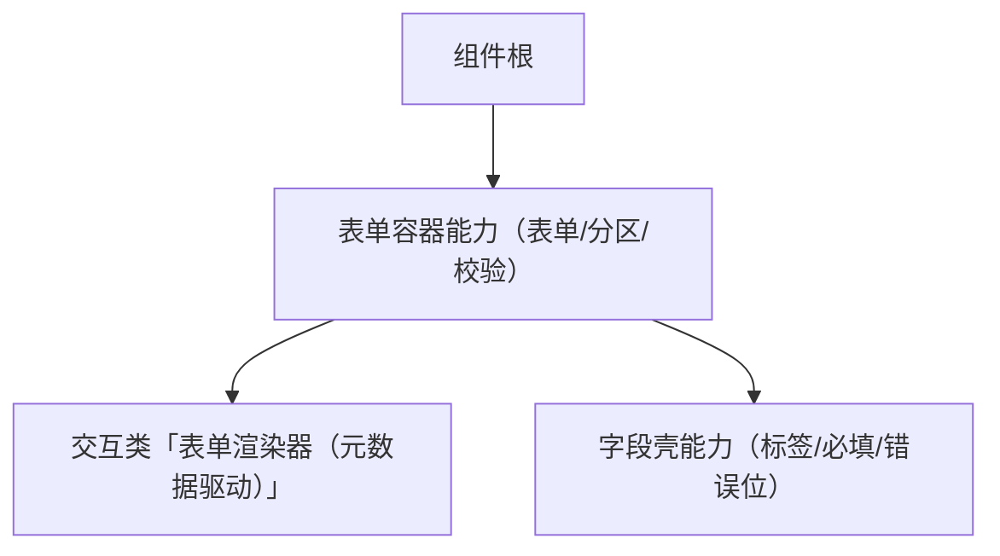

# 组件设计 · 表单容器能力

> 表单容器语义能力：标签位置与宽度 / 栅格列数 / 规则汇总 / 校验与重置 / 错误汇总与滚动定位 / 只读态
> 实现侧命名与落点见《[前端基类清单](../../../../../前端基类清单.md)》（§2.1 全量基类登记表；继承链全系统唯一一份），实现契约细节见项目详细设计。

[文档首页](../../../../../文档首页.md) › [项目规划说明](../../../../../规划/项目规划说明.md) › [组件设计](../../../01_组件设计_总览.md) › 表单容器能力　|　[← 容器能力](../04_组件设计_容器能力/04_组件设计_容器能力.md)　[媒体能力 →](../06_组件设计_媒体能力/06_组件设计_媒体能力.md)

> 可交互原型：[05_原型设计_表单容器能力.html](05_原型设计_表单容器能力.html)（演示标签位置/宽度、栅格列数、规则汇总、校验/重置/清除校验、错误汇总与滚动定位、只读态）

## 1. 目的与适用范围 

定义 BMS 前端**表单容器能力**的组件设计：为**表单/分区容器**提供公共能力——标签位置与宽度、栅格列数、校验规则汇总、校验/重置/清除校验、错误汇总与滚动定位、只读态。它是继承链上的**表单容器基类**（父基类 校验能力基类，被上位基类继承、由具体组件实现；落点见《[前端基类清单](../../../../../前端基类清单.md)》§2.1）。

### 1.1 定位 

| 职责 | 归属 |
| --- | --- |
| 标签位置/宽度、栅格列数、规则汇总、校验/重置、错误汇总与滚动定位、只读态 | **本节点（表单容器能力）** |
| 字段级控件与值绑定 | 输入组件基类 输入组件基类 / 值基类 值能力基类 / 字段基类 字段能力基类 |
| 字段外层（标签/必填/错误位） | [字段壳能力](../../02_能力类/10_组件设计_字段壳能力/10_组件设计_字段壳能力.md) |
| 元数据驱动渲染（分区/明细/提交） | [交互类「表单渲染器」](../../../08_交互类/12_组件设计_表单渲染器/12_组件设计_表单渲染器.md) |
| 服务端动态校验 | [《概要设计 · 表单定制》](../../../../概要设计/36_概要设计_表单定制.md) |

上游依据：[《前端开发规范》](../../../../../规范/前端开发规范.md)（「前端基类体系」节、组件契约）、[《布局设计 · 表单页》](../../../../布局设计/08_布局设计_表单页.html)（校验与提交、只读/编辑分态）、[《概要设计 · 表单定制》](../../../../概要设计/36_概要设计_表单定制.md)（服务端动态校验）。

> 本篇为 **基础组件类 · 能力「表单容器能力」**。**范围边界**：元数据取数与控件分发归 [表单渲染器](../../../08_交互类/12_组件设计_表单渲染器/12_组件设计_表单渲染器.md)；字段壳归 字段壳能力；具体控件归 输入组件基类 输入组件基类 与 基础控件类/字段类。

## 2. 职责与组成 

| 组成部分 | 职责 |
| --- | --- |
| 表单容器能力核心 | 表单容器语义：标签位置、栅格、规则汇总、校验/重置、错误定位、只读态 |
| 组件包装（按需） | 表单/分区渲染：标签布局、栅格与操作区，按需提供 |
| 校验协作（按需） | 与字段壳/字段编排协作：规则汇总、校验代理与错误定位 |

- **继承方式**：本基类是**继承链上的表单容器基类**（父基类 校验能力基类）；上位经继承取得其语义、不在链外自由挂接（父基类与落点见《[前端基类清单](../../../../../前端基类清单.md)》§2.1；口径见[《前端开发规范》](../../../../../规范/前端开发规范.md)「架构铁律」与 §3.4）。

## 3. 交互与契约语义 

| 语义项 | 说明 |
| --- | --- |
| 表单数据 | 表单数据模型（受控） |
| 校验规则 | 字段/元数据规则汇总（服务端动态校验由提交时兜底） |
| 标签位置 | `left` / `right` / `top` 三态（默认右置；窄容器与移动端置顶） |
| 标签宽度 | 默认取表单/主题值 |
| 栅格列数 | 1 / 2 / 3 列（默认 3；响应式断点可覆写） |
| 只读态 | 全字段只读（纯文本/禁用控件由字段壳决定） |
| 全局禁用 | 可全局禁用 |
| 事件语义 | 校验结果、提交、重置完成后对外通知 |
| 校验操作 | 校验、按字段校验、重置、清除校验、滚动到首个错误字段 |

## 4. 行为语义 

| 项 | 设计 |
| --- | --- |
| 规则汇总 | 字段/元数据规则汇总到容器；后端动态校验由提交时兜底 |
| 校验 | 校验汇总结果并按失败字段定位滚动；清除校验清错误 |
| 重置 | 复位初始值（编辑态复位到拉取值） |
| 只读态 | 全字段只读（不区分字段可编辑性，见 [字段权限能力](../../02_能力类/11_组件设计_字段权限能力/11_组件设计_字段权限能力.md)） |
| 栅格 | 主表 3 列、窄容器单列、长字段跨整行；标签位置随断点 |
| 提交 | 与渲染器/页面协作，保存加载态防重复；整表单事务由使用方保证 |

## 5. 场景集成 

| 场景 | 说明 |
| --- | --- |
| 表单页 | 主表分区（配合 [表单渲染器](../../../08_交互类/12_组件设计_表单渲染器/12_组件设计_表单渲染器.md)） |
| 弹窗/抽屉表单 | 窄容器单列表单（配合 交互类「弹窗抽屉表单」） |
| 查询筛选区 | 查询条件的轻量表单容器 |

## 6. 依赖接口与上游变更 

### 6.1 上游接口与口径 

| 项 | 说明 | 目标文档 |
| --- | --- | --- |
| 分层权威 | 能力（表单容器能力）职责 | [《前端开发规范》](../../../../../规范/前端开发规范.md)「前端基类体系」节（登记项①） |
| 校验与提交 | 前端校验与提交、只读分态 | [《布局设计 · 表单页》](../../../../布局设计/08_布局设计_表单页.html)（登记项②） |
| 动态校验 | 服务端动态校验一致性 | [《概要设计 · 表单定制》](../../../../概要设计/36_概要设计_表单定制.md)（登记项③） |
| 新增依赖 | **无**（核心能力框架无关；表单渲染按需实现） | — |

### 6.2 需登记的上游变更 

| 变更点 | 目标文档 | 内容 |
| --- | --- | --- |
| ① 表单容器能力契约 | [《前端开发规范》](../../../../../规范/前端开发规范.md)「前端基类体系」节 | 明确表单容器能力：标签位置/宽度、栅格、规则汇总、校验/重置/清除校验、错误定位、只读态 |
| ② 校验与提交 | [《布局设计 · 表单页》](../../../../布局设计/08_布局设计_表单页.html)「校验与提交」节 | 明确错误汇总与滚动定位、只读态、栅格与标签位置 |
| ③ 服务端动态校验 | [《概要设计 · 表单定制》](../../../../概要设计/36_概要设计_表单定制.md)「服务端动态校验」节 | 前端规则与后端一致、后端强制；错误返回结构供定位 |

> 按[《文档生成规范》](../../../../../规范/文档生成规范.md)「引用与追溯」节，上述变更需用户确认后由上游文档同步；本节点只定义表单容器能力语义与契约。

## 7. 权限 / i18n / 移动端 

- **权限**：字段权限由 [字段权限能力](../../02_能力类/11_组件设计_字段权限能力/11_组件设计_字段权限能力.md) 判定后传入（不渲染/禁用）。
- **i18n**：错误文案按错误码映射（i18n）。
- **移动端**：PC 与移动端为同一契约的多实现（同一套契约断言保障）；单列、标签置顶、操作按钮吸附。

## 8. 性能与边界 

| 场景 | 设计 |
| --- | --- |
| 校验 | 规则汇总一次构建；异步校验并发；失败定位滚动 |
| 大表单 | 分区懒渲染；重字段懒加载 |
| 边界 | 规则与元数据不同步、异步唯一性校验竞态、版本冲突、只读态与字段可编辑性混淆、错误定位失效、重置初始值来源、跨分区校验 |
| 不支持 | 元数据取数/分发（表单元数据能力）、字段壳（字段壳能力）、控件（输入形态能力/受控值能力/字段编排能力/输入域基类）、后端强校验 |

## 9. 检查清单 

- □ 契约语义：表单数据/校验规则/标签位置/标签宽度/栅格列数/只读态/全局禁用
- □ 校验操作：校验/按字段校验/重置/清除校验/滚动到错误
- □ 规则汇总、错误汇总与滚动定位、只读态、栅格与标签位置
- □ 与 表单渲染器、字段壳能力 边界清晰
- □ 权限/i18n/移动端符合第 7 节；性能边界符合第 8 节
- □ 三项上游登记已确认

> 组件设计节点（表单容器能力）· 与[《前端开发规范》](../../../../../规范/前端开发规范.md)[《布局设计 · 表单页》](../../../../布局设计/08_布局设计_表单页.html)[《概要设计 · 表单定制》](../../../../概要设计/36_概要设计_表单定制.md)[组件根基类](../../01_机制基类/02_组件设计_组件根基类/02_组件设计_组件根基类.md)[容器能力](../04_组件设计_容器能力/04_组件设计_容器能力.md)[媒体能力](../06_组件设计_媒体能力/06_组件设计_媒体能力.md)[字段壳能力](../../02_能力类/10_组件设计_字段壳能力/10_组件设计_字段壳能力.md)[交互类「表单渲染器」](../../../08_交互类/12_组件设计_表单渲染器/12_组件设计_表单渲染器.md)《命名规范》配套
