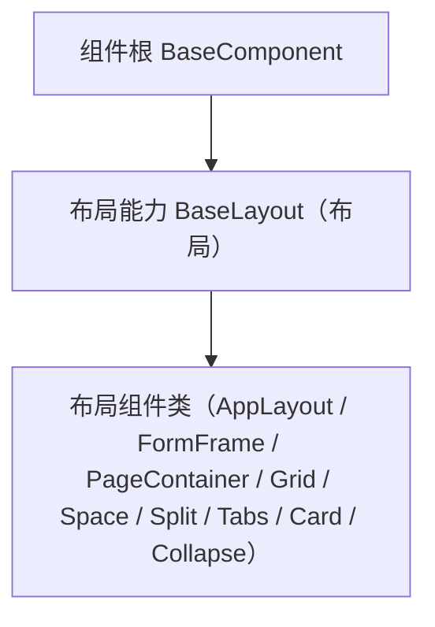

# 组件设计 · 布局能力

> `BaseLayout`（核心能力类，key `layout`，`depends: design-token`；`frontend/packages/core/src/capabilities/layout.ts`，登记 `capabilities/manifest.ts`）· 无 Vue 投影（按需回补）；`BaseLayout.vue` 组件包装为按需形态（历史未落码），按需随回补波重建

[文档首页](../../../../../文档首页.md) › [项目规划说明](../../../../../规划/项目规划说明.md) › [组件设计](../../../01_组件设计_总览.md) › 布局能力　|　[← 媒体能力](../06_组件设计_媒体能力/06_组件设计_媒体能力.md)　[受控值能力 →](../../02_能力类/08_组件设计_受控值能力/08_组件设计_受控值能力.md)

> 可交互原型：[07_原型设计_布局能力.html](07_原型设计_布局能力.html)（演示栅格/断点、间距/对齐、布局容器根元素与透传，供 布局组件类组合消费）

## 1. 目的与适用范围 

定义 BMS 前端 `frontend/packages/*`（核心 `frontend/packages/core` + 按需的 Vue 投影 `frontend/packages/vue`；渲染插件 `ui-ep` / `ui-vant` 按需）**布局能力（原「布局能力」）**的组件设计：核心能力类 `BaseLayout`（`frontend/packages/core/src/capabilities/layout.ts`，登记 `capabilities/manifest.ts`；`depends: design-token`）（+ 按需的 Vue 投影），为**所有布局组件**（主框架布局壳、表单框架壳、页面容器、栅格、间距/分割线、分栏、内容页签、卡片、折叠面板等）提供公共能力——栅格与响应式断点、间距/对齐令牌、布局根元素与 attrs 透传、显示/隐藏。它是组件设计体系**能力**，继承 [组件根基类](../../01_机制基类/02_组件设计_组件根基类/02_组件设计_组件根基类.md)。

### 1.1 定位 

| 职责 | 归属 |
| --- | --- |
| 栅格/断点、间距/对齐令牌、布局根元素与透传、显隐 | **本节点（布局能力）** |
| 通用字段/方法（日志/配置/i18n/生命周期） | [根系基类](../../01_机制基类/01_组件设计_根系基类/01_组件设计_根系基类.md) |
| 透传/尺寸/密度/主题/i18n/可访问性 | [组件根基类](../../01_机制基类/02_组件设计_组件根基类/02_组件设计_组件根基类.md) |
| 容器语义（滚动/懒加载/虚拟等） | [容器能力](../04_组件设计_容器能力/04_组件设计_容器能力.md) |
| 具体布局组件 | 布局组件类 |

上游依据：[《前端开发规范》](../../../../../规范/前端开发规范.md)「前端基类体系」节（§3.4 继承与组合分工）、[《布局设计 · 设计令牌》](../../../../布局设计/02_布局设计_设计令牌.html)（栅格/断点/间距令牌）、[《布局设计 · 响应式适配》](../../../../布局设计/11_布局设计_响应式适配.html)（断点）。

> 本篇为 **基础组件类 · 能力「布局能力」**。**范围边界**：通用能力归 根系/组件根；容器语义归 容器能力/表单容器能力；具体布局组件归 布局组件类（本能力被其组合消费）。

## 2. 组件清单与职责 

| 组件 / 工具 | 位置 | 职责 |
| --- | --- | --- |
| `BaseLayout`（核心能力类，key `layout`，`depends: design-token`） | `frontend/packages/core/src/capabilities/layout.ts`（登记 `capabilities/manifest.ts`） | 布局形态：栅格与断点、间距/对齐、布局根元素与透传、显隐 |
| `BaseLayout.vue`（可选组件包装） | 按需形态（历史未落码） | 按需随回补波按「核心类 + 投影（+ 插件包装）」重建 |

> **实现口径（2026-09-17，新体系）**：原「布局能力」（旧 `useLayout` 组合式）已类化为核心能力类 `BaseLayout`（`frontend/packages/core/src/capabilities/layout.ts`，继承 `BaseCapability`，登记 `capabilities/manifest.ts`；依赖 `design-token` 单向下沉）；本能力暂无 Vue 投影（按需回补，`useXxx` 只落 `frontend/packages/vue/src/bindings/`），`BaseLayout.vue` 组件包装为按需形态（历史未落码）；旧实现（原 `useXxx` 组合式）已随旧层删除（历史经 git 追溯）。`depends` 由能力机制开发态校验（单向、无循环）；契约语义（Props / 能力项 / 行为规则）保持不变。

## 3. 契约（Props 与能力） 

| 属性 | 类型 | 默认 | 说明 |
| --- | --- | --- | --- |
| `span` | number \| object | 24 | 栅格跨度（响应式可传 `{ xs, sm, md, lg, xl }`） |
| `offset` | number | 0 | 偏移 |
| `gap` | 'none' \| 'small' \| 'default' \| 'large' | 'default' | 间距（令牌） |
| `align` | 'start' \| 'center' \| 'end' \| 'stretch' | 'stretch' | 交叉轴对齐 |
| `justify` | 'start' \| 'center' \| 'end' \| 'space-between' \| 'space-around' | 'start' | 主轴对齐 |
| `wrap` | boolean | true | 换行 |
| `responsive` | boolean | true | 启用断点响应 |

| 能力 | 说明 |
| --- | --- |
| 断点 | 监听断点（xs/sm/md/lg/xl），按令牌切换跨度/方向/标签位置（断点值由渲染插件写入核心，核心不做 DOM 监听） |
| 令牌 | 间距/对齐/尺寸只消费设计令牌（经依赖能力 `design-token` / `BaseDesignToken`） |
| 根元素 | 单根元素 + attrs 透传（继承 组件根） |
| 显隐 | `visible` 控制渲染（继承 组件根） |

## 4. 行为与实现约定 

| 项 | 设计 |
| --- | --- |
| 栅格 | 24 栅格 + `span/offset`；响应式对象按断点取跨度 |
| 断点 | 与[《布局设计 · 响应式适配》](../../../../布局设计/11_布局设计_响应式适配.html)一致；窄屏自动转单列/纵向 |
| 间距/对齐 | 令牌驱动，避免硬编码 px |
| 嵌套 | 支持布局嵌套；避免过深（建议 ≤3 层） |
| 依赖方向 | 只依赖 根系/组件根 与登记依赖 `design-token`；被 布局组件类 按组合轨消费（能力 + 投影） |

## 5. 场景集成 

| 场景 | 说明 |
| --- | --- |
| 布局组件类 | 主框架/表单框架/页面容器/栅格/分栏/卡片等组合本能力 |
| 响应式页面 | 断点驱动的列数与方向切换 |

## 6. 依赖接口与上游变更 

### 6.1 上游接口与口径 

| 项 | 说明 | 目标文档 |
| --- | --- | --- |
| 分层权威 | 能力（布局能力）职责 | [《前端开发规范》](../../../../../规范/前端开发规范.md)「前端基类体系」节（登记项①） |
| 栅格/断点令牌 | 栅格、断点、间距令牌 | [《布局设计 · 设计令牌》](../../../../布局设计/02_布局设计_设计令牌.html)（登记项②） |
| 响应式断点 | 断点定义与策略 | [《布局设计 · 响应式适配》](../../../../布局设计/11_布局设计_响应式适配.html)（登记项③） |
| 新增依赖 | **无**（核心能力类框架无关；栅格渲染由渲染插件按需，`ui-ep` 可复用 `el-row`/`el-col`） | — |

### 6.2 需登记的上游变更 

| 变更点 | 目标文档 | 内容 |
| --- | --- | --- |
| ① 布局能力契约 | [《前端开发规范》](../../../../../规范/前端开发规范.md)「前端基类体系」节 | 能力新增**布局**一类（`BaseLayout`，key `layout`）：栅格/断点、间距/对齐令牌、布局根元素与透传；布局组件类组合消费 |
| ② 栅格与断点令牌 | [《布局设计 · 设计令牌》](../../../../布局设计/02_布局设计_设计令牌.html)「栅格与间距令牌」节 | 明确 24 栅格、断点（xs/sm/md/lg/xl）与间距令牌，布局组件只消费令牌 |
| ③ 响应式断点 | [《布局设计 · 响应式适配》](../../../../布局设计/11_布局设计_响应式适配.html)「断点」节 | 明确断点阈值与窄屏布局策略，供布局能力消费 |

> 按[《文档生成规范》](../../../../../规范/文档生成规范.md)「引用与追溯」节，上述变更需用户确认后由上游文档同步。

## 7. 权限 / i18n / 移动端 

- **权限**：布局不做权限判定；区域内动作按动作权限显示。
- **i18n**：布局内文案由使用方提供。
- **移动端**：`ui-vant` 为同一契约的另一实现（契约套件同一套断言）；断点驱动单列/纵向；安全区适配。

## 8. 性能与边界 

| 场景 | 设计 |
| --- | --- |
| 渲染 | 薄能力类；断点监听去抖（监听在渲染插件侧） |
| 边界 | 嵌套过深、断点抖动、响应式跨度与容器列数冲突、间距令牌缺失回退、多根元素透传 |
| 不支持 | 容器语义（容器能力/表单容器能力）、具体布局组件（布局组件类）、字段/展示语义 |

## 9. 检查清单 

- □ 契约：`span`/`offset`/`gap`/`align`/`justify`/`wrap`/`responsive`
- □ 断点与栅格、间距/对齐令牌、根元素透传与显隐
- □ 继承 根系/组件根，被 布局组件类组合消费；依赖方向单向（`depends` 登记校验）
- □ 权限/i18n/移动端符合第 7 节；边界符合第 8 节
- □ 三项上游登记已确认

> 组件设计节点（布局能力）· 与[《前端开发规范》](../../../../../规范/前端开发规范.md)[《布局设计 · 设计令牌》](../../../../布局设计/02_布局设计_设计令牌.html)[《布局设计 · 响应式适配》](../../../../布局设计/11_布局设计_响应式适配.html)[组件根基类](../../01_机制基类/02_组件设计_组件根基类/02_组件设计_组件根基类.md)[容器能力](../04_组件设计_容器能力/04_组件设计_容器能力.md)[受控值能力](../../02_能力类/08_组件设计_受控值能力/08_组件设计_受控值能力.md)《命名规范》配套
