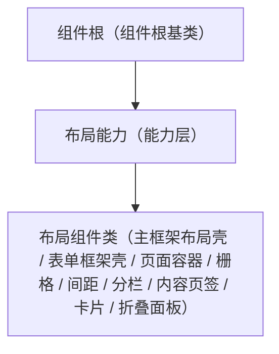

# 组件设计 · 布局能力

> 布局组件的公共能力：栅格与响应式断点、间距/对齐令牌、布局根元素与属性透传、显隐
> 实现侧命名与落点见《[前端基类清单](../../../../../前端基类清单.md)》（「能力」节），实现契约细节见项目详细设计。

[文档首页](../../../../../文档首页.md) › [项目规划说明](../../../../../规划/项目规划说明.md) › [组件设计](../../../01_组件设计_总览.md) › 布局能力　|　[← 媒体能力](../06_组件设计_媒体能力/06_组件设计_媒体能力.md)　[受控值能力 →](../../02_能力类/08_组件设计_受控值能力/08_组件设计_受控值能力.md)

> 可交互原型：[07_原型设计_布局能力.html](07_原型设计_布局能力.html)（演示栅格/断点、间距/对齐、布局容器根元素与透传，供布局组件类组合消费）

## 1. 目的与适用范围 

定义 BMS 前端**布局能力**的组件设计：为**所有布局组件**（主框架布局壳、表单框架壳、页面容器、栅格、间距/分割线、分栏、内容页签、卡片、折叠面板等）提供公共能力——栅格与响应式断点、间距/对齐令牌、布局根元素与属性透传、显示/隐藏。它是组件设计体系**能力层**（继承链上的一层），继承 [组件根基类](../../01_机制基类/02_组件设计_组件根基类/02_组件设计_组件根基类.md)。

### 1.1 定位与职责边界 

| 职责 | 归属 |
| --- | --- |
| 栅格/断点、间距/对齐令牌、布局根元素与透传、显隐 | **本节点（布局能力）** |
| 通用字段/方法（日志/配置/i18n/生命周期） | [根系基类](../../01_机制基类/01_组件设计_根系基类/01_组件设计_根系基类.md) |
| 透传/尺寸/密度/主题/i18n/可访问性 | [组件根基类](../../01_机制基类/02_组件设计_组件根基类/02_组件设计_组件根基类.md) |
| 容器语义（滚动/懒加载/虚拟等） | [容器能力](../04_组件设计_容器能力/04_组件设计_容器能力.md) |
| 具体布局组件 | 布局组件类（沿继承链派生） |

上游依据：[《前端开发规范》](../../../../../规范/前端开发规范.md)「前端基类体系」节（§3.4 继承与组合分工）、[《布局设计 · 设计令牌》](../../../../布局设计/02_布局设计_设计令牌.html)（栅格/断点/间距令牌）、[《布局设计 · 响应式适配》](../../../../布局设计/11_布局设计_响应式适配.html)（断点）。

> 本篇为 **基础组件类 · 能力「布局能力」**。**范围边界**：通用能力归 根系/组件根；容器语义归 容器能力/表单容器能力；具体布局组件归 布局组件类（本能力被其组合消费）。

## 2. 职责与组成 

| 组成部分 | 职责 |
| --- | --- |
| 布局能力核心 | 布局形态：栅格与断点、间距/对齐、布局根元素与透传、显隐；依赖设计令牌能力（单向） |
| 组件包装（按需） | 包装形态按需评估（能力核心 + 组件包装两层） |

## 3. 交互与契约语义 

| 语义项 | 说明 |
| --- | --- |
| 栅格跨度与偏移 | 24 栅格；支持跨度与偏移；响应式可按断点对象取值（xs / sm / md / lg / xl） |
| 间距 | 令牌档位：none / small / default / large |
| 对齐 | 交叉轴：start / center / end / stretch；主轴：start / center / end / space-between / space-around |
| 换行与断点响应 | 可控制换行；可启用断点响应 |
| 断点 | 按断点切换跨度 / 方向 / 标签位置；断点值由渲染侧按令牌提供 |
| 令牌 | 间距 / 对齐 / 尺寸只消费设计令牌（依赖设计令牌能力） |
| 根元素与透传 | 单根元素 + 属性透传（继承组件根） |
| 显隐 | `visible` 控制渲染（继承组件根） |

## 4. 行为语义 

| 项 | 设计 |
| --- | --- |
| 栅格 | 24 栅格 + 跨度/偏移；响应式对象按断点取跨度 |
| 断点 | 与[《布局设计 · 响应式适配》](../../../../布局设计/11_布局设计_响应式适配.html)一致；窄屏自动转单列/纵向 |
| 间距/对齐 | 令牌驱动，避免硬编码 |
| 嵌套 | 支持布局嵌套；避免过深（建议 ≤3 层） |
| 依赖方向 | 只依赖 根系/组件根 与登记依赖（设计令牌能力，单向）；被布局组件类沿继承链消费 |

## 5. 场景集成 

| 场景 | 说明 |
| --- | --- |
| 布局组件类 | 主框架/表单框架/页面容器/栅格/分栏/卡片等组合消费本能力 |
| 响应式页面 | 断点驱动的列数与方向切换 |

## 6. 依赖接口与上游变更 

### 6.1 上游接口与口径 

| 项 | 说明 | 目标文档 |
| --- | --- | --- |
| 分层权威 | 能力（布局能力）职责 | [《前端开发规范》](../../../../../规范/前端开发规范.md)「前端基类体系」节（登记项①） |
| 栅格/断点令牌 | 栅格、断点、间距令牌 | [《布局设计 · 设计令牌》](../../../../布局设计/02_布局设计_设计令牌.html)（登记项②） |
| 响应式断点 | 断点定义与策略 | [《布局设计 · 响应式适配》](../../../../布局设计/11_布局设计_响应式适配.html)（登记项③） |
| 新增依赖 | **无**：复用既有设计令牌与栅格基础件 | — |

### 6.2 需登记的上游变更 

| 变更点 | 目标文档 | 内容 |
| --- | --- | --- |
| ① 布局能力契约 | [《前端开发规范》](../../../../../规范/前端开发规范.md)「前端基类体系」节 | 能力新增**布局**一类：栅格/断点、间距/对齐令牌、布局根元素与透传；布局组件类组合消费 |
| ② 栅格与断点令牌 | [《布局设计 · 设计令牌》](../../../../布局设计/02_布局设计_设计令牌.html)「栅格与间距令牌」节 | 明确 24 栅格、断点（xs/sm/md/lg/xl）与间距令牌，布局组件只消费令牌 |
| ③ 响应式断点 | [《布局设计 · 响应式适配》](../../../../布局设计/11_布局设计_响应式适配.html)「断点」节 | 明确断点阈值与窄屏布局策略，供布局能力消费 |

> 按[《文档生成规范》](../../../../../规范/文档生成规范.md)「引用与追溯」节，上述变更需用户确认后由上游文档同步。

## 7. 权限 / i18n / 移动端 

- **权限**：布局不做权限判定；区域内动作按动作权限显示。
- **i18n**：布局内文案由使用方提供。
- **移动端**：移动端为同一契约的另一实现（同一套契约断言保障）；断点驱动单列/纵向；安全区适配。

## 8. 性能与边界 

| 场景 | 设计 |
| --- | --- |
| 渲染 | 布局能力为轻量层；断点监听去抖 |
| 边界 | 嵌套过深、断点抖动、响应式跨度与容器列数冲突、间距令牌缺失回退、多根元素透传 |
| 不支持 | 容器语义（容器能力/表单容器能力）、具体布局组件（布局组件类）、字段/展示语义 |

## 9. 检查清单 

- □ 契约语义：栅格跨度/偏移、间距/对齐令牌、换行与断点响应、根元素透传与显隐
- □ 断点与栅格、间距/对齐令牌、根元素透传与显隐
- □ 继承 根系/组件根，被布局组件类组合消费；依赖方向单向（依赖登记校验）
- □ 权限/i18n/移动端符合第 7 节；边界符合第 8 节
- □ 三项上游登记已确认

> 组件设计节点（布局能力）· 与[《前端开发规范》](../../../../../规范/前端开发规范.md)[《布局设计 · 设计令牌》](../../../../布局设计/02_布局设计_设计令牌.html)[《布局设计 · 响应式适配》](../../../../布局设计/11_布局设计_响应式适配.html)[组件根基类](../../01_机制基类/02_组件设计_组件根基类/02_组件设计_组件根基类.md)[容器能力](../04_组件设计_容器能力/04_组件设计_容器能力.md)[受控值能力](../../02_能力类/08_组件设计_受控值能力/08_组件设计_受控值能力.md)《命名规范》配套
