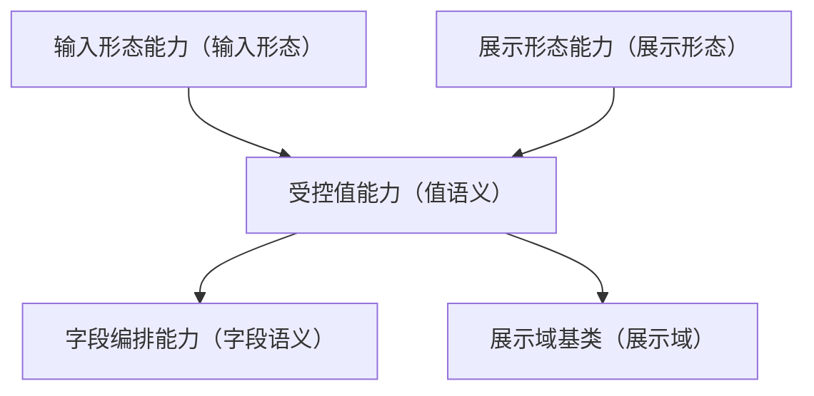

# 组件设计 · 受控值能力

> 输入与展示共用的值语义能力：值归一、格式化调度、三态（未设置 / 空 / 已填）、变更上报
> 实现侧命名与落点见《[前端基类清单](../../../../../前端基类清单.md)》（§2.1 全量基类登记表；继承链全系统唯一一份），实现契约细节见项目详细设计。

[文档首页](../../../../../文档首页.md) › [项目规划说明](../../../../../规划/项目规划说明.md) › [组件设计](../../../01_组件设计_总览.md) › 受控值能力　|　[← 布局能力](../../02_能力类/07_组件设计_布局能力/07_组件设计_布局能力.md)　[字段编排能力 →](../09_组件设计_字段编排能力/09_组件设计_字段编排能力.md)

> 可交互原型：[08_原型设计_受控值能力.html](08_原型设计_受控值能力.html)（演示值归一、三态（未设置/空/已填）、格式化调度与 `change` 上报；输入与展示共用）

## 1. 目的与适用范围 

定义 BMS 前端**受控值能力**的组件设计：为**输入与展示共用**提供**值语义**——值归一、格式化调度、三态（未设置/空/已填）、`change` 上报。它是组件设计体系**继承链上的能力域基类**，在值 / 字段链上承前启后：位于输入形态能力与展示形态能力之后，字段编排能力与展示域基类之前；继承 [组件根基类](../../01_机制基类/02_组件设计_组件根基类/02_组件设计_组件根基类.md)。

### 1.1 定位（为什么需要这一层） 

原本「形态」与「族语义」在「输入 / 展示」上职责打架（「长什么样」与「值与字段语义」被混为一处）；按[《前端开发规范》](../../../../../规范/前端开发规范.md) §3.3「冲突时插入基类」，把**值语义**独立为 `BaseValue`（继承链上的能力域基类）承前启后：

| 职责 | 归属 |
| --- | --- |
| 值归一、格式化调度、三态、`change` | **本节点（受控值能力）** |
| 输入/展示形态 | 输入形态能力 / 展示形态能力 |
| 字段语义（上下文/权限/校验） | [字段编排能力](../09_组件设计_字段编排能力/09_组件设计_字段编排能力.md) |
| 格式化规则本体 | [基础类「格式化工具」](../../../09_基础类/03_组件设计_格式化工具/03_组件设计_格式化工具.md) |

上游依据：[《前端开发规范》](../../../../../规范/前端开发规范.md)（§3.4 继承与组合分工、§3.3 演进原则）、[《架构设计 · 数据架构》](../../../../架构设计/07_架构设计_数据架构.md)（空值/精度口径）。

> 本篇为「受控值能力」节点。**范围边界**：形态归 形态能力；字段语义归 字段编排能力；格式化规则归 基础类「格式化工具」；域细化归 域基类。

## 2. 职责与组成 

| 组成部分 | 职责 |
| --- | --- |
| 受控值能力核心 | 值语义：归一、格式化调度、三态、`change` 上报；输入与展示均适用 |
| 组件包装（按需） | 包装形态按需评估（能力核心 + 组件包装两层） |

## 3. 交互与契约语义 

| 语义项 | 说明 |
| --- | --- |
| 受控值 | 组件值受外部控制；对外提交受控更新与业务变更（归一后值） |
| 空值归一 | 空串 / 未设置 → 空值归一目标（默认 `null`）；多值空归一为空数组 |
| 格式化 | 可按格式化器名或函数调度基础类「格式化工具」（金额 / 日期 / 枚举 / 布尔…）；缺失回退原值 |
| 三态 | `unset`（未设置）/ `empty`（显式空）/ `value`（已填）；关闭三态时前两者合并 |
| 变更上报 | `change` 归一后上报；去抖由具体控件决定 |

## 4. 行为语义 

| 项 | 设计 |
| --- | --- |
| 归一 | 空串/未设置 → 空值归一目标（默认 `null`）；多值空 → 空数组；子类可覆盖（如金额保留精度） |
| 三态 | `unset`（未设置）／`empty`（显式空）／`value`（已填）；关闭三态时 `unset` 与 `empty` 合并 |
| 格式化 | 展示侧经格式化调度基础类「格式化工具」；输入侧一般不用格式化（或输入掩码） |
| `change` | 归一后上报；去抖由具体控件决定 |
| 组合 | 输入链：输入形态能力 → 受控值能力 → 字段编排能力；展示链：展示形态能力 → 受控值能力 → 展示域基类 |
| 依赖方向 | 只依赖 总基类/组件根；输入/展示形态为消费方（不登记依赖）；不依赖 字段编排能力/域基类 |

## 5. 场景集成 

| 场景 | 说明 |
| --- | --- |
| 输入控件 | 具体输入控件沿继承链经 输入域基类、字段编排能力 取得本层（归一/三态） |
| 展示域 | 展示域基类组合本层做格式化展示 |
| 字段只读回显 | 值归一 + 格式化 |

## 6. 依赖接口与上游变更 

### 6.1 上游接口与口径 

| 项 | 说明 | 目标文档 |
| --- | --- | --- |
| 分层权威 | 受控值能力职责与冲突插层（能力即继承链上的层） | [《前端开发规范》](../../../../../规范/前端开发规范.md) 第 3 节（登记项①） |
| 空值/精度 | 空值归一与数值精度口径 | [《架构设计 · 数据架构》](../../../../架构设计/07_架构设计_数据架构.md)（登记项②） |
| 格式化 | 格式化调度口径 | [基础类「格式化工具」](../../../09_基础类/03_组件设计_格式化工具/03_组件设计_格式化工具.md)（登记项③） |
| 新增依赖 | **无** | — |

### 6.2 需登记的上游变更 

| 变更点 | 目标文档 | 内容 |
| --- | --- | --- |
| ① 受控值能力契约 | [《前端开发规范》](../../../../../规范/前端开发规范.md) 第 3 节 | 明确 受控值能力：归一、格式化调度、三态（未设置/空/已填）、`change`；承前启后（输入 / 展示形态能力 → 受控值能力 → 字段编排能力 / 展示域基类） |
| ② 空值与精度 | [《架构设计 · 数据架构》](../../../../架构设计/07_架构设计_数据架构.md)「空值与精度」节 | 明确各类型空值归一（`null`/`[]`/`''`）与数值/金额精度，供前端归一与后端一致 |
| ③ 格式化调度 | [基础类「格式化工具」](../../../09_基础类/03_组件设计_格式化工具/03_组件设计_格式化工具.md) | 明确格式化调度接口（格式化器名/函数）与缺失回退 |

> 按[《文档生成规范》](../../../../../规范/文档生成规范.md)「引用与追溯」节，上述变更需用户确认后由上游文档同步。

## 7. 权限 / i18n / 移动端 

- **权限**：不做权限判定（字段权限见 [字段权限能力](../../02_能力类/11_组件设计_字段权限能力/11_组件设计_字段权限能力.md)）。
- **i18n**：布尔/枚举文本由格式化工具按 locale。
- **移动端**：值语义为同一契约的另一实现（同一套契约断言保障）。

## 8. 性能与边界 

| 场景 | 设计 |
| --- | --- |
| 归一 | 轻量计算；避免每次渲染重复归一（可缓存） |
| 边界 | 空值语义差异（`''`/`null`/`[]`）、三态与必填、格式化器缺失回退、输入侧误用格式化、精度丢失 |
| 不支持 | 形态（形态能力）、字段语义（字段编排能力）、格式化规则本体（基础类「格式化工具」）、族细化（族基类） |

## 9. 检查清单 

- □ 契约语义：受控值、空值归一（默认 `null`）、格式化调度、三态（`unset`/`empty`/`value`）、`change` 上报
- □ 归一与三态口径清晰；格式化调度基础类「格式化工具」；缺失回退
- □ 输入链与展示链组合方式明确；依赖方向单向
- □ 权限/i18n/移动端符合第 7 节；性能边界符合第 8 节
- □ 三项上游登记已确认

> 组件设计节点（受控值能力）· 与[《前端开发规范》](../../../../../规范/前端开发规范.md)[《架构设计 · 数据架构》](../../../../架构设计/07_架构设计_数据架构.md)[基础类「格式化工具」](../../../09_基础类/03_组件设计_格式化工具/03_组件设计_格式化工具.md)[输入形态能力](../../02_能力类/02_组件设计_输入形态能力/02_组件设计_输入形态能力.md)[展示形态能力](../../02_能力类/03_组件设计_展示形态能力/03_组件设计_展示形态能力.md)[字段编排能力](../09_组件设计_字段编排能力/09_组件设计_字段编排能力.md)[展示域基类](../../03_域基类/02_组件设计_展示域基类/02_组件设计_展示域基类.md)《命名规范》配套
