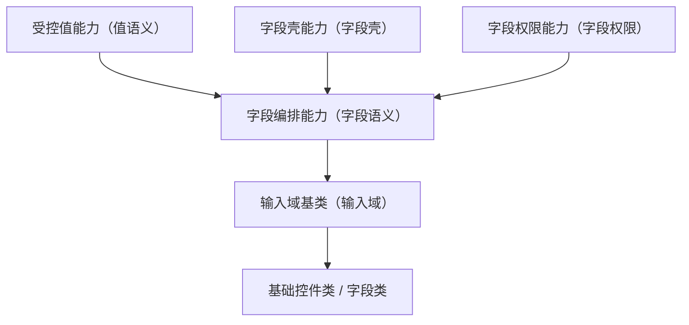

# 组件设计 · 字段编排能力

> 表单字段语义能力：在值语义之上提供字段上下文（标签 / 必填 / 错误）、字段权限（可见 / 可编辑）、校验触发与字段标识注册
> 实现侧命名与落点见《[前端基类清单](../../../../../前端基类清单.md)》（「能力」节），实现契约细节见项目详细设计。

[文档首页](../../../../../文档首页.md) › [项目规划说明](../../../../../规划/项目规划说明.md) › [组件设计](../../../01_组件设计_总览.md) › 字段编排能力　|　[← 受控值能力](../08_组件设计_受控值能力/08_组件设计_受控值能力.md)　[字段壳能力 →](../10_组件设计_字段壳能力/10_组件设计_字段壳能力.md)

> 可交互原型：[09_原型设计_字段编排能力.html](09_原型设计_字段编排能力.html)（演示字段语义：字段上下文（label/必填/错误）、字段权限（visible/editable）、三态与校验触发、`fieldKey` 注册）

## 1. 目的与适用范围 

定义 BMS 前端**字段编排能力**的组件设计：在 [受控值能力](../08_组件设计_受控值能力/08_组件设计_受控值能力.md) 的**值语义**之上提供**表单字段语义**——字段上下文（label/必填/错误，来自 [字段壳能力](../10_组件设计_字段壳能力/10_组件设计_字段壳能力.md)）、字段权限（`visible`/`editable`，来自 [字段权限能力](../11_组件设计_字段权限能力/11_组件设计_字段权限能力.md)）、校验触发、`fieldKey`。它是组件设计体系**能力层**（值 / 字段链，继承链上的一层），依赖字段壳能力、字段权限能力与受控值能力（单向、登记校验）。

### 1.1 定位 

| 职责 | 归属 |
| --- | --- |
| 字段上下文（label/必填/错误/栅格）、字段权限、校验触发、`fieldKey` | **本节点（字段编排能力，依赖 字段壳能力/字段权限能力）** |
| 值语义（归一/三态/格式化） | [受控值能力](../08_组件设计_受控值能力/08_组件设计_受控值能力.md) |
| 字段壳细节（label/必填/错误位） | [字段壳能力](../10_组件设计_字段壳能力/10_组件设计_字段壳能力.md) |
| 字段权限细节（visible/editable/required/脱敏） | [字段权限能力](../11_组件设计_字段权限能力/11_组件设计_字段权限能力.md) |
| 元数据取数与控件分发 | [交互类「表单渲染器」](../../../08_交互类/12_组件设计_表单渲染器/12_组件设计_表单渲染器.md) |

上游依据：[《前端开发规范》](../../../../../规范/前端开发规范.md)（§3.4 继承与组合分工）、[《概要设计 · 菜单管理》](../../../../概要设计/07_概要设计_菜单管理.md)（`sys_field`/`sys_role_field` 字段元数据）、[《概要设计 · 表单定制》](../../../../概要设计/36_概要设计_表单定制.md)（字段属性）。

> 本篇为「字段编排能力」节点。**范围边界**：值语义归 受控值能力；壳/权限细节归 字段壳能力/字段权限能力；输入域细化归 [输入域基类](../../03_域基类/01_组件设计_输入域基类/01_组件设计_输入域基类.md)。

## 2. 职责与组成 

| 组成部分 | 职责 |
| --- | --- |
| 字段编排能力核心 | 字段语义：组合字段壳与字段权限，提供字段上下文、校验触发与字段标识注册 |
| 组件包装（按需） | 包装形态按需评估（能力核心 + 组件包装两层） |

## 3. 交互与契约语义 

| 语义项 | 说明 |
| --- | --- |
| 字段标识 | `fieldKey`：上下文注册、错误定位、元数据读取；未提供时降级为匿名字段 |
| 字段上下文 | 标签 / 必填 / 帮助 / 错误来自字段壳能力；栅格跨度随字段属性 |
| 字段权限 | `visible` / `editable` 来自字段权限能力；必填与脱敏按元数据 |
| 值 | 继承受控值能力（归一 / 三态） |
| 校验 | 值变化触发字段校验并回传上下文；提交时由表单容器统一汇总 |
| 事件 | `change`（继承受控值能力）、校验结果转发 |
| 上下文下发 | 向控件下发只读 / 禁用 / 必填 / 错误等字段上下文 |

## 4. 行为语义 

| 项 | 设计 |
| --- | --- |
| 字段上下文 | 由字段壳能力统一维护，本层接收并转发给控件（label/占位/必填/错误） |
| 字段权限 | 由字段权限能力判定：`permVisible=false` 整壳不渲染；`editable=false` 合并禁用态；`required`/脱敏按元数据 |
| 校验触发 | 值变化触发字段校验并回传上下文；提交时由表单容器统一汇总 |
| `fieldKey` | 挂载注册、卸载注销；未提供时降级为匿名字段 |
| 依赖方向 | 依赖受控值能力 / 字段壳能力 / 字段权限能力（单向登记校验）；被输入域基类沿继承链消费；不依赖具体控件 |

## 5. 场景集成 

| 场景 | 说明 |
| --- | --- |
| 表单字段 | 基础控件与字段类沿继承链经输入域基类取得本层 |
| 列表行内编辑 | 明细区字段 |
| 只读回显 | 字段权限 + 值格式化 |

## 6. 依赖接口与上游变更 

### 6.1 上游接口与口径 

| 项 | 说明 | 目标文档 |
| --- | --- | --- |
| 分层权威 | 字段编排能力职责 | [《前端开发规范》](../../../../../规范/前端开发规范.md) 第 3 节（登记项①） |
| 字段元数据 | `sys_field`/`sys_role_field`、`GET /menus/my` | [《概要设计 · 菜单管理》](../../../../概要设计/07_概要设计_菜单管理.md)（登记项②） |
| 字段属性 | `label/required/help/span` 等下发 | [《概要设计 · 表单定制》](../../../../概要设计/36_概要设计_表单定制.md)（登记项③） |
| 新增依赖 | **无** | — |

### 6.2 需登记的上游变更 

| 变更点 | 目标文档 | 内容 |
| --- | --- | --- |
| ① 字段编排能力契约 | [《前端开发规范》](../../../../../规范/前端开发规范.md) 第 3 节 | 明确 字段编排能力：在值语义上加字段上下文/字段权限/校验触发/字段标识，依赖字段壳能力与字段权限能力（单向登记） |
| ② 字段元数据 | [《概要设计 · 菜单管理》](../../../../概要设计/07_概要设计_菜单管理.md)「字段元数据」节 | 明确字段 `label/required/help/span/visible/editable/脱敏` 随 `GET /menus/my` 下发 |
| ③ 字段属性 | [《概要设计 · 表单定制》](../../../../概要设计/36_概要设计_表单定制.md)「字段属性」节 | 明确字段属性默认值与前端消费口径 |

> 按[《文档生成规范》](../../../../../规范/文档生成规范.md)「引用与追溯」节，上述变更需用户确认后由上游文档同步。

## 7. 权限 / i18n / 移动端 

- **权限**：字段权限由 [字段权限能力](../11_组件设计_字段权限能力/11_组件设计_字段权限能力.md) 判定；本能力只负责应用（不渲染/传禁用态）。
- **i18n**：label/help 由元数据按 locale 下发。
- **移动端**：字段语义一致（移动端为同一契约的另一实现，同一套契约断言保障）；单列渲染。

## 8. 性能与边界 

| 场景 | 设计 |
| --- | --- |
| 上下文 | 注册/注销 O(1)；避免逐字段重复读元数据 |
| 边界 | `fieldKey` 缺失/重复、`visible` 与栅格收缩、`editable` 被绕过（后端拒绝）、必填与三态、脱敏与复制 |
| 不支持 | 值语义（受控值能力）、壳/权限细节（字段壳能力/字段权限能力）、域细化（域基类）、元数据取数（表单元数据能力） |

## 9. 检查清单 

- □ 契约语义：字段标识、标签/必填/帮助/栅格跨度、值变化与校验触发、字段上下文下发
- □ 依赖字段壳能力（字段壳）与字段权限能力（字段权限）；值语义继承 受控值能力
- □ 校验触发与上下文注册；依赖方向单向（依赖登记校验）
- □ 权限/i18n/移动端符合第 7 节；性能边界符合第 8 节
- □ 三项上游登记已确认

> 组件设计节点（字段编排能力）· 与[《前端开发规范》](../../../../../规范/前端开发规范.md)[《概要设计 · 菜单管理》](../../../../概要设计/07_概要设计_菜单管理.md)[《概要设计 · 表单定制》](../../../../概要设计/36_概要设计_表单定制.md)[受控值能力](../08_组件设计_受控值能力/08_组件设计_受控值能力.md)[字段壳能力](../10_组件设计_字段壳能力/10_组件设计_字段壳能力.md)[字段权限能力](../11_组件设计_字段权限能力/11_组件设计_字段权限能力.md)[输入域基类](../../03_域基类/01_组件设计_输入域基类/01_组件设计_输入域基类.md)[交互类「表单渲染器」](../../../08_交互类/12_组件设计_表单渲染器/12_组件设计_表单渲染器.md)《命名规范》配套
