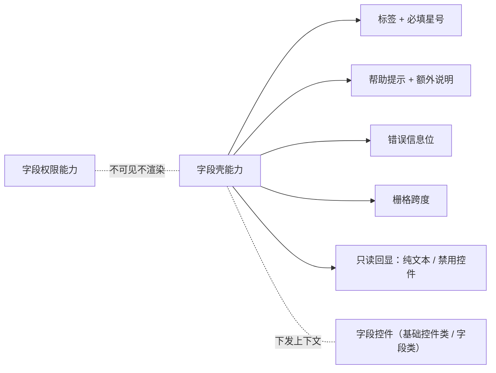

# 组件设计 · 字段壳

> 字段的外层结构能力：标签 / 必填星号 / 帮助提示 / 错误信息位 / 额外说明 / 栅格跨度 / 标签位置 / 只读回显切换
> 实现侧命名与落点见《[前端基类清单](../../../../../前端基类清单.md)》（「能力」节），实现契约细节见项目详细设计。

[文档首页](../../../../../文档首页.md) › [项目规划说明](../../../../../规划/项目规划说明.md) › [组件设计](../../../01_组件设计_总览.md) › 字段壳能力　|　[← 字段编排能力](../09_组件设计_字段编排能力/09_组件设计_字段编排能力.md)　[字段权限能力 →](../11_组件设计_字段权限能力/11_组件设计_字段权限能力.md)

> 可交互原型：[10_原型设计_字段壳能力.html](10_原型设计_字段壳能力.html)（演示 label/必填星号/帮助 tooltip/错误位/栅格跨度/只读回显切换，以及它与输入域基类、字段权限能力的配合）

## 1. 目的与适用范围 

定义 BMS 前端**字段壳能力**的组件设计：统一承载字段的**外层结构**——标签、必填星号、帮助提示、错误信息位、描述/额外说明、栅格跨度、标签宽度/位置，以及**只读回显切换**（纯文本 / 禁用控件）。它是基础组件类中的「字段壳能力」，**被基础控件类与字段类组合消费**，与[输入域基类](../../03_域基类/01_组件设计_输入域基类/01_组件设计_输入域基类.md)（控件行为）、[字段权限能力](../../02_能力类/11_组件设计_字段权限能力/11_组件设计_字段权限能力.md)（可见/可编辑）共同构成字段的公共外层与行为契约。

### 1.1 定位与职责边界 

| 职责 | 归属 |
| --- | --- |
| 标签/必填星号/帮助/错误位/额外说明/栅格跨度/标签位置 | **本节点（字段壳能力）** |
| 只读回显结构（纯文本 / 禁用控件） | **本节点**（控件提供只读渲染） |
| 受控值、禁用合并、三态、校验触发 | [输入域基类](../../03_域基类/01_组件设计_输入域基类/01_组件设计_输入域基类.md) |
| 可见/可编辑/必填/脱敏 | [字段权限能力](../../02_能力类/11_组件设计_字段权限能力/11_组件设计_字段权限能力.md) |
| 具体输入/展示控件 | 基础控件类、字段类 |
| 布局元数据取数、控件分发 | [交互类「表单渲染器」](../../../08_交互类/12_组件设计_表单渲染器/12_组件设计_表单渲染器.md) |

上游依据：[《布局设计 · 表单页》](../../../../布局设计/08_布局设计_表单页.html)（三列主表、窄容器单列、长字段跨整行、只读/编辑分态）、[《布局设计 · 表单定制》](../../../../布局设计/14_布局设计_表单定制.html)（栅格与字段属性）、[《布局设计 · 表格明细》](../../../../布局设计/09_布局设计_表格明细.html)（明细行内字段）；数据口径依据[《概要设计 · 表单定制》](../../../../概要设计/36_概要设计_表单定制.md)（字段属性标签/必填/帮助/占位/跨度等下发）。

> 本篇为「字段壳能力」节点。**范围边界**：**控件行为**归输入域基类；**权限与必填判定来源**归字段权限能力；**具体控件**归基础控件类 / 字段类；**全表布局与分区**归[表单渲染器](../../../08_交互类/12_组件设计_表单渲染器/12_组件设计_表单渲染器.md)；只读纯文本的**值格式化**归[展示域基类](../../03_域基类/02_组件设计_展示域基类/02_组件设计_展示域基类.md)。

## 2. 职责与组成 

| 组成部分 | 职责 |
| --- | --- |
| 字段壳能力核心 | 字段外层壳状态：标签、必填、帮助、错误（错误的设置与清除、错误态判定） |
| 组件包装（按需） | 外壳渲染：标签/必填星号/帮助/错误位/额外说明/栅格跨度/标签位置/只读回显切换 |
| 字段上下文通道（按需） | 壳向控件下发标签/必填/错误/只读/禁用/尺寸/跨度；控件回传值变化与校验结果 |
| 壳内部件（按需） | 帮助提示（tooltip）等外壳内聚件 |

- 命名与落点遵循[《命名规范》](../../../../../规范/命名规范.md)与[《前端开发规范》](../../../../../规范/前端开发规范.md)；实现侧命名与落点见《[前端基类清单](../../../../../前端基类清单.md)》。

## 3. 交互与契约语义 

| 语义项 | 说明 |
| --- | --- |
| 标签与必填 | 标签文案（i18n）；必填显示红色星号；星号来源为字段必填属性或校验规则（可自动推导，统一一处避免不一致） |
| 帮助与额外说明 | 帮助说明显示问号图标，悬停/点击展示提示（支持富文本说明、i18n，不遮挡布局）；额外说明为标签下方小字（如取值范围、格式提示） |
| 错误信息位 | 错误信息优先于控件自身校验态，为空时读上下文；提交校验时滚动定位到首个错误字段 |
| 栅格跨度 | 字段占用列数（主表默认 3 列；窄容器单列；长字段跨整行），由布局元数据下发、壳消费 |
| 标签宽度与位置 | 宽度默认取表单/主题值；位置三态（左 / 右 / 顶部），宽屏取右、窄容器与移动端置顶，表单级可覆盖 |
| 冒号 | 标签后是否加冒号（可配） |
| 只读回显 | 三态：纯文本 / 禁用控件 / 按字段类型自动（富文本、上传等用展示形态，简单文本用纯文本） |
| 标签显隐 | 明细行内/表头场景可隐藏标签，壳退化为单元格容器 |
| 校验转发与标签交互 | 转发控件校验结果（供表单渲染器汇总）；标签点击可用于帮助/聚焦（可选） |
| 上下文下发 | 默认插槽向控件下发只读/禁用/尺寸等上下文，供控件按外层状态渲染 |

## 4. 交互与渲染 

| 项 | 设计 |
| --- | --- |
| 标签与必填 | 左侧/顶部标签，必填显示红色星号；星号统一推导（字段属性或校验规则含必填） |
| 帮助提示 | 问号图标 + 悬停/点击提示（富文本说明，i18n）；不遮挡布局 |
| 错误位 | 控件校验失败或提交校验时在壳内展示错误（由[表单渲染器](../../../08_交互类/12_组件设计_表单渲染器/12_组件设计_表单渲染器.md)汇总），滚动定位到首个错误字段 |
| 额外说明 | 标签下方小字说明（取值范围、格式提示） |
| 栅格跨度 | 决定字段占用列数（主表 3 列，窄容器单列，长字段跨整行）；由布局元数据下发 |
| 只读回显 | 查看态：纯文本（经[展示域基类](../../03_域基类/02_组件设计_展示域基类/02_组件设计_展示域基类.md)格式化）、禁用控件置灰回显、或按字段类型自动 |
| 标签位置 | 宽屏右置，窄容器/移动端置顶；表单级可覆盖 |
| 明细行内 | 隐藏标签，壳退化为单元格容器（[《布局设计 · 表格明细》](../../../../布局设计/09_布局设计_表格明细.html)） |
| 权限协作 | 字段不可见时**整个壳不渲染**（由渲染器判定后跳过），栅格自然收缩 |
| 语言 | 标签/帮助/额外说明走 i18n；值不翻译 |
| 无控件空态 | 只读且值为空显示统一占位（口径见展示域基类） |

## 5. 场景集成 

| 场景 | 说明 |
| --- | --- |
| 主表表单 | 3 列栅格，字段壳承载标签/必填/帮助/错误 |
| 窄容器/弹窗 | 单列、标签置顶 |
| 明细行内编辑 | 隐藏标签，壳作为单元格 |
| 查看态 | 只读回显方式决定纯文本或禁用控件 |
| 查询筛选区 | 标签左置，错误位一般不启用（[展示类「查询筛选区」](../../../07_展示类/02_组件设计_查询筛选区/02_组件设计_查询筛选区.md)） |

## 6. 依赖接口与上游变更 

### 6.1 上游接口与口径 

| 项 | 说明 | 目标文档 |
| --- | --- | --- |
| 字段属性 | 标签/必填/帮助/占位/跨度等字段属性下发 | [《概要设计 · 表单定制》](../../../../概要设计/36_概要设计_表单定制.md)（登记项③） |
| 栅格布局 | 三列主表、窄容器单列、长字段跨整行 | [《布局设计 · 表单定制》](../../../../布局设计/14_布局设计_表单定制.html)（登记项②） |
| 字段与校验 | 标签/必填/错误/只读回显 | [《布局设计 · 表单页》](../../../../布局设计/08_布局设计_表单页.html)（登记项①） |
| 明细行内 | 无标签单元格 | [《布局设计 · 表格明细》](../../../../布局设计/09_布局设计_表格明细.html) |
| 校验规则 | 必填与规则来源 | [基础类「格式化工具」](../../../09_基础类/03_组件设计_格式化工具/03_组件设计_格式化工具.md)、[表单渲染器](../../../08_交互类/12_组件设计_表单渲染器/12_组件设计_表单渲染器.md) |
| 新增依赖 | **无**：复用表单与栅格等既有基础件 | — |

### 6.2 需登记的上游变更 

| 变更点 | 目标文档 | 内容 |
| --- | --- | --- |
| ① 字段壳契约 | [《布局设计 · 表单页》](../../../../布局设计/08_布局设计_表单页.html)「字段与校验」节 | 明确字段壳统一的标签/必填星号/帮助/错误位/额外说明/只读回显（纯文本或禁用控件）；必填星号由字段属性或校验规则统一推导；错误滚动定位；标注组件设计 字段壳能力 为语义依据 |
| ② 栅格与跨度 | [《布局设计 · 表单定制》](../../../../布局设计/14_布局设计_表单定制.html)「栅格布局」节 | 明确跨度（编辑态/查看态）由元数据下发、字段壳消费；宽屏 3 列 / 窄容器单列 / 长字段跨整行；标签位置随断点切换 |
| ③ 字段属性下发 | [《概要设计 · 表单定制》](../../../../概要设计/36_概要设计_表单定制.md)「字段属性」节 | 明确字段属性（标签/必填/帮助/额外说明/占位/跨度/标签位置）的元数据字段与默认值，供字段壳与渲染器消费 |

> 按[《文档生成规范》](../../../../../规范/文档生成规范.md)「引用与追溯」节，上述变更需用户确认后由上游文档同步；本节点只定义字段壳语义与契约。

## 7. 权限 / i18n / 移动端 

- **权限**：字段可见/可编辑由[字段权限能力](../../02_能力类/11_组件设计_字段权限能力/11_组件设计_字段权限能力.md)判定；壳负责"不可见不渲染、不可编辑下发禁用"；必填与脱敏按字段属性。
- **i18n**：标签/帮助/额外说明/错误文案按 locale；值不翻译。
- **移动端**：PC 与移动端为同一契约的多实现（同一套契约断言保障）；字段壳语义同源（标签顶部、单列、错误位一致）。

## 8. 性能与边界 

| 场景 | 设计 |
| --- | --- |
| 渲染 | 壳为轻量容器；帮助提示懒渲染 |
| 校验 | 错误信息由上下文集中，避免每字段重复监听 |
| 边界 | 必填星号与校验规则不一致、标签过长换行/省略、帮助与额外说明并存、跨度超出列数、只读回显类型与字段不匹配（富文本/上传）、长表单错误定位、明细无标签、标签位置断点切换抖动 |
| 不支持 | 控件行为（输入域基类）、权限判定（字段权限能力）、具体控件（基础控件类）、全表布局（表单元数据能力）、值格式化（展示域基类） |

## 9. 检查清单 

- □ 契约语义：标签/必填（可自动）/帮助/额外说明/错误位/栅格跨度/标签宽度与位置/只读回显三态/标签显隐
- □ 渲染：必填星号统一推导、帮助提示、错误位与滚动定位、额外说明、栅格跨度、标签位置随断点
- □ 只读回显：纯文本 / 禁用控件 / 自动 三选，自动按字段类型；空值统一占位
- □ 权限协作：不可见整壳不渲染、不可编辑下发禁用
- □ 明细行内隐藏标签；查询区形态适配
- □ 权限/i18n/移动端符合第 7 节；性能边界（懒渲染、集中校验）符合第 8 节
- □ 三项上游登记已确认：字段壳契约、栅格与跨度、字段属性下发

> 组件设计节点 · 与[《布局设计 · 表单页》](../../../../布局设计/08_布局设计_表单页.html)[《布局设计 · 表单定制》](../../../../布局设计/14_布局设计_表单定制.html)[《布局设计 · 表格明细》](../../../../布局设计/09_布局设计_表格明细.html)[《概要设计 · 表单定制》](../../../../概要设计/36_概要设计_表单定制.md)[输入域基类](../../03_域基类/01_组件设计_输入域基类/01_组件设计_输入域基类.md)[字段权限能力](../../02_能力类/11_组件设计_字段权限能力/11_组件设计_字段权限能力.md)[展示域基类](../../03_域基类/02_组件设计_展示域基类/02_组件设计_展示域基类.md)[交互类「表单渲染器」](../../../08_交互类/12_组件设计_表单渲染器/12_组件设计_表单渲染器.md)[展示类「查询筛选区」](../../../07_展示类/02_组件设计_查询筛选区/02_组件设计_查询筛选区.md)[基础类「格式化工具」](../../../09_基础类/03_组件设计_格式化工具/03_组件设计_格式化工具.md)《命名规范》配套
