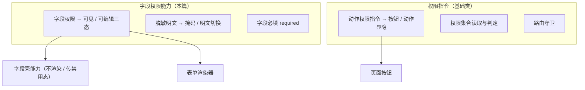

# 组件设计 · 字段权限

> 字段级权限的权威契约：可见 / 可编辑 / 必填三态与脱敏标记、只读 / 编辑 / 隐藏三态、读写双端协作
> 实现侧命名与落点见《[前端基类清单](../../../../../前端基类清单.md)》（「能力」节），实现契约细节见项目详细设计。

[文档首页](../../../../../文档首页.md) › [项目规划说明](../../../../../规划/项目规划说明.md) › [组件设计](../../../01_组件设计_总览.md) › 字段权限能力　|　[← 字段壳能力](../10_组件设计_字段壳能力/10_组件设计_字段壳能力.md)　[输入域基类 →](../../03_域基类/01_组件设计_输入域基类/01_组件设计_输入域基类.md)

> 可交互原型：[11_原型设计_字段权限能力.html](11_原型设计_字段权限能力.html)（演示字段 `visible`/`editable`、只读/编辑/隐藏三态、脱敏与 `data:plain` 明文、必填星号来源与双重控制）

## 1. 目的与适用范围 

定义 BMS 前端**字段级权限（字段权限能力）**的权威契约：依据表单元数据得到字段的可见（`permVisible`）/ 可编辑（`editable`）/ 必填（`required`）三态与脱敏标记，统一回答"字段是否渲染、可见/不可见、可编辑/不可编辑、是否必填、是否脱敏"；并定义脱敏明文、字段元数据来源与下发、只读/编辑/隐藏三态口径、读写双端协作。它是基础组件类中的「字段权限能力」（继承链上的一层），**被 [字段壳能力](../../02_能力类/10_组件设计_字段壳能力/10_组件设计_字段壳能力.md) 与 [交互类「表单渲染器」](../../../08_交互类/12_组件设计_表单渲染器/12_组件设计_表单渲染器.md) 消费**。

> **权威迁移**：本篇为字段权限的**权威定义**；原[基础类「权限指令」](../../../09_基础类/02_组件设计_权限指令/02_组件设计_权限指令.md)中的字段权限部分（脱敏明文 / 字段数据来源 / 只读分态 / 脱敏）**已迁入本篇**，基础类「权限指令」缩为「动作权限指令」并引用本篇。

### 1.1 与动作权限的分工 

| 维度 | 归属 |
| --- | --- |
| 字段可见 / 可编辑三态、脱敏与明文、字段必填口径 | **本节点（字段权限能力）** |
| 按钮/动作权限、权限集合、路由守卫 | [基础类「动作权限指令」](../../../09_基础类/02_组件设计_权限指令/02_组件设计_权限指令.md) |
| 字段外层渲染（label/必填星号/错误位） | [字段壳能力](../../02_能力类/10_组件设计_字段壳能力/10_组件设计_字段壳能力.md) |
| 元数据取数与控件分发 | [交互类「表单渲染器」](../../../08_交互类/12_组件设计_表单渲染器/12_组件设计_表单渲染器.md) |

上游依据：[《架构设计 · 权限计算引擎》](../../../../架构设计/15_架构设计_子系统_权限计算引擎.md)（权限分层、字段权限、双端下发）、[《架构设计 · 前端架构》](../../../../架构设计/08_架构设计_前端架构.md)（权限渲染）、[《概要设计 · 菜单管理》](../../../../概要设计/07_概要设计_菜单管理.md)（`sys_field`/`sys_role_field`、`GET /menus/my` 下发）、[《概要设计 · 用户管理》](../../../../概要设计/03_概要设计_用户管理.md)（脱敏标记 `data:plain`）；页面形态依据[《布局设计 · 表单页》](../../../../布局设计/08_布局设计_表单页.html)「字段权限与脱敏」节。

## 2. 职责与组成 

| 组成部分 | 职责 |
| --- | --- |
| 字段权限核心 | 依据表单元数据返回字段可见 / 可编辑 / 必填三态与脱敏标记；门禁合并禁用态（供字段壳与渲染器协作） |
| 脱敏明文（展示件，按需） | 持 `data:plain` 动作权限时展示脱敏字段明文，否则掩码 |
| 脱敏掩码（展示层，按需） | 按字段脱敏规则掩码（手机/邮箱/身份证等），供展示类与导出复用 |
| 字段元数据 | `GET /menus/my` 下发的字段定义与本用户 `visible`/`editable`/`required`/脱敏标记 |

## 3. 字段权限模型与数据来源 

| 项 | 设计 |
| --- | --- |
| 字段实体 | `sys_field`（`form_id` + `field_key`）挂表单 |
| 授予 | `sys_role_field`（`role_id, form_id, field_id, visible, editable`），默认全部可见可编辑，授予后收窄 |
| 读时过滤 | 不可见字段（`visible=false`）后端序列化层过滤，**不返回**；前端不渲染 |
| 写时校验 | 不可编辑字段（`editable=false`）保存时后端拒绝，前端置禁用态 |
| 下发路径 | `GET /api/v1/menus/my` 表单元数据随菜单下发，含按钮与字段的可见/可编辑/必填/脱敏状态 |
| 必填 `required` | 来自字段属性/校验规则（**非权限收窄项**）；[字段壳能力](../../02_能力类/10_组件设计_字段壳能力/10_组件设计_字段壳能力.md) 统一推导星号 |
| 脱敏协作 | 脱敏是掩码展示；字段权限是可见性控制，两者互补（`data:plain` 查看明文） |

## 4. 交互与契约语义 

### 4.1 字段权限语义 

| 语义项 | 说明 |
| --- | --- |
| 可见 | 不可见字段由字段壳 / 渲染器跳过渲染（栅格自然收缩） |
| 可编辑 | 不可编辑字段在编辑态也禁用（下发禁用态给控件） |
| 必填 | 来自字段属性 / 校验规则（非权限收窄项），由字段壳统一推导星号 |

- 字段 label/help/必填/脱敏标记由表单元数据接口按当前 locale 下发（`sys_field_i18n` 附表），字段组件不重复渲染 label。
- 字段组件**不感知权限逻辑**：只接受禁用态与"是否渲染"（由字段壳/渲染器决定）。
- 保存时若包含不可编辑字段，后端拒绝并返回错误码；前端静默处理并回显（[基础类「请求封装」](../../../09_基础类/01_组件设计_请求封装/01_组件设计_请求封装.md)）。

### 4.2 只读/编辑/隐藏三态 

| 状态 | 字段渲染 |
| --- | --- |
| 只读态（查看） | 全部字段只读回显（纯文本或禁用控件，不区分 `editable`） |
| 编辑态 | `editable=true` 可编辑；`editable=false` 仍禁用 |
| `visible=false` | 任何状态都不渲染 |

## 5. 脱敏与明文 

- 敏感字段（`sys_field` 注册脱敏标记，如手机号、邮箱、身份证）默认按规则掩码展示（如 `138****5678`）。
- 持 `data:plain` 动作权限的用户可请求明文；前端在掩码与明文间切换。
- 脱敏字段的导出同样受 `data:plain` 约束（[《概要设计 · 导入导出》](../../../../概要设计/19_概要设计_导入导出.md)：敏感字段默认脱敏，持 `data:plain` 方可导出明文）。
- 明文请求不落 localStorage，仅内存态。

## 6. 与动作权限 / 请求封装协作 

- **双重控制**：前端显隐（字段权限 + 动作权限）+ 后端 `require_permission`/字段写校验；即使前端被绕过，后端仍拒绝。
- 403 响应由响应拦截统一提示并跳 403（[基础类「请求封装」](../../../09_基础类/01_组件设计_请求封装/01_组件设计_请求封装.md)）。
- 权限版本变更（实时推送或下次请求）→ 权限集合重新装配菜单、权限与字段元数据（含可见 / 可编辑）。
- 租户切换后字段权限随权限集合整体重算（[交互类「租户切换」](../../../08_交互类/18_组件设计_租户切换/18_组件设计_租户切换.md)）。

## 7. 依赖接口与上游变更 

### 7.1 上游接口与口径 

| 项 | 说明 | 目标文档 |
| --- | --- | --- |
| 字段权限模型 | 权限分层、字段权限、双端下发 | [《架构设计 · 权限计算引擎》](../../../../架构设计/15_架构设计_子系统_权限计算引擎.md)（登记项①） |
| 字段元数据 | `sys_field`/`sys_role_field`、`GET /menus/my` | [《概要设计 · 菜单管理》](../../../../概要设计/07_概要设计_菜单管理.md)（登记项②） |
| 脱敏标记 | `data:plain` | [《概要设计 · 用户管理》](../../../../概要设计/03_概要设计_用户管理.md) |
| 字段权限页面 | 字段权限与脱敏、只读/编辑分态 | [《布局设计 · 表单页》](../../../../布局设计/08_布局设计_表单页.html)（登记项③） |
| 权限集合 | 权限集合读取与判定（动作权限侧） | [基础类「动作权限指令」](../../../09_基础类/02_组件设计_权限指令/02_组件设计_权限指令.md) |
| 新增依赖 | **无** | — |

### 7.2 需登记的上游变更 

| 变更点 | 目标文档 | 内容 |
| --- | --- | --- |
| ① 字段权限权威口径 | [《架构设计 · 权限计算引擎》](../../../../架构设计/15_架构设计_子系统_权限计算引擎.md)「字段权限」节 | 明确字段级 `visible`/`editable` 的读取过滤与写入校验、`required` 非权限项、脱敏（`data:plain`）与字段权限互补；前端契约见组件设计 字段权限能力 |
| ② 字段元数据下发 | [《概要设计 · 菜单管理》](../../../../概要设计/07_概要设计_菜单管理.md)「字段元数据」节 | 明确 `sys_field`/`sys_role_field` 字段与 `GET /menus/my` 下发内容：`visible`/`editable`/`required`/脱敏标记/`help`/`span`，随菜单与 i18n 一并下发 |
| ③ 字段权限页面口径 | [《布局设计 · 表单页》](../../../../布局设计/08_布局设计_表单页.html)「字段权限与脱敏」节 | 引用组件设计 字段权限能力 为字段权限契约依据；明确只读/编辑/隐藏三态、不可见不渲染（栅格收缩）、不可编辑置禁用态、脱敏掩码与明文 |

> 按[《文档生成规范》](../../../../../规范/文档生成规范.md)「引用与追溯」节，上述变更需用户确认后由上游文档同步；本节点只定义字段权限契约。

## 8. 权限 / i18n / 移动端 

- **权限**：字段权限为角色级授予；本节点即权限渲染的字段侧权威；动作权限见基础类「动作权限指令」；后端强校验为准。
- **i18n**：字段标签 / 帮助 / 脱敏提示由后端按 locale 下发，前端不硬编码。
- **移动端**：移动端为同一契约的另一实现（同一套契约断言保障）；字段权限同为表单元数据下发；移动端表单按可见性跳过、不可编辑置只读；脱敏与 `data:plain` 机制同源。

## 9. 性能与边界 

| 场景 | 设计 |
| --- | --- |
| 判断开销 | 可见 / 可编辑来自元数据 O(1) 读取；字段壳不重复查询 |
| 重装配 | 权限版本变化时一次性重装配字段元数据，避免逐字段请求 |
| 明文 | 明文仅内存态，不落 localStorage |
| 边界 | 未登录/租户未解析时元数据为空（字段全按无权限处理，页面加载/跳登录）、`visible=false` 与栅格收缩、`editable=false` 被绕过（后端拒绝）、脱敏与必填并存、明文请求失败回退掩码、字段元数据与渲染器版本不一致 |
| 不支持 | 动作权限（基础类「动作权限指令」）、字段壳渲染（字段壳能力）、控件（输入域基类 / 基础控件类）、后端强校验实现 |

## 10. 检查清单 

- □ 可见性：`visible=false` 不渲染（栅格自然收缩）、`editable=false` 下发禁用态，字段组件不感知权限逻辑
- □ `required` 来自字段属性/校验规则、非权限收窄项；必填星号由字段壳统一推导
- □ 只读/编辑/隐藏三态清晰；只读态全字段只读回显
- □ 脱敏字段按规则掩码，`data:plain` 才可看/导明文，明文不落 localStorage
- □ 双重控制：前端显隐 + 后端读过滤/写校验；403 统一处理
- □ 权限版本变更/租户切换触发字段元数据重装配
- □ 与基础类「动作权限指令」的动作权限分工清晰
- □ 权限/i18n/移动端符合第 8 节；性能边界符合第 9 节
- □ 三项上游登记已确认：字段权限权威口径、字段元数据下发、字段权限页面口径

> 组件设计节点 · 与[《架构设计 · 权限计算引擎》](../../../../架构设计/15_架构设计_子系统_权限计算引擎.md)[《架构设计 · 前端架构》](../../../../架构设计/08_架构设计_前端架构.md)[《概要设计 · 菜单管理》](../../../../概要设计/07_概要设计_菜单管理.md)[《概要设计 · 用户管理》](../../../../概要设计/03_概要设计_用户管理.md)[《概要设计 · 导入导出》](../../../../概要设计/19_概要设计_导入导出.md)[《布局设计 · 表单页》](../../../../布局设计/08_布局设计_表单页.html)[基础类「请求封装」](../../../09_基础类/01_组件设计_请求封装/01_组件设计_请求封装.md)[基础类「动作权限指令」](../../../09_基础类/02_组件设计_权限指令/02_组件设计_权限指令.md)[交互类「表单渲染器」](../../../08_交互类/12_组件设计_表单渲染器/12_组件设计_表单渲染器.md)[交互类「租户切换」](../../../08_交互类/18_组件设计_租户切换/18_组件设计_租户切换.md)[输入域基类](../../03_域基类/01_组件设计_输入域基类/01_组件设计_输入域基类.md)[字段壳能力](../../02_能力类/10_组件设计_字段壳能力/10_组件设计_字段壳能力.md)《命名规范》配套
