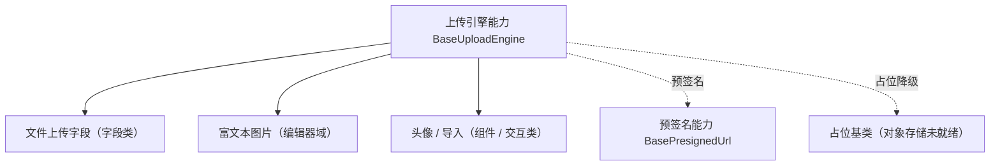

# 组件设计 · 上传引擎能力

> `BaseUploadEngine`（核心能力类，key `upload-engine`，`depends: presigned-url`；`frontend/packages/core/src/capabilities/upload-engine.ts`，登记 `capabilities/manifest.ts`）· 无 Vue 投影（按需回补）；`BaseUploader.vue` 组件包装为按需形态（历史未落码），按需随回补波重建

[文档首页](../../../../../文档首页.md) › [项目规划说明](../../../../../规划/项目规划说明.md) › [组件设计](../../../01_组件设计_总览.md) › 上传引擎能力　|　[← 选项源能力](../12_组件设计_选项源能力/12_组件设计_选项源能力.md)　[异步任务能力 →](../14_组件设计_异步任务能力/14_组件设计_异步任务能力.md)

> 可交互原型：[13_原型设计_上传引擎能力.html](13_原型设计_上传引擎能力.html)（演示分片进度、秒传命中、断点续传、取消与占位降级）

## 1. 目的与适用范围 

定义 BMS 前端 `frontend/packages/*`（核心 `frontend/packages/core` + 按需的 Vue 投影 `frontend/packages/vue`；渲染插件 `ui-ep` / `ui-vant` 按需）**上传引擎能力（原「上传引擎能力」）**的组件设计：核心能力类 `BaseUploadEngine`（`frontend/packages/core/src/capabilities/upload-engine.ts`，登记 `capabilities/manifest.ts`，依赖 `presigned-url` 单向下沉）（+ 按需的 Vue 投影），为**文件上传、富文本图片、头像、导入文件**等场景提供统一上传能力——分片、秒传、断点续传、进度、取消。它是组件设计体系**能力（key `upload-engine`）**，继承 [组件根基类](../../01_机制基类/02_组件设计_组件根基类/02_组件设计_组件根基类.md)；对象存储能力对齐后端 `BaseObjectStorage`（预签名上传），依赖未就绪时按**占位降级**。

### 1.1 定位 

| 职责 | 归属 |
| --- | --- |
| 分片、秒传、断点续传、进度、取消、并发控制、校验（大小 / 类型） | **本节点（上传引擎能力）** |
| 预签名获取与失效重取 | [预签名能力](../22_组件设计_预签名能力/22_组件设计_预签名能力.md) |
| 上传后的字段值 / 表单回填 | [受控值能力](../08_组件设计_受控值能力/08_组件设计_受控值能力.md) 与字段壳 |
| 对象存储服务端契约 | 后端 `BaseObjectStorage`（[《后端基类清单》](../../../../../后端基类清单.md)「对象存储」节） |

上游依据：[《前端开发规范》](../../../../../规范/前端开发规范.md)（§3 能力）、[《架构设计 · 数据架构》](../../../../架构设计/07_架构设计_数据架构.md)（大文件与直传）、[《概要设计 · 文件管理》](../../../../概要设计/01_概要设计_总览.md)（文件上传接口）。

> 本篇为 **基础组件类 · 能力「上传引擎能力」**。**范围边界**：预签名归预签名能力；字段外观归字段壳；本能力只管"文件怎么传"。

## 2. 组件清单与职责 

| 组件 / 工具 | 位置 | 职责 |
| --- | --- | --- |
| `BaseUploadEngine`（核心能力类，key `upload-engine`，`depends: presigned-url`） | `frontend/packages/core/src/capabilities/upload-engine.ts`（登记 `capabilities/manifest.ts`） | 上传：`upload` / `pause` / `resume` / `cancel` / `retry`；分片、秒传、断点、进度、并发控制 |
| `BaseUploader.vue`（可选组件包装） | 按需形态（历史未落码） | 按需随回补波按「核心类 + 投影（+ 插件包装）」重建 |

> **实现口径（2026-09-17，新体系）**：原「上传引擎能力」（旧 `useUploadEngine` 组合式）已类化为核心能力类 `BaseUploadEngine`（`frontend/packages/core/src/capabilities/upload-engine.ts`，继承 `BaseCapability`，登记 `capabilities/manifest.ts`，依赖 `presigned-url` 单向下沉）；本能力暂无 Vue 投影（按需回补，`useXxx` 只落 `frontend/packages/vue/src/bindings/`），`BaseUploader.vue` 组件包装为按需形态（历史未落码）；旧实现（原 `useXxx` 组合式）已随旧层删除（历史经 git 追溯）。`depends` 由能力机制开发态校验（单向、无循环）；契约语义（Props / 方法 / 事件 / 行为规则）保持不变。

- 命名遵循[《命名规范》](../../../../../规范/命名规范.md)：核心能力类 `BaseXxx`（本能力的 Vue 投影按需回补 `useUploadEngine`，`useXxx` 只落 `frontend/packages/vue/src/bindings/`）；位置遵循[《前端开发规范》](../../../../../规范/前端开发规范.md)（核心能力类落 `frontend/packages/core/src/capabilities/<key>.ts`，登记 `capabilities/manifest.ts`）。

## 3. 契约（Props 与方法） 

| 属性 | 类型 | 默认 | 说明 |
| --- | --- | --- | --- |
| `accept` | string | '' | 接受类型（`image/*`、`.xlsx` 等） |
| `maxSize` | number | — | 单文件大小上限（MB） |
| `multiple` | boolean | false | 多文件 |
| `limit` | number | — | 数量上限 |
| `chunkSize` | number | 4MB | 分片大小（大文件分片直传） |
| `concurrency` | number | 3 | 并发上传数 |
| `direct` | boolean | true | 直传对象存储（预签名；false 走服务端中转） |

| 方法 / 事件 | 说明 |
| --- | --- |
| `upload(files)` | 上传（自动分片 / 秒传判定 / 断点续传） |
| `pause(id)` / `resume(id)` / `cancel(id)` / `retry(id)` | 控制单个上传 |
| `progress` | 进度事件（上传中：百分比 / 分片数） |
| `uploaded` / `failed` | 完成 / 失败事件（载荷含文件与结果 id） |
| `before-upload` | 校验钩子（类型 / 大小 / 数量；返回 false 阻止） |

## 4. 行为与实现约定 

| 项 | 设计 |
| --- | --- |
| 分片与并发 | 大文件自动分片（`chunkSize`）；并发数受控；失败分片重试（指数退避） |
| 秒传 | 上传前算文件指纹（hash）询问服务端：已存在直接返回文件 id（命中秒传） |
| 断点续传 | 记录已完成分片（服务端 / 本地）；网络中断后续传未完成分片 |
| 直传与预签名 | 默认直传对象存储（预签名 URL 上传，后端不代理）；预签名过期自动重取（预签名能力） |
| 进度与取消 | 进度按分片汇总（防抖上报 UI）；取消终止在途请求并清理分片状态 |
| 校验 | `before-upload` 客户端先校验（类型 / 大小 / 数量），服务端二次校验 |
| 占位降级 | 对象存储 / 预签名未就绪时按占位语义：禁用上传控件、空态提示；接入后无改调用方 |
| 释放 | 在途请求登记[异步资源基类](../../01_机制基类/05_组件设计_异步资源基类/05_组件设计_异步资源基类.md)（组件卸载 / 取消自动中止） |
| 依赖方向 | 只依赖 组件根 / 预签名能力（`depends: presigned-url` 单向下沉）/ 机制基类；不依赖具体字段组件 |

## 5. 场景集成 

| 场景 | 说明 |
| --- | --- |
| 文件上传字段 | 单 / 多附件上传（列表、进度、删除、回显） |
| 富文本图片 | 编辑器内插图：上传 → 插入图片地址（编辑器域协作） |
| 头像上传 | 单图裁剪前上传或上传后裁剪（按组件定） |
| 导入文件 | 大 Excel 上传（配合[异步任务能力](../14_组件设计_异步任务能力/14_组件设计_异步任务能力.md)轮询解析进度） |

## 6. 依赖接口与上游变更 

### 6.1 上游接口与口径 

| 项 | 说明 | 目标文档 |
| --- | --- | --- |
| 分层权威 | 上传引擎能力职责与直传口径 | [《前端开发规范》](../../../../../规范/前端开发规范.md) 第 3 节（登记项①） |
| 上传接口 | 分片 / 秒传 / 断点 / 预签名接口 | [《概要设计 · 文件管理》](../../../../概要设计/01_概要设计_总览.md)、[《架构设计 · 数据架构》](../../../../架构设计/07_架构设计_数据架构.md)（登记项②） |
| 对象存储 | 后端 `BaseObjectStorage` 预签名契约 | [《后端基类清单》](../../../../../后端基类清单.md)「对象存储」节（登记项③） |
| 新增依赖 | **无** | — |

### 6.2 需登记的上游变更 

| 变更点 | 目标文档 | 内容 |
| --- | --- | --- |
| ① 上传引擎契约 | [《前端开发规范》](../../../../../规范/前端开发规范.md) 第 3 节 | 明确 `BaseUploadEngine`：分片 / 秒传 / 断点 / 进度 / 取消 / 并发 / 校验 / 占位降级 |
| ② 上传接口 | [《概要设计》](../../../../概要设计/01_概要设计_总览.md) 对应节点 | 分片上传、秒传问询、断点续传、预签名获取接口；限制（大小 / 类型 / 数量）口径 |
| ③ 直传与预签名 | [《架构设计 · 数据架构》](../../../../架构设计/07_架构设计_数据架构.md) + [《后端基类清单》](../../../../../后端基类清单.md) | 直传对象存储 + 预签名 TTL 与失效重取口径 |

> 按[《文档生成规范》](../../../../../规范/文档生成规范.md)「引用与追溯」节，上述变更需用户确认后由上游文档同步。

## 7. 权限 / i18n / 移动端 

- **权限**：上传权限由后端校验（接口 / 预签名签发时）；前端提示失败原因。
- **i18n**：错误与提示文案走 vue-i18n（超限 / 类型不允许 / 网络失败）。
- **移动端**：`ui-vant` 为同一契约的另一实现（契约套件同一套断言），能力语义一致（触控选文件 / 拍照上传能力差异由端内处理）。

## 8. 性能与边界 

| 场景 | 设计 |
| --- | --- |
| 大文件 | 分片直传 + 并发控制 + 断点续传；进度防抖上报（不逐分片渲染） |
| 网络 | 失败分片指数退避重试；预签名过期自动重取；离线 / 弱网提示 |
| 边界 | 秒传指纹碰撞（服务端校验大小与 hash）、取消后残留分片、重复提交同名文件、并发超限、浏览器内存（大文件切片不整读） |
| 不支持 | 预签名实现（预签名能力）、字段外观（字段壳）、对象存储服务端（后端基座） |

## 9. 检查清单 

- □ 契约：`accept`/`maxSize`/`multiple`/`limit`/`chunkSize`/`concurrency`/`direct` + `upload`/`pause`/`resume`/`cancel`/`retry` + 进度与完成事件
- □ 行为：分片 / 秒传 / 断点 / 并发控制、直传预签名与失效重取、校验双端、占位降级、释放走异步资源
- □ 依赖方向单向（`depends: presigned-url`）；不依赖具体字段组件
- □ 权限/i18n/移动端符合第 7 节；性能边界符合第 8 节
- □ 三项上游登记已确认

> 组件设计节点（上传引擎能力）· 与[《前端开发规范》](../../../../../规范/前端开发规范.md)[《架构设计 · 数据架构》](../../../../架构设计/07_架构设计_数据架构.md)[《后端基类清单》](../../../../../后端基类清单.md)[预签名能力](../22_组件设计_预签名能力/22_组件设计_预签名能力.md)[异步任务能力](../14_组件设计_异步任务能力/14_组件设计_异步任务能力.md)[占位基类](../../01_机制基类/04_组件设计_占位基类/04_组件设计_占位基类.md)《命名规范》配套
