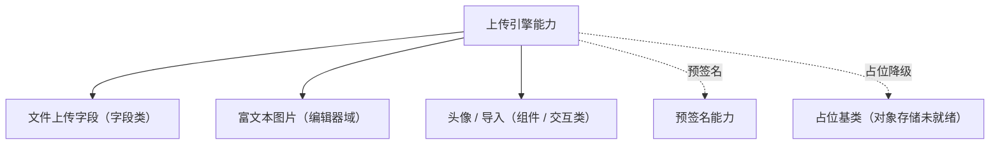

# 组件设计 · 上传引擎能力

> 文件类场景统一的上传能力：分片、秒传、断点续传、进度、取消、并发控制与占位降级
> 实现侧命名与落点见《[前端基类清单](../../../../../前端基类清单.md)》（§2.1 全量基类登记表；继承链全系统唯一一份），实现契约细节见项目详细设计。

[文档首页](../../../../../文档首页.md) › [项目规划说明](../../../../../规划/项目规划说明.md) › [组件设计](../../../01_组件设计_总览.md) › 上传引擎能力　|　[← 选项源能力](../12_组件设计_选项源能力/12_组件设计_选项源能力.md)　[异步任务能力 →](../14_组件设计_异步任务能力/14_组件设计_异步任务能力.md)

> 可交互原型：[13_原型设计_上传引擎能力.html](13_原型设计_上传引擎能力.html)（演示分片进度、秒传命中、断点续传、取消与占位降级）

## 1. 目的与适用范围 

定义 BMS 前端**上传引擎能力**的组件设计：为**文件上传、富文本图片、头像、导入文件**等场景提供统一上传能力——分片、秒传、断点续传、进度、取消、并发控制。它是组件设计体系**继承链上的能力基类**，依赖预签名能力（单向、登记校验）；继承 [组件根基类](../../01_机制基类/02_组件设计_组件根基类/02_组件设计_组件根基类.md)；对象存储服务端契约对齐后端对象存储基类（预签名上传），依赖未就绪时按**占位降级**。

### 1.1 定位 

| 职责 | 归属 |
| --- | --- |
| 分片、秒传、断点续传、进度、取消、并发控制、校验（大小 / 类型） | **本节点（上传引擎能力）** |
| 预签名获取与失效重取 | [预签名能力](../22_组件设计_预签名能力/22_组件设计_预签名能力.md) |
| 上传后的字段值 / 表单回填 | [受控值能力](../08_组件设计_受控值能力/08_组件设计_受控值能力.md) 与字段壳 |
| 对象存储服务端契约 | 后端对象存储基类（[《后端基类清单》](../../../../../后端基类清单.md)「对象存储」节） |

上游依据：[《前端开发规范》](../../../../../规范/前端开发规范.md)（§3 能力）、[《架构设计 · 数据架构》](../../../../架构设计/07_架构设计_数据架构.md)（大文件与直传）、[《概要设计 · 文件管理》](../../../../概要设计/01_概要设计_总览.md)（文件上传接口）。

> 本篇为 **基础组件类 · 能力「上传引擎能力」**。**范围边界**：预签名归预签名能力；字段外观归字段壳；本能力只管"文件怎么传"。

## 2. 职责与组成 

| 组成部分 | 职责 |
| --- | --- |
| 上传引擎核心 | 上传控制（开始 / 暂停 / 继续 / 取消 / 重试）：分片、秒传、断点、进度、并发控制 |
| 组件包装（按需） | 包装形态按需评估（能力核心 + 组件包装两层） |

## 3. 交互与契约语义 

| 语义项 | 说明 |
| --- | --- |
| 接受类型 | 可接受的文件类型（`image/*`、`.xlsx` 等） |
| 大小与数量 | 单文件大小上限（MB）、数量上限 |
| 多文件 | 是否允许多文件 |
| 分片 | 分片大小（大文件分片直传，默认 4MB） |
| 并发 | 并发上传数（默认 3） |
| 直传 | 默认直传对象存储（预签名）；否则走服务端中转 |
| 上传前校验 | 类型 / 大小 / 数量校验（可阻止上传） |
| 进度 | 上传中进度（百分比 / 分片数） |
| 完成与失败 | 完成 / 失败上报（载荷含文件与结果标识） |

## 4. 行为语义 

| 项 | 设计 |
| --- | --- |
| 分片与并发 | 大文件自动分片（默认 4MB）；并发数受控；失败分片重试（指数退避） |
| 秒传 | 上传前算文件指纹（hash）询问服务端：已存在直接返回文件标识（命中秒传） |
| 断点续传 | 记录已完成分片（服务端 / 本地）；网络中断后续传未完成分片 |
| 直传与预签名 | 默认直传对象存储（预签名上传，后端不代理）；预签名过期自动重取（预签名能力） |
| 进度与取消 | 进度按分片汇总（防抖上报 UI）；取消终止在途请求并清理分片状态 |
| 校验 | 上传前客户端先校验（类型 / 大小 / 数量），服务端二次校验 |
| 占位降级 | 对象存储 / 预签名未就绪时按占位语义：禁用上传控件、空态提示；接入后无需改调用方 |
| 释放 | 在途请求登记[异步资源基类](../../01_机制基类/05_组件设计_异步资源基类/05_组件设计_异步资源基类.md)（组件卸载 / 取消自动中止） |
| 依赖方向 | 只依赖 组件根 / 公共基类 / 预签名能力（单向登记）；不依赖具体字段组件 |

## 5. 场景集成 

| 场景 | 说明 |
| --- | --- |
| 文件上传字段 | 单 / 多附件上传（列表、进度、删除、回显） |
| 富文本图片 | 编辑器内插图：上传 → 插入图片地址（编辑器域协作） |
| 头像上传 | 单图裁剪前上传或上传后裁剪（按组件定） |
| 导入文件 | 大 Excel 上传（配合[异步任务能力](../14_组件设计_异步任务能力/14_组件设计_异步任务能力.md)轮询解析进度） |

## 6. 依赖接口与上游变更 

### 6.1 上游接口与口径 

| 项 | 说明 | 目标文档 |
| --- | --- | --- |
| 分层权威 | 上传引擎能力职责与直传口径 | [《前端开发规范》](../../../../../规范/前端开发规范.md) 第 3 节（登记项①） |
| 上传接口 | 分片 / 秒传 / 断点 / 预签名接口 | [《概要设计 · 文件管理》](../../../../概要设计/01_概要设计_总览.md)、[《架构设计 · 数据架构》](../../../../架构设计/07_架构设计_数据架构.md)（登记项②） |
| 对象存储 | 后端对象存储基类预签名契约 | [《后端基类清单》](../../../../../后端基类清单.md)「对象存储」节（登记项③） |
| 新增依赖 | **无** | — |

### 6.2 需登记的上游变更 

| 变更点 | 目标文档 | 内容 |
| --- | --- | --- |
| ① 上传引擎契约 | [《前端开发规范》](../../../../../规范/前端开发规范.md) 第 3 节 | 明确 上传引擎能力：分片 / 秒传 / 断点 / 进度 / 取消 / 并发 / 校验 / 占位降级 |
| ② 上传接口 | [《概要设计》](../../../../概要设计/01_概要设计_总览.md) 对应节点 | 分片上传、秒传问询、断点续传、预签名获取接口；限制（大小 / 类型 / 数量）口径 |
| ③ 直传与预签名 | [《架构设计 · 数据架构》](../../../../架构设计/07_架构设计_数据架构.md) + [《后端基类清单》](../../../../../后端基类清单.md) | 直传对象存储 + 预签名 TTL 与失效重取口径 |

> 按[《文档生成规范》](../../../../../规范/文档生成规范.md)「引用与追溯」节，上述变更需用户确认后由上游文档同步。

## 7. 权限 / i18n / 移动端 

- **权限**：上传权限由后端校验（接口 / 预签名签发时）；前端提示失败原因。
- **i18n**：错误与提示文案走全局语言能力（超限 / 类型不允许 / 网络失败）。
- **移动端**：移动端为同一契约的另一实现（同一套契约断言保障），能力语义一致（触控选文件 / 拍照上传能力差异由端内处理）。

## 8. 性能与边界 

| 场景 | 设计 |
| --- | --- |
| 大文件 | 分片直传 + 并发控制 + 断点续传；进度防抖上报（不逐分片渲染） |
| 网络 | 失败分片指数退避重试；预签名过期自动重取；离线 / 弱网提示 |
| 边界 | 秒传指纹碰撞（服务端校验大小与指纹）、取消后残留分片、重复提交同名文件、并发超限、浏览器内存（大文件切片不整读） |
| 不支持 | 预签名实现（预签名能力）、字段外观（字段壳）、对象存储服务端（后端对象存储基类） |

## 9. 检查清单 

- □ 契约语义：接受类型 / 大小与数量 / 多文件 / 分片 / 并发 / 直传 + 上传 / 暂停 / 继续 / 取消 / 重试 + 进度与完成上报
- □ 行为：分片 / 秒传 / 断点 / 并发控制、直传预签名与失效重取、校验双端、占位降级、释放走异步资源
- □ 依赖方向单向（依赖预签名能力）；不依赖具体字段组件
- □ 权限/i18n/移动端符合第 7 节；性能边界符合第 8 节
- □ 三项上游登记已确认

> 组件设计节点（上传引擎能力）· 与[《前端开发规范》](../../../../../规范/前端开发规范.md)[《架构设计 · 数据架构》](../../../../架构设计/07_架构设计_数据架构.md)[《后端基类清单》](../../../../../后端基类清单.md)[预签名能力](../22_组件设计_预签名能力/22_组件设计_预签名能力.md)[异步任务能力](../14_组件设计_异步任务能力/14_组件设计_异步任务能力.md)[占位基类](../../01_机制基类/04_组件设计_占位基类/04_组件设计_占位基类.md)《命名规范》配套
