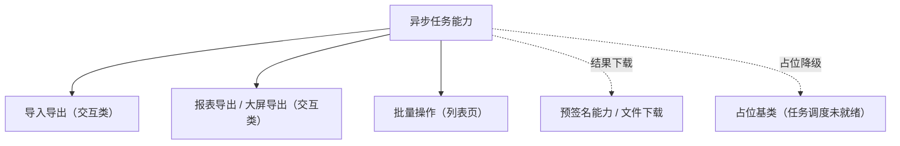

# 组件设计 · 异步任务能力

> 长任务统一能力：提交 / 轮询进度 / 取消 / 结果下载（导入导出、报表与大屏导出、批量操作共用；任务调度未就绪时占位降级）
> 实现侧命名与落点见《[前端基类清单](../../../../../前端基类清单.md)》（§2.1 全量基类登记表；继承链全系统唯一一份），实现契约细节见项目详细设计。

[文档首页](../../../../../文档首页.md) › [项目规划说明](../../../../../规划/项目规划说明.md) › [组件设计](../../../01_组件设计_总览.md) › 异步任务能力　|　[← 上传引擎能力](../13_组件设计_上传引擎能力/13_组件设计_上传引擎能力.md)　[页签状态能力 →](../15_组件设计_页签状态能力/15_组件设计_页签状态能力.md)

> 可交互原型：[14_原型设计_异步任务能力.html](14_原型设计_异步任务能力.html)（演示提交任务、轮询进度（递增间隔）、取消、完成下载与占位降级）

## 1. 目的与适用范围 

定义 BMS 前端**异步任务能力**的组件设计：为**导入导出、报表导出、大屏导出、批量操作**等长任务提供统一语义——任务提交、进度轮询、取消、结果下载。它是继承链上的能力域基类 **`BaseAsyncTask`**（父基类 `BaseComponent`；经[能力机制](../../01_机制基类/03_组件设计_能力机制/03_组件设计_能力机制.md)声明与登记，落点见《[前端基类清单](../../../../../前端基类清单.md)》§2.1）；后端对齐任务调度基座与任务表（当前**占位先行**）。

### 1.1 定位 

| 职责 | 归属 |
| --- | --- |
| 提交 / 轮询进度 / 取消 / 结果下载、轮询节奏与失败重试 | **本节点（异步任务能力）** |
| 结果文件存取 | [预签名能力](../22_组件设计_预签名能力/22_组件设计_预签名能力.md) 与对象存储 |
| 导入导出的列配置 / 模板下载 | [交互类「导入导出」](../../../08_交互类/01_组件设计_导入导出/01_组件设计_导入导出.md) |
| 后端任务调度与任务表 | [《后端基类清单》](../../../../../后端基类清单.md)「任务调度」节 |

上游依据：[《前端开发规范》](../../../../../规范/前端开发规范.md)（§3 能力）、[《概要设计 · 导入导出》](../../../../概要设计/01_概要设计_总览.md)、[《后端基类清单》](../../../../../后端基类清单.md)「任务调度」节（后端任务调度对齐）。

> 本篇为 **基础组件类 · 能力「异步任务能力」**。**范围边界**：列配置与模板归导入导出组件；结果下载归预签名能力；本能力只管"任务怎么提交、怎么跟踪、怎么取结果"。

## 2. 职责与组成 

| 组成部分 | 职责 |
| --- | --- |
| 异步任务能力核心 | 任务提交 / 进度轮询 / 取消 / 结果下载；轮询节奏与失败重试、占位降级 |
| 响应式投影（按需） | 能力核心 ↔ 响应式框架的桥接，提供等价的响应式入口（投影只做桥接，不重复实现） |
| 组件包装（按需） | 模板层包装形态，按需评估 |

## 3. 交互与契约语义 

| 语义项 | 说明 |
| --- | --- |
| 任务类型 | 提交时指定任务类型（如导出用户 / 导入用户 / 报表生成），决定任务名映射与结果形态 |
| 轮询节奏 | 起始间隔约 1 秒，随进度递增至上限约 5 秒（均可配）；页面隐藏时降频 |
| 失败重试 | 轮询网络失败自动重试（默认 2 次）；任务自身失败不重试（提示 + 可手动重提） |
| 完成提示 | 完成 / 失败默认提示（走通知消息，可关闭） |
| 提交 | 提交任务并返回任务标识；大文件导入先走上传承载 |
| 查询进度 | 查询任务进度（进度百分比 / 阶段 / 消息） |
| 取消 | 服务端标记取消 + 停止轮询 |
| 结果下载 | 经预签名能力触发下载；大文件走浏览器下载 |
| 进度 / 完成 / 失败事件 | 供进度面板与通知消费 |
| 运行状态 | 运行中标识与当前任务标识（响应式） |

## 4. 交互与行为语义 

| 项 | 设计 |
| --- | --- |
| 轮询节奏 | 间隔递增（起始 → 上限）；页面隐藏降频；完成后停止 |
| 失败重试 | 轮询网络失败自动重试；任务自身失败不重试（提示 + 可手动重提） |
| 取消 | 服务端取消 + 本地停止轮询；取消后不再提示 |
| 结果下载 | 完成后取结果地址触发下载；过期失效自动重取；大文件走浏览器下载 |
| 长时间等待 | 超过阈值提示"任务已转入后台，完成后通知"（配合[订阅基类](../../01_机制基类/08_组件设计_订阅基类/08_组件设计_订阅基类.md)或通知铃铛） |
| 占位降级 | 后端任务调度未就绪时按占位语义：提交返回占位任务（进度恒定 / 提示"暂不支持"）、不轮询；接入后无改调用方 |
| 释放 | 轮询定时器登记[异步资源基类](../../01_机制基类/05_组件设计_异步资源基类/05_组件设计_异步资源基类.md)（卸载 / 切换自动停止） |
| 依赖方向 | 只依赖 组件根 / 预签名能力 / 中间层基类；不依赖具体页面 |

## 5. 场景集成 

| 场景 | 说明 |
| --- | --- |
| 导入导出 | 导入解析（大文件）、导出生成（大数据量）→ 进度面板 + 结果下载 |
| 报表 / 大屏导出 | 生成大文件后下载；与打印导出组件协作 |
| 批量操作 | 批量删除 / 批量转换的异步执行与结果回执 |
| 后台任务通知 | 完成后消息铃铛提示（订阅基类 + 通知消息） |

## 6. 依赖接口与上游变更 

### 6.1 上游接口与口径 

| 项 | 说明 | 目标文档 |
| --- | --- | --- |
| 分层权威 | 异步任务能力职责与轮询口径 | [《前端开发规范》](../../../../../规范/前端开发规范.md) 第 3 节（登记项①） |
| 任务接口 | 提交 / 查询进度 / 取消 / 结果接口 | [《概要设计 · 导入导出》](../../../../概要设计/01_概要设计_总览.md)（登记项②） |
| 后端任务基座 | 后端任务调度（任务名 / 队列 / 执行入口）与任务表 | [《后端基类清单》](../../../../../后端基类清单.md)「任务调度」节（登记项③） |
| 新增依赖 | **无**：复用通知、下载与预签名等既有基础件 | — |

### 6.2 需登记的上游变更 

| 变更点 | 目标文档 | 内容 |
| --- | --- | --- |
| ① 异步任务能力契约 | [《前端开发规范》](../../../../../规范/前端开发规范.md) 第 3 节 | 明确异步任务能力：提交 / 轮询（递增间隔）/ 取消 / 结果下载 / 后台通知 / 占位降级 |
| ② 任务接口 | [《概要设计》](../../../../概要设计/01_概要设计_总览.md) 对应节点 | 任务提交与进度查询接口（进度百分比 / 阶段 / 消息）、结果文件获取；后台通知事件 |
| ③ 后端任务对齐 | [《后端基类清单》](../../../../../后端基类清单.md) | 任务类型命名与后端任务调度基座对齐；结果文件落对象存储（预签名下载） |

> 按[《文档生成规范》](../../../../../规范/文档生成规范.md)「引用与追溯」节，上述变更需用户确认后由上游文档同步；本节点只定义异步任务能力语义与契约。

## 7. 权限 / i18n / 移动端 

- **权限**：任务提交与结果下载权限由后端校验；前端不判权。
- **i18n**：阶段文案与提示走全局语言能力；任务名映射由任务类型决定。
- **移动端**：PC 与移动端为同一契约的多实现（同一套契约断言保障），能力语义一致（后台任务完成以推送 / 铃铛提示）。

## 8. 性能与边界 

| 场景 | 设计 |
| --- | --- |
| 轮询 | 递增间隔 + 页面隐藏降频 + 完成即停；避免多组件重复轮询同一任务 |
| 边界 | 轮询风暴（多任务）、任务丢失（服务端重启）、取消竞态、结果过期、占位与真实切换、超时未完成 |
| 不支持 | 列配置 / 模板（导入导出组件）、结果文件存取（预签名能力 / 对象存储）、后端任务执行（后端基座） |

## 9. 检查清单 

- □ 契约语义：任务类型 / 轮询节奏 / 失败重试 / 完成提示；提交 / 查询进度 / 取消 / 结果下载；进度与完成事件；运行状态
- □ 行为：递增轮询、失败重试、取消语义、结果下载与过期重取、后台转通知、占位降级、释放走异步资源
- □ 继承与依赖：能力位于继承链上；依赖方向单向；与导入导出 / 预签名能力协作口径清晰
- □ 权限 / i18n / 移动端符合第 7 节；性能边界符合第 8 节
- □ 三项上游登记已确认

> 组件设计节点（异步任务能力）· 与[《前端开发规范》](../../../../../规范/前端开发规范.md)[《后端基类清单》](../../../../../后端基类清单.md)[上传引擎能力](../13_组件设计_上传引擎能力/13_组件设计_上传引擎能力.md)[预签名能力](../22_组件设计_预签名能力/22_组件设计_预签名能力.md)[导入导出](../../../08_交互类/01_组件设计_导入导出/01_组件设计_导入导出.md)[占位基类](../../01_机制基类/04_组件设计_占位基类/04_组件设计_占位基类.md)《命名规范》配套
