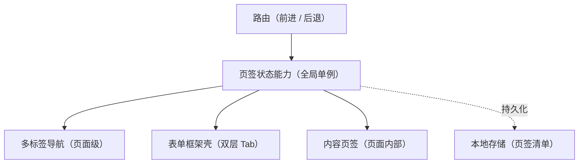

# 组件设计 · 页签状态能力

> 页签状态统一能力：打开 / 关闭 / 固定 / 激活 / 缓存键与缓存清单（多标签导航、表单框架双层页签、内容页签共用；刷新后恢复）
> 实现侧命名与落点见《[前端基类清单](../../../../../前端基类清单.md)》（§2.1 全量基类登记表；继承链全系统唯一一份），实现契约细节见项目详细设计。

[文档首页](../../../../../文档首页.md) › [项目规划说明](../../../../../规划/项目规划说明.md) › [组件设计](../../../01_组件设计_总览.md) › 页签状态能力　|　[← 异步任务能力](../14_组件设计_异步任务能力/14_组件设计_异步任务能力.md)　[偏好持久化能力 →](../16_组件设计_偏好持久化能力/16_组件设计_偏好持久化能力.md)

> 可交互原型：[15_原型设计_页签状态能力.html](15_原型设计_页签状态能力.html)（演示打开 / 关闭 / 固定、激活相邻、去重激活与缓存清单）

## 1. 目的与适用范围 

定义 BMS 前端**页签状态能力**的组件设计：统一管理页签的**打开、关闭、固定、激活、缓存键与缓存清单**，供 [布局组件类「多标签导航」](../../../03_布局组件类/04_组件设计_多标签导航/04_组件设计_多标签导航.md)、[布局组件类「表单框架壳」](../../../03_布局组件类/02_组件设计_表单框架壳/02_组件设计_表单框架壳.md)（双层 Tab）与[布局组件类「内容页签」](../../../03_布局组件类/09_组件设计_内容页签/09_组件设计_内容页签.md) 共用。它是组件设计体系的**继承链上的能力基类**，只维护页签状态与缓存清单，不渲染标签栏。

### 1.1 定位 

| 职责 | 归属 |
| --- | --- |
| 页签清单与激活、打开 / 关闭 / 固定、缓存键、缓存清单、持久化 | **本节点（页签状态能力）** |
| 标签栏渲染与交互（右键菜单等） | [多标签导航](../../../03_布局组件类/04_组件设计_多标签导航/04_组件设计_多标签导航.md) |
| 表单页内部 Tab | [表单框架壳](../../../03_布局组件类/02_组件设计_表单框架壳/02_组件设计_表单框架壳.md)（不参与顶层页签与持久化） |
| 脏数据拦截 | [容器组件类「弹窗抽屉表单」](../../../04_容器组件类/01_组件设计_弹窗抽屉表单/01_组件设计_弹窗抽屉表单.md) 与表单页脏状态 |

上游依据：[《前端开发规范》](../../../../../规范/前端开发规范.md)（§6 状态管理约定：页签状态为全局单例；§8.1 Tab 与路由）、[《布局设计 · 主框架》](../../../../布局设计/01_布局设计_总览.html)（多标签行为）。

> 本篇为 **基础组件类 · 能力「页签状态能力」**。**范围边界**：标签栏 UI 归多标签导航；表单内部 Tab 归表单框架壳；本能力只管页签状态与缓存清单。

## 2. 职责与组成 

| 组成部分 | 职责 |
| --- | --- |
| 页签状态核心 | 页签状态：打开 / 关闭 / 固定 / 激活 / 缓存键 / 缓存清单 / 持久化 |
| 响应式投影 | 能力核心 ↔ 响应式框架的桥接；宿主以**全局单例**持有，多标签导航、表单框架、内容页签读取同一实例状态（投影只做桥接，不重复实现） |
| 组件包装（按需） | 模板层包装形态，按需评估 |

## 3. 交互与契约语义 

| 语义项 | 说明 |
| --- | --- |
| 页签清单 | 已打开页签（键 / 标题 / 路径 / 可关闭 / 固定 / 组件标识） |
| 激活页签 | 当前激活页签键（缺省为路由路径 / 名称） |
| 缓存清单 | 参与缓存的组件清单（固定页签常驻 + 非固定按策略） |
| 打开 | 同键已存在则激活，不重复打开 |
| 关闭 | 关闭并激活相邻页签（优先右侧 → 左侧 → 首页） |
| 关闭其他 / 全部 | 固定页签保留 |
| 固定 / 取消固定 | 固定页签不可关、常驻缓存 |
| 激活 | 同步路由；由路由守卫或标签点击触发 |
| 查询 | 是否已打开某页签（供路由白名单与拦截判定） |

## 4. 交互与行为语义 

| 项 | 设计 |
| --- | --- |
| 打开去重 | 同键（路由路径 / 名称 + 参数策略）只保留一个页签；重复打开转为激活 |
| 路由驱动 | 前进 / 后退同步激活；直接访问先建后激活；路由白名单过滤（登录、404 等不建签） |
| 关闭顺序 | 关闭激活页签 → 激活右侧相邻，无则左侧，最后首页；固定页签不参与关闭 |
| 缓存清单 | 由固定页签 + 表单框架双层的缓存策略合成（表单页缓存由表单框架壳管理） |
| 持久化 | 页签清单与激活项写入本地存储（键 `bms_open_tabs`）；刷新后恢复；**表单内部 Tab 不持久化** |
| 标题 | 取自菜单名（按 locale 翻译）或路由元信息标题，不直接用路由名称 |
| 脏数据 | 关闭前由页面脏状态触发确认（经弹窗抽屉表单的确认能力），确认后关闭 |
| 单例口径 | 全局唯一实例，消费方读取同一状态；不引入独立状态仓库 |
| 依赖方向 | 只依赖 组件根 / 路由；被布局类消费，不被具体页面直接改状态 |

## 5. 场景集成 

| 场景 | 说明 |
| --- | --- |
| 多标签导航 | 页面级页签：打开菜单 → 建签激活；关闭 / 固定 / 右键菜单 |
| 表单框架 | 列表固定签 + 详情多开签（第二层 Tab 由表单框架壳消费打开 / 关闭） |
| 内容页签 | 页面内部页签：不参与顶层页签与持久化，仅复用交互模式 |
| 路由守卫 | 无权限路由不建签（与动态路由 / 权限上下文协作） |

## 6. 依赖接口与上游变更 

### 6.1 上游接口与口径 

| 项 | 说明 | 目标文档 |
| --- | --- | --- |
| 分层权威 | 页签状态能力职责与单例口径 | [《前端开发规范》](../../../../../规范/前端开发规范.md) §6 / §8.1（登记项①） |
| 页签行为 | 打开 / 关闭 / 固定 / 缓存与持久化 | [《布局设计 · 主框架》](../../../../布局设计/01_布局设计_总览.html)（登记项②） |
| 缓存清单 | 缓存清单与表单框架双层 Tab | [表单框架壳](../../../03_布局组件类/02_组件设计_表单框架壳/02_组件设计_表单框架壳.md)（登记项③） |
| 新增依赖 | **无**：复用既有路由与状态基础件 | — |

### 6.2 需登记的上游变更 

| 变更点 | 目标文档 | 内容 |
| --- | --- | --- |
| ① 页签状态能力契约 | [《前端开发规范》](../../../../../规范/前端开发规范.md) | 明确页签状态能力的单例口径：打开 / 关闭 / 固定 / 缓存键 / 持久化 / 脏数据拦截；表单内部 Tab 不参与 |
| ② 页签行为口径 | [《布局设计 · 主框架》](../../../../布局设计/01_布局设计_总览.html) | 关闭激活顺序、固定页签、前进后退同步、白名单过滤 |
| ③ 缓存清单协作 | [表单框架壳](../../../03_布局组件类/02_组件设计_表单框架壳/02_组件设计_表单框架壳.md) | 缓存清单与表单框架双层 Tab 缓存策略合成口径 |

> 按[《文档生成规范》](../../../../../规范/文档生成规范.md)「引用与追溯」节，上述变更需用户确认后由上游文档同步；本节点只定义页签状态能力语义与契约。

## 7. 权限 / i18n / 移动端 

- **权限**：无权限路由不建签（权限上下文过滤 + 路由守卫）；本能力不判权。
- **i18n**：页签标题取菜单名（按 locale 翻译）或路由元信息标题。
- **移动端**：PC 与移动端为同一契约的多实现（同一套契约断言保障），页签状态简化为栈式导航（交互不同）。

## 8. 性能与边界 

| 场景 | 设计 |
| --- | --- |
| 缓存 | 缓存清单精确输出，避免全量缓存（内存） |
| 持久化 | 只存必要字段（键 / 标题 / 路径 / 固定）；频繁写本地存储防抖 |
| 边界 | 页签数量无上限（可配上限与提示）、参数不同同页签策略、关闭激活竞态、刷新恢复后路由不一致、固定签被误关 |
| 不支持 | 标签栏 UI（多标签导航）、表单内部 Tab（表单框架壳）、权限判定 |

## 9. 检查清单 

- □ 契约语义：页签清单 / 激活页签 / 缓存清单；打开 / 关闭 / 关闭其他 / 关闭全部 / 固定 / 取消固定 / 激活
- □ 行为：打开去重、路由同步、关闭激活顺序、固定不可关、白名单过滤、持久化、脏数据确认
- □ 单例口径（全局单例，非独立状态仓库）；被布局类消费，依赖方向单向
- □ 权限 / i18n / 移动端符合第 7 节；性能边界符合第 8 节
- □ 三项上游登记已确认

> 组件设计节点（页签状态能力）· 与[《前端开发规范》](../../../../../规范/前端开发规范.md)[《布局设计 · 主框架》](../../../../布局设计/01_布局设计_总览.html)[多标签导航](../../../03_布局组件类/04_组件设计_多标签导航/04_组件设计_多标签导航.md)[表单框架壳](../../../03_布局组件类/02_组件设计_表单框架壳/02_组件设计_表单框架壳.md)[内容页签](../../../03_布局组件类/09_组件设计_内容页签/09_组件设计_内容页签.md)《命名规范》配套
