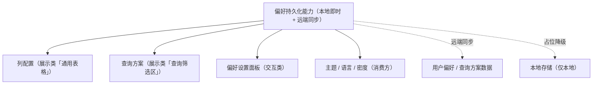

# 组件设计 · 偏好持久化能力

> 偏好持久化能力：本地即时 + 远端同步（列配置、查询方案、偏好面板、主题语言共用；远端未就绪时降级为仅本地）
> 实现侧命名与落点见《[前端基类清单](../../../../../前端基类清单.md)》（§2.1 全量基类登记表；继承链全系统唯一一份），实现契约细节见项目详细设计。

[文档首页](../../../../../文档首页.md) › [项目规划说明](../../../../../规划/项目规划说明.md) › [组件设计](../../../01_组件设计_总览.md) › 偏好持久化能力　|　[← 页签状态能力](../15_组件设计_页签状态能力/15_组件设计_页签状态能力.md)　[编辑器内核能力 →](../17_组件设计_编辑器内核能力/17_组件设计_编辑器内核能力.md)

> 可交互原型：[16_原型设计_偏好持久化能力.html](16_原型设计_偏好持久化能力.html)（演示本地即时生效、远端防抖同步与状态指示、重置默认与占位降级）

## 1. 目的与适用范围 

定义 BMS 前端**偏好持久化能力**的组件设计：为**表格列配置、查询方案、偏好设置面板、主题与语言**等提供统一的「本地即时 + 远端同步」偏好存取；远端对应用户偏好 / 查询方案数据（跨设备同步，未就绪时**占位降级为仅本地**）。它是组件设计体系的**继承链上的能力域基类**。

### 1.1 定位 

| 职责 | 归属 |
| --- | --- |
| 本地即时存取、远端同步、合并冲突策略、重置默认、占位降级 | **本节点（偏好持久化能力）** |
| 偏好内容的结构与默认值 | 各消费方（列配置、查询方案、主题等） |
| 偏好数据与接口 | 后端（阶段八回补） |
| 语言 / 时区上下文 | [语言上下文能力](../26_组件设计_语言上下文能力/26_组件设计_语言上下文能力.md)（消费者） |

上游依据：[《前端开发规范》](../../../../../规范/前端开发规范.md)（§3 能力、§6 状态管理约定）、[《概要设计 · 系统参数》](../../../../概要设计/10_概要设计_系统参数.md)（用户偏好 / 查询方案表）。

> 本篇为 **基础组件类 · 能力「偏好持久化能力」**。**范围边界**：偏好内容定义归消费方；远端数据结构归后端；本能力只管"偏好怎么存、怎么同步、怎么合并"。

## 2. 职责与组成 

| 组成部分 | 职责 |
| --- | --- |
| 偏好持久化能力核心 | 偏好：读取 / 写入 / 重置 / 远端拉取 / 立即推送；本地即时 + 远端防抖同步；占位降级 |
| 响应式投影 | 能力核心 ↔ 响应式框架的桥接；消费方经此读写偏好，同步状态可观测（投影只做桥接，不重复实现） |
| 组件包装（按需） | 模板层包装形态，按需评估 |

## 3. 交互与契约语义 

| 语义项 | 说明 |
| --- | --- |
| 偏好键 | 偏好唯一键（如列表列偏好 / 查询方案 / 界面主题） |
| 存储范围 | 三选：仅本地（本地存储）/ 仅远端（偏好数据）/ 本地即时 + 远端同步（默认组合） |
| 默认值 | 重置与首次使用的回退值 |
| 远端同步防抖 | 约 800 毫秒合并连续变更后推送 |
| 冲突合并策略 | 三选：远端优先 / 本地优先 / 深合并（默认深合并） |
| 读取 / 写入 | 本地即时生效；写入触发远端防抖同步 |
| 重置 | 恢复默认值（本地 + 远端） |
| 远端拉取 | 登录 / 切换租户后拉取远端并与本地合并 |
| 立即推送 | 离开页面 / 提交前推送未同步变更 |
| 同步状态 | 同步中 / 已同步（响应式指示） |

## 4. 交互与行为语义 

| 项 | 设计 |
| --- | --- |
| 本地优先 | 读写先走本地存储（即时生效、离线可用）；远端作为跨设备同步层 |
| 远端同步 | 写入防抖推送（合并连续变更）；登录 / 切租户 / 刷新后拉取远端与本地合并（默认深合并） |
| 冲突 | 默认深合并（远端新值覆盖叶子）；本地操作为主的偏好（如列宽拖拽）用本地优先；冲突不可自动判定时以远端为准并提示 |
| 重置 | 恢复默认值并同步清除远端 |
| 占位降级 | 偏好数据 / 查询方案接口未就绪时按占位语义：仅本地存储（存储范围自动降级），同步状态提示"仅本地"；接入后无改调用方 |
| 与页签协作 | 页签持久化由页签状态能力自管，不走本能力（保持单一职责） |
| 释放 | 同步请求登记[异步资源基类](../../01_机制基类/05_组件设计_异步资源基类/05_组件设计_异步资源基类.md)（卸载时推送并取消在途） |
| 依赖方向 | 只依赖 组件根 / 中间层基类；不依赖具体组件；消费方组合本能力 |

## 5. 场景集成 

| 场景 | 说明 |
| --- | --- |
| 列配置 | 表格列显隐 / 顺序 / 宽度，跨设备同步 |
| 查询方案 | 保存 / 应用查询条件方案（与查询方案能力协作） |
| 偏好设置面板 | 主题 / 密度 / 语言等用户偏好统一存取 |
| 语言与主题 | 语言上下文与主题品牌化读取 / 写入偏好（各自能力消费） |

## 6. 依赖接口与上游变更 

### 6.1 上游接口与口径 

| 项 | 说明 | 目标文档 |
| --- | --- | --- |
| 分层权威 | 偏好能力职责与本地 / 远端口径 | [《前端开发规范》](../../../../../规范/前端开发规范.md) 第 3 节（登记项①） |
| 偏好数据与接口 | 用户偏好 / 查询方案数据与读写接口 | [《概要设计 · 系统参数》](../../../../概要设计/10_概要设计_系统参数.md)（登记项②） |
| 多租户隔离 | 偏好的租户隔离与切换 | [《概要设计》](../../../../概要设计/01_概要设计_总览.md)（登记项③） |
| 新增依赖 | **无**：复用既有存储与请求基础件 | — |

### 6.2 需登记的上游变更 

| 变更点 | 目标文档 | 内容 |
| --- | --- | --- |
| ① 偏好持久化契约 | [《前端开发规范》](../../../../../规范/前端开发规范.md) 第 3 节 | 明确偏好持久化能力：本地即时 + 远端防抖同步 + 合并策略 + 重置 + 占位降级（仅本地） |
| ② 偏好接口 | [《概要设计》](../../../../概要设计/01_概要设计_总览.md) 对应节点 | 偏好读写（批量读取 / 写入）与查询方案接口；跨设备同步语义 |
| ③ 租户切换 | [《概要设计》](../../../../概要设计/01_概要设计_总览.md) 对应节点 | 切换租户后偏好重新拉取与隔离口径 |

> 按[《文档生成规范》](../../../../../规范/文档生成规范.md)「引用与追溯」节，上述变更需用户确认后由上游文档同步；本节点只定义偏好持久化能力语义与契约。

## 7. 权限 / i18n / 移动端 

- **权限**：偏好存取按用户隔离（后端鉴权）；前端不判权。
- **i18n**：偏好内容不涉及文案（值本身）；面板文案走全局语言能力。
- **移动端**：PC 与移动端为同一契约的多实现（同一套契约断言保障），能力语义一致；移动端偏好键按端区分（避免相互覆盖）。

## 8. 性能与边界 

| 场景 | 设计 |
| --- | --- |
| 写入 | 本地写即时；远端防抖合并（避免每次拖拽全量推送） |
| 读取 | 同步读本地（首屏不等待远端）；远端异步合并后响应式刷新 |
| 边界 | 本地与远端冲突、本地存储容量（大对象裁剪）、隐私模式禁用本地存储（降级内存）、跨租户污染、未登录时远端跳过 |
| 不支持 | 偏好内容定义（消费方）、偏好数据与接口（后端）、页签持久化（页签状态能力） |

## 9. 检查清单 

- □ 契约语义：偏好键 / 存储范围（仅本地 / 仅远端 / 组合）/ 默认值 / 远端同步防抖 / 冲突合并策略；读取 / 写入 / 重置 / 远端拉取 / 立即推送；同步状态
- □ 行为：本地即时 + 远端防抖、合并策略、重置双清、占位降级仅本地、释放登记异步资源
- □ 消费方（列配置 / 查询方案 / 偏好面板 / 语言主题）组合本能力；依赖方向单向
- □ 权限 / i18n / 移动端符合第 7 节；性能边界符合第 8 节
- □ 三项上游登记已确认

> 组件设计节点（偏好持久化能力）· 与[《前端开发规范》](../../../../../规范/前端开发规范.md)[《概要设计 · 系统参数》](../../../../概要设计/10_概要设计_系统参数.md)[列配置能力](../28_组件设计_列配置能力/28_组件设计_列配置能力.md)[查询方案能力](../29_组件设计_查询方案能力/29_组件设计_查询方案能力.md)[偏好设置面板](../../../08_交互类/15_组件设计_偏好设置面板/15_组件设计_偏好设置面板.md)《命名规范》配套
