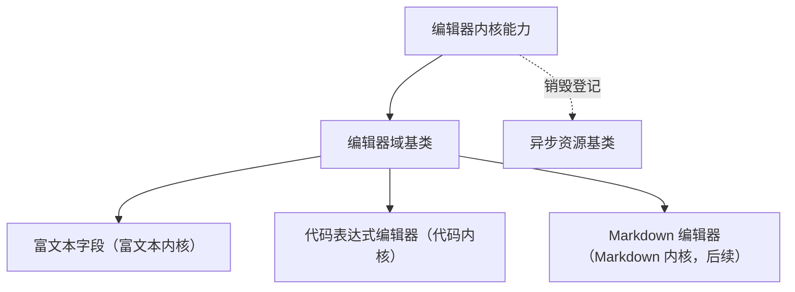

# 组件设计 · 编辑器内核能力

> 编辑器内核能力：内核懒加载 / 实例创建与销毁 / 内容协议读写（代码编辑器与富文本、Markdown 共用，差异由内核类型决定）
> 实现侧命名与落点见《[前端基类清单](../../../../../前端基类清单.md)》（「能力」节），实现契约细节见项目详细设计。

[文档首页](../../../../../文档首页.md) › [项目规划说明](../../../../../规划/项目规划说明.md) › [组件设计](../../../01_组件设计_总览.md) › 编辑器内核能力　|　[← 偏好持久化能力](../16_组件设计_偏好持久化能力/16_组件设计_偏好持久化能力.md)　[树数据能力 →](../18_组件设计_树数据能力/18_组件设计_树数据能力.md)

> 可交互原型：[17_原型设计_编辑器内核能力.html](17_原型设计_编辑器内核能力.html)（演示内核按需加载、实例创建 / 销毁与内容协议读写；同屏多实例共享内核模块）

## 1. 目的与适用范围 

定义 BMS 前端**编辑器内核能力**的组件设计：为 [编辑器域基类](../../03_域基类/05_组件设计_编辑器域基类/05_组件设计_编辑器域基类.md) 提供底层能力——**内核懒加载（独立分包）、实例创建与销毁、内容协议读写**；代码编辑器与富文本 / Markdown 编辑器**共用同一能力**，差异由**内核类型**（富文本 / Markdown / 代码）决定。它是组件设计体系的**能力层**（继承链上的一层，经能力机制声明与登记）。

### 1.1 定位 

| 职责 | 归属 |
| --- | --- |
| 内核懒加载（分包）、实例创建 / 销毁、内容协议读写、多实例共享 | **本节点（编辑器内核能力）** |
| 域契约（只读 / 高度 / 工具栏插槽 / 上传配置） | [编辑器域基类](../../03_域基类/05_组件设计_编辑器域基类/05_组件设计_编辑器域基类.md) |
| 富文本图片上传 | [上传引擎能力](../13_组件设计_上传引擎能力/13_组件设计_上传引擎能力.md) |
| 具体编辑器产品（版本 / 插件） | 实现层（本能力定义加载与协议契约） |

上游依据：[《前端开发规范》](../../../../../规范/前端开发规范.md)（§3 能力）、[《架构设计 · 前端组件体系》](../../../../架构设计/05_架构设计_前端组件体系.md)（重组件异步加载与分包策略）。

> 本篇为 **基础组件类 · 能力「编辑器内核能力」**。**范围边界**：域契约归编辑器域基类；上传归上传引擎；本能力只管"内核怎么加载、实例怎么管、内容怎么读写"。

## 2. 职责与组成 

| 组成部分 | 职责 |
| --- | --- |
| 编辑器内核能力核心 | 内核懒加载（独立分包）、实例创建 / 销毁、内容协议读写、多实例共享 |
| 内核模块缓存（能力内部机制） | 同屏多编辑器共享已加载内核模块，避免重复加载 |
| 响应式投影（按需） | 能力核心 ↔ 响应式框架的桥接（投影只做桥接，不重复实现） |

## 3. 交互与契约语义 

| 语义项 | 说明 |
| --- | --- |
| 内核类型 | 三选：富文本 / Markdown / 代码，决定加载的模块与内容协议 |
| 语言包 | 代码模式的语言包（如 SQL / JSON），同样按需懒加载 |
| 只读 | 禁编辑、保留复制与滚动；切换只读不重建实例 |
| 占位提示 | 内核支持时透传 |
| 加载内核 | 按需加载内核模块（模块级缓存，重复调用不重复加载） |
| 创建实例 | 内核就绪后创建实例（挂载点 + 选项），返回统一实例句柄 |
| 销毁实例 | 幂等销毁（登记异步资源，卸载自动调用） |
| 内容读写 | 按内核类型协议归一：HTML / Markdown / 纯文本 |
| 内容变更回调 | 由编辑器域基类去抖后对外抛出 |

## 4. 交互与行为语义 

| 项 | 设计 |
| --- | --- |
| 懒加载 | 按需加载（独立分包）；模块级缓存，**同屏多实例共享已加载模块**；加载失败重试一次并提示 |
| 加载时机 | 由编辑器域基类决定（首次进入视口 / 聚焦 / 编辑态）；本能力只提供加载能力 |
| 实例协议 | 创建返回统一句柄（内容读 / 内容写 / 聚焦 / 销毁），屏蔽不同内核差异 |
| 销毁 | 幂等；登记[异步资源基类](../../01_机制基类/05_组件设计_异步资源基类/05_组件设计_异步资源基类.md)，卸载自动销毁（防 DOM / 定时器泄漏） |
| 内容协议 | 富文本＝HTML（提交前 / 渲染时白名单净化 + 服务端二次）；Markdown＝Markdown 文本；代码＝纯文本 + 语言标记；协议只在本能力内归一，对外一致 |
| 只读 | 只读透传内核（禁编辑、保复制滚动）；切换只读不重建实例 |
| 依赖方向 | 只依赖 组件根 / 机制基类；被编辑器域基类组合；不依赖具体字段组件 |

## 5. 场景集成 

| 场景 | 说明 |
| --- | --- |
| 富文本字段 | 富文本内核：公告 / 说明 / 审批意见（叠加输入域基类与字段壳） |
| 代码表达式编辑器 | 代码内核 + 语言包：表单公式 / 报表表达式 / 规则脚本 |
| 同屏多编辑器 | 表单多项富文本 / 代码项：共享内核模块，各自独立实例 |
| 内容渲染 | 展示侧按内容协议渲染（净化后），与编辑协议一致 |

## 6. 依赖接口与上游变更 

### 6.1 上游接口与口径 

| 项 | 说明 | 目标文档 |
| --- | --- | --- |
| 分层权威 | 编辑器内核能力职责与协议口径 | [《前端开发规范》](../../../../../规范/前端开发规范.md) 第 3 节（登记项①） |
| 分包加载 | 内核模块独立分包（首屏不含） | [《架构设计 · 前端组件体系》](../../../../架构设计/05_架构设计_前端组件体系.md)「分包与加载策略」节（登记项②） |
| 内容安全 | 富文本净化责任边界（前端白名单 + 服务端二次） | [编辑器域基类](../../03_域基类/05_组件设计_编辑器域基类/05_组件设计_编辑器域基类.md) + [《架构设计 · 安全》](../../../../架构设计/01_架构设计_总览.md)（登记项③） |
| 新增依赖 | 编辑器内核（代码编辑器与富文本内核，版本随实现锁定） | — |

### 6.2 需登记的上游变更 

| 变更点 | 目标文档 | 内容 |
| --- | --- | --- |
| ① 编辑器内核契约 | [《前端开发规范》](../../../../../规范/前端开发规范.md) 第 3 节 | 明确编辑器内核能力：内核懒加载（分包 / 模块缓存）/ 实例协议 / 销毁 / 内容协议（富文本 / Markdown / 代码） |
| ② 分包策略 | [《架构设计 · 前端组件体系》](../../../../架构设计/05_架构设计_前端组件体系.md) | 编辑器内核与语言包异步加载、独立分包，同屏多实例共享 |
| ③ 内容净化 | [《架构设计》](../../../../架构设计/01_架构设计_总览.md) 安全节点 + [编辑器域基类](../../03_域基类/05_组件设计_编辑器域基类/05_组件设计_编辑器域基类.md) | 前端白名单净化 + 服务端二次净化的责任边界 |

> 按[《文档生成规范》](../../../../../规范/文档生成规范.md)「引用与追溯」节，上述变更需用户确认后由上游文档同步；本节点只定义编辑器内核能力语义与契约。

## 7. 权限 / i18n / 移动端 

- **权限**：不做权限判定（编辑器只读由编辑器域基类 / 字段权限决定）。
- **i18n**：内核语言包按 locale 懒加载；工具栏文案由编辑器域基类处理。
- **移动端**：PC 与移动端为同一契约的多实现（同一套契约断言保障），内核可不同（内容协议同源，数据兼容）。

## 8. 性能与边界 

| 场景 | 设计 |
| --- | --- |
| 分包 | 内核 / 语言包异步加载，独立分包；模块缓存防重复加载 |
| 多实例 | 每实例独立视图与状态；销毁彻底（事件 / 定时器 / 观察器） |
| 边界 | 加载失败（重试 + 降级纯文本）、实例未销毁泄漏、协议不一致（历史数据）、只读切换重建、语言包缺失 |
| 不支持 | 域契约（编辑器域基类）、上传（上传引擎能力）、具体编辑器产品配置（使用方） |

## 9. 检查清单 

- □ 契约语义：内核类型 / 语言包 / 只读 / 占位提示；加载内核 / 创建实例 / 销毁实例 / 内容读写 / 内容变更回调
- □ 行为：懒加载与模块缓存、统一实例协议、幂等销毁（登记异步资源）、内容协议归一、加载失败重试
- □ 被编辑器域基类组合；依赖方向单向（不依赖具体字段组件）
- □ 权限 / i18n / 移动端符合第 7 节；性能边界符合第 8 节
- □ 三项上游登记已确认

> 组件设计节点（编辑器内核能力）· 与[《前端开发规范》](../../../../../规范/前端开发规范.md)[《架构设计 · 前端组件体系》](../../../../架构设计/05_架构设计_前端组件体系.md)[编辑器域基类](../../03_域基类/05_组件设计_编辑器域基类/05_组件设计_编辑器域基类.md)[上传引擎能力](../13_组件设计_上传引擎能力/13_组件设计_上传引擎能力.md)[异步资源基类](../../01_机制基类/05_组件设计_异步资源基类/05_组件设计_异步资源基类.md)《命名规范》配套
