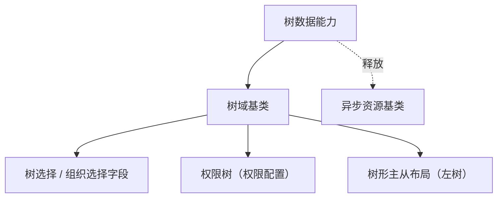

# 组件设计 · 树数据能力

> 树数据能力：加载 / 懒加载 / 选中与勾选 / 过滤（树选择、组织树、权限树、树形主从共用）
> 实现侧命名与落点见《[前端基类清单](../../../../../前端基类清单.md)》（「能力」节），实现契约细节见项目详细设计。

[文档首页](../../../../../文档首页.md) › [项目规划说明](../../../../../规划/项目规划说明.md) › [组件设计](../../../01_组件设计_总览.md) › 树数据能力　|　[← 编辑器内核能力](../17_组件设计_编辑器内核能力/17_组件设计_编辑器内核能力.md)　[用户展示能力 →](../19_组件设计_用户展示能力/19_组件设计_用户展示能力.md)

> 可交互原型：[18_原型设计_树数据能力.html](18_原型设计_树数据能力.html)（演示加载 / 懒加载缓存、选中与勾选模型、关键字过滤与请求释放）

## 1. 目的与适用范围 

定义 BMS 前端**树数据能力**的组件设计：承载树形态的**数据与选择模型**——加载 / 懒加载、数据归一、选中 / 勾选、关键字过滤；由 [树域基类](../../03_域基类/03_组件设计_树域基类/03_组件设计_树域基类.md) 组合，供**树选择字段、组织树、权限树、树形主从布局**共用。它是组件设计体系的**能力层**（继承链上的一层，经能力机制声明与登记）。

### 1.1 定位 

| 职责 | 归属 |
| --- | --- |
| 数据加载 / 懒加载、归一、选中 / 勾选模型、过滤、缓存 | **本节点（树数据能力）** |
| 域契约与组件包装（插槽 / 事件） | [树域基类](../../03_域基类/03_组件设计_树域基类/03_组件设计_树域基类.md) |
| 字段语义（标签 / 必填 / 校验） | [字段编排能力](../09_组件设计_字段编排能力/09_组件设计_字段编排能力.md) 与字段壳 |
| 树数据的后端接口 | 组织 / 权限 / 字典树接口（模块接口） |

上游依据：[《前端开发规范》](../../../../../规范/前端开发规范.md)（§3 能力）、[《前端基类清单》](../../../../../前端基类清单.md)「能力」节、[《概要设计》](../../../../概要设计/01_概要设计_总览.md)（组织 / 权限树结构）。

> 本篇为 **基础组件类 · 能力「树数据能力」**。**范围边界**：组件包装与插槽归树域基类；字段外观归输入域基类与字段壳；本能力只管"树数据与选择状态"。

## 2. 职责与组成 

| 组成部分 | 职责 |
| --- | --- |
| 树数据能力核心 | 树数据：加载 / 懒加载 / 归一 / 选中 / 勾选 / 过滤；懒加载缓存与释放 |
| 响应式投影（按需） | 能力核心 ↔ 响应式框架的桥接（投影只做桥接，不重复实现） |

## 3. 交互与契约语义 

| 语义项 | 说明 |
| --- | --- |
| 节点键 / 文本 / 子节点字段 | 数据归一映射（键 / 文本 / 子级；叶标记决定是否可懒加载） |
| 勾选与父子独立 | 勾选模型（含半选）；父子勾选是否独立可配 |
| 懒加载模式 | 按需拉取子级 |
| 树数据与加载态 | 数据与加载状态（响应式） |
| 选择状态集合 | 选中键 / 勾选键 / 展开键 |
| 加载根节点 | 远程模式加载根节点 |
| 懒加载子级 | 按需拉取子级（记录已加载标记，重复展开不重复请求） |
| 数据归一 | 后端树 → 前端节点（键 / 文本 / 子级映射） |
| 单选 / 选择键集合 | 单选模型（受控） |
| 勾选 / 取勾选 | 勾选模型（级联 / 独立；返回可含半选） |
| 过滤 | 保留命中节点及祖先路径 |

## 4. 交互与行为语义 

| 项 | 设计 |
| --- | --- |
| 归一 | 按节点键 / 文本 / 子节点字段映射；空子级与叶标记决定是否可懒加载 |
| 懒加载缓存 | 每节点记录已加载；重复展开命中缓存；父级刷新时清理子级缓存 |
| 选择模型 | 单选与勾选独立；勾选级联由本能力计算（视图层不重复计算，二者口径统一）；半选集合可查询 |
| 过滤 | 本地过滤保留命中节点及祖先；远程过滤由加载根节点带参（由使用方选） |
| 释放 | 在途请求登记[异步资源基类](../../01_机制基类/05_组件设计_异步资源基类/05_组件设计_异步资源基类.md)（卸载 / 参数变化自动取消，防竞态） |
| 受控与视图 | 数据与选择状态在本能力维护（受控输入输出）；视图渲染归树域基类 |
| 依赖方向 | 只依赖 组件根 / 机制基类；被树域基类组合；不依赖字段组件 |

## 5. 场景集成 

| 场景 | 说明 |
| --- | --- |
| 树选择 / 组织选择字段 | 单选模型 + 回显（配合选项源能力做组织数据源） |
| 权限树 | 勾选模型（含半选）回传（权限配置） |
| 树形主从布局 | 单选节点驱动右侧列表 / 详情 |
| 字典树 / 分类树 | 懒加载大数据量树 |

## 6. 依赖接口与上游变更 

### 6.1 上游接口与口径 

| 项 | 说明 | 目标文档 |
| --- | --- | --- |
| 分层权威 | 树数据能力职责与选择模型口径 | [《前端开发规范》](../../../../../规范/前端开发规范.md) 第 3 节（登记项①） |
| 树数据结构 | 组织 / 权限 / 分类树字段与懒加载接口 | [《概要设计》](../../../../概要设计/01_概要设计_总览.md) 对应节点（登记项②） |
| 组合关系 | 能力 → 树域基类 → 字段 / 布局组件的组合关系 | [《架构设计 · 前端架构》](../../../../架构设计/08_架构设计_前端架构.md)（登记项③） |
| 新增依赖 | **无**：复用既有请求与树形态基础件 | — |

### 6.2 需登记的上游变更 

| 变更点 | 目标文档 | 内容 |
| --- | --- | --- |
| ① 树数据能力契约 | [《前端开发规范》](../../../../../规范/前端开发规范.md) 第 3 节 | 明确树数据能力：加载 / 懒加载缓存 / 归一 / 选中·勾选模型 / 过滤 / 释放 |
| ② 树接口结构 | [《概要设计》](../../../../概要设计/01_概要设计_总览.md) 对应节点 | 组织 / 权限 / 分类树的节点字段与懒加载接口（含叶标记） |
| ③ 域组合关系 | [《架构设计 · 前端架构》](../../../../架构设计/08_架构设计_前端架构.md) | 登记「能力（树数据）→ 域基类（树域）→ 字段 / 布局组件」组合链 |

> 按[《文档生成规范》](../../../../../规范/文档生成规范.md)「引用与追溯」节，上述变更需用户确认后由上游文档同步；本节点只定义树数据能力语义与契约。

## 7. 权限 / i18n / 移动端 

- **权限**：树数据范围由后端过滤；前端可叠加节点禁用态；本能力不判权。
- **i18n**：节点文本由接口按 locale 下发；无需前端翻译。
- **移动端**：PC 与移动端为同一契约的多实现（同一套契约断言保障），数据与选择模型一致。

## 8. 性能与边界 

| 场景 | 设计 |
| --- | --- |
| 大数据量 | 懒加载优先；一次性加载设节点上限保护；展开态按需维护 |
| 更新 | 节点级更新（刷新某一子树）不整树重建 |
| 边界 | 键重复、懒加载失败重试、过滤后展开态恢复、勾选半选计算、受控与视图不一致、请求竞态 |
| 不支持 | 组件包装与插槽（树域基类）、字段外观（字段壳）、权限判定 |

## 9. 检查清单 

- □ 契约语义：节点键 / 文本 / 子节点字段 / 勾选开关 / 父子独立 / 懒加载；加载根节点 / 懒加载子级 / 归一 / 单选 / 勾选 / 过滤
- □ 行为：懒加载缓存、选择模型（含半选）、过滤保留祖先、请求释放（登记异步资源）、受控一致
- □ 被树域基类组合；依赖方向单向
- □ 权限 / i18n / 移动端符合第 7 节；性能边界符合第 8 节
- □ 三项上游登记已确认

> 组件设计节点（树数据能力）· 与[《前端开发规范》](../../../../../规范/前端开发规范.md)[《前端基类清单》](../../../../../前端基类清单.md)[树域基类](../../03_域基类/03_组件设计_树域基类/03_组件设计_树域基类.md)[选项源能力](../12_组件设计_选项源能力/12_组件设计_选项源能力.md)[异步资源基类](../../01_机制基类/05_组件设计_异步资源基类/05_组件设计_异步资源基类.md)《命名规范》配套
