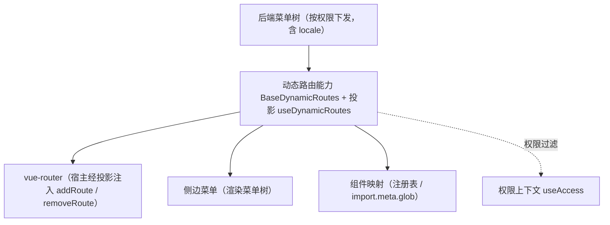

# 组件设计 · 动态路由能力

> `BaseDynamicRoutes`（核心能力类，key `dynamic-routes`；`frontend/packages/core/src/capabilities/dynamic-routes.ts`，登记 `capabilities/manifest.ts`）+ 投影 `useDynamicRoutes`（`frontend/packages/vue/src/bindings/useDynamicRoutes.ts`）· 动态路由注册：菜单树 → 路由构建 / 注册 / 卸载（前端不硬编码路由表；宿主 `frontend/apps/*` 经 `@bms/vue` 投影消费，`router/menuRoutes.ts`）

[文档首页](../../../../../文档首页.md) › [项目规划说明](../../../../../规划/项目规划说明.md) › [组件设计](../../../01_组件设计_总览.md) › 动态路由能力　|　[← 用户展示能力](../19_组件设计_用户展示能力/19_组件设计_用户展示能力.md)　[表单元数据能力 →](../21_组件设计_表单元数据能力/21_组件设计_表单元数据能力.md)

> 可交互原型：[20_原型设计_动态路由能力.html](20_原型设计_动态路由能力.html)（演示菜单树 → 路由构建、注册 / 卸载、白名单与未注册拦截）

## 1. 目的与适用范围 

定义 BMS 前端 `frontend/packages/*`（核心 `frontend/packages/core` + Vue 投影 `frontend/packages/vue`；渲染插件 `ui-ep` / `ui-vant` 按需）**动态路由能力（原「动态路由能力」）**的组件设计：核心能力类 `BaseDynamicRoutes`（`frontend/packages/core/src/capabilities/dynamic-routes.ts`，登记 `capabilities/manifest.ts`）+ 投影 `useDynamicRoutes`（`frontend/packages/vue/src/bindings/useDynamicRoutes.ts`）。它是组件设计体系**能力（key `dynamic-routes`）**，承载**菜单树 → 路由的构建、注册与卸载**——[《前端开发规范》](../../../../../规范/前端开发规范.md) §7 强制"菜单树由后端按权限动态下发，前端动态注册路由，**禁止硬编码路由表**"；宿主 `frontend/apps/*` 经 `@bms/vue` 投影消费（`router/menuRoutes.ts`），配合 [侧边菜单](../../../08_交互类/13_组件设计_侧边菜单/13_组件设计_侧边菜单.md) 与[注册表基类](../../01_机制基类/06_组件设计_注册表基类/06_组件设计_注册表基类.md)。

### 1.1 定位 

| 职责 | 归属 |
| --- | --- |
| 菜单树 → 路由构建、注册 / 卸载、组件映射、白名单与拦截 | **本节点（动态路由能力）** |
| 菜单树渲染 | [侧边菜单](../../../08_交互类/13_组件设计_侧边菜单/13_组件设计_侧边菜单.md) |
| 组件注册表 | [注册表基类](../../01_机制基类/06_组件设计_注册表基类/06_组件设计_注册表基类.md)（组件名 → 组件映射） |
| 权限码校验与过滤 | [权限上下文能力](../27_组件设计_权限上下文能力/27_组件设计_权限上下文能力.md) 与路由守卫 |
| 运行时模块加载（微前端） | 阶段五宿主外壳与模块加载器（本能力提供注册接口） |

上游依据：[《前端开发规范》](../../../../../规范/前端开发规范.md)（§7 动态菜单与权限）、[《架构设计 · 前端架构》](../../../../架构设计/08_架构设计_前端架构.md)（动态路由与插件化）、[《概要设计 · 菜单管理》](../../../../概要设计/01_概要设计_总览.md)（菜单树下发）。

> 本篇为 **基础组件类 · 能力「动态路由能力」**。**范围边界**：菜单树渲染归侧边菜单；组件映射归注册表；权限判定归权限上下文与守卫；本能力只管"路由怎么注册与卸载"。

## 2. 组件清单与职责 

| 组件 / 工具 | 位置 | 职责 |
| --- | --- | --- |
| `BaseDynamicRoutes`（核心能力类，key `dynamic-routes`） | `frontend/packages/core/src/capabilities/dynamic-routes.ts`（登记 `capabilities/manifest.ts`） | 路由：`buildRoutes`（菜单树 → 路由构建）/ `register` / `unregister` / `hasRoute` / `reset`；反应式 `routes`；菜单树转换与组件映射 |
| `useDynamicRoutes`（Vue 投影） | `frontend/packages/vue/src/bindings/useDynamicRoutes.ts` | 核心 `BaseDynamicRoutes` ↔ Vue；宿主 `frontend/apps/*` 消费（`router/menuRoutes.ts`），注册 / 卸载动作由宿主注入（`onRegister` / `onUnregister`） |
| `routeGuards.ts`（能力内部机制） | 未单独落码（守卫随宿主 `frontend/apps/*`，随回补波重建） | 注册 / 卸载的守卫协作（白名单、404、未注册拦截） |

> **实现口径（2026-09-17，新体系）**：原「动态路由能力」（旧 `useDynamicRoutes` 组合式）中，路由构建与登记已类化为核心能力类 `BaseDynamicRoutes`（`frontend/packages/core/src/capabilities/dynamic-routes.ts`，继承 `BaseCapability`，登记 `capabilities/manifest.ts`，提供 `buildRoutes` + 反应式 `routes` / `register` / `unregister` / `hasRoute` / `reset`，注册动作经注入 adapter 承担、核心不依赖路由库）+ Vue 投影 `useDynamicRoutes`（`frontend/packages/vue/src/bindings/useDynamicRoutes.ts`，`useXxx` 只存在于此）；宿主 `frontend/apps/*` 经 `@bms/vue` 投影消费（`router/menuRoutes.ts`）。旧实现已删除（历史经 git 追溯），守卫按需随回补波落宿主。`depends` 由能力机制开发态校验（单向、无循环）；契约语义（参数 / 方法 / 事件 / 行为规则）保持不变。

- 命名遵循[《命名规范》](../../../../../规范/命名规范.md)：核心能力类 `BaseXxx`、Vue 投影 `useXxx`（`useXxx` 只落 `frontend/packages/vue/src/bindings/`）；位置遵循[《前端开发规范》](../../../../../规范/前端开发规范.md)（核心能力类落 `frontend/packages/core/src/capabilities/<key>.ts`，登记 `capabilities/manifest.ts`）。

## 3. 契约（参数与方法） 

| 选项 | 类型 | 默认 | 说明 |
| --- | --- | --- | --- |
| `key` | string | `'dynamic-routes'` | 能力 key（登记与依赖引用用） |
| `adapter` | `{ register, unregister }` | — | 路由适配器（宿主经投影注入 `addRoute` / `removeRoute`；缺省占位，不操作真实路由） |

| 方法 / 成员 | 说明 |
| --- | --- |
| `buildRoutes(menuTree, { pathPrefix, allowedPaths })` | 菜单树 → 路由记录（path / name / meta.title / component 映射；`public` 节点与白名单路径不参与注册） |
| `register(routes)` | 登记（按名去重合并；返回新增条数） |
| `unregister(names?)` | 卸载（缺省全部；返回移除条数） |
| `hasRoute(name)` | 判定是否已注册 |
| `reset()` | 全量重置（先卸载全部） |
| `routes` | 已注册路由清单（响应式 `observable`，供菜单渲染） |
| `describe()` | 元信息（含 `placeholder`（无 adapter 占位）与 `registered` 数量） |

- 投影 `useDynamicRoutes`：宿主经 `@bms/vue` 消费（响应式 `pathPrefix` / `allowedPaths` + `onRegister` / `onUnregister` + `routes` / `registered`）。
- 原设计面（未落码）：`mode`（菜单 / 模块来源）与 `fallback404`——404 兜底归宿主路由守卫；运行时模块来源随微前端阶段五。

## 4. 行为与实现约定 

| 项 | 设计 |
| --- | --- |
| 组件映射 | `component` 名 → 组件：经[注册表基类](../../01_机制基类/06_组件设计_注册表基类/06_组件设计_注册表基类.md)（`import.meta.glob` 批量注册）；**未注册组件名拦截并提示**（防白屏） |
| 权限过滤 | 菜单树已按权限下发（后端）；前端注册时再经[权限上下文能力](../27_组件设计_权限上下文能力/27_组件设计_权限上下文能力.md)过滤（双保险）；无权限路由直达仍被守卫拦截 |
| 注册时机 | 登录成功 / 刷新恢复后拉取菜单 → `buildRoutes` → `register`；注册完成前不渲染菜单（避免闪烁） |
| 卸载 | 退出登录 / 切换租户：`unregister` 清空动态路由（防越权访问）；模块卸载同口径 |
| 白名单与 404 | `allowedPaths` 不参与动态注册；未注册路径由宿主路由守卫兜底 404（含菜单配置错误的提示；`fallback404` 为原设计面） |
| 模块模式 | 阶段五运行时模块以同一套契约注册（`mode` 为原设计面），宿主注入上下文 |
| 释放 | 菜单拉取请求登记[异步资源基类](../../01_机制基类/05_组件设计_异步资源基类/05_组件设计_异步资源基类.md) |
| 依赖方向 | 只依赖 组件根 / 注册表基座 / 权限上下文 / 机制基类；供宿主 `frontend/apps/*`（经 `@bms/vue` 投影）与布局壳消费 |

## 5. 场景集成 

| 场景 | 说明 |
| --- | --- |
| 登录后初始化 | 拉取菜单树 → 注册路由 → 渲染侧边菜单与页签 |
| 刷新恢复 | 重新拉取菜单并注册（幂等，已注册跳过） |
| 退出 / 切租户 | 卸载全部动态路由 + 清缓存 |
| 微前端模块 | 宿主外壳按模块清单加载并以同一套契约注册路由（`mode` 为原设计面） |

## 6. 依赖接口与上游变更 

### 6.1 上游接口与口径 

| 项 | 说明 | 目标文档 |
| --- | --- | --- |
| 分层权威 | 动态路由能力职责与禁硬编码口径 | [《前端开发规范》](../../../../../规范/前端开发规范.md) §7（登记项①） |
| 菜单树下发 | 菜单树结构与权限过滤 | [《概要设计 · 菜单管理》](../../../../概要设计/01_概要设计_总览.md)（登记项②） |
| 前端架构 | 动态路由与运行时模块 | [《架构设计 · 前端架构》](../../../../架构设计/08_架构设计_前端架构.md)「前端插件化与运行时组合」节（登记项③） |
| 新增依赖 | **无** | — |

### 6.2 需登记的上游变更 

| 变更点 | 目标文档 | 内容 |
| --- | --- | --- |
| ① 动态路由能力契约 | [《前端开发规范》](../../../../../规范/前端开发规范.md) §7 | 明确 `BaseDynamicRoutes`（投影 `useDynamicRoutes`）：菜单树 → 路由构建 / 注册 / 卸载；组件映射经注册表；未注册拦截；白名单与 404 |
| ② 菜单树下发 | [《概要设计》](../../../../概要设计/01_概要设计_总览.md) 对应节点 | 菜单树字段（path / name / component / meta.title / 权限）与刷新恢复语义 |
| ③ 模块注册模式 | [《架构设计 · 前端架构》](../../../../架构设计/08_架构设计_前端架构.md) | 运行时模块以同一套契约注册路由（阶段五宿主外壳对接） |

> 按[《文档生成规范》](../../../../../规范/文档生成规范.md)「引用与追溯」节，上述变更需用户确认后由上游文档同步。

## 7. 权限 / i18n / 移动端 

- **权限**：菜单树按权限下发 + 注册时二次过滤 + 守卫拦截；**前端不硬编码路由表**。
- **i18n**：菜单标题由后端按 locale 下发；`meta.title` 存已翻译标题。
- **移动端**：`ui-vant` 为同一契约的另一实现（契约套件同一套断言），机制一致（菜单/路由注册方式相同，交互不同）。

## 8. 性能与边界 

| 场景 | 设计 |
| --- | --- |
| 注册 | 批量注册（一次 `addRoute` 多条）；组件懒加载（路由级分包） |
| 边界 | 组件名未注册（拦截提示）、菜单配置错误（404 兜底）、重复注册（幂等跳过）、切换租户残留（卸载清空）、刷新竞态 |
| 不支持 | 菜单渲染（侧边菜单）、组件映射存储（注册表基座）、权限判定（权限上下文 / 守卫） |

## 9. 检查清单 

- □ 契约：能力选项（`key` / `adapter`）+ `buildRoutes`（`pathPrefix` / `allowedPaths`）/ `register` / `unregister` / `hasRoute` / `reset` / `routes`；原设计面（`mode` / `fallback404`）按需补
- □ 行为：组件映射经注册表、未注册拦截、权限双保险、登录 / 刷新注册、退出 / 切租户卸载、白名单与 404
- □ 禁止硬编码路由表；供宿主 `frontend/apps/*` 与布局壳消费，依赖方向单向
- □ 权限/i18n/移动端符合第 7 节；性能边界符合第 8 节
- □ 三项上游登记已确认

> 组件设计节点（动态路由能力）· 与[《前端开发规范》](../../../../../规范/前端开发规范.md)[《架构设计 · 前端架构》](../../../../架构设计/08_架构设计_前端架构.md)[注册表基类](../../01_机制基类/06_组件设计_注册表基类/06_组件设计_注册表基类.md)[权限上下文能力](../27_组件设计_权限上下文能力/27_组件设计_权限上下文能力.md)[侧边菜单](../../../08_交互类/13_组件设计_侧边菜单/13_组件设计_侧边菜单.md)《命名规范》配套
