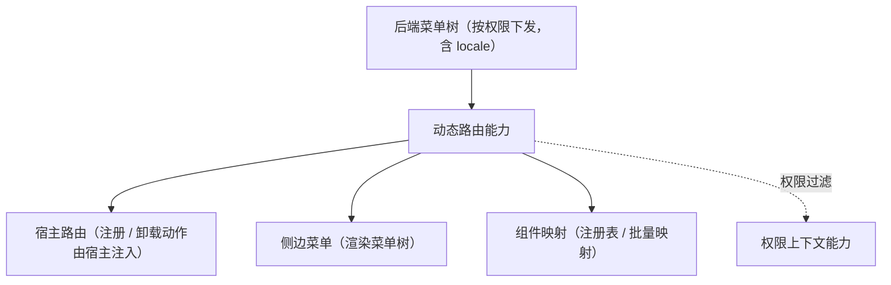

# 组件设计 · 动态路由能力

> 动态路由：菜单树 → 路由构建 / 注册 / 卸载（前端不硬编码路由表；供宿主外壳与布局壳消费）
> 实现侧命名与落点见《[前端基类清单](../../../../../前端基类清单.md)》（§2.1 全量基类登记表；继承链全系统唯一一份），实现契约细节见项目详细设计。

[文档首页](../../../../../文档首页.md) › [项目规划说明](../../../../../规划/项目规划说明.md) › [组件设计](../../../01_组件设计_总览.md) › 动态路由能力　|　[← 用户展示能力](../19_组件设计_用户展示能力/19_组件设计_用户展示能力.md)　[表单元数据能力 →](../21_组件设计_表单元数据能力/21_组件设计_表单元数据能力.md)

> 可交互原型：[20_原型设计_动态路由能力.html](20_原型设计_动态路由能力.html)（演示菜单树 → 路由构建、注册 / 卸载、白名单与未注册拦截）

## 1. 目的与适用范围 

定义 BMS 前端**动态路由能力**的组件设计：承载**菜单树 → 路由的构建、注册与卸载**——[《前端开发规范》](../../../../../规范/前端开发规范.md) §7 强制"菜单树由后端按权限动态下发，前端动态注册路由，**禁止硬编码路由表**"；与[侧边菜单](../../../08_交互类/13_组件设计_侧边菜单/13_组件设计_侧边菜单.md)（菜单树渲染）与[注册表基类](../../01_机制基类/06_组件设计_注册表基类/06_组件设计_注册表基类.md)（组件映射）协作。

### 1.1 定位与职责边界 

| 职责 | 归属 |
| --- | --- |
| 菜单树 → 路由构建、注册 / 卸载、组件映射、白名单与拦截 | **本节点（动态路由能力）** |
| 菜单树渲染 | [侧边菜单](../../../08_交互类/13_组件设计_侧边菜单/13_组件设计_侧边菜单.md) |
| 组件注册表 | [注册表基类](../../01_机制基类/06_组件设计_注册表基类/06_组件设计_注册表基类.md)（组件名 → 组件映射） |
| 权限码校验与过滤 | [权限上下文能力](../27_组件设计_权限上下文能力/27_组件设计_权限上下文能力.md) 与宿主路由守卫 |
| 运行时模块加载（微前端） | 阶段五宿主外壳与模块加载器（本能力提供注册接口） |

上游依据：[《前端开发规范》](../../../../../规范/前端开发规范.md)（§7 动态菜单与权限）、[《架构设计 · 前端架构》](../../../../架构设计/08_架构设计_前端架构.md)（动态路由与插件化）、[《概要设计 · 菜单管理》](../../../../概要设计/01_概要设计_总览.md)（菜单树下发）。

> 本篇为 **基础组件类 · 能力「动态路由能力」**。本基类位于继承链上（父子关系与落点见《[前端基类清单](../../../../../前端基类清单.md)》§2.1），经能力机制声明与登记，只被上位基类依赖、不在链外自由挂接。**范围边界**：菜单树渲染归侧边菜单；组件映射归注册表；权限判定归权限上下文与宿主守卫；本能力只管"路由怎么注册与卸载"。

## 2. 职责与组成 

| 组成部分 | 职责 |
| --- | --- |
| 路由构建 | 菜单树 → 路由记录（路径 / 名称 / 标题 / 组件映射）；公共节点与白名单路径不参与注册 |
| 注册与卸载 | 按名去重注册、按名或全量卸载、已注册判定、全量重置；注册 / 卸载动作经宿主注入 |
| 路由清单 | 已注册路由清单（响应式，供菜单与宿主消费） |
| 守卫协作（按需） | 白名单、未注册拦截与 404 兜底的协作语义（守卫归宿主） |

## 3. 交互与契约语义 

| 语义项 | 说明 |
| --- | --- |
| 路由接入选项 | 路由适配器（宿主注入注册 / 卸载动作；缺省占位、不操作真实路由） |
| 路由构建 | 输入菜单树与构建选项（路径前缀、白名单路径）；产出路由记录（路径 / 名称 / 标题 / 组件映射） |
| 注册 | 按名去重合并；返回新增条数 |
| 卸载 | 缺省全部；返回移除条数 |
| 已注册判定与重置 | 判定是否已注册；全量重置先卸载全部 |
| 路由清单 | 已注册路由清单（响应式）；状态元信息含占位标记与已注册数量 |
| 模块来源（按需） | 运行时模块路由以同一契约注册，宿主注入上下文；404 兜底归宿主守卫 |

## 4. 行为语义 

| 项 | 设计 |
| --- | --- |
| 组件映射 | 组件名 → 组件经[注册表基类](../../01_机制基类/06_组件设计_注册表基类/06_组件设计_注册表基类.md)批量映射；**未注册组件名拦截并提示**（防白屏） |
| 权限过滤 | 菜单树已按权限下发（后端）；注册时再经[权限上下文能力](../27_组件设计_权限上下文能力/27_组件设计_权限上下文能力.md)过滤（双保险）；无权限路由直达仍被守卫拦截 |
| 注册时机 | 登录成功 / 刷新恢复后拉取菜单 → 构建 → 注册；注册完成前不渲染菜单（避免闪烁） |
| 卸载 | 退出登录 / 切换租户：卸载全部动态路由（防越权访问）；模块卸载同口径 |
| 白名单与 404 | 白名单路径不参与动态注册；未注册路径由宿主路由守卫兜底 404（含菜单配置错误的提示） |
| 释放 | 菜单拉取请求登记[异步资源基类](../../01_机制基类/05_组件设计_异步资源基类/05_组件设计_异步资源基类.md) |
| 依赖方向 | 位于继承链上的能力域基类；只依赖 组件根 / 中间层基类 / 注册表基座 / 权限上下文；供宿主与布局壳消费，不依赖上层 |

## 5. 场景集成 

| 场景 | 说明 |
| --- | --- |
| 登录后初始化 | 拉取菜单树 → 注册路由 → 渲染侧边菜单与页签 |
| 刷新恢复 | 重新拉取菜单并注册（幂等，已注册跳过） |
| 退出 / 切租户 | 卸载全部动态路由 + 清缓存 |
| 微前端模块 | 宿主外壳按模块清单加载并以同一套契约注册路由（模块来源模式按需评估） |

## 6. 依赖接口与上游变更 

### 6.1 上游接口与口径 

| 项 | 说明 | 目标文档 |
| --- | --- | --- |
| 分层权威 | 动态路由能力职责与禁硬编码口径 | [《前端开发规范》](../../../../../规范/前端开发规范.md) §7（登记项①） |
| 菜单树下发 | 菜单树结构与权限过滤 | [《概要设计 · 菜单管理》](../../../../概要设计/01_概要设计_总览.md)（登记项②） |
| 前端架构 | 动态路由与运行时模块 | [《架构设计 · 前端架构》](../../../../架构设计/08_架构设计_前端架构.md)「前端插件化与运行时组合」节（登记项③） |
| 新增依赖 | **无** | — |

### 6.2 需登记的上游变更 

| 变更点 | 目标文档 | 内容 |
| --- | --- | --- |
| ① 动态路由能力契约 | [《前端开发规范》](../../../../../规范/前端开发规范.md) §7 | 明确动态路由能力：菜单树 → 路由构建 / 注册 / 卸载；组件映射经注册表；未注册拦截；白名单与 404 |
| ② 菜单树下发 | [《概要设计》](../../../../概要设计/01_概要设计_总览.md) 对应节点 | 菜单树字段（路径 / 名称 / 组件 / 标题 / 权限）与刷新恢复语义 |
| ③ 模块注册模式 | [《架构设计 · 前端架构》](../../../../架构设计/08_架构设计_前端架构.md) | 运行时模块以同一套契约注册路由（阶段五宿主外壳对接） |

> 按[《文档生成规范》](../../../../../规范/文档生成规范.md)「引用与追溯」节，上述变更需用户确认后由上游文档同步。

## 7. 权限 / i18n / 移动端 

- **权限**：菜单树按权限下发 + 注册时二次过滤 + 守卫拦截；**前端不硬编码路由表**。
- **i18n**：菜单标题由后端按 locale 下发；路由标题存已翻译标题。
- **移动端**：移动端为同一契约的另一实现（同一套契约断言保障），机制一致（菜单 / 路由注册方式相同，交互不同）。

## 8. 性能与边界 

| 场景 | 设计 |
| --- | --- |
| 注册 | 批量注册（一次注册多条）；组件懒加载（路由级分包） |
| 边界 | 组件名未注册（拦截提示）、菜单配置错误（404 兜底）、重复注册（幂等跳过）、切换租户残留（卸载清空）、刷新竞态 |
| 不支持 | 菜单渲染（侧边菜单）、组件映射存储（注册表基座）、权限判定（权限上下文 / 宿主守卫） |

## 9. 检查清单 

- □ 契约语义：路由接入选项（适配器）+ 路由构建（路径前缀 / 白名单路径 / 路由记录）+ 注册 / 卸载 / 已注册判定 / 重置 / 路由清单
- □ 行为：组件映射经注册表、未注册拦截、权限双保险、登录 / 刷新注册、退出 / 切租户卸载、白名单与 404
- □ 禁止硬编码路由表；本基类位于继承链上（能力域基类），供宿主与布局壳消费，依赖方向单向
- □ 权限/i18n/移动端符合第 7 节；性能边界符合第 8 节
- □ 三项上游登记已确认

> 组件设计节点（动态路由能力）· 与[《前端开发规范》](../../../../../规范/前端开发规范.md)[《架构设计 · 前端架构》](../../../../架构设计/08_架构设计_前端架构.md)[注册表基类](../../01_机制基类/06_组件设计_注册表基类/06_组件设计_注册表基类.md)[权限上下文能力](../27_组件设计_权限上下文能力/27_组件设计_权限上下文能力.md)[侧边菜单](../../../08_交互类/13_组件设计_侧边菜单/13_组件设计_侧边菜单.md)[《命名规范》](../../../../../规范/命名规范.md)配套
