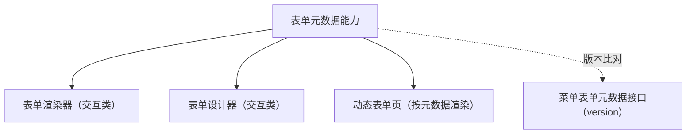

# 组件设计 · 表单元数据能力

> 表单元数据：菜单下发表单元数据的加载 / 缓存 / 版本比对（字段列表、类型、校验、布局、权限属性；表单渲染器与设计器共用）
> 实现侧命名与落点见《[前端基类清单](../../../../../前端基类清单.md)》（§2.1 全量基类登记表；继承链全系统唯一一份），实现契约细节见项目详细设计。

[文档首页](../../../../../文档首页.md) › [项目规划说明](../../../../../规划/项目规划说明.md) › [组件设计](../../../01_组件设计_总览.md) › 表单元数据能力　|　[← 动态路由能力](../20_组件设计_动态路由能力/20_组件设计_动态路由能力.md)　[预签名能力 →](../22_组件设计_预签名能力/22_组件设计_预签名能力.md)

> 可交互原型：[21_原型设计_表单元数据能力.html](21_原型设计_表单元数据能力.html)（演示按菜单加载元数据、版本比对缓存、字段结构查看与刷新）

## 1. 目的与适用范围 

定义 BMS 前端**表单元数据能力**的组件设计：承载**菜单下发的表单元数据**（字段列表、类型、校验、布局、权限属性）的**加载、缓存与版本比对**；供 [交互类「表单渲染器」](../../../08_交互类/12_组件设计_表单渲染器/12_组件设计_表单渲染器.md) 与[交互类「表单设计器」](../../../08_交互类/05_组件设计_表单设计器/05_组件设计_表单设计器.md) 共用。

### 1.1 定位与职责边界 

| 职责 | 归属 |
| --- | --- |
| 元数据加载、缓存与版本比对、字段结构归一 | **本节点（表单元数据能力）** |
| 元数据 → 组件渲染 | [表单渲染器](../../../08_交互类/12_组件设计_表单渲染器/12_组件设计_表单渲染器.md)（字段类型 → 控件映射经[注册表基类](../../01_机制基类/06_组件设计_注册表基类/06_组件设计_注册表基类.md)） |
| 元数据编辑（设计态） | [表单设计器](../../../08_交互类/05_组件设计_表单设计器/05_组件设计_表单设计器.md) |
| 元数据存储与下发 | 后端（菜单管理 / 表单定制） |

上游依据：[《前端开发规范》](../../../../../规范/前端开发规范.md)（§3 能力）、[《概要设计 · 表单定制》](../../../../概要设计/36_概要设计_表单定制.md)（字段属性与元数据结构）。

> 本篇为 **基础组件类 · 能力「表单元数据能力」**。本基类位于继承链上（父子关系与落点见《[前端基类清单](../../../../../前端基类清单.md)》§2.1），经能力机制声明与登记，只被上位基类依赖、不在链外自由挂接。**范围边界**：渲染归表单渲染器；设计态编辑归表单设计器；本能力只管"元数据怎么取、怎么缓存、怎么比对版本"。

## 2. 职责与组成 

| 组成部分 | 职责 |
| --- | --- |
| 元数据加载与缓存 | 按菜单标识加载；版本号比对，未变化命中缓存；跨页面复用 |
| 字段结构归一 | 字段结构归一（类型 / 键 / 标签 / 校验 / 属性 / 权限属性 / 布局），供渲染器直接消费 |
| 设计态刷新 | 设计器保存后直接更新缓存；发布后其他端靠版本号拉新 |
| 降级与占位 | 接口未就绪时空元数据 + 提示；渲染器回退静态字段 |

## 3. 交互与契约语义 

| 语义项 | 说明 |
| --- | --- |
| 元数据键 | 菜单 / 表单标识（元数据键，必填） |
| 缓存 | 是否缓存（按菜单标识 + 版本号） |
| 缺失回退 | 元数据缺失时回退默认渲染（由渲染器实现） |
| 元数据状态 | 元数据（字段列表 / 布局 / 分组 / 权限属性，响应式）、当前版本号（比对用）、加载态与错误（降级展示） |
| 加载 | 带版本号请求；未变化命中缓存 |
| 强制刷新 | 设计态保存后强制刷新；可传新元数据直接更新 |
| 同步读取 | 已加载时零等待读取缓存 |
| 失效 | 设计器保存 / 菜单变更后主动失效 |

## 4. 行为语义 

| 项 | 设计 |
| --- | --- |
| 版本比对 | 请求带当前版本号；服务端返回未修改（not-modified）或新版本；未变化命中缓存（与选项源能力同口径） |
| 缓存 | 按元数据键缓存；跨页面复用（同一菜单多入口）；主动失效 |
| 归一 | 元数据字段结构归一（类型、键、标签、校验、属性、权限属性、布局），供渲染器直接消费 |
| 设计态 | 设计器保存成功后直接更新缓存（不需额外请求）；发布后其他端靠版本号拉新 |
| 降级 | 元数据接口未就绪时按占位语义：空元数据 + 提示；渲染器回退静态字段（如开发期） |
| 释放 | 在途请求登记[异步资源基类](../../01_机制基类/05_组件设计_异步资源基类/05_组件设计_异步资源基类.md) |
| 依赖方向 | 位于继承链上的能力基类；只依赖 组件根 / 公共基类；被渲染器 / 设计器消费；不依赖具体字段组件 |

## 5. 场景集成 

| 场景 | 说明 |
| --- | --- |
| 表单渲染器 | 按元数据字段列表渲染字段（类型 → 控件经注册表）、校验、布局、权限属性 |
| 表单设计器 | 读取 / 保存元数据（设计态刷新） |
| 动态表单页 | 同一页面按菜单键加载不同元数据（多租户定制差异） |
| 字段权限 | 元数据中的权限属性与[字段权限能力](../11_组件设计_字段权限能力/11_组件设计_字段权限能力.md)协作（可见 / 可编辑 / 必填） |

## 6. 依赖接口与上游变更 

### 6.1 上游接口与口径 

| 项 | 说明 | 目标文档 |
| --- | --- | --- |
| 分层权威 | 表单元数据能力职责与版本比对 | [《前端开发规范》](../../../../../规范/前端开发规范.md) 第 3 节（登记项①） |
| 元数据结构 | 字段属性 / 布局 / 权限属性 schema | [《概要设计 · 表单定制》](../../../../概要设计/36_概要设计_表单定制.md)（登记项②） |
| 渲染协作 | 字段类型 → 控件映射 | [表单渲染器](../../../08_交互类/12_组件设计_表单渲染器/12_组件设计_表单渲染器.md) + [注册表基类](../../01_机制基类/06_组件设计_注册表基类/06_组件设计_注册表基类.md)（登记项③） |
| 新增依赖 | **无** | — |

### 6.2 需登记的上游变更 

| 变更点 | 目标文档 | 内容 |
| --- | --- | --- |
| ① 表单元数据能力契约 | [《前端开发规范》](../../../../../规范/前端开发规范.md) 第 3 节 | 明确表单元数据能力：加载 / 缓存与版本比对 / 归一 / 设计态刷新 / 降级 |
| ② 元数据接口 | [《概要设计》](../../../../概要设计/01_概要设计_总览.md) 对应节点 | 菜单表单元数据接口（含版本号）、保存与发布语义 |
| ③ 渲染协作 | [表单渲染器](../../../08_交互类/12_组件设计_表单渲染器/12_组件设计_表单渲染器.md) | 元数据 → 控件映射经注册表；缺失字段类型降级为纯文本 / 提示 |

> 按[《文档生成规范》](../../../../../规范/文档生成规范.md)「引用与追溯」节，上述变更需用户确认后由上游文档同步。

## 7. 权限 / i18n / 移动端 

- **权限**：元数据按菜单权限下发（无权限菜单不返回）；字段权限属性由[字段权限能力](../11_组件设计_字段权限能力/11_组件设计_字段权限能力.md)消费。
- **i18n**：字段标签由元数据（含 locale）下发；渲染器不翻译业务字段。
- **移动端**：移动端为同一契约的另一实现（同一套契约断言保障），同一元数据可渲染不同布局（由端内渲染器决定）。

## 8. 性能与边界 

| 场景 | 设计 |
| --- | --- |
| 缓存 | 按元数据键缓存 + 版本比对；同菜单多入口只请求一次 |
| 边界 | 元数据版本不同步、字段类型未注册（降级提示）、设计态与发布态混用、缓存过期、多租户元数据差异 |
| 不支持 | 字段渲染（表单渲染器）、设计态编辑（表单设计器）、字段权限判定（字段权限能力） |

## 9. 检查清单 

- □ 契约语义：元数据键 / 缓存 / 缺失回退 + 加载 / 强制刷新 / 同步读取 / 失效 + 元数据状态与版本号
- □ 行为：版本比对缓存、结构归一、设计态直接刷新、占位降级、请求释放
- □ 被渲染器 / 设计器消费；本基类位于继承链上（能力基类），依赖方向单向
- □ 权限/i18n/移动端符合第 7 节；性能边界符合第 8 节
- □ 三项上游登记已确认

> 组件设计节点（表单元数据能力）· 与[《前端开发规范》](../../../../../规范/前端开发规范.md)[《概要设计 · 表单定制》](../../../../概要设计/36_概要设计_表单定制.md)[表单渲染器](../../../08_交互类/12_组件设计_表单渲染器/12_组件设计_表单渲染器.md)[表单设计器](../../../08_交互类/05_组件设计_表单设计器/05_组件设计_表单设计器.md)[注册表基类](../../01_机制基类/06_组件设计_注册表基类/06_组件设计_注册表基类.md)[《命名规范》](../../../../../规范/命名规范.md)配套
