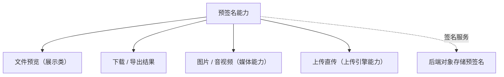

# 组件设计 · 预签名能力

> 预签名：签名 URL 的获取 / 缓存 / 失效重取 / 降级下载（文件预览、下载、导出共用）
> 实现侧命名与落点见《[前端基类清单](../../../../../前端基类清单.md)》（§2.1 全量基类登记表；继承链全系统唯一一份），实现契约细节见项目详细设计。

[文档首页](../../../../../文档首页.md) › [项目规划说明](../../../../../规划/项目规划说明.md) › [组件设计](../../../01_组件设计_总览.md) › 预签名能力　|　[← 表单元数据能力](../21_组件设计_表单元数据能力/21_组件设计_表单元数据能力.md)　[拖拽基座能力 →](../23_组件设计_拖拽基座能力/23_组件设计_拖拽基座能力.md)

> 可交互原型：[22_原型设计_预签名能力.html](22_原型设计_预签名能力.html)（演示签名 URL 缓存与 TTL、失效自动重取一次、降级走后端下载）

## 1. 目的与适用范围 

定义 BMS 前端**预签名能力**的组件设计：统一**预签名 URL 的获取、缓存与失效重取**——供 [展示类「文件预览」](../../../07_展示类/08_组件设计_文件预览/08_组件设计_文件预览.md)、文件下载、[媒体能力](../06_组件设计_媒体能力/06_组件设计_媒体能力.md)（图片 / 音视频）、[上传引擎能力](../13_组件设计_上传引擎能力/13_组件设计_上传引擎能力.md)（直传）与导出结果下载共用；后端对齐对象存储基类的预签名接口与默认有效期（见[《后端基类清单》](../../../../../后端基类清单.md)「对象存储」节）。

### 1.1 定位与职责边界 

| 职责 | 归属 |
| --- | --- |
| 签名 URL 获取、TTL 缓存、失效自动重取、降级下载 | **本节点（预签名能力）** |
| 预览渲染 | [文件预览](../../../07_展示类/08_组件设计_文件预览/08_组件设计_文件预览.md) / [媒体能力](../06_组件设计_媒体能力/06_组件设计_媒体能力.md) |
| 上传使用签名 URL | [上传引擎能力](../13_组件设计_上传引擎能力/13_组件设计_上传引擎能力.md) |
| 签名签发与桶策略 | 后端对象存储基类（[《后端基类清单》](../../../../../后端基类清单.md)「对象存储」节） |

上游依据：[《前端开发规范》](../../../../../规范/前端开发规范.md)（§3 能力）、[《架构设计 · 数据架构》](../../../../架构设计/07_架构设计_数据架构.md)（文件直传与预签名）、[《后端基类清单》](../../../../../后端基类清单.md)「对象存储」（预签名接口与默认有效期）。

> 本篇为 **基础组件类 · 能力「预签名能力」**。本基类位于继承链上（父子关系与落点见《[前端基类清单](../../../../../前端基类清单.md)》§2.1），经能力机制声明与登记，只被上位基类依赖、不在链外自由挂接。**范围边界**：预览渲染归文件预览 / 媒体能力；上传流程归上传引擎；本能力只管"签名 URL 怎么取、怎么缓存、失效怎么办"。

## 2. 职责与组成 

| 组成部分 | 职责 |
| --- | --- |
| 签名获取与缓存 | 按文件标识获取签名 URL；缓存 URL 与过期时间；命中缓存直接返回 |
| 失效重取 | 过期 / 无权时自动重取一次后重试 |
| 降级 | 重取失败或无法直连时按降级策略走后端下载接口 |
| 并发合并 | 同一文件并发请求合并为一次（防重复签发） |

## 3. 交互与契约语义 

| 语义项 | 说明 |
| --- | --- |
| 用途 | `GET`（下载 / 预览）/ `PUT`（上传直传） |
| 有效期 | 期望有效期（秒，缺省取后端默认有效期） |
| 提前刷新 | 提前刷新阈值（秒，剩余时间低于此值视为将过期） |
| 降级策略 | 失效且重取失败时的降级：`download`（走后端下载接口）/ `none`（不处理） |
| 获取 | 获取签名 URL（命中缓存直接返回；含提前刷新判断） |
| 强制重取 | 失效 / 权限变化后强制重取 |
| 触发下载 | 触发下载（浏览器下载方式；降级走后端下载） |
| 清理与缓存状态 | 清除缓存（文件更新 / 替换后）；缓存状态（响应式，调试用） |

## 4. 行为语义 

| 项 | 设计 |
| --- | --- |
| TTL 缓存 | 缓存 URL + 过期时间；请求时判断"剩余时间 < 提前刷新阈值"则提前重取（避免用到将过期 URL） |
| 失效重取 | 预览 / 下载遇到无权 / 过期：自动重取**一次**后重试；再失败按降级策略降级或提示 |
| 并发合并 | 同一文件并发请求合并为一次（防重复签发） |
| 降级下载 | 无法直连（跨域受控 / 私有桶）时走后端下载接口（带鉴权，后端代理流） |
| 权限 | 签名由后端签发（权限在签发时校验）；前端不缓存敏感 URL 超期 |
| 释放 | 在途请求登记[异步资源基类](../../01_机制基类/05_组件设计_异步资源基类/05_组件设计_异步资源基类.md) |
| 依赖方向 | 位于继承链上的能力基类；只依赖 组件根 / 公共基类；被预览 / 媒体 / 上传 / 导出消费（依赖方向单向下沉） |

## 5. 场景集成 

| 场景 | 说明 |
| --- | --- |
| 文件预览 | 图片 / PDF / 音视频预览取签名 URL |
| 下载 | 附件下载（单文件） |
| 导出结果 | 异步任务完成后取结果文件签名 URL 下载 |
| 上传直传 | 上传用途（`PUT`）取签名 URL 供分片直传 |

## 6. 依赖接口与上游变更 

### 6.1 上游接口与口径 

| 项 | 说明 | 目标文档 |
| --- | --- | --- |
| 分层权威 | 预签名能力职责与缓存口径 | [《前端开发规范》](../../../../../规范/前端开发规范.md) 第 3 节（登记项①） |
| 签名接口 | 预签名签发接口与有效期 | [《概要设计 · 文件管理》](../../../../概要设计/01_概要设计_总览.md)（登记项②） |
| 后端对齐 | 对象存储预签名接口与默认有效期 | [《后端基类清单》](../../../../../后端基类清单.md)「对象存储」节（登记项③） |
| 新增依赖 | **无** | — |

### 6.2 需登记的上游变更 

| 变更点 | 目标文档 | 内容 |
| --- | --- | --- |
| ① 预签名能力契约 | [《前端开发规范》](../../../../../规范/前端开发规范.md) 第 3 节 | 明确预签名能力：TTL 缓存 + 提前刷新 + 失效重取一次 + 并发合并 + 降级下载 |
| ② 签名接口 | [《概要设计》](../../../../概要设计/01_概要设计_总览.md) 对应节点 | 预签名签发接口（`GET` / `PUT`）、有效期口径、签发失败错误码 |
| ③ 后端对齐 | [《后端基类清单》](../../../../../后端基类清单.md) | 预签名参数与返回（地址 / 有效期 / 用途）与前端缓存字段一致 |

> 按[《文档生成规范》](../../../../../规范/文档生成规范.md)「引用与追溯」节，上述变更需用户确认后由上游文档同步。

## 7. 权限 / i18n / 移动端 

- **权限**：签名签发在后端鉴权（无权限不签发）；前端不落盘敏感 URL。
- **i18n**：错误提示（无权下载 / 已过期）走全局语言能力。
- **移动端**：移动端为同一契约的另一实现（同一套契约断言保障），能力语义一致（下载行为差异由端内处理）。

## 8. 性能与边界 

| 场景 | 设计 |
| --- | --- |
| 缓存 | URL 按文件标识缓存 + 提前刷新；同文件多次预览只签发一次 |
| 边界 | 时钟偏差（提前刷新兜底）、URL 过期竞态、跨域受限（降级）、私有桶、权限变更后旧 URL 残留 |
| 不支持 | 预览渲染（文件预览 / 媒体能力）、上传流程（上传引擎能力）、签名签发（后端） |

## 9. 检查清单 

- □ 契约语义：用途（`GET` / `PUT`）/ 有效期 / 提前刷新阈值 / 降级策略（`download` / `none`）+ 获取 / 强制重取 / 触发下载 / 清理
- □ 行为：TTL 缓存 + 提前刷新、失效重取一次、并发合并、降级下载、在途释放
- □ 与后端预签名参数 / 返回对齐；本基类位于继承链上（能力基类），依赖方向单向
- □ 权限/i18n/移动端符合第 7 节；性能边界符合第 8 节
- □ 三项上游登记已确认

> 组件设计节点（预签名能力）· 与[《前端开发规范》](../../../../../规范/前端开发规范.md)[《后端基类清单》](../../../../../后端基类清单.md)[媒体能力](../06_组件设计_媒体能力/06_组件设计_媒体能力.md)[上传引擎能力](../13_组件设计_上传引擎能力/13_组件设计_上传引擎能力.md)[文件预览](../../../07_展示类/08_组件设计_文件预览/08_组件设计_文件预览.md)[异步资源基类](../../01_机制基类/05_组件设计_异步资源基类/05_组件设计_异步资源基类.md)[《命名规范》](../../../../../规范/命名规范.md)配套
