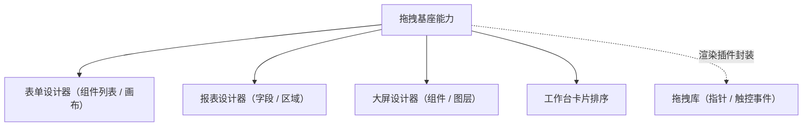

# 组件设计 · 拖拽基座能力

> 拖拽基座：拖拽 / 排序 / 跨区移动的统一语义（把手、触控、顺序与移动上报；设计器共用）
> 实现侧命名与落点见《[前端基类清单](../../../../../前端基类清单.md)》（§2.1 全量基类登记表；继承链全系统唯一一份），实现契约细节见项目详细设计。

[文档首页](../../../../../文档首页.md) › [项目规划说明](../../../../../规划/项目规划说明.md) › [组件设计](../../../01_组件设计_总览.md) › 拖拽基座能力　|　[← 预签名能力](../22_组件设计_预签名能力/22_组件设计_预签名能力.md)　[设计令牌能力 →](../24_组件设计_设计令牌能力/24_组件设计_设计令牌能力.md)

> 可交互原型：[23_原型设计_拖拽基座能力.html](23_原型设计_拖拽基座能力.html)（演示同区排序、跨区移动、拖拽把手与顺序变更上报）

## 1. 目的与适用范围 

定义 BMS 前端**拖拽基座能力**的组件设计：统一**拖拽、排序、跨区移动**能力——供 [交互类「表单设计器」](../../../08_交互类/05_组件设计_表单设计器/05_组件设计_表单设计器.md)、[交互类「报表设计器」](../../../08_交互类/08_组件设计_报表设计器/08_组件设计_报表设计器.md)、[交互类「大屏设计器与播放」](../../../08_交互类/09_组件设计_大屏设计器与播放/09_组件设计_大屏设计器与播放.md) 与工作台卡片排序共用；底层拖拽库由渲染插件侧统一封装（能力只维护拖拽状态骨架），对上层暴露统一契约。

### 1.1 定位与职责边界 

| 职责 | 归属 |
| --- | --- |
| 拖拽 / 排序 / 跨区、把手、触控、顺序与移动事件 | **本节点（拖拽基座能力）** |
| 拖拽后的业务语义（新增组件 / 字段映射 / 布局计算） | 各设计器（消费方） |
| 拖拽视觉与占位提示 | 各设计器（本能力提供钩子与状态） |
| 拖拽库 | 渲染插件侧（统一封装；能力只维护拖拽状态骨架，避免各设计器自接拖拽库） |

上游依据：[《前端开发规范》](../../../../../规范/前端开发规范.md)（§3 分层）、[《架构设计 · 前端组件体系》](../../../../架构设计/05_架构设计_前端组件体系.md)（设计器重组件异步加载）。

> 本篇为 **基础组件类 · 能力「拖拽基座能力」**。本基类位于继承链上（父子关系与落点见《[前端基类清单](../../../../../前端基类清单.md)》§2.1），经能力机制声明与登记，只被上位基类依赖、不在链外自由挂接。**范围边界**：拖拽后业务语义归设计器；本能力只管"怎么拖、拖到哪、顺序变化"。

## 2. 职责与组成 

| 组成部分 | 职责 |
| --- | --- |
| 拖拽状态骨架 | 拖拽中 / 悬停 / 顺序调整（重排；指针事件由渲染层承担） |
| 排序与跨区移动 | 同区排序与跨区移动；变化上报（起止区 / 项 / 原位置 / 新位置） |
| 把手与触控 | 拖拽把手（避免与输入 / 点击冲突）；移动端触控（长按触发，与滚动区分） |
| 组件包装（按需） | 拖拽列表壳的组件形态（核心实现 + 响应式投影 + 插件包装），按需评估 |

## 3. 交互与契约语义 

| 语义项 | 说明 |
| --- | --- |
| 拖拽组 | 拖拽组名（同组可跨区移动；不同组隔离） |
| 形态 | `list`（列表）/ `grid`（网格，大屏画布） |
| 把手 | 拖拽把手选择器（不给则整项可拖） |
| 禁用 | 禁用拖拽但保留渲染（只读 / 预览态） |
| 动画 | 动画时长（毫秒） |
| 初始化与销毁 | 初始化拖拽（返回句柄；销毁幂等，登记异步资源、卸载自动调用） |
| 程序化移动 | 程序化移动（撤销 / 快捷键支持） |
| 变化上报 | 顺序 / 跨区变化事件（含起止区、项、原位置、新位置） |
| 拖拽状态 | 拖拽中状态（响应式；供占位提示与禁用交互） |

## 4. 行为语义 

| 项 | 设计 |
| --- | --- |
| 同区排序 | 列表 / 网格内排序；变化上报新顺序（消费方更新模型） |
| 跨区移动 | 同拖拽组的区域间移动（左侧组件列表 → 画布；字段区 → 行区） |
| 把手 | 设计器场景用把手（避免与输入 / 点击冲突）；列表排序可整项拖 |
| 触控 | 移动端触控拖拽（长按触发，与滚动区分；事件绑定由渲染插件承担） |
| 禁用 | 禁用时禁用拖拽但保留渲染（预览 / 只读设计态） |
| 销毁 | 销毁幂等；登记[异步资源基类](../../01_机制基类/05_组件设计_异步资源基类/05_组件设计_异步资源基类.md)（卸载自动清理事件监听，渲染插件侧） |
| 与撤销栈协作 | 移动后由设计器把操作压入撤销栈；本能力不维护撤销 |
| 依赖方向 | 位于继承链上的能力基类；只依赖 组件根 / 公共基类（无基类依赖）；被设计器类组合消费；不依赖具体设计器 |

## 5. 场景集成 

| 场景 | 说明 |
| --- | --- |
| 表单设计器 | 左侧组件列表拖入画布；画布内排序；跨区（分区 / 栅格） |
| 报表设计器 | 字段拖入行 / 列 / 指标区 |
| 大屏设计器 | 组件拖入画布、图层排序（网格模式） |
| 工作台卡片 | 卡片排序（用户偏好持久化协作） |

## 6. 依赖接口与上游变更 

### 6.1 上游接口与口径 

| 项 | 说明 | 目标文档 |
| --- | --- | --- |
| 分层权威 | 拖拽基座能力职责与库封装口径（渲染插件侧） | [《前端开发规范》](../../../../../规范/前端开发规范.md) 第 3 节（登记项①） |
| 设计器协作 | 拖拽语义与撤销栈 | [表单设计器](../../../08_交互类/05_组件设计_表单设计器/05_组件设计_表单设计器.md)、[大屏设计器](../../../08_交互类/09_组件设计_大屏设计器与播放/09_组件设计_大屏设计器与播放.md)（登记项②） |
| 分包 | 拖拽库异步加载 | [《架构设计 · 前端组件体系》](../../../../架构设计/05_架构设计_前端组件体系.md)（登记项③） |
| 新增依赖 | 拖拽库（渲染插件侧统一封装） | — |

### 6.2 需登记的上游变更 

| 变更点 | 目标文档 | 内容 |
| --- | --- | --- |
| ① 拖拽基座契约 | [《前端开发规范》](../../../../../规范/前端开发规范.md) 第 3 节 | 明确拖拽基座能力：同区排序 / 跨区移动 / 把手 / 触控 / 销毁；设计器不得另接拖拽库 |
| ② 设计器协作 | [表单设计器](../../../08_交互类/05_组件设计_表单设计器/05_组件设计_表单设计器.md) 等 | 顺序 / 跨区变化载荷与撤销栈 / 模型更新口径 |
| ③ 分包与选型 | [《架构设计 · 前端组件体系》](../../../../架构设计/05_架构设计_前端组件体系.md) | 拖拽库选型与异步加载（渲染插件 / 设计器分包内） |

> 按[《文档生成规范》](../../../../../规范/文档生成规范.md)「引用与追溯」节，上述变更需用户确认后由上游文档同步。

## 7. 权限 / i18n / 移动端 

- **权限**：设计态编辑权限由页面控制（无编辑权限时置为禁用态）；本能力不判权。
- **i18n**：无文案（拖拽提示由消费方）。
- **移动端**：移动端为同一契约的另一实现（同一套契约断言保障）；触控拖拽语义一致（长按触发）。

## 8. 性能与边界 

| 场景 | 设计 |
| --- | --- |
| 大列表 | 虚拟化 + 拖拽结合时注意测量；拖拽中避免全量重渲染 |
| 边界 | 拖拽与点击冲突（把手）、跨区限制（拖拽组）、拖拽中数据变更、销毁后残留监听、触控与滚动冲突 |
| 不支持 | 撤销栈（设计器）、拖拽视觉（消费方）、业务语义（消费方） |

## 9. 检查清单 

- □ 契约语义：拖拽组 / 形态（`list` / `grid`）/ 把手 / 禁用 / 动画 + 初始化与销毁 / 程序化移动 / 变化上报 / 拖拽状态
- □ 行为：同区排序、跨区受限、把手、触控、幂等销毁（登记异步资源）、拖拽库统一封装（渲染插件侧）
- □ 被设计器类组合消费；本基类位于继承链上（能力基类），依赖方向单向
- □ 权限/i18n/移动端符合第 7 节；性能边界符合第 8 节
- □ 三项上游登记已确认

> 组件设计节点（拖拽基座能力）· 与[《前端开发规范》](../../../../../规范/前端开发规范.md)[《架构设计 · 前端组件体系》](../../../../架构设计/05_架构设计_前端组件体系.md)[表单设计器](../../../08_交互类/05_组件设计_表单设计器/05_组件设计_表单设计器.md)[大屏设计器与播放](../../../08_交互类/09_组件设计_大屏设计器与播放/09_组件设计_大屏设计器与播放.md)[异步资源基类](../../01_机制基类/05_组件设计_异步资源基类/05_组件设计_异步资源基类.md)[《命名规范》](../../../../../规范/命名规范.md)配套
