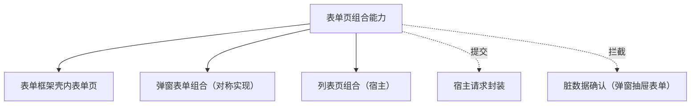

# 组件设计 · 表单页组合能力

> 表单页组合：三态（新增 / 编辑 / 详情）、详情加载、提交、脏数据跟踪与离开拦截（与列表页、弹窗表单组合能力对称）
> 实现侧命名与落点见《[前端基类清单](../../../../../前端基类清单.md)》（§2.1 全量基类登记表；继承链全系统唯一一份），实现契约细节见项目详细设计。

[文档首页](../../../../../文档首页.md) › [项目规划说明](../../../../../规划/项目规划说明.md) › [组件设计](../../../01_组件设计_总览.md) › 表单页组合能力　|　[← 设计令牌能力](../24_组件设计_设计令牌能力/24_组件设计_设计令牌能力.md)　[语言上下文能力 →](../26_组件设计_语言上下文能力/26_组件设计_语言上下文能力.md)

> 可交互原型：[25_原型设计_表单页组合能力.html](25_原型设计_表单页组合能力.html)（演示三态切换、详情加载、脏数据跟踪、提交与离开确认）

## 1. 目的与适用范围 

定义 BMS 前端**表单页组合能力**的组件设计：组合表单页的**三态（新增 / 编辑 / 详情）、详情加载、提交、脏数据跟踪与离开拦截**；与宿主列表页组合、[弹窗抽屉表单](../../../04_容器组件类/01_组件设计_弹窗抽屉表单/01_组件设计_弹窗抽屉表单.md) 的表单组合对称，供 [布局组件类「表单框架壳」](../../../03_布局组件类/02_组件设计_表单框架壳/02_组件设计_表单框架壳.md) 内的表单页复用。

### 1.1 定位与职责边界 

| 职责 | 归属 |
| --- | --- |
| 三态、详情加载、提交、脏数据跟踪、离开拦截、保存后回退 | **本节点（表单页组合能力）** |
| 表单渲染与字段 | 各表单页（字段组件 + 表单容器能力） |
| 请求提交 / 重试 | [基础类「请求封装」](../../../09_基础类/01_组件设计_请求封装/01_组件设计_请求封装.md)（宿主请求封装） |
| 离开确认对话框 | [容器组件类「弹窗抽屉表单」](../../../04_容器组件类/01_组件设计_弹窗抽屉表单/01_组件设计_弹窗抽屉表单.md) 的确认能力 |
| 列表页组合 | 宿主列表页组合（不在本节点） |

上游依据：[《前端开发规范》](../../../../../规范/前端开发规范.md)（§8.3 列表页 / 表单页约定）、[《布局设计 · 表单页》](../../../../布局设计/08_布局设计_表单页.html)（三态、只读 / 编辑分态）、[《架构设计 · 前端架构》](../../../../架构设计/08_架构设计_前端架构.md)（表单框架壳约定）。

> 本篇为 **基础组件类 · 能力「表单页组合能力」**。本基类位于继承链上（父子关系与落点见《[前端基类清单](../../../../../前端基类清单.md)》§2.1），经能力机制声明与登记，只被上位基类依赖、不在链外自由挂接。**范围边界**：弹窗表单用弹窗抽屉表单的组合能力（对称）；列表页用宿主列表页组合；本能力只管"表单页三态与提交流程"。

## 2. 职责与组成 

| 组成部分 | 职责 |
| --- | --- |
| 三态与脏数据状态 | 三态（新增 / 编辑 / 详情）判定；脏数据跟踪、提交中状态、可离开判定；提交编排由宿主请求层承担 |
| 详情加载 | 加载详情（编辑 / 详情态；含版本 / 乐观锁字段） |
| 提交与重置 | 提交（校验 → 请求 → 成功处理）；重置为初始快照（脏数据清零） |
| 离开拦截 | 脏数据确认（返回 / 关闭页签 / 路由切换）、离开放行 |
| 事件与状态同步 | 保存成功事件、脏数据变化事件（供表单框架壳与页签关闭拦截协作） |
| 组件包装（按需） | 表单页壳的组件形态（信息栏 / 主表 + 明细插槽 / 底部操作栏），按需评估 |

## 3. 交互与契约语义 

| 语义项 | 说明 |
| --- | --- |
| 三态 | `create` / `edit` / `detail`（由路由 / 调用方决定） |
| 主键 | 编辑 / 详情的主键（新增为空） |
| 接口集合 | 详情 / 新增 / 更新接口（经请求封装） |
| 脏数据跟踪 | 是否跟踪脏数据（与初始快照比对） |
| 离开拦截 | 是否拦截离开（返回 / 关闭页签 / 路由切换） |
| 详情加载 | 加载详情（编辑 / 详情态；含版本 / 乐观锁字段） |
| 提交 | 提交（校验 → 请求 → 成功提示 → 保存成功事件 → 回退 / 刷新列表） |
| 重置 | 重置为初始快照（脏数据清零） |
| 脏数据状态 | 脏数据状态（响应式；供表单框架壳与页签关闭拦截） |
| 离开 | 离开（脏数据时确认；确认后放行） |
| 事件 | 保存成功 / 脏数据变化事件 |

## 4. 行为语义 

| 项 | 设计 |
| --- | --- |
| 三态 | `create`：空表单 + 默认值；`edit`：加载详情 + 可编辑；`detail`：加载详情 + 只读（复用编辑组件，禁用或纯文本回显） |
| 脏数据 | 提交前初始快照 vs 当前值深比较（仅跟踪表单字段）；脏数据状态同步给表单框架壳 / 页签关闭拦截 |
| 离开拦截 | 脏数据时弹确认（放弃修改 / 继续编辑）；页签关闭、路由切换、页面卸载三处统一 |
| 提交 | 表单校验通过 → 宿主请求封装提交；**整体提交主表 + 明细（单事务）**；携带版本号乐观锁 |
| 成功处理 | 提示成功 → 触发保存成功事件（表单框架壳刷新列表 / 关闭详情页签）→ 回退到列表或保持编辑态（按页面配置） |
| 并发 | 提交中按钮加载态防重复提交（经宿主请求封装 / 交互能力） |
| 释放 | 详情 / 提交请求登记[异步资源基类](../../01_机制基类/05_组件设计_异步资源基类/05_组件设计_异步资源基类.md)（宿主请求层） |
| 依赖方向 | 位于继承链上的能力域基类；只依赖 组件根 / 中间层基类（请求经宿主请求封装注入）；被表单页组合消费；不依赖具体字段组件 |

## 5. 场景集成 

| 场景 | 说明 |
| --- | --- |
| 表单框架壳表单页 | 列表固定 + 详情多开：详情页签内为编辑 / 详情态表单页 |
| 新增 / 编辑表单 | 三态切换由路由参数决定；保存后回列表 |
| 审批 / 只读详情 | 详情态：只读回显 + 审批轨迹（与审批流组件协作） |
| 移动端表单 | 同契约（同接口多实现）、不同布局（弹层 / 页内跳转） |

## 6. 依赖接口与上游变更 

### 6.1 上游接口与口径 

| 项 | 说明 | 目标文档 |
| --- | --- | --- |
| 分层权威 | 表单页组合能力职责与三态口径 | [《前端开发规范》](../../../../../规范/前端开发规范.md) §8.3（登记项①） |
| 页面形态 | 三态 / 只读 / 信息栏 | [《布局设计 · 表单页》](../../../../布局设计/08_布局设计_表单页.html)（登记项②） |
| 框架协作 | 表单框架壳事件约定（打开详情 / 保存成功 / 脏数据） | [表单框架壳](../../../03_布局组件类/02_组件设计_表单框架壳/02_组件设计_表单框架壳.md)（登记项③） |
| 新增依赖 | **无**（请求经宿主请求封装，能力无新增上游文档依赖） | — |

### 6.2 需登记的上游变更 

| 变更点 | 目标文档 | 内容 |
| --- | --- | --- |
| ① 表单页组合契约 | [《前端开发规范》](../../../../../规范/前端开发规范.md) §8.3 | 明确表单页组合能力：三态 / 详情加载 / 脏数据 / 离开拦截 / 提交与成功处理；与弹窗表单组合 / 列表页组合对称 |
| ② 页面形态 | [《布局设计 · 表单页》](../../../../布局设计/08_布局设计_表单页.html) | 三态与只读分态的交互口径（页内动作区 / 页签拦截） |
| ③ 框架事件 | [表单框架壳](../../../03_布局组件类/02_组件设计_表单框架壳/02_组件设计_表单框架壳.md) | 保存成功 / 脏数据事件与列表刷新、页签关闭拦截的时序 |

> 按[《文档生成规范》](../../../../../规范/文档生成规范.md)「引用与追溯」节，上述变更需用户确认后由上游文档同步。

## 7. 权限 / i18n / 移动端 

- **权限**：按钮级动作权限用[基础类「权限指令」](../../../09_基础类/02_组件设计_权限指令/02_组件设计_权限指令.md)；字段权限由[字段权限能力](../11_组件设计_字段权限能力/11_组件设计_字段权限能力.md)处理；本能力不判权。
- **i18n**：提示文案走全局语言能力；字段标签由元数据 / 表单定义提供。
- **移动端**：移动端为同一契约的另一实现（同一套契约断言保障）；三态与脏数据语义一致。

## 8. 性能与边界 

| 场景 | 设计 |
| --- | --- |
| 脏数据比较 | 仅比较表单字段（避免大对象深比较）；快照在详情加载后建立 |
| 大表单 | 明细行变更局部跟踪；避免每次按键全量比对 |
| 边界 | 详情加载失败（空表单 + 提示）、乐观锁冲突（提示刷新）、提交重复、离开确认竞态、保存成功后列表刷新时序 |
| 不支持 | 弹窗表单组合、列表页组合、字段权限判定 |

## 9. 检查清单 

- □ 契约语义：三态（`create` / `edit` / `detail`）/ 主键 / 接口集合 / 脏数据跟踪 / 离开拦截 + 详情加载 / 提交 / 重置 / 脏数据状态 / 离开 / 事件
- □ 行为：三态、快照脏数据、三处离开拦截、整体提交 + 乐观锁、成功回退 / 刷新、防重复提交
- □ 与弹窗表单组合 / 列表页组合对称；请求经宿主请求封装；本基类位于继承链上（能力域基类），依赖方向单向
- □ 权限/i18n/移动端符合第 7 节；性能边界符合第 8 节
- □ 三项上游登记已确认

> 组件设计节点（表单页组合能力）· 与[《前端开发规范》](../../../../../规范/前端开发规范.md)[《布局设计 · 表单页》](../../../../布局设计/08_布局设计_表单页.html)[表单框架壳](../../../03_布局组件类/02_组件设计_表单框架壳/02_组件设计_表单框架壳.md)[基础类「请求封装」](../../../09_基础类/01_组件设计_请求封装/01_组件设计_请求封装.md)[弹窗抽屉表单](../../../04_容器组件类/01_组件设计_弹窗抽屉表单/01_组件设计_弹窗抽屉表单.md)[《命名规范》](../../../../../规范/命名规范.md)配套
