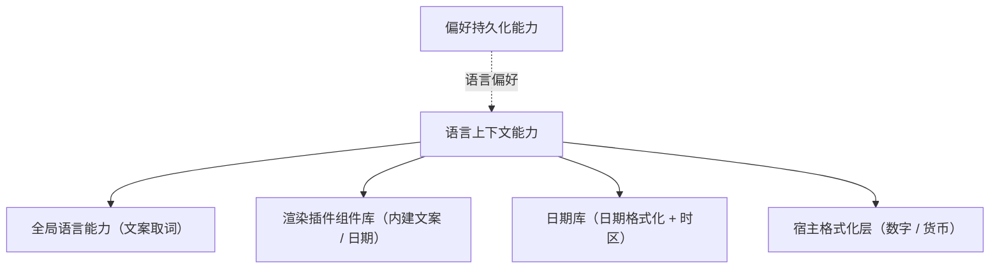

# 组件设计 · 语言上下文能力

> 语言上下文能力：当前语言与时区上下文 / 语言切换联动（文案 / 组件库 / 日期库）/ 时区格式化 / 格式缓存
> 实现侧命名与落点见《[前端基类清单](../../../../../前端基类清单.md)》（「能力」节），实现契约细节见项目详细设计。

[文档首页](../../../../../文档首页.md) › [项目规划说明](../../../../../规划/项目规划说明.md) › [组件设计](../../../01_组件设计_总览.md) › 语言上下文能力　|　[← 表单页组合能力](../25_组件设计_表单页组合能力/25_组件设计_表单页组合能力.md)　[权限上下文能力 →](../27_组件设计_权限上下文能力/27_组件设计_权限上下文能力.md)

> 可交互原型：[26_原型设计_语言上下文能力.html](26_原型设计_语言上下文能力.html)（演示语言切换（文案 / 组件库 / 日期库联动）、时区格式化与格式缓存）

## 1. 目的与适用范围 

定义 BMS 前端**语言上下文能力**的组件设计：统一承载**当前语言、时区与格式上下文**——语言切换（全站文案 + 组件库内建文案 + 日期库语言联动）、时区格式化（后端 UTC → 用户时区）、数字 / 货币格式化；供 [交互类「国际化文案编辑器」](../../../08_交互类/11_组件设计_国际化文案编辑器/11_组件设计_国际化文案编辑器.md)、日期时间字段与全部展示组件共用。它是基础组件类中的「语言上下文能力」，是继承链上**能力层**的一层（能力即继承链上的层），与[偏好持久化能力](../16_组件设计_偏好持久化能力/16_组件设计_偏好持久化能力.md)（偏好存储）协作。

### 1.1 定位 

| 职责 | 归属 |
| --- | --- |
| 语言 / 时区上下文、切换联动、格式缓存、UTC ↔ 本地转换 | **本节点（语言上下文能力）** |
| 文案资源（语言包） | 全局语言能力的语言包 + 后端下发业务文案 |
| 偏好持久化 | [偏好持久化能力](../16_组件设计_偏好持久化能力/16_组件设计_偏好持久化能力.md)（语言 / 时区偏好） |
| 业务数据翻译 | 后端（菜单 / 字典 / 元数据按 locale 下发） |

上游依据：[《前端开发规范》](../../../../../规范/前端开发规范.md)（§3 分层）、[《命名规范》](../../../../../规范/命名规范.md)（i18n key 命名）、[《架构设计 · 子系统 · 国际化》](../../../../架构设计/24_架构设计_子系统_国际化.md)（语言集 / 时区口径）。

> 本篇为 **基础组件类 · 能力「语言上下文能力」**。**范围边界**：文案资源归语言包 / 后端；偏好存储归偏好持久化；本能力只管"当前语言 / 时区是什么、怎么格式化"。

## 2. 职责与组成 

| 组成部分 | 职责 |
| --- | --- |
| 能力核心 | 上下文状态：当前语言 / 用户时区（切换入口）；契约语义：日期时间格式化 / 数字格式化 |
| 切换联动（投影 / 宿主 / 插件侧） | 语言切换联动全站文案、组件库内建文案与日期库语言；刷新远端文案缓存 |
| 格式化落地（宿主格式化层） | 日期时间按用户时区格式化；数字 / 货币按当前语言格式化；格式化实例按语言 + 时区缓存 |

- **时区收敛**：日期时间的「UTC 存储 → 本地展示」统一经本能力契约（格式化由宿主格式化层承担），禁止各组件各自拼装本地时间字符串造成口径发散。

## 3. 交互与契约语义 

| 语义项 | 说明 |
| --- | --- |
| 当前语言 | 默认 zh-CN；可选 zh-CN / en-US（与后端支持语言一致）；切换即全站文案刷新 |
| 用户时区 | 默认浏览器时区；可选 IANA 时区（如 `Asia/Shanghai`）；偏好可覆盖 |
| 格式上下文 | 内置日期 / 日期时间 / 时间 / 数字 / 货币格式 |
| 语言切换 | 联动全站文案、组件库内建文案、日期库语言与页面语言属性；写入偏好；刷新远端文案缓存 |
| 时区切换 | 写入偏好；日期时间按新时区重算 |
| 文案取词 | 委托全局语言能力（支持参数），根部的统一取词入口 |
| 日期时间格式化 | 后端 UTC / ISO → 用户时区；格式按格式上下文选取 |
| 数字 / 货币格式化 | 按当前语言格式化（与格式化工具协作） |
| 语言变化事件 | 语言切换后触发（刷新业务缓存：菜单 / 字典 / 元数据） |

## 4. 行为与分层关系 

| 项 | 设计 |
| --- | --- |
| 切换联动 | 语言切换同步：全站文案、渲染插件组件库语言、日期库语言、页面语言属性；再触发语言变化事件让业务缓存（菜单 / 元数据）重新拉取 |
| 时区 | 后端时间统一 UTC / ISO 存储；展示经日期格式化转用户时区；日期输入的反向转换由字段负责，经本能力契约 |
| 格式缓存 | 格式化实例按语言 + 时区缓存（避免重复构造；由宿主格式化层承担） |
| 持久化 | 语言 / 时区偏好经[偏好持久化能力](../16_组件设计_偏好持久化能力/16_组件设计_偏好持久化能力.md)存储（跨设备同步；协作关系，不入能力依赖登记） |
| 语言包 | 语言包按需加载（懒加载语言分块）；缺失 key 回退默认语言并开发态告警 |
| 释放 | 监听注销 / 语言包加载请求登记[异步资源基类](../../01_机制基类/05_组件设计_异步资源基类/05_组件设计_异步资源基类.md) |
| 依赖方向 | 只依赖 组件根 / 机制基类（能力层依赖登记为空；偏好持久化经消费方注入协作）；被全部组件消费（经根系的取词入口与宿主格式化层）；能力在继承链上、依赖单向 |

## 5. 场景集成 

| 场景 | 说明 |
| --- | --- |
| 语言切换 | 偏好面板 / 顶部切换：切换语言 → 全站文案刷新 |
| 日期时间字段 | 展示与输入按用户时区；与[日期时间字段](../../../06_字段类/02_组件设计_日期时间字段/02_组件设计_日期时间字段.md)协作 |
| 国际化文案编辑器 | 编辑语言包（读取当前语言与 key 结构） |
| 通知 / 导出 | 文案与日期格式按用户偏好呈现 |

## 6. 依赖接口与上游变更 

### 6.1 上游接口与口径 

| 项 | 说明 | 目标文档 |
| --- | --- | --- |
| 分层权威 | 语言上下文能力职责与时区口径 | [《前端开发规范》](../../../../../规范/前端开发规范.md) 第 3 节（登记项①） |
| 国际化机制 | 语言集 / 语言包 / 后端翻译 | [《架构设计 · 子系统 · 国际化》](../../../../架构设计/24_架构设计_子系统_国际化.md)（登记项②） |
| i18n key | key 命名与错误码文案映射 | [《命名规范》](../../../../../规范/命名规范.md)「国际化命名」节（登记项③） |
| 新增依赖 | **无**（全局语言能力 / 日期库已定案；能力本体无新增上游文档依赖） | — |

### 6.2 需登记的上游变更 

| 变更点 | 目标文档 | 内容 |
| --- | --- | --- |
| ① 语言上下文契约 | [《前端开发规范》](../../../../../规范/前端开发规范.md) 第 3 节 | 明确语言上下文能力：切换联动（全站文案 / 组件库 / 日期库）/ 时区格式化 / 格式缓存 / 语言包按需加载 |
| ② 时区口径 | [《架构设计 · 子系统 · 国际化》](../../../../架构设计/24_架构设计_子系统_国际化.md) | 后端 UTC 存储、前端按用户时区展示；日期输入反向转换口径 |
| ③ 语言偏好 | [《概要设计》](../../../../概要设计/01_概要设计_总览.md) 对应节点 | 语言 / 时区偏好存储与跨设备同步（`sys_user_preference`） |

> 按[《文档生成规范》](../../../../../规范/文档生成规范.md)「引用与追溯」节，上述变更需用户确认后由上游文档同步；本节点只定义语言上下文语义与契约。

## 7. 权限 / i18n / 移动端 

- **权限**：无关。
- **i18n**：本能力即语言上下文本身（取词委托全局语言能力；格式化由宿主格式化层承担）。
- **移动端**：移动端渲染插件为同一契约的另一实现（同一套契约断言保障）；语言 / 时区语义一致。

## 8. 性能与边界 

| 场景 | 设计 |
| --- | --- |
| 语言包 | 按需加载语言分块；切换时避免整页白屏（先换界面文案、业务数据异步刷新） |
| 格式化 | 格式化实例缓存；列表格式化避免逐行构造 |
| 边界 | 语言包缺失 key（回退 + 告警）、时区与浏览器不一致、切换时业务缓存未刷新（事件缺漏）、格式化环境差异 |
| 不支持 | 文案资源本体（语言包 / 后端）、偏好存储（偏好持久化能力）、字段输入界面（日期时间字段） |

## 9. 检查清单 

- □ 契约语义：当前语言 / 用户时区 / 格式上下文 + 语言切换 / 时区切换 / 文案取词 / 日期时间格式化 / 数字格式化 / 语言变化事件
- □ 行为：切换联动（全站文案 / 组件库 / 日期库 / 页面语言属性）、语言变化事件刷新业务缓存、时区收敛、格式缓存、语言包按需加载
- □ 日期 / 数字格式统一经本能力契约（格式化由宿主格式化层承担，禁止各组件自拼）；被全部组件消费；能力为继承链上的一层、依赖单向
- □ 权限 / i18n / 移动端符合第 7 节；性能边界符合第 8 节
- □ 三项上游登记已确认

> 组件设计节点（语言上下文能力）· 与[《前端开发规范》](../../../../../规范/前端开发规范.md)[《架构设计 · 子系统 · 国际化》](../../../../架构设计/24_架构设计_子系统_国际化.md)[《命名规范》](../../../../../规范/命名规范.md)[偏好持久化能力](../16_组件设计_偏好持久化能力/16_组件设计_偏好持久化能力.md)[日期时间字段](../../../06_字段类/02_组件设计_日期时间字段/02_组件设计_日期时间字段.md)《命名规范》配套
