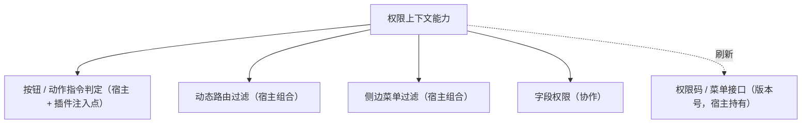

# 组件设计 · 权限上下文能力

> 动作 / 路由级权限上下文：权限码集合与判定（单码 / 任一 / 全部）/ 菜单与路由过滤 / 变更刷新；前端仅体验，后端为准
> 实现侧命名与落点见《[前端基类清单](../../../../../前端基类清单.md)》（「能力」节），实现契约细节见项目详细设计。

[文档首页](../../../../../文档首页.md) › [项目规划说明](../../../../../规划/项目规划说明.md) › [组件设计](../../../01_组件设计_总览.md) › 权限上下文能力　|　[← 语言上下文能力](../26_组件设计_语言上下文能力/26_组件设计_语言上下文能力.md)　[列配置能力 →](../28_组件设计_列配置能力/28_组件设计_列配置能力.md)

> 可交互原型：[27_原型设计_权限上下文能力.html](27_原型设计_权限上下文能力.html)（演示权限码集合、按钮显隐、路由 / 菜单过滤与权限变更刷新）

## 1. 目的与适用范围 

定义 BMS 前端**权限上下文能力**的组件设计：统一承载**权限码集合与判定**（单码 / 任一 / 全部，占位空集降级）——动作 / 路由级权限上下文；应用态（集合 / 菜单 / 版本 / 加载编排）由宿主外壳汇聚，按钮 / 指令判定经注入点消费本能力判定，菜单 / 路由过滤由宿主组合；与[字段权限能力](../11_组件设计_字段权限能力/11_组件设计_字段权限能力.md)（字段级）分工：本能力管**动作 / 路由级**，字段级归字段权限。它是基础组件类中的「权限上下文能力」，是继承链上**能力层**的一层（能力即继承链上的层）。

### 1.1 定位 

| 职责 | 归属 |
| --- | --- |
| 权限码集合与判定（单码 / 任一 / 全部）、路由 / 菜单过滤、变更刷新 | **本节点（权限上下文能力，核心判定）+ 宿主应用态（过滤 / 刷新编排）** |
| 按钮显隐指令 | [基础类「权限指令」](../../../09_基础类/02_组件设计_权限指令/02_组件设计_权限指令.md)（经注入点消费本能力判定） |
| 字段级权限（可见 / 可编辑 / 必填） | [字段权限能力](../11_组件设计_字段权限能力/11_组件设计_字段权限能力.md)（元数据驱动） |
| 权限数据与版本号 | 后端 RBAC（阶段七）；版本号由宿主应用态自持 |

上游依据：[《前端开发规范》](../../../../../规范/前端开发规范.md)（§7 动态菜单与权限）、[《概要设计 · RBAC》](../../../../概要设计/01_概要设计_总览.md)（权限码）、[《架构设计 · 前端架构》](../../../../架构设计/08_架构设计_前端架构.md)（权限渲染）。

> 本篇为 **基础组件类 · 能力「权限上下文能力」**。**范围边界**：后端为准（前端只是消费与显隐，不构成安全边界）；字段级权限归字段权限能力；本能力只管"动作 / 路由权限上下文"。

## 2. 职责与组成 

| 组成部分 | 职责 |
| --- | --- |
| 能力核心 | 权限码集合与判定：单码 / 任一 / 全部（占位空集 = 全量降级）；契约语义：菜单树过滤 / 刷新 / 权限变化事件 |
| 响应式投影（按需） | 能力核心与响应式的桥接：投影集合同步与判定依赖追踪；不重复实现能力逻辑 |
| 宿主应用态（宿主侧组合） | 集合 / 菜单 / 版本 / 加载编排；菜单 / 路由过滤与版本号由宿主自持 |

## 3. 交互与契约语义 

| 语义项 | 说明 |
| --- | --- |
| 权限码集合 | 当前用户权限码（`业务:动作`；登录后拉取；占位空集 = 全量降级） |
| 权限版本 | 角色 / 授权变更后比对刷新（**由宿主应用态自持**） |
| 单码判定 | 单权限判定（按钮 / 动作指令消费） |
| 任一 / 全部判定 | 批量场景的任一 / 全部判定 |
| 菜单树 / 路由过滤 | 按权限码过滤菜单树 / 路由（注册前双保险；宿主侧组合实现） |
| 刷新 | 登录 / 权限变更 / 版本号变化后拉取权限码 |
| 权限变化事件 | 权限变化后触发（重建动态路由 / 刷新菜单） |

## 4. 行为与分层关系 

| 项 | 设计 |
| --- | --- |
| 数据来源 | 登录成功后与菜单一起拉取权限码集合（一次请求）；刷新页面重新拉取（宿主应用态编排） |
| 默认拒绝 | **无权限默认隐藏**（按钮 / 动作指令无权限不渲染）；白名单页面（首页 / 个人中心）不受限 |
| 判定 | 纯内存集合判定（单码 / 任一 / 全部）；批量渲染（表格行操作列）避免重复判定开销 |
| 过滤 | 菜单树 / 路由注册前过滤（与后端下发双保险；宿主侧组合）；无权限直达由路由守卫拦截（403） |
| 变更刷新 | 角色 / 授权变更后：后端版本号变化 → 刷新（宿主重装配）→ 重建动态路由 + 刷新菜单（无需刷新页面，可选） |
| 安全边界 | **前端判定仅为体验**（显隐），真正校验在后端接口（前端不构成安全边界） |
| 释放 | 权限拉取请求登记[异步资源基类](../../01_机制基类/05_组件设计_异步资源基类/05_组件设计_异步资源基类.md)（宿主侧） |
| 依赖方向 | 只依赖 组件根 / 机制基类（能力层依赖登记为空，无能力依赖）；被权限指令 / 动态路由 / 菜单组合消费（宿主 / 插件侧）；能力在继承链上、依赖单向 |

## 5. 场景集成 

| 场景 | 说明 |
| --- | --- |
| 按钮显隐 | 按权限码判定（如 `user:create`）：新建按钮（无权限不渲染） |
| 动态路由 / 菜单 | 注册前过滤菜单树（宿主组合过滤，与后端下发一致） |
| 操作列渲染 | 表格行操作按权限组装（批量判定） |
| 权限变更 | 管理员调整角色后，用户端刷新（版本号驱动） |

## 6. 依赖接口与上游变更 

### 6.1 上游接口与口径 

| 项 | 说明 | 目标文档 |
| --- | --- | --- |
| 分层权威 | 权限上下文能力职责与默认拒绝口径 | [《前端开发规范》](../../../../../规范/前端开发规范.md) §7（登记项①） |
| 权限码 | 权限码命名（`业务:动作`）与集合接口 | [《概要设计 · RBAC》](../../../../概要设计/01_概要设计_总览.md)、[《命名规范》](../../../../../规范/命名规范.md)（登记项②） |
| 权限刷新 | 版本号与刷新时机 | [《架构设计 · 前端架构》](../../../../架构设计/08_架构设计_前端架构.md)（登记项③） |
| 新增依赖 | **无**（能力本体无新增上游文档依赖；过滤 / 版本编排在宿主） | — |

### 6.2 需登记的上游变更 

| 变更点 | 目标文档 | 内容 |
| --- | --- | --- |
| ① 权限上下文契约 | [《前端开发规范》](../../../../../规范/前端开发规范.md) §7 | 明确权限上下文能力：权限码集合与判定 / 默认拒绝；菜单路由过滤与版本号刷新由宿主组合；前端只做体验（后端为准） |
| ② 权限码接口 | [《概要设计》](../../../../概要设计/01_概要设计_总览.md) 对应节点 | 权限码集合接口（含版本号）与菜单接口的返回结构 |
| ③ 变更刷新 | [《架构设计 · 前端架构》](../../../../架构设计/08_架构设计_前端架构.md) | 权限变更后权限变化事件 → 重建路由 / 菜单的时序 |

> 按[《文档生成规范》](../../../../../规范/文档生成规范.md)「引用与追溯」节，上述变更需用户确认后由上游文档同步；本节点只定义权限上下文语义与契约。

## 7. 权限 / i18n / 移动端 

- **权限**：本能力即权限上下文（动作 / 路由级判定）；字段级归字段权限能力；安全边界在后端。
- **i18n**：无关（权限码为标识符）。
- **移动端**：移动端渲染插件为同一契约的另一实现（同一套契约断言保障）；权限上下文语义一致（宿主应用态同口径）。

## 8. 性能与边界 

| 场景 | 设计 |
| --- | --- |
| 判定 | 内存集合查询（常量开销）；列表批量渲染可先算一次布尔数组 |
| 边界 | 权限码大小写 / 拼写错误（开发态校验）、权限变更未刷新、菜单与权限码不一致（后端为准）、白名单遗漏、权限缓存过期 |
| 不支持 | 字段级权限（字段权限能力）、后端校验（RBAC）、按钮指令实现（权限指令） |

## 9. 检查清单 

- □ 契约语义：权限码集合 / 权限版本（由宿主应用态自持）+ 单码 / 任一 / 全部判定 + 菜单树 / 路由过滤 / 刷新 / 权限变化事件
- □ 行为：登录拉取、默认拒绝、白名单、菜单路由过滤双保险、版本号刷新、纯内存判定
- □ 前端仅为体验（后端为准）；被权限指令 / 动态路由组合消费；能力为继承链上的一层、依赖单向
- □ 权限 / i18n / 移动端符合第 7 节；性能边界符合第 8 节
- □ 三项上游登记已确认

> 组件设计节点（权限上下文能力）· 与[《前端开发规范》](../../../../../规范/前端开发规范.md)[《概要设计 · RBAC》](../../../../概要设计/01_概要设计_总览.md)[基础类「权限指令」](../../../09_基础类/02_组件设计_权限指令/02_组件设计_权限指令.md)[动态路由能力](../20_组件设计_动态路由能力/20_组件设计_动态路由能力.md)[字段权限能力](../11_组件设计_字段权限能力/11_组件设计_字段权限能力.md)《命名规范》配套
