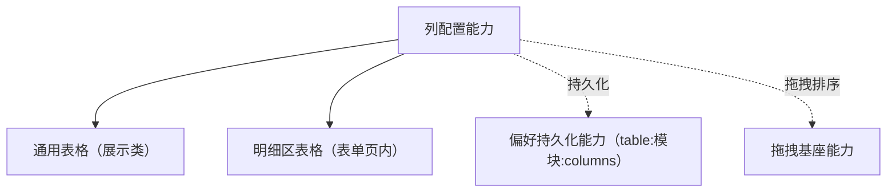

# 组件设计 · 列配置能力

> 列配置能力：列的显隐 / 顺序 / 宽度 / 冻结 / 重置；用户配置层与列定义分离，持久化经偏好持久化能力
> 实现侧命名与落点见《[前端基类清单](../../../../../前端基类清单.md)》（§2.1 全量基类登记表；继承链全系统唯一一份），实现契约细节见项目详细设计。

[文档首页](../../../../../文档首页.md) › [项目规划说明](../../../../../规划/项目规划说明.md) › [组件设计](../../../01_组件设计_总览.md) › 列配置能力　|　[← 权限上下文能力](../27_组件设计_权限上下文能力/27_组件设计_权限上下文能力.md)　[查询方案能力 →](../29_组件设计_查询方案能力/29_组件设计_查询方案能力.md)

> 可交互原型：[28_原型设计_列配置能力.html](28_原型设计_列配置能力.html)（演示列显隐、拖拽排序、宽度调整、重置与持久化）

## 1. 目的与适用范围 

定义 BMS 前端**列配置能力**的组件设计：统一表格**列的显隐、顺序、宽度、冻结与持久化**（用户配置层与列定义分离）——供 [展示类「通用表格」](../../../07_展示类/01_组件设计_通用表格/01_组件设计_通用表格.md) 与明细区表格共用；持久化经[偏好持久化能力](../16_组件设计_偏好持久化能力/16_组件设计_偏好持久化能力.md)（`table:模块:columns`）。它是基础组件类中的「列配置能力」，是**继承链上的组件基类**（父基类与落点见《[前端基类清单](../../../../../前端基类清单.md)》§2.1）。

### 1.1 定位 

| 职责 | 归属 |
| --- | --- |
| 列显隐、顺序、宽度、重置、冻结列、列配置导出 | **本节点（列配置能力）** |
| 表格渲染与数据 | [通用表格](../../../07_展示类/01_组件设计_通用表格/01_组件设计_通用表格.md) |
| 持久化存储 | [偏好持久化能力](../16_组件设计_偏好持久化能力/16_组件设计_偏好持久化能力.md) |
| 拖拽排序交互 | [拖拽基座能力](../23_组件设计_拖拽基座能力/23_组件设计_拖拽基座能力.md) |

上游依据：[《前端开发规范》](../../../../../规范/前端开发规范.md)（§3 分层）、[《布局设计 · 列表页》](../../../../布局设计/01_布局设计_总览.html)（表格列行为）。

> 本篇为 **基础组件类 · 能力「列配置能力」**。**范围边界**：表格渲染归通用表格；存储归偏好持久化；本能力只管"列的定义与用户偏好"。

## 2. 职责与组成 

| 组成部分 | 职责 |
| --- | --- |
| 基类核心 | 列配置用户层状态：列显隐 / 顺序 / 宽度；契约语义：切换显隐 / 调整顺序 / 调宽 / 冻结 / 重置；持久化经偏好持久化能力对接 |

## 3. 交互与契约语义 

| 语义项 | 说明 |
| --- | --- |
| 列定义 | 列要素：字段 / 列头 / 宽度 / 固定 / 默认隐藏（由页面提供，本能力只维护用户配置层） |
| 持久化键 | `table:{模块}:columns`（经偏好持久化能力） |
| 宽度边界 | 拖拽宽度上下限 |
| 可见列 | 当前可见列（顺序即渲染顺序；响应式） |
| 显隐切换 | 列显隐切换（至少保留一列） |
| 顺序调整 | 顺序调整（列设置面板 / 表头拖拽） |
| 宽度调整 | 宽度调整（表头拖拽；双击列边界自适应） |
| 冻结切换 | 冻结列切换（左侧 / 右侧 / 取消） |
| 重置 | 重置为默认配置（列定义的默认隐藏生效） |
| 保存 / 恢复 | 手动保存 / 恢复（偏好持久化自动同步，手动入口供设置面板） |

## 4. 行为与分层关系 

| 项 | 设计 |
| --- | --- |
| 列定义 | 列定义来自页面；本能力只维护"用户配置层"（显隐 / 顺序 / 宽度 / 冻结） |
| 显隐 | 默认列 + 默认隐藏；用户切换即时生效；至少保留一列（防止空白表） |
| 顺序 | 列设置面板或表头拖拽调整（拖拽经拖拽基座能力）；顺序即可见列顺序 |
| 宽度 | 表头拖拽调整；双击列边界自适应内容；设宽度上下限边界 |
| 冻结 | 左侧 / 右侧冻结（操作列默认右冻结）；与固定列数限制协调 |
| 持久化 | 变更防抖后经偏好持久化能力保存（键 `table:模块:columns`；基类依赖偏好持久化为单向下沉）；跨设备同步；重置同步清远端 |
| 明细表 | 明细区表格独立持久化键（如 `table:order:detail:columns`） |
| 依赖方向 | 只依赖 组件根 / 公共基类；基类依赖偏好持久化能力（单向下沉）；拖拽经拖拽基座能力协作（不入能力依赖登记）；被表格组合消费；不依赖具体页面 |

## 5. 场景集成 

| 场景 | 说明 |
| --- | --- |
| 通用表格 | 列设置面板（显隐 / 顺序）、表头拖宽、冻结列 |
| 明细区表格 | 主表表单内的明细列配置（独立键） |
| 导出协作 | 导出列范围取当前可见列（与导入导出组件协作） |
| 查询方案 | 列配置与查询方案同属用户偏好（各自键） |

## 6. 依赖接口与上游变更 

### 6.1 上游接口与口径 

| 项 | 说明 | 目标文档 |
| --- | --- | --- |
| 分层权威 | 列配置能力职责与持久化口径 | [《前端开发规范》](../../../../../规范/前端开发规范.md) 第 3 节（登记项①） |
| 列行为 | 列显隐 / 拖宽 / 冻结的交互口径 | [《布局设计 · 列表页》](../../../../布局设计/01_布局设计_总览.html)（登记项②） |
| 持久化 | 列配置存储键与同步 | [偏好持久化能力](../16_组件设计_偏好持久化能力/16_组件设计_偏好持久化能力.md)（登记项③） |
| 新增依赖 | **无**（基类依赖偏好持久化能力为既有登记，无新增上游文档依赖） | — |

### 6.2 需登记的上游变更 

| 变更点 | 目标文档 | 内容 |
| --- | --- | --- |
| ① 列配置能力契约 | [《前端开发规范》](../../../../../规范/前端开发规范.md) 第 3 节 | 明确列配置能力：显隐 / 顺序 / 宽度 / 冻结 / 重置；用户配置层与列定义分离 |
| ② 列交互口径 | [《布局设计 · 列表页》](../../../../布局设计/01_布局设计_总览.html) | 列设置面板入口、拖宽 / 双击自适应、冻结规则 |
| ③ 存储键 | [偏好持久化能力](../16_组件设计_偏好持久化能力/16_组件设计_偏好持久化能力.md) | `table:{模块}:columns` 键规则与跨设备同步 |

> 按[《文档生成规范》](../../../../../规范/文档生成规范.md)「引用与追溯」节，上述变更需用户确认后由上游文档同步；本节点只定义列配置语义与契约。

## 7. 权限 / i18n / 移动端 

- **权限**：列是否可见可叠加权限（无权限列不纳入列定义，由页面组装）；本能力不判权。
- **i18n**：列标题由列定义（i18n key 或后端下发）提供。
- **移动端**：移动端渲染插件为同一契约的另一实现（同一套契约断言保障）；移动端不提供列配置（窄屏精简列）。

## 8. 性能与边界 

| 场景 | 设计 |
| --- | --- |
| 拖宽 | 拖拽过程只更新预览宽度，松手后一次性写模型（避免高频重排） |
| 持久化 | 变更防抖保存；恢复时与列定义合并（新增列自动追加） |
| 边界 | 列标识变更（旧配置不匹配，按标识合并兜底）、全隐（禁止）、宽度越界、冻结冲突、跨设备格式升级 |
| 不支持 | 表格渲染（通用表格）、存储实现（偏好持久化能力）、拖拽库（拖拽基座能力） |

## 9. 检查清单 

- □ 契约语义：列定义 / 持久化键 / 宽度边界 + 可见列 / 显隐切换 / 顺序调整 / 宽度调整 / 冻结切换 / 重置 / 保存 / 恢复
- □ 行为：用户配置层、至少保留一列、顺序即渲染序、拖宽边界、冻结规则、防抖持久化
- □ 被表格组合消费；持久化经偏好持久化能力（基类依赖单向下沉）、拖拽经拖拽基座能力；本基类位于继承链上、依赖单向
- □ 权限 / i18n / 移动端符合第 7 节；性能边界符合第 8 节
- □ 三项上游登记已确认

> 组件设计节点（列配置能力）· 与[《前端开发规范》](../../../../../规范/前端开发规范.md)[《布局设计 · 列表页》](../../../../布局设计/01_布局设计_总览.html)[通用表格](../../../07_展示类/01_组件设计_通用表格/01_组件设计_通用表格.md)[偏好持久化能力](../16_组件设计_偏好持久化能力/16_组件设计_偏好持久化能力.md)[拖拽基座能力](../23_组件设计_拖拽基座能力/23_组件设计_拖拽基座能力.md)《命名规范》配套
