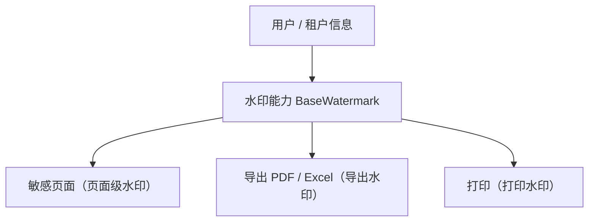

# 组件设计 · 水印能力

> `BaseWatermark`（核心能力类，key `watermark`；`frontend/packages/core/src/capabilities/watermark.ts`，登记 `capabilities/manifest.ts`）· 无 Vue 投影（按需回补；水印绘制由渲染插件承担）；旧实现已删除（历史经 git 追溯）

[文档首页](../../../../../文档首页.md) › [项目规划说明](../../../../../规划/项目规划说明.md) › [组件设计](../../../01_组件设计_总览.md) › 水印能力　|　[← 查询方案能力](../29_组件设计_查询方案能力/29_组件设计_查询方案能力.md)　[模块上下文能力 →](../31_组件设计_模块上下文能力/31_组件设计_模块上下文能力.md)

> 可交互原型：[30_原型设计_水印能力.html](30_原型设计_水印能力.html)（演示水印注入（用户 / 租户信息）、透明度 / 旋转 / 密度调节与防移除）

## 1. 目的与适用范围 

定义 BMS 前端 `frontend/packages/*`（核心 `frontend/packages/core` + 按需的 Vue 投影 `frontend/packages/vue`；渲染插件 `ui-ep` / `ui-vant` 按需）**水印能力（原「水印能力」）**的组件设计：核心能力类 `BaseWatermark`（`frontend/packages/core/src/capabilities/watermark.ts`，登记 `capabilities/manifest.ts`）（+ 按需的 Vue 投影）。它是组件设计体系**能力**，统一**水印注入**——页面区域与导出内容叠加**用户 / 租户信息**水印（涉密防泄漏）；供 [展示类「水印」](../../../07_展示类/14_组件设计_水印/14_组件设计_水印.md)（组件形态）、[交互类「打印与导出PDF」](../../../08_交互类/19_组件设计_打印与导出PDF/19_组件设计_打印与导出PDF.md) 与敏感页面共用。

### 1.1 定位 

| 职责 | 归属 |
| --- | --- |
| 水印内容组装（用户 / 租户 / 时间）、注入与移除、防移除、导出注入接口 | **本节点（水印能力；核心承载内容组装与显示状态，绘制 / 注入由渲染插件承担）** |
| 水印组件视觉壳 | [展示类「水印」](../../../07_展示类/14_组件设计_水印/14_组件设计_水印.md) |
| 导出 / 打印流程 | [打印与导出PDF](../../../08_交互类/19_组件设计_打印与导出PDF/19_组件设计_打印与导出PDF.md) |
| 用户 / 租户信息 | [用户展示能力](../19_组件设计_用户展示能力/19_组件设计_用户展示能力.md) 与租户上下文 |

上游依据：[《前端开发规范》](../../../../../规范/前端开发规范.md)（§3 分层）、[《架构设计 · 安全》](../../../../架构设计/01_架构设计_总览.md)（防泄漏）、[《布局设计》](../../../../布局设计/01_布局设计_总览.html)（水印视觉）。

> 本篇为 **基础组件类 · 能力「水印能力」**。**范围边界**：水印组件视觉归展示类「水印」；导出流程归打印导出组件；本能力只管"水印内容与注入机制"。

## 2. 组件清单与职责 

| 组件 / 工具 | 位置 | 职责 |
| --- | --- | --- |
| `BaseWatermark`（核心能力类，key `watermark`） | `frontend/packages/core/src/capabilities/watermark.ts`（登记 `capabilities/manifest.ts`） | 水印内容组装与显示状态：`build(lines)` / `text` / `show` / `hide`；契约语义：`apply(el)` / `remove(el)` / `update(opts)` / `toDataURL()`（绘制 / 注入由渲染插件承担） |

- 命名遵循[《命名规范》](../../../../../规范/命名规范.md)；落点遵循[《前端开发规范》](../../../../../规范/前端开发规范.md) §3（核心能力类 + 按需投影 + 插件包装）。

> **实现口径（2026-09-17，新体系）**：原「水印能力」（旧 `useWatermark` 组合式）已类化为核心能力类 `BaseWatermark`（`frontend/packages/core/src/capabilities/watermark.ts`，继承 `BaseCapability`，登记 `capabilities/manifest.ts`；核心只做水印文本组装与显示状态）；本能力暂无 Vue 投影（按需回补，`useXxx` 只落 `frontend/packages/vue/src/bindings/`），旧实现已删除（历史经 git 追溯）；canvas 生成 / 注入移除 / 防移除 / 导出注入由渲染插件承担。`depends` 由能力机制开发态校验（单向、无循环）；契约语义（内容组装 / 注入移除 / 防移除 / 导出注入 / 行为规则）保持不变。

## 3. 契约（参数与方法） 

| 属性 | 类型 | 默认 | 说明 |
| --- | --- | --- | --- |
| `text` | string \| string[] | 自动组装 | 水印内容（默认：姓名 + 工号 / 手机号 + 租户名 + 日期） |
| `opacity` | number | 0.15 | 透明度（0-1） |
| `rotate` | number | -20 | 旋转角度（度） |
| `gapX` / `gapY` | number | 180 / 120 | 水印间距（密度） |
| `fontSize` | number | 14 | 字号 |
| `guard` | boolean | true | 防移除（MutationObserver 重建被删水印层） |

| 方法 / 事件 | 说明 |
| --- | --- |
| `apply(el)` | 注入水印（元素级 / 页面级）；返回句柄 |
| `remove(el)` | 移除水印（卸载 / 权限放开后） |
| `update(opts)` | 更新内容或样式（用户切换后） |
| `toDataURL()` | 生成水印图片（供导出 / 打印注入） |

## 4. 行为与实现约定 

| 项 | 设计 |
| --- | --- |
| 内容组装 | 默认组装当前用户（姓名 / 工号）+ 租户名 + 日期；可覆盖；**不引入敏感信息超范围**（与安全口径一致） |
| 生成方式 | canvas 生成平铺图案 → 背景图（性能好、无 DOM 逐块；渲染插件侧实现）；旋转 / 间距 / 透明度参数化 |
| 防移除 | `guard` 时 MutationObserver 监听水印层被删除 / 样式篡改并重建（渲染插件侧实现；提高摘除成本，不承诺绝对防） |
| 范围 | 页面级（根容器）或区域级（敏感卡片）；导出 / 打印经 `toDataURL` 注入 |
| 释放 | 观察者 / 句柄登记[异步资源基类](../../01_机制基类/05_组件设计_异步资源基类/05_组件设计_异步资源基类.md)（组件卸载自动移除，渲染插件侧） |
| 依赖方向 | 只依赖 组件根 / 机制基类（`depends` 空；用户 / 租户信息经调用方注入协作）；被页面与导出流程组合消费 |

## 5. 场景集成 

| 场景 | 说明 |
| --- | --- |
| 敏感页面 | 员工信息 / 薪资 / 审计页面页面级水印（防拍照泄露威慑） |
| 导出 PDF / Excel | 导出内容叠加水印（`toDataURL` 注入页眉 / 背景） |
| 打印 | 打印件水印（与打印样式协作） |
| 区域水印 | 文件预览 / 图表卡区域级水印 |

## 6. 依赖接口与上游变更 

### 6.1 上游接口与口径 

| 项 | 说明 | 目标文档 |
| --- | --- | --- |
| 分层权威 | 水印能力职责与内容口径 | [《前端开发规范》](../../../../../规范/前端开发规范.md) 第 3 节（登记项①） |
| 安全口径 | 水印内容范围与防泄漏要求 | [《架构设计 · 安全》](../../../../架构设计/01_架构设计_总览.md)（登记项②） |
| 导出协作 | 导出 / 打印水印注入 | [打印与导出PDF](../../../08_交互类/19_组件设计_打印与导出PDF/19_组件设计_打印与导出PDF.md)（登记项③） |
| 新增依赖 | **无**（能力本体无新增上游文档依赖） | — |

### 6.2 需登记的上游变更 

| 变更点 | 目标文档 | 内容 |
| --- | --- | --- |
| ① 水印能力契约 | [《前端开发规范》](../../../../../规范/前端开发规范.md) 第 3 节 | 明确水印能力（`BaseWatermark`）：内容组装 / canvas 生成 / 防移除 / `toDataURL` 导出注入 / 卸载移除（绘制与防移除在渲染插件侧） |
| ② 水印内容范围 | [《架构设计》](../../../../架构设计/01_架构设计_总览.md) 安全节点 | 水印内容要素（用户 / 租户 / 时间）与敏感信息边界 |
| ③ 导出协作 | [打印与导出PDF](../../../08_交互类/19_组件设计_打印与导出PDF/19_组件设计_打印与导出PDF.md) | 导出 / 打印注入水印的方式与时序 |

> 按[《文档生成规范》](../../../../../规范/文档生成规范.md)「引用与追溯」节，上述变更需用户确认后由上游文档同步。

## 7. 权限 / i18n / 移动端 

- **权限**：水印是否启用可由页面 / 权限决定；本能力不判权。
- **i18n**：水印内容中的"日期 / 租户名"按 locale 格式化（语言上下文能力协作）。
- **移动端**：`ui-vant` 为同一契约的另一实现（契约套件同一套断言）；能力语义一致（密度参数按端调整）。

## 8. 性能与边界 

| 场景 | 设计 |
| --- | --- |
| 生成 | canvas 一次生成 base64（不逐块 DOM）；参数变化才重生成 |
| 边界 | 水印被移除（`guard` 重建）、打印样式差异、导出时高度不足（平铺）、深色背景可读性、内容过长溢出 |
| 不支持 | 组件视觉壳（展示类「水印」）、导出流程（打印导出）、权限判定 |

## 9. 检查清单 

- □ 契约：`text`/`opacity`/`rotate`/`gapX`/`gapY`/`fontSize`/`guard` + `apply`/`remove`/`update`/`toDataURL`
- □ 行为：内容组装不超范围、canvas 生成、防移除重建、导出注入、卸载自动移除
- □ 被敏感页面 / 导出流程组合消费；依赖方向单向（`depends` 登记校验）
- □ 权限/i18n/移动端符合第 7 节；性能边界符合第 8 节
- □ 三项上游登记已确认

> 组件设计节点（水印能力）· 与[《前端开发规范》](../../../../../规范/前端开发规范.md)[《架构设计 · 安全》](../../../../架构设计/01_架构设计_总览.md)[展示类「水印」](../../../07_展示类/14_组件设计_水印/14_组件设计_水印.md)[打印与导出PDF](../../../08_交互类/19_组件设计_打印与导出PDF/19_组件设计_打印与导出PDF.md)[用户展示能力](../19_组件设计_用户展示能力/19_组件设计_用户展示能力.md)《命名规范》配套
