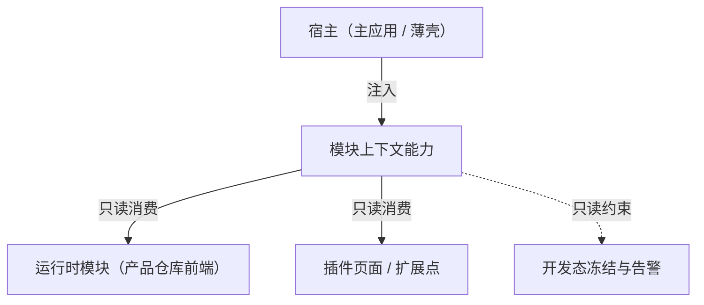

# 组件设计 · 模块上下文能力

> 模块上下文能力：宿主注入的统一上下文入口（路由 / 状态库 / 国际化 / 用户 / 租户）与只读消费约束、未注入兜底
> 实现侧命名与落点见《[前端基类清单](../../../../../前端基类清单.md)》（「能力」节），实现契约细节见项目详细设计。

[文档首页](../../../../../文档首页.md) › [项目规划说明](../../../../../规划/项目规划说明.md) › [组件设计](../../../01_组件设计_总览.md) › 模块上下文能力　|　[← 水印能力](../30_组件设计_水印能力/30_组件设计_水印能力.md)　[交互能力 →](../../02_能力类/01_组件设计_交互能力/01_组件设计_交互能力.md)

> 可交互原型：[31_原型设计_模块上下文能力.html](31_原型设计_模块上下文能力.html)（演示宿主注入上下文、模块只读消费与未注入时的开发态报错）

## 1. 目的与适用范围 

定义 BMS 前端**模块上下文能力**的组件设计：作为**能力侧的统一上下文入口**——宿主（[微前端外壳](../../../03_布局组件类/01_组件设计_主框架布局壳/01_组件设计_主框架布局壳.md) / 宿主外壳与模块加载器）注入路由 / 状态库 / 国际化 / 用户 / 租户句柄，能力侧**只读消费**；供阶段五运行时模块（产品仓库前端模块）与宿主外壳协作。它是基础组件类中的「模块上下文能力」，是继承链上**能力层**的一层（能力即继承链上的层）。

### 1.1 定位 

| 职责 | 归属 |
| --- | --- |
| 上下文注入与读取、只读约束、未注入兜底 | **本节点（模块上下文能力）** |
| 宿主注入实现与模块加载 | [《架构设计 · 前端架构》](../../../../架构设计/08_架构设计_前端架构.md)「前端插件化与运行时组合」节（阶段五） |
| 动态路由注册 | [动态路由能力](../20_组件设计_动态路由能力/20_组件设计_动态路由能力.md) |
| 注册表挂接 | [注册表基类](../../01_机制基类/06_组件设计_注册表基类/06_组件设计_注册表基类.md) |

上游依据：[《前端开发规范》](../../../../../规范/前端开发规范.md)（§3 分层）、[《架构设计 · 前端架构》](../../../../架构设计/08_架构设计_前端架构.md)（微前端宿主与模块契约）、知识档案《微前端》专题。

> 本篇为 **基础组件类 · 能力「模块上下文能力」**。**范围边界**：宿主加载与注入实现归阶段五外壳；注册挂接归注册表基座；本能力只管"模块从哪拿上下文、拿到的是不是只读"。

## 2. 职责与组成 

| 组成部分 | 职责 |
| --- | --- |
| 能力核心 | 上下文读取（只读约定：能力侧不得改写宿主句柄）；契约语义：读取 / 是否已注入 / 只读约束 |
| 注入通道（机制侧，按需） | 宿主注入与能力侧只读读取的通道；未注入时的开发态报错 / 默认值 |

## 3. 交互与契约语义 

| 语义项 | 说明 |
| --- | --- |
| 严格模式 | 默认开启：未注入即开发态报错（生产兜底降级） |
| 路由 | 路由实例（模块内跳转） |
| 状态库 | 状态库实例（只读消费会话 / 权限 / 配置） |
| 国际化 | 国际化实例（取词） |
| 用户 | 当前用户（标识 / 姓名 / 权限码引用） |
| 租户 | 当前租户（标识 / 名称） |
| 读取 | 取上下文（只读对象；开发态冻结） |
| 是否已注入 | 是否已注入（模块可做降级分支） |
| 上下文变化事件 | 上下文关键项变化（用户 / 租户切换；模块重建时重读） |

## 4. 行为与分层关系 

| 项 | 设计 |
| --- | --- |
| 注入 | 宿主在外壳初始化时注入（宿主外壳与模块加载器，阶段五）；能力侧只读读取 |
| 只读 | 上下文对象开发态冻结（含浅冻结）；能力侧**不得改写**宿主状态（写操作走动作 / 事件） |
| 未注入兜底 | 非严格模式或生产态：读取返回安全默认（空用户 / 默认租户）并降级提示；禁止能力侧自读全局变量绕过 |
| 生命周期 | 模块加载时读取；用户 / 租户切换 → 上下文变化事件 → 模块重读（重新初始化） |
| 安全 | 用户项仅含展示与判定所需字段（不携带令牌）；令牌由请求层自持（能力侧不接触） |
| 释放 | 事件监听登记[异步资源基类](../../01_机制基类/05_组件设计_异步资源基类/05_组件设计_异步资源基类.md) |
| 依赖方向 | 只依赖 组件根 / 机制基类（能力层依赖登记为空，无能力依赖）；被运行时模块组合消费；不依赖具体业务组件；能力在继承链上、依赖单向 |

## 5. 场景集成 

| 场景 | 说明 |
| --- | --- |
| 运行时模块（产品仓库） | 模块页面统一经本能力取路由 / 国际化 / 用户，接入主应用 |
| 插件页面 / 扩展点 | 扩展组件经上下文取宿主能力（不直接引用宿主模块） |
| 用户 / 租户切换 | 上下文变化事件 → 模块重读并刷新 |
| 调试 | 是否已注入 / 严格模式帮助定位"模块脱离宿主"运行的问题 |

## 6. 依赖接口与上游变更 

### 6.1 上游接口与口径 

| 项 | 说明 | 目标文档 |
| --- | --- | --- |
| 分层权威 | 模块上下文能力职责与只读约束 | [《前端开发规范》](../../../../../规范/前端开发规范.md) 第 3 节（登记项①） |
| 微前端契约 | 宿主注入内容与模块契约 | [《架构设计 · 前端架构》](../../../../架构设计/08_架构设计_前端架构.md)「前端插件化与运行时组合」节（登记项②） |
| 安全边界 | 上下文不含令牌 / 敏感字段 | [《架构设计 · 安全》](../../../../架构设计/01_架构设计_总览.md)（登记项③） |
| 新增依赖 | **无**（能力本体无新增上游文档依赖） | — |

### 6.2 需登记的上游变更 

| 变更点 | 目标文档 | 内容 |
| --- | --- | --- |
| ① 模块上下文契约 | [《前端开发规范》](../../../../../规范/前端开发规范.md) 第 3 节 | 明确模块上下文能力：注入（路由 / 状态库 / 国际化 / 用户 / 租户）、只读约束、未注入兜底 |
| ② 宿主契约 | [《架构设计 · 前端架构》](../../../../架构设计/08_架构设计_前端架构.md) | 宿主注入内容清单与模块上下文变化事件时序（阶段五落地） |
| ③ 安全边界 | [《架构设计》](../../../../架构设计/01_架构设计_总览.md) 安全节点 | 上下文不含令牌 / 敏感字段；模块不接触凭据 |

> 按[《文档生成规范》](../../../../../规范/文档生成规范.md)「引用与追溯」节，上述变更需用户确认后由上游文档同步；本节点只定义模块上下文语义与契约。

## 7. 权限 / i18n / 移动端 

- **权限**：上下文携带权限码引用（[权限上下文能力](../27_组件设计_权限上下文能力/27_组件设计_权限上下文能力.md)），判定归权限上下文；本能力只传递。
- **i18n**：国际化实例经上下文提供（能力侧取词统一入口）。
- **移动端**：移动端渲染插件为同一契约的另一实现（同一套契约断言保障）；宿主注入语义一致。

## 8. 性能与边界 

| 场景 | 设计 |
| --- | --- |
| 读取 | 上下文为对象引用（无拷贝开销）；读取不做深克隆 |
| 边界 | 未注入（严格模式报错 / 降级）、上下文被模块改写（冻结告警）、用户 / 租户切换后模块未重读、多宿主冲突（同时挂载） |
| 不支持 | 宿主加载实现（阶段五）、注册挂接（注册表基座）、权限判定（权限上下文能力） |

## 9. 检查清单 

- □ 契约语义：严格模式 + 读取 / 是否已注入 + 上下文成员（路由 / 状态库 / 国际化 / 用户 / 租户）+ 上下文变化事件
- □ 行为：只读冻结、未注入兜底（禁止绕过全局）、用户 / 租户切换重读、不含令牌
- □ 被运行时模块组合消费；能力为继承链上的一层、依赖单向
- □ 权限 / i18n / 移动端符合第 7 节；性能边界符合第 8 节
- □ 三项上游登记已确认

> 组件设计节点（模块上下文能力）· 与[《前端开发规范》](../../../../../规范/前端开发规范.md)[《架构设计 · 前端架构》](../../../../架构设计/08_架构设计_前端架构.md)[动态路由能力](../20_组件设计_动态路由能力/20_组件设计_动态路由能力.md)[权限上下文能力](../27_组件设计_权限上下文能力/27_组件设计_权限上下文能力.md)[注册表基类](../../01_机制基类/06_组件设计_注册表基类/06_组件设计_注册表基类.md)《命名规范》配套
