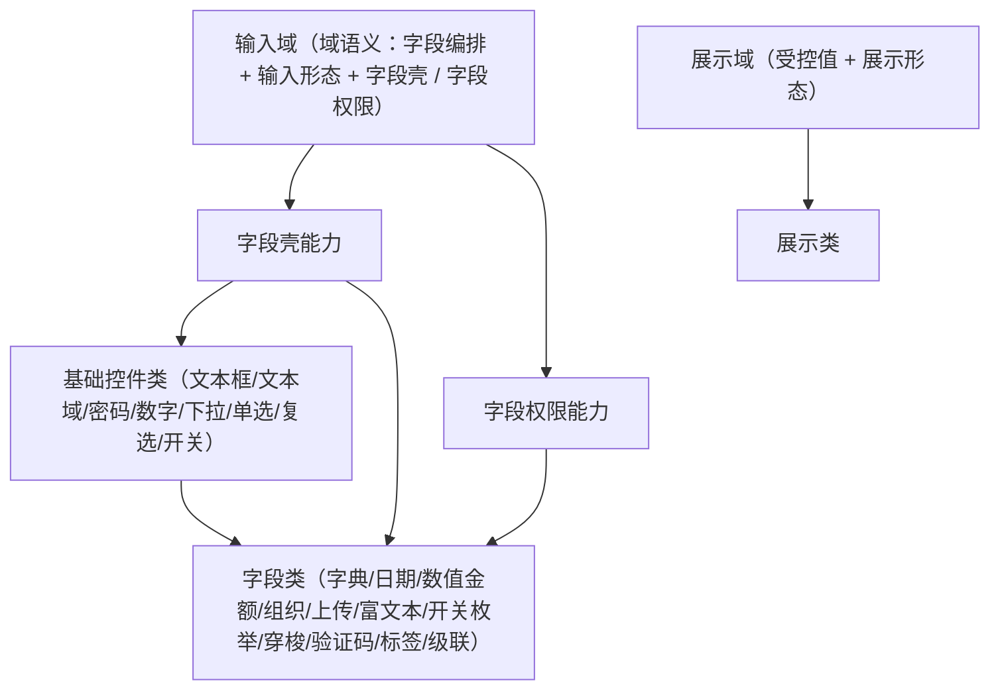

# 组件设计 · 输入族基类（原输入域基类）

> 输入域语义基类：受控绑定 / 值归一 / 三态 / 禁用合并 / 只读回显 / 校验触发 / 变更上报——被基础控件类与字段类继承
> 实现侧命名与落点见《[前端基类清单](../../../../../前端基类清单.md)》（§2.1 全量基类登记表、§5 能力域基类；继承链全系统唯一一份）。**本节点目录名沿用「域基类」的历史命名，正文按新口径称「族基类」。**

[文档首页](../../../../../文档首页.md) › [项目规划说明](../../../../../规划/项目规划说明.md) › [组件设计](../../../01_组件设计_总览.md) › 输入域基类　|　[← 字段权限能力](../../02_能力类/11_组件设计_字段权限能力/11_组件设计_字段权限能力.md)　[展示域基类 →](../02_组件设计_展示域基类/02_组件设计_展示域基类.md)

> 可交互原型：[01_原型设计_输入域基类.html](01_原型设计_输入域基类.html)（演示受控绑定、值变化通知、三态（未设置）、禁用/只读、前后缀插槽、继承关系与值归一）

## 1. 目的与适用范围 

定义 BMS 前端**输入域基类**的组件设计：输入域语义由继承链上的能力域基类承载——字段编排（值归一、三态、禁用合并、校验触发、变更上报）+ 输入形态 + 字段壳 / 字段权限；它是组件设计体系**输入域语义基类**，**被 [基础控件类](../../../01_组件设计_总览.md)（文本框/文本域/密码/数字/下拉/单选/复选/开关）与 [字段类](../../../01_组件设计_总览.md)（字典/日期/数值金额/组织/上传/富文本/开关枚举/穿梭/验证码/标签/级联）继承**，统一「界面渲染、受控、可见/可编辑、必填、校验」的公共契约。

### 1.1 定位与继承体系 

- **本基类是 `BaseInput`（父基类 `BaseField`）**：继承链为 `BaseObject → BaseComponent → BaseValue → BaseField → BaseInput`（落点见《前端基类清单》§2.1 / §5.1）。
- **基类不是"终端组件"**：不直接用于页面；页面用基础控件类或字段类，二者均**继承本基类**（族语义经继承链承载）。
- **统一控制点**：受控绑定、三态、禁用（权限/只读/加载合并）、校验触发、变更上报——全部在基类定义一次，子类只负责"值如何输入/展示"。
- **越权防护**：字段不可见由[字段权限能力](../../02_能力类/11_组件设计_字段权限能力/11_组件设计_字段权限能力.md)在**字段壳层**决定不渲染，不进入基类；基类只处理"可编辑/禁用"的渲染态。

上游依据：[《前端开发规范》](../../../../../规范/前端开发规范.md)（组件契约、组合式、TypeScript 约定）、[《架构设计 · 前端架构》](../../../../架构设计/08_架构设计_前端架构.md)（组件分层与目录）、[《概要设计 · 表单定制》](../../../../概要设计/36_概要设计_表单定制.md)（组件类型与字段属性）；页面形态依据[《布局设计 · 表单页》](../../../../布局设计/08_布局设计_表单页.html)（三态、只读/编辑分态）。

> 本篇为「输入域基类」节点（体系基类层）。**范围边界**：**字段外层壳**归[字段壳能力](../../02_能力类/10_组件设计_字段壳能力/10_组件设计_字段壳能力.md)；**字段权限**归[字段权限能力](../../02_能力类/11_组件设计_字段权限能力/11_组件设计_字段权限能力.md)；**具体控件**归基础控件类与字段类；**只读展示**归[展示域基类](../02_组件设计_展示域基类/02_组件设计_展示域基类.md)。

## 2. 职责与组成 

| 组成部分 | 职责 |
| --- | --- |
| 输入域语义（能力域基类） | 受控绑定、三态、禁用合并、校验触发、变更上报（能力域基类承载） |
| 域包装件 | 继承链上的域层包装（能力域基类之上、具体控件之下），承载域语义并可被模板层消费 |
| 字段上下文通道（按需） | 字段壳下发标签/必填/错误/只读，控件回传值变化与校验结果 |
| 表单容器协作（可选） | 与表单容器能力协作：校验规则注入、校验/重置/清除校验的代理语义 |

- **继承方式**：族基类是**继承链上的能力域基类**（其上位基类之上、具体组件 / 件之下）；基础控件类与字段类经输入域派生取得公共行为语义，不在链外自由挂接（口径见[《前端开发规范》](../../../../../规范/前端开发规范.md)§1「架构铁律」与 §3.4）。

## 3. 交互与契约语义 

| 语义项 | 说明 |
| --- | --- |
| 受控值 | 单向受控（由外部持有真值，输入即对外通知）；子类可收窄值类型 |
| 禁用 | 编辑态不可编辑；只读态由字段壳统一置禁用；多来源合并见第 4 节 |
| 只读 | 可聚焦、可复制、不可修改（用于只读回显的输入框） |
| 尺寸 | 随密度令牌（小 / 默认 / 大 三态） |
| 占位文案 | 占位提示（i18n 或字段属性下发） |
| 可清空 | 一键清空；清空后归一到统一空值（默认空） |
| 字段标识 | 字段标识用于字段上下文注册与校验定位 |
| 值变化语义 | 值变化同时对外通知两类消费方：受控更新（双向绑定）与业务变更监听（含归一后值） |
| 焦点语义 | 聚焦/失焦对外透传（供壳与渲染器协作） |
| 校验语义 | 校验结果回传字段壳，供错误位展示 |
| 插槽语义 | 前缀、后缀、前置、后置、空态（自定义空态）；默认插槽留空由子类填充控件 |
| 透传语义 | 未声明的属性/事件透传到底层控件 |

## 4. 基类行为 

| 项 | 设计 |
| --- | --- |
| 受控 | 只认外部受控值，不在内部持有"真值"；输入即先通知受控更新、再通知业务变更 |
| 值归一 | 空串/未定义 → 统一空值（默认空）；多值控件空数组归一；子类可覆盖（如金额保留精度） |
| 三态 | 未设置（值为空且未交互）与显式空可区分（用于必填校验与占位提示差异） |
| 禁用合并 | 显式禁用、只读、字段不可编辑、加载中——多来源在基类汇合为同一禁用态 |
| 只读回显 | 只读时控件禁止修改但保持可聚焦/可复制；是否改用纯文本由字段壳按字段类型决定（[字段壳能力](../../02_能力类/10_组件设计_字段壳能力/10_组件设计_字段壳能力.md)） |
| 校验 | 子类声明规则，基类在值变化时触发校验并回传上下文；提交时由表单统一校验 |
| 去抖/时序 | 输入类事件即时通知受控更新；业务变更可配置去抖（如文本搜索型字段） |
| 上下文注册 | 挂载时按字段标识注册、卸载注销；错误信息由壳统一渲染 |
| 插槽 | 统一前后缀/前置后置/空态插槽；子类可增补（如密码可见切换、数字步进） |
| 无权限字段 | 不可见由壳层控制**不渲染**基类组件（越权语义在字段权限，不在基类） |

## 5. 场景集成 

| 场景 | 说明 |
| --- | --- |
| 基础控件类 | 文本框/文本域/密码/数字/下拉/单选/复选/开关 均继承本基类 |
| 字段类 | 字典/日期/数值金额/组织/上传/富文本/开关枚举/穿梭/验证码/标签/级联 继承本基类 |
| 表单渲染器 | 按字段类型分发到继承基类的控件（[交互类「表单渲染器」](../../../08_交互类/12_组件设计_表单渲染器/12_组件设计_表单渲染器.md)） |
| 查询筛选区 | 查询条件的输入控件复用基础控件（[展示类「查询筛选区」](../../../07_展示类/02_组件设计_查询筛选区/02_组件设计_查询筛选区.md)） |

## 6. 依赖接口与上游变更 

### 6.1 上游接口与口径 

| 项 | 说明 | 目标文档 |
| --- | --- | --- |
| 组件契约 | 组件契约、组合式与 TypeScript 约定 | [《前端开发规范》](../../../../../规范/前端开发规范.md)（登记项①） |
| 组件分层 | 核心能力 / 投影 / 渲染插件落点与继承关系（能力域基类 → 基础控件类 / 字段类） | [《架构设计 · 前端架构》](../../../../架构设计/08_架构设计_前端架构.md)（登记项②） |
| 组件类型 | 基础控件类型注册与字段属性 | [《概要设计 · 表单定制》](../../../../概要设计/36_概要设计_表单定制.md)（登记项③） |
| 三态/只读 | 只读用禁用、三态共用布局 | [《布局设计 · 表单页》](../../../../布局设计/08_布局设计_表单页.html) |
| 新增依赖 | **无**：复用既有表单控件与样式令牌 | — |

### 6.2 需登记的上游变更 

| 变更点 | 目标文档 | 内容 |
| --- | --- | --- |
| ① 字段组件继承契约 | [《前端开发规范》](../../../../../规范/前端开发规范.md)「组件契约」节 | 明确字段控件统一继承输入域基类：受控绑定 + 变更通知、禁用合并（权限/只读/加载）、值归一与三态、校验触发；标注组件设计 输入域基类 为语义依据 |
| ② 组件分层与目录 | [《架构设计 · 前端架构》](../../../../架构设计/08_架构设计_前端架构.md)「组件体系（基类体系与目录登记）」节 | 明确核心能力、Vue 投影与渲染插件落点（以《[前端基类清单](../../../../../前端基类清单.md)》为准），及基础控件经输入域组合取得契约的依赖方向（只准上层依赖下层，禁止反向） |
| ③ 基础控件类型注册 | [《概要设计 · 表单定制》](../../../../概要设计/36_概要设计_表单定制.md)「组件类型与自建字段边界」节 | 明确文本/文本域/密码/数字/下拉/单选/复选/开关作为**基础控件**由基础控件类提供、均继承输入域基类；字段类型→控件映射表更新为指向基础控件类（配合[表单渲染器](../../../08_交互类/12_组件设计_表单渲染器/12_组件设计_表单渲染器.md)登记） |

> 按[《文档生成规范》](../../../../../规范/文档生成规范.md)「引用与追溯」节，上述变更需用户确认后由上游文档同步；本节点只定义基类语义与契约，不单独裁决目录与映射。

## 7. 权限 / i18n / 移动端 

- **权限**：基类通过禁用合并体现"不可编辑"；"不可见"由[字段权限能力](../../02_能力类/11_组件设计_字段权限能力/11_组件设计_字段权限能力.md)与字段壳决定；动作权限见[基础类「权限指令」](../../../09_基础类/02_组件设计_权限指令/02_组件设计_权限指令.md)。
- **i18n**：占位/空态等文案由字段属性或全局语言能力提供；基类不内嵌文案。
- **移动端**：PC 与移动端同一契约多实现（不要求字节级同款）；禁用/三态/受控语义一致（同一套契约断言保障）。

## 8. 性能与边界 

| 场景 | 设计 |
| --- | --- |
| 渲染 | 基类薄、无额外渲染层；子类重控件懒加载 |
| 更新 | 受控更新只触发一次通知；业务变更可去抖；避免深监听受控值 |
| 边界 | 空值归一差异（空串/空/空数组）、三态与必填、只读与禁用混淆、插槽冲突、字段标识缺失、上下文未注册、受控与非受控误用、透传属性冲突 |
| 不支持 | 字段壳、字段权限、具体控件（基础控件类）、只读展示（展示域基类） |

## 9. 检查清单 

- □ 契约语义：受控值/禁用/只读/尺寸/占位/可清空/空值归一/字段标识；值变化、焦点、校验、插槽与透传语义
- □ 行为：值归一、三态、禁用合并（权限/只读/加载）、校验触发、上下文注册、插槽与透传
- □ 继承：基础控件类与字段类声明继承自本基类；只读回显由壳决定纯文本或禁用控件
- □ 越权：不可见不在基类处理（归字段权限能力 + 壳）
- □ 权限/越权、i18n（占位/空态不内嵌文案）、移动端（同一契约多实现）符合第 7 节
- □ 性能边界：薄基类、单次通知、可去抖、避免深监听
- □ 三项上游登记已确认：字段组件继承契约、组件分层与目录、基础控件类型注册

> 组件设计节点（体系基类层）· 与[《前端开发规范》](../../../../../规范/前端开发规范.md)[《架构设计 · 前端架构》](../../../../架构设计/08_架构设计_前端架构.md)[《概要设计 · 表单定制》](../../../../概要设计/36_概要设计_表单定制.md)[《布局设计 · 表单页》](../../../../布局设计/08_布局设计_表单页.html)[字段壳能力](../../02_能力类/10_组件设计_字段壳能力/10_组件设计_字段壳能力.md)[字段权限能力](../../02_能力类/11_组件设计_字段权限能力/11_组件设计_字段权限能力.md)[展示域基类](../02_组件设计_展示域基类/02_组件设计_展示域基类.md)《命名规范》配套
