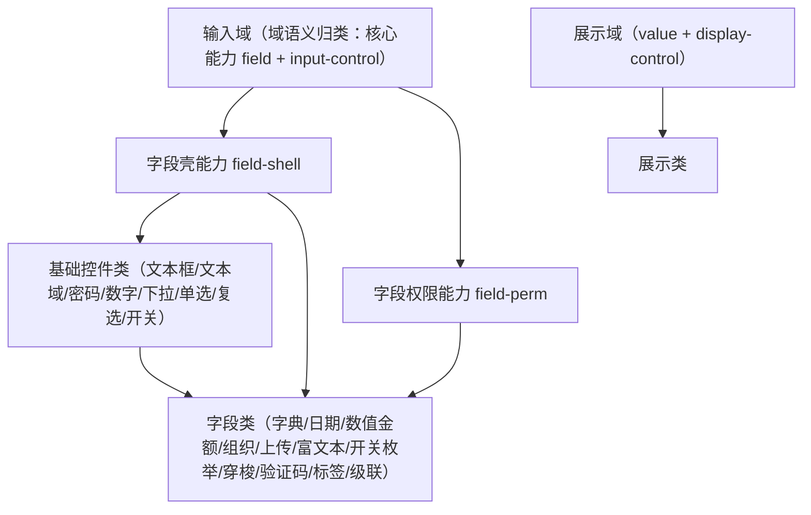

# 组件设计 · 输入域基类

> BaseInput（输入域基类，组合核心能力 `field` + `input-control`；被 基础控件类与 字段类继承；域包装按「核心能力 + 投影 + 插件包装」随域 05+ 回补波重建）

[文档首页](../../../../../文档首页.md) › [项目规划说明](../../../../../规划/项目规划说明.md) › [组件设计](../../../01_组件设计_总览.md) › 输入域基类　|　[← 字段权限能力](../../02_能力片段/11_组件设计_字段权限片段/11_组件设计_字段权限片段.md)　[展示域基类 →](../02_组件设计_展示域基类/02_组件设计_展示域基类.md)

> 可交互原型：[01_原型设计_输入域基类.html](01_原型设计_输入域基类.html)（演示受控 `v-model`、`change` 事件、三态（未设置）、`disabled`/`readonly`、前后缀插槽、继承关系与值归一）

## 1. 目的与适用范围 

定义 BMS 前端（核心 `frontend/packages/core` 纯 TS；渲染插件与宿主按同一契约装配）**输入域基类**的组件设计：输入域能力已在核心类化——`field`（字段编排：值归一、三态、`disabled` 合并、校验触发、变更上报）+ `input-control`（输入形态）+ `field-shell` / `field-perm`（字段壳与字段权限）；字段壳与控件的通信（原由[字段壳能力](../../02_能力片段/10_组件设计_字段壳片段/10_组件设计_字段壳片段.md)的字段上下文承载）随旧层删除，归域 05+ 回补波按新体系重建。它是组件设计体系**输入域语义基类**，**被 [基础控件类](../../../01_组件设计_总览.md)（文本框/文本域/密码/数字/下拉/单选/复选/开关）与 [字段类](../../../01_组件设计_总览.md)（字典/日期/数值金额/组织/上传/富文本/开关枚举/穿梭/验证码/标签/级联）继承**，统一「界面渲染、受控、可见/可编辑、必填、校验」的公共契约。

### 1.1 定位与继承体系 

- **基类不是"终端组件"**：不直接用于页面；页面用 03 基础控件或 字段类，二者均**继承本基类**（域包装按「核心能力 + 投影 + 插件包装」随域 05+ 回补波重建；当前组件经能力组合取得，见第 3、4 节）。
- **统一控制点**：受控绑定、三态、`disabled`（权限/只读/加载合并）、校验触发、`change` 上报——全部在基类定义一次，子类只负责"值如何输入/展示"。
- **越权防护**：`visible=false` 由[字段权限能力](../../02_能力片段/11_组件设计_字段权限片段/11_组件设计_字段权限片段.md)在**字段壳层**决定不渲染，不进入基类；基类只处理"可编辑/禁用"的渲染态。

上游依据：[《前端开发规范》](../../../../../规范/前端开发规范.md)（Props/emit、组合式函数、TypeScript 约定）、[《架构设计 · 前端架构》](../../../../架构设计/08_架构设计_前端架构.md)（组件分层与目录）、[《概要设计 · 表单定制》](../../../../概要设计/36_概要设计_表单定制.md)（组件类型与字段属性）；页面形态依据[《布局设计 · 表单页》](../../../../布局设计/08_布局设计_表单页.html)（三态、只读/编辑分态）。

> 本篇为「输入域基类」节点（体系底层基类）。**范围边界**：**字段外层壳**归[字段壳能力](../../02_能力片段/10_组件设计_字段壳片段/10_组件设计_字段壳片段.md)；**字段权限**归[字段权限能力](../../02_能力片段/11_组件设计_字段权限片段/11_组件设计_字段权限片段.md)；**具体控件**归 基础控件类与 字段类；**只读展示**归[展示域基类](../../03_域基类/02_组件设计_展示域基类/02_组件设计_展示域基类.md)。

## 2. 组件清单与职责 

| 组件 / 工具 | 位置 | 职责 |
| --- | --- | --- |
| 输入域能力组合（`field` + `input-control`） | `frontend/packages/core/src/capabilities/{field,input-control,field-shell,field-perm}.ts`；投影 `frontend/packages/vue/src/bindings/`（`useField` / `useValue`） | 输入域语义（受控绑定、三态、`disabled` 合并、校验触发、`change` 上报）；原 `BaseInput.vue` 域包装已随旧层删除（历史经 git 追溯），按「核心能力 + 投影 + 插件包装」随域 05+ 回补波重建 |
| 字段上下文（原 `useFieldContext`，随旧层删除） | 拟落 `frontend/packages/vue/src/bindings/`（随域 05+ 回补波重建） | 字段上下文（`provide`/`inject`）：字段壳下发 label/required/error/readonly，控件回传值变化与校验结果 |
| 表单容器能力（`form-container`） | `frontend/packages/core/src/capabilities/form-container.ts` | 与 `el-form`/`el-form-item` 协作：校验规则注入、`validate`/`resetFields`/`clearValidate` 代理（可选，复用 Element Plus） |

- 命名与落点遵循[《命名规范》](../../../../../规范/命名规范.md)与[《前端开发规范》](../../../../../规范/前端开发规范.md)：核心类 `BaseXxx`、能力 `key` kebab-case、投影 `useXxx`（只落 `frontend/packages/vue/src/bindings/`）；核心能力落 `frontend/packages/core/src/capabilities/`，域包装随回补波落渲染插件层（`frontend/packages/ui-ep` / `ui-vant`）。
- **继承方式**：Vue 组合式 API 无类继承（域包装为可选语义归类）；子控件经 `field` + `input-control` 能力（+ 投影 `useField`）复用行为，以插件层包装原生控件；本体系用"声明继承自基类"统一表述。
- **实现口径（2026-09-17，新体系）**：域能力已在核心类化——输入域 = `field` + `input-control` + `field-shell` / `field-perm`（落 `frontend/packages/core/src/capabilities/`；投影 `useField` / `useValue`）；**框架无关**——原生 `<input>` 兜底 + 插槽，`el-input` / Vant 由基础控件类子类在渲染插件层接入；字段上下文（`provide` / `inject`）归域 05+ 回补波重建。原 `BaseInput.vue` + 域组合式已随旧层删除（历史经 git 追溯）。

## 3. 基类契约（Props 与事件） 

| 属性 | 类型 | 默认 | 说明 |
| --- | --- | --- | --- |
| `modelValue` | any | `undefined` | 受控值（v-model）；子类可收窄类型 |
| `disabled` | boolean | false | 禁用（编辑态不可编辑字段、只读态由壳统一置 true） |
| `readonly` | boolean | false | 只读（可聚焦不可改，用于只读回显的输入框） |
| `size` | 'small' \| 'default' \| 'large' | 'default' | 尺寸（随密度令牌，见 [展示域基类](../../03_域基类/02_组件设计_展示域基类/02_组件设计_展示域基类.md)） |
| `placeholder` | string | '' | 占位（i18n 或字段属性） |
| `clearable` | boolean | false | 可清空 |
| `emptyValue` | any | `null` | 清空后的归一值（默认 `null`） |
| `fieldKey` | string | '' | 字段标识（注册字段上下文、校验定位） |

| 事件 | 载荷 | 说明 |
| --- | --- | --- |
| `update:modelValue` | value | 值变化（受控） |
| `change` | value | 值变化（业务监听，含归一后值） |
| `focus` / `blur` | event | 焦点（透传） |
| `validate` | result | 校验结果（供壳展示错误） |

- 具名插槽：`prefix`、`suffix`、`prepend`、`append`、`empty`（自定义空态）；`default` 留空（子类填充原生控件）。
- 透传：未声明属性/事件透传到底层 `el-input` 等原生控件（`inheritAttrs`）。

## 4. 基类行为 

| 项 | 设计 |
| --- | --- |
| 受控 | 只认 `modelValue`，不在内部持有"真值"；输入即 `emit('update:modelValue')` 再 `emit('change')` |
| 值归一 | 空串/`undefined` → `emptyValue`（默认 `null`）；多值空数组归一；子类可覆盖（如金额保留精度） |
| 三态 | `unset`（未设置，值为 `emptyValue` 且未交互）与 `empty`（显式空）可区分（如必填校验与占位提示） |
| `disabled` 合并 | `disabled = props.disabled \|\| fieldContext.readonly \|\| permState.editable===false \|\| loading`——只读态与字段权限统一在基类汇合 |
| 只读回显 | `readonly=true` 时控件禁止修改但保持可聚焦/可复制；是否改用纯文本由字段壳按字段类型决定（[字段壳能力](../../02_能力片段/10_组件设计_字段壳片段/10_组件设计_字段壳片段.md)） |
| 校验 | 子类声明规则，基类在值变化时触发校验并回传 `fieldContext`；提交时由表单统一 `validate` |
| 去抖/时序 | 输入类事件即时 `update`，`change` 可配置去抖（如文本搜索型字段） |
| 上下文注册 | 挂载时向 `fieldContext` 注册（fieldKey），卸载注销；错误信息由壳统一渲染 |
| 插槽 | 统一前后缀/前置后置/空态插槽；子类可增补（如密码可见切换、数字步进） |
| 无权限字段 | `visible=false` 由壳层控制**不渲染**基类组件（越权语义在字段权限，不在基类） |

## 5. 场景集成 

| 场景 | 说明 |
| --- | --- |
| 03 基础控件 | 文本框/文本域/密码/数字/下拉/单选/复选/开关 均继承本基类 |
| 字段类 | 字典/日期/数值金额/组织/上传/富文本/开关枚举/穿梭/验证码/标签/级联 继承本基类 |
| 表单渲染器 | `FormField` 按 `type` 分发到继承基类的控件（[交互类「表单渲染器」](../../../08_交互类/12_组件设计_表单渲染器/12_组件设计_表单渲染器.md)） |
| 查询筛选区 | 查询条件的输入控件复用基础控件（[展示类「查询筛选区」](../../../07_展示类/02_组件设计_查询筛选区/02_组件设计_查询筛选区.md)） |

## 6. 依赖接口与上游变更 

### 6.1 上游接口与口径 

| 项 | 说明 | 目标文档 |
| --- | --- | --- |
| 组件契约 | Props/emit、组合式函数、TS 约定 | [《前端开发规范》](../../../../../规范/前端开发规范.md)（登记项①） |
| 组件分层 | 核心能力 / 投影 / 渲染插件落点与继承关系（能力类 → 基础控件类 / 字段类） | [《架构设计 · 前端架构》](../../../../架构设计/08_架构设计_前端架构.md)（登记项②） |
| 组件类型 | 基础控件类型注册与字段属性 | [《概要设计 · 表单定制》](../../../../概要设计/36_概要设计_表单定制.md)（登记项③） |
| 三态/只读 | 只读用 `disabled`、三态共用布局 | [《布局设计 · 表单页》](../../../../布局设计/08_布局设计_表单页.html) |
| 新增依赖 | **无**：复用 Element Plus 控件 | — |

### 6.2 需登记的上游变更 

| 变更点 | 目标文档 | 内容 |
| --- | --- | --- |
| ① 字段组件继承契约 | [《前端开发规范》](../../../../../规范/前端开发规范.md)「组件契约」节 | 明确字段控件统一继承 输入域基类 基类：受控 `modelValue`/`update:modelValue`+`change`、`disabled` 合并（权限/只读/loading）、值归一与三态、校验触发、`BaseXxx` 命名；标注组件设计 输入域基类 为契约依据 |
| ② 组件分层与目录 | [《架构设计 · 前端架构》](../../../../架构设计/08_架构设计_前端架构.md)「组件体系（基类体系与目录登记）」节 | 明确核心能力（`frontend/packages/core/src/capabilities/`）、Vue 投影（`frontend/packages/vue/src/bindings/`）与渲染插件（`frontend/packages/ui-ep` / `ui-vant`）落点，及 05/01 经输入域能力组合取得契约的依赖方向（只准上层依赖下层，禁止反向） |
| ③ 基础控件类型注册 | [《概要设计 · 表单定制》](../../../../概要设计/36_概要设计_表单定制.md)「组件类型与自建字段边界」节 | 明确 `text/textarea/password/number/select/radio/checkbox/switch` 作为**基础控件**由 05 类提供、均继承 输入域基类 基类；字段类型→控件映射表更新为指向 05/01（配合 [交互类「表单渲染器」](../../../08_交互类/12_组件设计_表单渲染器/12_组件设计_表单渲染器.md) 登记） |

> 按[《文档生成规范》](../../../../../规范/文档生成规范.md)「引用与追溯」节，上述变更需用户确认后由上游文档同步；本节点只定义基类契约，不单独裁决目录与映射。

## 7. 权限 / i18n / 移动端 

- **权限**：基类通过 `disabled` 合并体现"不可编辑"；"不可见"由[字段权限能力](../../02_能力片段/11_组件设计_字段权限片段/11_组件设计_字段权限片段.md)与字段壳决定；动作为 基础类「权限指令」。
- **i18n**：`placeholder`/空态等文案由字段属性或 vue-i18n 提供；基类不内嵌文案。
- **移动端**：移动端渲染插件 `frontend/packages/ui-vant`（Vant）与 `ui-ep` 同一契约多实现（不要求字节级同款）；`disabled`/三态/受控语义一致（契约套件同一套断言）。

## 8. 性能与边界 

| 场景 | 设计 |
| --- | --- |
| 渲染 | 基类薄、无额外 DOM；子类重控件懒加载 |
| 更新 | 受控更新只触发一次 emit；`change` 可去抖；避免深监听 `modelValue` |
| 边界 | 空值归一差异（`''` vs `null` vs `[]`）、三态与必填、只读与禁用混淆、插槽冲突、`fieldKey` 缺失、上下文未注册、受控与非受控误用、透传属性冲突 |
| 不支持 | 字段壳（`field-shell`）、字段权限（`field-perm`）、具体控件（05/01）、只读展示（展示域基类） |

## 9. 检查清单 

- □ 基类契约：受控 `modelValue`/`update:modelValue`/`change`、`disabled`/`readonly`/`size`/`emptyValue`/`fieldKey`
- □ 行为：值归一、三态、`disabled` 合并（权限/只读/loading）、校验触发、上下文注册、插槽与透传
- □ 继承：05/01 声明继承自本基类；只读回显由壳决定纯文本或 `disabled`
- □ 越权：`visible=false` 不在基类处理（归 字段权限能力 + 壳）
- □ 权限/越权、i18n（占位/空态不内嵌文案）、移动端（同一契约多实现）符合第 7 节
- □ 性能边界：薄基类、单次 emit、可去抖、避免深监听
- □ 三项上游登记已确认：字段组件继承契约、组件分层与目录、基础控件类型注册

> 组件设计节点（体系底层基类）· 与[《前端开发规范》](../../../../../规范/前端开发规范.md)[《架构设计 · 前端架构》](../../../../架构设计/08_架构设计_前端架构.md)[《概要设计 · 表单定制》](../../../../概要设计/36_概要设计_表单定制.md)[《布局设计 · 表单页》](../../../../布局设计/08_布局设计_表单页.html)[字段壳能力](../../02_能力片段/10_组件设计_字段壳片段/10_组件设计_字段壳片段.md)[字段权限能力](../../02_能力片段/11_组件设计_字段权限片段/11_组件设计_字段权限片段.md)[展示域基类](../../03_域基类/02_组件设计_展示域基类/02_组件设计_展示域基类.md)《命名规范》配套
