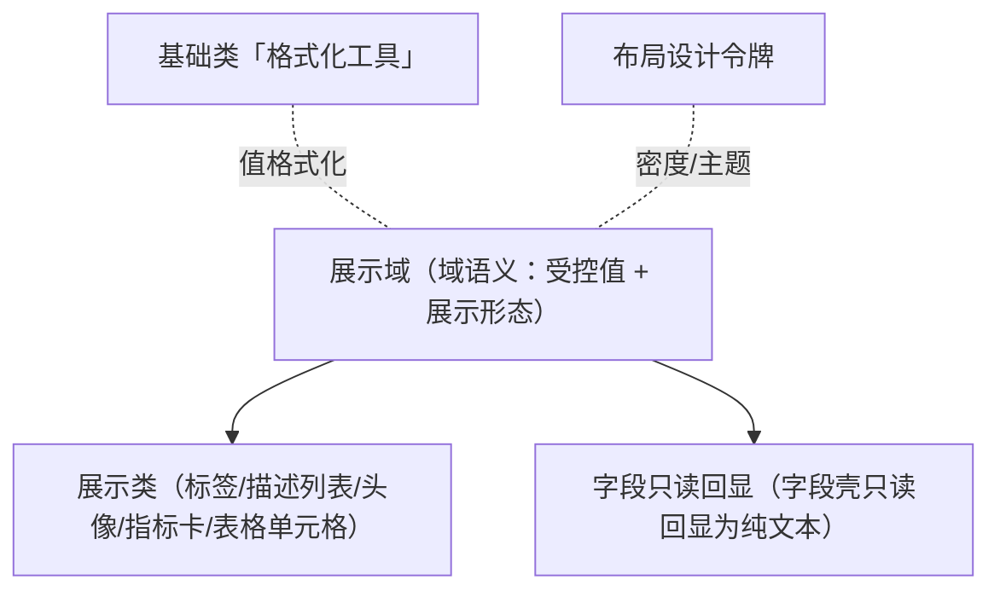

# 组件设计 · 展示组件基类（原展示域基类）

> 展示域语义基类：只读值渲染 / 值格式化调度 / 空值统一占位 / 密度与主题令牌消费 / 超长省略与可复制——被展示类与字段只读回显继承
> 实现侧命名与落点见《[前端基类清单](../../../../../前端基类清单.md)》（§2.1 全量基类登记表、§5 组件基类；继承链全系统唯一一份）。**本节点目录名沿用「域基类」的历史命名，正文按新口径称「组件基类」。**

[文档首页](../../../../../文档首页.md) › [项目规划说明](../../../../../规划/项目规划说明.md) › [组件设计](../../../01_组件设计_总览.md) › 展示域基类　|　[← 输入域基类](../01_组件设计_输入域基类/01_组件设计_输入域基类.md)　[树域基类 →](../03_组件设计_树域基类/03_组件设计_树域基类.md)

> 可交互原型：[02_原型设计_展示域基类.html](02_原型设计_展示域基类.html)（演示值格式化、空值统一占位、密度切换、只读不校验、可复制与超长省略，及它被展示类继承的关系）

## 1. 目的与适用范围 

定义 BMS 前端**展示域基类**的组件设计：展示域语义由受控值语义（值格式化调度、三态与空值）与展示形态语义（密度、空值占位、主题令牌、可复制 / 省略）承载。它是组件设计体系**展示域语义基类**，与 [输入域基类](../../03_域基类/01_组件设计_输入域基类/01_组件设计_输入域基类.md)（输入侧基类）对称，**被 展示类（[状态标签与描述列表](../../../07_展示类/03_组件设计_状态标签与描述列表/03_组件设计_状态标签与描述列表.md)/[头像与用户信息](../../../07_展示类/12_组件设计_头像与用户信息/12_组件设计_头像与用户信息.md)/[指标卡](../../../07_展示类/10_组件设计_指标卡/10_组件设计_指标卡.md) 等）与字段控件只读回显继承**，统一"值怎么格式化、空值怎么显示、密度/主题怎么消费"。

### 1.1 定位与职责边界 

| 职责 | 归属 |
| --- | --- |
| 只读值渲染、空值占位、密度、可复制 / 省略、主题令牌消费 | **本节点（组件基类 展示组件基类，父基类 值能力基类，链：总基类 → 组件根 → 值能力基类 → 展示组件基类）** |
| 具体格式化规则（金额/日期/枚举文本） | [基础类「格式化工具」](../../../09_基础类/03_组件设计_格式化工具/03_组件设计_格式化工具.md)（本节点消费） |
| 输入侧行为（受控 / 校验） | [输入组件基类 输入组件基类](../../03_域基类/01_组件设计_输入域基类/01_组件设计_输入域基类.md) |
| 具体展示组件（标签/头像/图表） | 展示类 |
| 空状态（整块无数据） | [展示类「异常与空状态」](../../../07_展示类/05_组件设计_异常与空状态/05_组件设计_异常与空状态.md) |

上游依据：[《布局设计 · 设计令牌》](../../../../布局设计/02_布局设计_设计令牌.html)（密度/字号/色令牌，展示组件只消费令牌）、[《布局设计 · 表格明细》](../../../../布局设计/09_布局设计_表格明细.html)（单元格只读渲染）、[《布局设计 · 列表页》](../../../../布局设计/07_布局设计_列表页.html)（列表展示）、[《布局设计 · 异常与空状态》](../../../../布局设计/12_布局设计_异常与空状态.html)（空值与空状态分工）。

> 本篇为「展示域基类」节点（体系基类层）。**范围边界**：**格式化规则本体**归[基础类「格式化工具」](../../../09_基础类/03_组件设计_格式化工具/03_组件设计_格式化工具.md)；**具体展示组件**归 展示类；**整块空状态**归[展示类「异常与空状态」](../../../07_展示类/05_组件设计_异常与空状态/05_组件设计_异常与空状态.md)；**输入侧**归 输入域基类。

## 2. 职责与组成 

| 组成部分 | 职责 |
| --- | --- |
| 展示域语义（组件基类） | 只读值渲染：接收原始值并按格式化语义输出文本 / 节点；统一空值占位、超长省略、悬浮、可复制（组件基类承载） |
| 域包装件 | 继承链上的域层包装（组件基类之上、具体组件之下），承载展示语义并可被模板层消费 |
| 格式化协作 | 按格式化器调度[基础类「格式化工具」](../../../09_基础类/03_组件设计_格式化工具/03_组件设计_格式化工具.md)；未指定或未注册回退原值 |
| 空态协作（可选） | 空值统一占位；整块无数据由[展示类「异常与空状态」](../../../07_展示类/05_组件设计_异常与空状态/05_组件设计_异常与空状态.md)承担，两者不混用 |

- **继承方式**：组件基类是**继承链上的组件基类**（其上位基类之上、具体组件 / 件之下）；展示类与字段只读回显经展示域派生取得公共行为语义，不在链外自由挂接（口径见[《前端开发规范》](../../../../../规范/前端开发规范.md)§1「架构铁律」与 §3.4）。
- 展示组件统一**只读**：不接收受控值、不参与校验；需要交互（点击/跳转）由具体展示组件扩展。

## 3. 交互与契约语义 

| 语义项 | 说明 |
| --- | --- |
| 原始值 | 只读接收原始值，输出文本 / 节点；由格式化语义或默认转换渲染 |
| 格式化语义 | 按格式化器（金额/日期/枚举/布尔等）调度基础类「格式化工具」；未指定则默认转换；未注册名回退原值 |
| 空值占位 | 空 / 未定义 / 空串 / 空数组 / 空对象统一显示占位（默认 `—`，可覆盖）；`0` / `false` 不为空 |
| 密度 | 紧凑 / 默认 / 宽松 三态，随表格/表单/用户偏好上下文，映射设计令牌 |
| 可复制 | 提供复制入口，复制**格式化后**文本或原值（按配置）；脱敏字段不可复制明文 |
| 超长省略 | 超长省略（开关 / 最大宽度）；省略时悬浮显示完整值 |
| 只读语义 | 不参与校验、不可编辑；与输入侧严格区分（不共用受控值） |
| 主题令牌 | 颜色/字号/间距只消费令牌，不硬编码；随品牌色与亮暗主题自动适配 |
| i18n | 布尔/枚举文本等按 locale；占位与复制提示走全局语言能力 |
| 插槽语义 | 默认（自定义渲染，如标签/头像/链接，提供当前值与格式化文本）；空态（自定义空占位） |

## 4. 基类行为 

| 项 | 设计 |
| --- | --- |
| 值格式化 | 按格式化器调度 [基础类「格式化工具」](../../../09_基础类/03_组件设计_格式化工具/03_组件设计_格式化工具.md)（金额千分位、日期、枚举文本、布尔是/否）；未指定则默认转换；未注册名回退原值 |
| 空值占位 | 空 / 未定义 / 空串 / 空数组 / 空对象统一显示占位（默认 `—`）；**空值与空状态区分**：单元格空值用占位，整块无数据用空状态组件（[展示类「异常与空状态」](../../../07_展示类/05_组件设计_异常与空状态/05_组件设计_异常与空状态.md)） |
| 密度 | 由密度或上下文（表格/表单/用户偏好）决定行高与字号，映射[《布局设计 · 设计令牌》](../../../../布局设计/02_布局设计_设计令牌.html) |
| 主题令牌 | 颜色/字号/间距只消费令牌，不硬编码；随品牌色与亮暗主题自动适配（[交互类「主题与品牌化」](../../../08_交互类/17_组件设计_主题与品牌化/17_组件设计_主题与品牌化.md)） |
| 只读 | 不参与校验、不可编辑；与输入侧组件严格区分（不共用受控值） |
| 省略与悬浮 | 超长省略 + 悬浮完整值；表格默认溢出时悬浮 |
| 可复制 | 可复制时显示复制入口（复制**格式化后**文本或原值，按配置）；脱敏值不可复制明文 |
| i18n | 布尔/枚举文本等按 locale（[基础类「格式化工具」](../../../09_基础类/03_组件设计_格式化工具/03_组件设计_格式化工具.md)负责）；占位与复制提示走全局语言能力 |
| 标题/描述 | 标签渲染归[字段壳能力](../../02_能力类/10_组件设计_字段壳能力/10_组件设计_字段壳能力.md)与描述列表，不在基类 |

## 5. 场景集成 

| 场景 | 说明 |
| --- | --- |
| 表格单元格 | 只读列渲染 + 空值占位 + 省略/悬浮（[展示类「通用表格」](../../../07_展示类/01_组件设计_通用表格/01_组件设计_通用表格.md)） |
| 描述列表 | 详情字段值渲染（[展示类「状态标签与描述列表」](../../../07_展示类/03_组件设计_状态标签与描述列表/03_组件设计_状态标签与描述列表.md)） |
| 字段只读回显 | 字段壳只读回显为纯文本时使用展示域基类格式化（[字段壳能力](../../02_能力类/10_组件设计_字段壳能力/10_组件设计_字段壳能力.md)） |
| 指标卡/图表卡 | 数值/同比格式化（[展示类「指标卡」](../../../07_展示类/10_组件设计_指标卡/10_组件设计_指标卡.md)） |
| 头像与用户信息 | 名称/部门文本渲染 |

## 6. 依赖接口与上游变更 

### 6.1 上游接口与口径 

| 项 | 说明 | 目标文档 |
| --- | --- | --- |
| 设计令牌 | 密度/字号/色令牌，展示只消费 | [《布局设计 · 设计令牌》](../../../../布局设计/02_布局设计_设计令牌.html)（登记项②） |
| 只读渲染 | 单元格/描述展示口径 | [《布局设计 · 表格明细》](../../../../布局设计/09_布局设计_表格明细.html)（登记项①） |
| 空值与空状态 | 空值占位与整块空状态分工 | [《布局设计 · 异常与空状态》](../../../../布局设计/12_布局设计_异常与空状态.html)（登记项③） |
| 格式化规则 | 金额/日期/枚举/布尔 | [基础类「格式化工具」](../../../09_基础类/03_组件设计_格式化工具/03_组件设计_格式化工具.md) |
| 新增依赖 | **无** | — |

### 6.2 需登记的上游变更 

| 变更点 | 目标文档 | 内容 |
| --- | --- | --- |
| ① 只读展示域基类契约 | [《布局设计 · 表格明细》](../../../../布局设计/09_布局设计_表格明细.html)「只读渲染」节 | 明确只读值统一经展示域基类渲染：格式化、空值占位 `—`、省略与悬浮、可复制；组件不硬编码色值；标注组件设计 展示域基类 为契约依据 |
| ② 展示令牌与密度 | [《布局设计 · 设计令牌》](../../../../布局设计/02_布局设计_设计令牌.html)「展示令牌」节 | 明确展示组件的密度（紧凑/默认/宽松）与字号/行高/色令牌映射；展示组件只消费令牌、随主题品牌自动适配 |
| ③ 空值与空状态分工 | [《布局设计 · 异常与空状态》](../../../../布局设计/12_布局设计_异常与空状态.html)「空值展示」节 | 明确单元格/字段空值统一占位 `—`（展示域基类），整块无数据用空状态组件；两者不混用；占位可配置 |

> 按[《文档生成规范》](../../../../../规范/文档生成规范.md)「引用与追溯」节，上述变更需用户确认后由上游文档同步；本节点只定义展示域基类语义与契约。

## 7. 权限 / i18n / 移动端 

- **权限**：展示值是否可见由字段权限与数据范围判定（[字段权限能力](../../02_能力类/11_组件设计_字段权限能力/11_组件设计_字段权限能力.md)）；脱敏字段的展示由字段权限与脱敏规则控制；展示域基类不判断权限。
- **i18n**：布尔/枚举文本按 locale（[基础类「格式化工具」](../../../09_基础类/03_组件设计_格式化工具/03_组件设计_格式化工具.md)负责）；占位与复制提示走全局语言能力。
- **移动端**：PC 与移动端同一契约多实现（展示语义一致：格式化、空值占位、密度；同一套契约断言保障）。

## 8. 性能与边界 

| 场景 | 设计 |
| --- | --- |
| 渲染 | 纯文本渲染轻量；悬浮/复制按需挂载 |
| 大表格 | 单元格格式化结果可缓存；避免每格创建重组件 |
| 边界 | 空值判定差异（`0`/`false` 非空）、超长文本省略与悬浮冲突、可复制与脱敏（脱敏值不应可复制明文）、密度上下文缺失、主题令牌缺失回退、格式化器不存在回退原值 |
| 不支持 | 格式化规则本体（基础类「格式化工具」）、具体展示组件（展示类）、空状态（展示类「异常与空状态」）、输入侧（输入域基类）、权限判定（字段权限能力） |

## 9. 检查清单 

- □ 契约语义：原始值/格式化/空值占位/密度/可复制/超长省略/悬浮；只读不校验、与输入侧不共用受控值
- □ 行为：格式化调度、空值统一占位、密度令牌、主题令牌、省略与悬浮、可复制、i18n
- □ 空值 vs 空状态分工清晰；`0`/`false` 不被误判为空
- □ 脱敏值不可复制明文（与 字段权限能力 协作）
- □ 被 展示类与字段只读回显继承；不硬编码色值
- □ 权限/i18n/移动端符合第 7 节；性能边界（缓存/按需挂载/回退）符合第 8 节
- □ 三项上游登记已确认：只读展示域基类契约、展示令牌与密度、空值与空状态分工

> 组件设计节点 · 与[《布局设计 · 设计令牌》](../../../../布局设计/02_布局设计_设计令牌.html)[《布局设计 · 表格明细》](../../../../布局设计/09_布局设计_表格明细.html)[《布局设计 · 列表页》](../../../../布局设计/07_布局设计_列表页.html)[《布局设计 · 异常与空状态》](../../../../布局设计/12_布局设计_异常与空状态.html)[输入域基类](../../03_域基类/01_组件设计_输入域基类/01_组件设计_输入域基类.md)[字段壳能力](../../02_能力类/10_组件设计_字段壳能力/10_组件设计_字段壳能力.md)[字段权限能力](../../02_能力类/11_组件设计_字段权限能力/11_组件设计_字段权限能力.md)[展示类「异常与空状态」](../../../07_展示类/05_组件设计_异常与空状态/05_组件设计_异常与空状态.md)[展示类「状态标签与描述列表」](../../../07_展示类/03_组件设计_状态标签与描述列表/03_组件设计_状态标签与描述列表.md)[交互类「主题与品牌化」](../../../08_交互类/17_组件设计_主题与品牌化/17_组件设计_主题与品牌化.md)[基础类「格式化工具」](../../../09_基础类/03_组件设计_格式化工具/03_组件设计_格式化工具.md)《命名规范》配套
